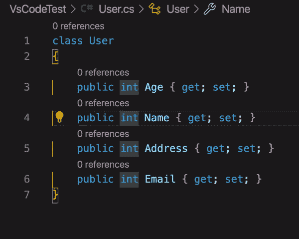
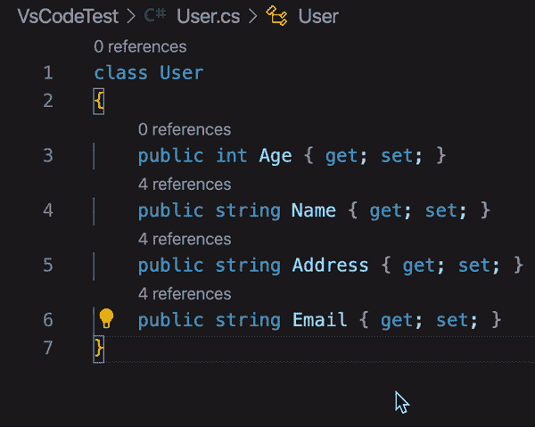
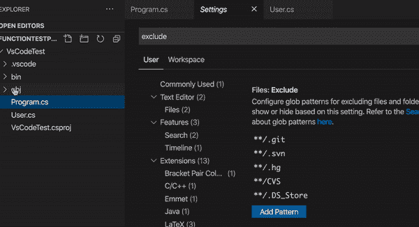
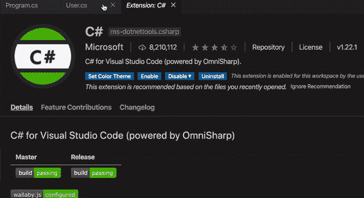
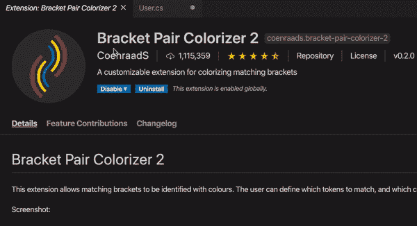
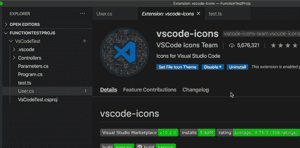
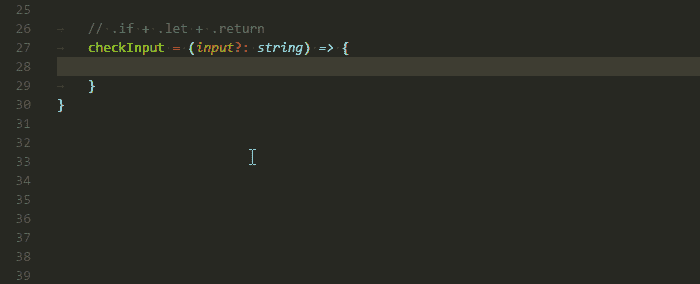

# 6 VS 代码技巧将提高你的生产力

> 原文：<https://levelup.gitconnected.com/6-vs-code-tips-will-improve-your-productivity-49ed8ef8983b>

来自[突发事件](https://burst.shopify.com/computer?utm_campaign=photo_credit&utm_content=Free+Developer+Coding+In+Php+Image%3A+Stunning+Photography&utm_medium=referral&utm_source=credit)的[莎拉·普鲁格](https://burst.shopify.com/@sarahpflugphoto?utm_campaign=photo_credit&utm_content=Free+Developer+Coding+In+Php+Image%3A+Stunning+Photography&utm_medium=referral&utm_source=credit)的照片

作为一名在 Mac OS 上开发 DotNet 项目的程序员，我非常热爱 VS 代码。VS 代码不仅是跨平台的，而且是免费的、开源的、功能强大的。以下是我曾经用 VS 代码编程的一些小技巧。通过使用这些技巧，VS 代码将变得更简单，并使您更有效率。

# 技巧#1 多行和多光标编辑

第一个技巧是 VS 代码中的多行多光标编辑。是的，VS 代码允许我们同时编辑多行。我认为，在某些情况下，这将极大地提高我们的生产率，正如你可以看到下面的例子。

*   Windows: **Ctrl + Alt +箭头键**
*   Mac OS: **Opt + Cmd +箭头键**

耶！它看起来很酷，提高了我们的工作效率。

但是，如果要编辑的多行代码没有对齐，例如，在源代码文件的不同位置。然后，您可以使用键盘和鼠标进行多光标编辑。

*   Windows: **Alt** +用鼠标选择目标块
*   Mac OS: **Opt** +用鼠标选择目标块

顺便说一下，正如你在多光标编辑的例子中看到的，你也可以通过使用键盘和鼠标使用这种方法来做*多行编辑*。

# 技巧 2:排除多余的文件和文件夹

当您关注您的源代码时，项目中自动生成的文件和文件夹就变得多余了。您可以配置 VS 代码的设置文件，从 VS 代码中排除您认为多余的文件和文件夹，以使您的工作空间整洁。

如上图所示，可以打开 VS 代码的设置面板，找到 Exclude 部分，然后添加模式排除多余的文件和文件夹(例如 **obj** 文件夹和 **bin** 文件夹)。

# 技巧 3 prop 和 ctor 片段

如果你安装了微软的 [C#扩展](https://marketplace.visualstudio.com/items?itemName=ms-vscode.csharp)，你可以使用 **prop** 和 **ctor** 片段来提高你的编码速度。

# 小贴士#4:当你处理括号的时候，让你的生活更简单

我想很多程序员都和我有过类似的经历。当一对括号相距很远时，很难匹配到正确的一对括号。例如，一个很长的方法，或者传递给方法的参数很复杂。

因此，[支架对彩色 2 扩展](https://marketplace.visualstudio.com/items?itemName=CoenraadS.bracket-pair-colorizer-2)是处理这种情况的绝佳选择，会让你的生活更轻松。

# 技巧 5:添加图标，使项目布局信息丰富

VS 代码默认的图标主题很无聊。当项目复杂时，这样的图标主题不能提供足够的信息，使得项目难以维护。比如很难区分不同的文件类型，也很难区分文件夹和文件。

因此，需要选择一个优秀的图标主题，替换默认的图标主题(可以设置图标主题表单 VS 代码**偏好文件图标主题**面板)。例如，我使用 [vscode-icons 扩展](https://marketplace.visualstudio.com/items?itemName=vscode-icons-team.vscode-icons)来使项目布局具有信息性。

# 提示#6 后缀完成

如果你喜欢 Rider 或 Resharper，我想你可能会喜欢**后缀模板**功能。例如，你想用后缀模板封装一些代码，比如说，`if`，你可以快速地用一个必需的`if`语句包围代码。

而 [TS/JS 后缀完成扩展](https://marketplace.visualstudio.com/items?itemName=ipatalas.vscode-postfix-ts)在编写 TS/JS 代码时提供了与 VS 代码类似的功能。

这 6 个技巧让我在用 VS 代码写代码时更有效率，我相信它们也一定会提高你的效率。试试看！

感谢阅读。希望有用！