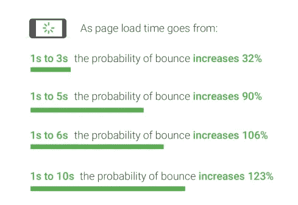
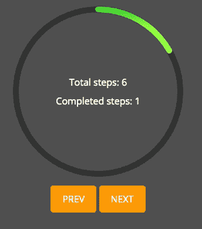
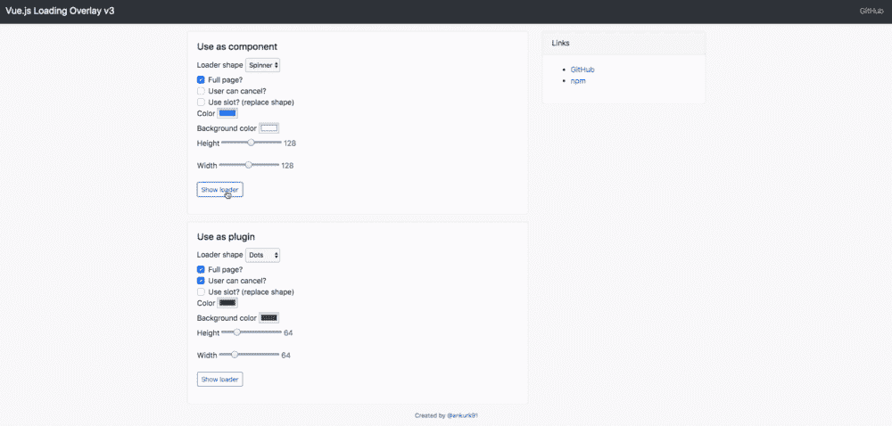
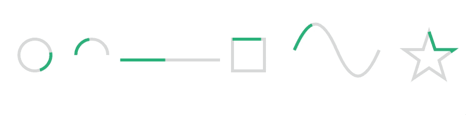
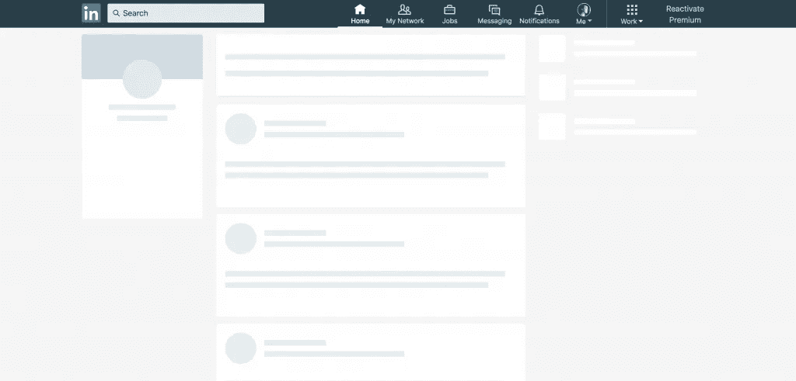

# 6 Vue 装载机动画库，以降低您的跳出率

> 原文：<https://levelup.gitconnected.com/6-vue-loader-animation-libraries-to-reduce-your-bounce-rate-bb3757bdc75c>


[NeONBRAND](https://unsplash.com/@neonbrand?utm_source=medium&utm_medium=referral) 在 [Unsplash](https://unsplash.com?utm_source=medium&utm_medium=referral) 上的照片

没有人喜欢等待装载东西。只要看看谷歌 2017 年的数据，就能发现加载时间和跳出率之间的相关性。



让人们不离开你的网站的一个方法是添加视觉反馈，让他们知道东西只是在加载，而不是坏了。它也吸引了人们的注意力，因此等待时间似乎比静态屏幕要短得多。

无论是包含一个旋转动画还是添加实际的进度条，提供一个漂亮的视觉元素都可以提高你的站点的性能(并让你的访问者更开心)。

幸运的是，对于 Vue 开发人员来说，有大量惊人的加载程序库可以在几分钟内添加到您的项目中。

在这篇文章中，我们将讨论我最喜欢的六个。

准备好了吗？我们走吧。

# 1.简单旋转器

顾名思义，这是一个非常简单的组件，但它仍然非常强大。Vue 简单微调器提供了一个可定制的微调器元素。使用道具，我们可以控制我们的旋转器:

*   大小
*   背景和前景颜色
*   速度
*   标签文本
*   更加

只需几行代码，我们就可以在项目中添加一个 spinner。首先，我们可以在命令行中用`npm install vue-simple-spinner --save.`安装这个库

然后，我们将它导入到我们的组件中，在我们的模板中声明它，并更改我们想要的任何道具。轻松点。

```
<template>
   <vue-simple-spinner size="medium" />
</template>
<script>
import VueSimpleSpinner from 'vue-simple-spinner'
export default {
   components: { 
      VueSimpleSpinner
   }
}
```

就这样，我们应该有了第一个旋转器。


# 2.Vue 径向进度

如果你正在寻找一个真正的进度条，而不是一个旋转动画，Vue Radial Progress 是一个非常好的库。

Vue Radial Progress 允许您在进度条中设置步数以及用户当前所处的步骤。然后，它会根据完成多少来填充一定比例的进度条。

凭借流畅的动画、可定制的特性和基于 SVG 的填充系统，当您拥有包含多个离散步骤的异步流程时，该库将非常强大。

实现起来也是轻而易举。

首先，用`npm install --save vue-radial-progress`安装库就可以了。然后，这是文档中的示例组件。

正如您所看到的，它非常简单，主要的道具是大小、完成的步骤和步骤总数。

此外，该库使用[组件插槽](https://learnvue.co/2019/12/using-component-slots-in-vuejs%e2%80%8a-%e2%80%8aan-overview/)来简化在圆圈内添加文本的过程。

```
<template>
  <radial-progress-bar :diameter="200"
                       :completed-steps="completedSteps"
                       :total-steps="totalSteps">
   <p>Total steps: {{ totalSteps }}</p>
   <p>Completed steps: {{ completedSteps }}</p>
  </radial-progress-bar>
</template>

<script>
import RadialProgressBar from 'vue-radial-progress'

export default {
  data () {
    return {
      completedSteps: 0,
      totalSteps: 10
    }
  },

  components: {
    RadialProgressBar
  }
}
</script>
```



# 3.Vue 加载覆盖

Vue 加载覆盖是全屏加载组件的完美解决方案。例如，如果您的应用程序包含某种仪表板，并且您希望等到所有数据都加载完毕后再让用户点击，那么这个库可能会很有用。

我发现这个库的一个非常棒的特性是，你可以允许用户在点击时取消加载覆盖。这将关闭覆盖并触发一个[事件](https://learnvue.co/2020/01/a-vue-event-handling-cheatsheet-the-essentials)，你可以用它来取消你正在运行的任何任务。

通过添加这个特性，您可以允许用户自己决定何时任务加载和退出时间过长。这意味着他们不必离开页面。

要将它添加到您的项目中，请运行`npm install --save vue-loading-overlay`

接下来，这是一个使用 Vue 加载覆盖库的示例组件。我们的组件采用一些决定可见性、处理取消和改变显示的道具。

```
<template>
    <div class="vld-parent">
        <loading :active.sync="isLoading" 
        :can-cancel="true" 
        :on-cancel="onCancel"
        :is-full-page="fullPage"></loading>

        <label><input type="checkbox" v-model="fullPage">Full page?</label>
        <button @click.prevent="doAjax">fetch Data</button>
    </div>
</template>

<script>
    // Import component
    import Loading from 'vue-loading-overlay';
    // Import stylesheet
    import 'vue-loading-overlay/dist/vue-loading.css';

    export default {
        data() {
            return {
                isLoading: false,
                fullPage: true
            }
        },
        components: {
            Loading
        },
        methods: {
            doAjax() {
                this.isLoading = true;
                // simulate AJAX
                setTimeout(() => {
                  this.isLoading = false
                },5000)
            },
            onCancel() {
              console.log('User cancelled the loader.')
            }
        }
    }
</script>
```



# 4.Vue 进度路径

Vue Progress Path 是最受欢迎的加载程序库之一。由 Guillaume Chau 构建，他是 Vue 核心团队的成员，这是我最喜欢使用的工具之一。

使用 SVG，Vue Progress path 可以创建不同形状的进度条。它有几个内置的形状，但是最强大的特性是能够传递您自己的 SVG 形状——这意味着可能性是无限的。

用`npm i --save vue-progress-path`把它添加到你的项目中，然后用`npm i --save vue-progress-path`把它全局添加到你的 `src/main.js`文件中。

```
import 'vue-progress-path/dist/vue-progress-path.css'
import VueProgress from 'vue-progress-path'

Vue.use(VueProgress, {
  // defaultShape: 'circle',
})
```

现在，让我们看看如何向我们的组件添加一个进度路径。

```
<loading-progress
  :progress="progress"
  :indeterminate="indeterminate"
  :counter-clockwise="counterClockwise"
  :hide-background="hideBackground"
  shape="semicircle"
  size="64"
/>
```

这个库的另一个令人惊奇的地方是它很容易定制。与其强迫你处理道具来定制外观，你可以只写 CSS 代码来编辑样式。

```
.vue-progress-path path {
  stroke-width: 12;
}

.vue-progress-path .progress {
  stroke: red;
}
```



# 5.Vue 加载按钮

Vue Loading 按钮是一种简单而有效的方式，向用户显示正在加载的东西。

它所做的就是在按钮被点击的时候给按钮添加一个旋转动画。但是通过流畅的动画，它创造了一个无缝的外观，这将使你的网站流行起来。

安装起来非常快。

首先用 `npm install --save vue-loading-button`安装。然后，您可以像文档中的这个示例一样轻松地开始。

```
<template>
   <VueLoadingButton aria-label='Send message' />
</template>
<script>
import VueLoadingButton from 'vue-loading-button'

export default {
  components: {
    VueLoadingButton,
  }
}
</script>
```

简而言之，您所要做的就是根据情况将加载值设置为 true/false。您还可以添加自定义样式，使其适合您的应用程序。


# 6.结核骨架

骨骼装载是给[速度错觉](https://css-tricks.com/building-skeleton-screens-css-custom-properties/)的好方法。基本上，你会

Linkedin 的截图展示了一个很好的骨架加载的例子。



TBSkeleton 是在您的 Vue 项目中实现这一特性的好方法。然而，它是相当代码密集型的，需要你明智地规划你的元素。

创建骨架时，您必须在一个唯一的骨架元素中创建不同元素的所有轮廓。

我认为理解这一点的最好方法就是看一个例子。

首先，使用`npm install --save tb-skeleton`安装它。然后，用这几行将其添加到您的 Vue 项目的`src/main.js`文件中。

```
import skeleton from 'tb-skeleton'
import  'tb-skeleton/dist/skeleton.css'
Vue.use(skeleton)
```

然后，这里有一个来自 TBSkeleton 文档的框架组件的例子。

```
<template>
  <div>
    <skeleton :theme="opacity" :shape="radius" :bg-color="#dcdbdc">
     <tb-skeleton  width="30%" :aspect-ratio="1"  :shape="circle" bg-color="#eee"></tb-skeleton>
     <tb-skeleton  width="30%" :aspect-ratio=".3"></tb-skeleton>
     <tb-skeleton  width="30%" :aspect-ratio=".3"></tb-skeleton>
   </skeleton>
  </div>
</template>
<script>
  import {TbSkeleton,Skeleton} from 'tb-skeleton'
  export default {
    components: {
      TbSkeleton,
      Skeleton
    }
  }
</script>
```

正如你所看到的，如果你把它添加到更复杂的[组件](https://learnvue.co/2019/12/using-component-slots-in-vuejs%e2%80%8a-%e2%80%8aan-overview/)中，肯定会花费一些努力，但我认为这绝对是值得的。

# 结论

这些只是您可以在项目中使用的几十个奇妙的 Vue loader 库中的几个。如果你想找到更多，我绝对推荐查看 [awesome-vue Github repo](https://github.com/vuejs/awesome-vue) 。

而如果没有找到适合自己需求的，那就自己建，自己分享！我相信其他人也会发现它非常有用。

你最喜欢的加载器库有哪些？获得新的资源总是一件幸事，所以请告诉我！

如果你有兴趣了解更多关于 Vue 3 的知识，请下载我的免费 Vue 3 备忘单，里面有一些基本知识，比如组合 API、Vue 3 模板语法和事件处理。

*原载于 2020 年 2 月 10 日 https://learnvue.co**的* [*。*](https://learnvue.co/2020/02/6-vue-loader-animation-libraries-to-reduce-your-bounce-rate)