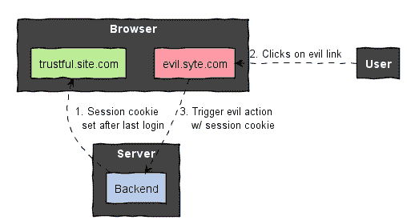
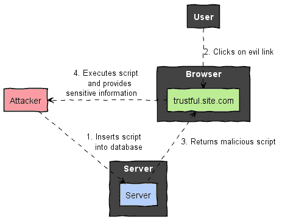
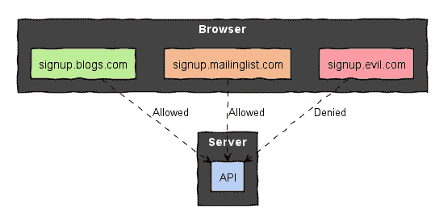

# 现在提高你的网络应用安全性的 6 种方法

> 原文：<https://levelup.gitconnected.com/6-ways-to-improve-your-web-apps-security-now-164ff76661b8>

## 针对常见漏洞的技术无关缓解措施

[真诚媒体](https://unsplash.com/@sincerelymedia?utm_source=medium&utm_medium=referral)在 [Unsplash](https://unsplash.com?utm_source=medium&utm_medium=referral) 上拍摄的照片

作为开发人员，编写代码不仅仅是我们的工作。我们负责交付经过测试、功能齐全且安全的软件。所有这些要求都同样复杂。但我感觉这些并不总是被平等对待。

应用安全并不总是一等公民。但应该是。客户向我们提供他们的数据，并希望我们将其保存在安全的地方。让他们容易被利用，我们就有失去客户信任和业务的风险。

我写这个故事是为了帮助你提高你的 web 应用程序的安全性。我将介绍可以在任何 web 应用程序中快速实现的缓解措施。因此，我挑选了[十个最常见的安全风险](https://owasp.org/www-project-top-ten/)中的五个，并为跨站请求伪造添加了专门的一章。每个部分由一个或多个漏洞和多个缓解措施组成。

1.  [**跨站请求伪造**](https://owasp.org/www-project-top-ten/OWASP_Top_Ten_2017/Top_10-2017_A7-Cross-Site_Scripting_(XSS))
2.  [**跨站脚本**](https://owasp.org/www-project-top-ten/OWASP_Top_Ten_2017/Top_10-2017_A7-Cross-Site_Scripting_(XSS))
3.  [**安全误配置**](https://owasp.org/www-project-top-ten/OWASP_Top_Ten_2017/Top_10-2017_A6-Security_Misconfiguration)
4.  [**破解认证**](https://owasp.org/www-project-top-ten/OWASP_Top_Ten_2017/Top_10-2017_A2-Broken_Authentication)
5.  [**敏感数据曝光**](https://owasp.org/www-project-top-ten/OWASP_Top_Ten_2017/Top_10-2017_A3-Sensitive_Data_Exposure)
6.  [**利用已知漏洞的组件**](https://owasp.org/www-project-top-ten/OWASP_Top_Ten_2017/Top_10-2017_A9-Using_Components_with_Known_Vulnerabilities)

# 跨站点请求伪造

> 跨站点请求伪造(CSRF)是一种攻击，它迫使最终用户在他们当前已通过身份验证的 web 应用程序上执行不需要的操作。owasp.org/www-community/attacks/csrf
> /

## 攻击

如果攻击者可以在没有通知的情况下代表用户执行操作，就会发生 CSRF 攻击。

1.  我们的用户登录到**trustful.site.com。**
2.  **trustful.site.com**设置一个会话 cookie。
3.  攻击者诱骗用户导航到**evil.syte.com。**
4.  **evil.syte.com 称 trustful.site.com 为后端。**
5.  后端应用程序**验证会话 cookie 并执行请求。**

很可怕，不是吗？为什么会这样？默认情况下，Cookies 被发送到与其域值相匹配的主机名。但并不是所有的浏览器都会检查当前网页是否与 cookies 的域值相匹配。它们使用 HTTP 请求的目标主机来确定要附加哪些 cookies。

> 域属性指定 cookie 将被发送到的那些主机。例如，如果域属性的值是
> “example . com”，则用户代理在向 example.com 发出 HTTP 请求时会将 cookie 包含在 Cookie
> 头中..].
> [tools.ietf.org/html/rfc6265#section-4.1.2](https://tools.ietf.org/html/rfc6265#section-4.1.2)

因此，只要会话 cookie 有效，**evil.syte.com**就可以代表用户执行动作。

## 缓解措施

我们可以做三件事来减轻 CSRF 的风险:

*   仅通过安全的 HTTPs 连接发送 cookies，
*   限制对 cookies 的访问，以及
*   阻止浏览器从第三方网站发送 cookie。

为此，[设置](https://developer.mozilla.org/en-US/docs/Web/HTTP/Headers/Set-Cookie)以下 cookie 属性:

*   `Secure`
*   `HttpOnly`
*   `SameSite=strict`

# 跨站点脚本

> 跨站脚本(XSS)攻击是一种注入，其中恶意脚本被注入到良性和可信的网站中。当攻击者使用 web 应用程序向不同的最终用户发送恶意代码(通常以浏览器端脚本的形式)时，就会发生 XSS 攻击。
> [owasp.org/www-community/attacks/xss/](https://owasp.org/www-community/attacks/xss/)

## 攻击

对 XSS 的攻击需要两个先决条件。首先，攻击者必须将代码注入 web 应用程序。第二，web 应用程序必须盲目地执行它得到的所有脚本。与 CSRF 的攻击不同，不一定有第三方网站参与其中。

跨站点脚本攻击可能涉及保存在数据库中的代码，或者在运行时注入的代码。对于下面的例子，我们将着重于前者。

1.  攻击者通过未经服务器验证的字段将恶意脚本插入到我们的数据库中。
2.  攻击者给我们的用户发送了一个到**trustful.site.com 的链接。他知道这个页面会返回危险的脚本。**
3.  **我们的用户点击了链接，不知不觉地收到了恶意代码片段。**
4.  **浏览器执行攻击者准备好的代码。该脚本向我们的攻击者发送敏感信息。**

您有兴趣了解 XSS 漏洞的运行情况吗？点击以下链接:[谷歌 XSS 游戏演示](https://xss-game.appspot.com/level1/frame?query=%3Cscript%3Ealert(%27This%20is%20an%20XSS%20attack%27)%3C/script%3E)。它将打开一个由 Google 提供的游乐场，并显示一个 JavaScript 警告。弹出窗口的文本在名为 query 的 URL 参数中。我们称之为**反射 XSS 攻击**，因为服务器反射了查询参数。

## 缓解措施

**两次验证所有数据**。首先，前端应用程序需要验证**所有**用户输入。验证将首先降低恶意数据进入应用程序的风险。尽管如此，黑客仍然可以直接呼叫服务器。因此，第二，我们也需要在服务器端验证所有数据。为了减轻 XSS 风险，我们需要**验证每个 JSON 或 XML 字段的值。这些字段应仅包含明确允许的字符，并具有可接受的长度**。

**对所有数据进行编码**以防止反射 XSS 攻击。OWASP 基金会为 NodeJS 和 T21 Java 构建了合适的库。编码确保 web 浏览器显示代码而不是执行代码。

**告诉浏览器从第三方服务器获取哪种类型的资源**。这样的内容策略是一个重大的安全改进，因为它限制了 XSS 攻击的范围。

*   如果您使用 CDN 或从其他服务器加载资源，请对预期的域使用适当的内容安全策略。如`Content-Security-Policy: font-src [https://fonts.cdn.com](https://fonts.cdn.com.)` [。](https://fonts.cdn.com.)
*   如果不使用 CDN，将响应头`Content-Security-Policy` 设置为值`default-src ‘none'`。

# 安全错误配置

> 安全配置错误是最常见的问题。这通常是由不安全的默认配置、不完整或临时配置、开放式云存储、错误配置的 HTTP 头以及包含敏感信息的详细错误消息造成的。
> [owasp.org/www-project-top-ten/](https://owasp.org/www-project-top-ten/)

任何组件的不正确配置都可能帮助攻击者发现安全漏洞并识别攻击面。在 web 应用程序安全的上下文中，正确配置的系统

*   隐藏有关使用的组件和框架的信息，以及
*   不允许未经验证和未经授权的访问。

> 攻击面描述了攻击者可以进入系统的所有不同点，以及他们可以获取数据的位置。
> [cheatsheetseries . owasp . org/Cheat sheets/Attack _ Surface _ Analysis _ Cheat _ sheet . html](https://cheatsheetseries.owasp.org/cheatsheets/Attack_Surface_Analysis_Cheat_Sheet.html#:~:text=The%20Attack%20Surface%20describes%20all,out%20of%20the%20application%2C%20and)

## 攻击

关于系统的信息可以出现在 HTTP 头和 HTTP 响应体中。包含服务器信息的标准 HTTP 头有:

*   **服务器(Apache，NGINX)，**
*   **x-powered-by (ExpressJS，PHP)，**
*   **x-应用-上下文(Spring Boot)，**
*   **通孔(清漆)**

像 **ExpressJS** 或者 **Spring Boot** 这样的框架提供了一个默认的错误处理机制。默认情况下，如果它们处理未捕获的错误或异常，两者都会返回堆栈跟踪。堆栈跟踪给攻击者一个应用程序的详细印象。它们揭示了哪些类型和实例正在使用，并处理了请求。有了这些深入的知识，攻击者就可以发起更复杂的攻击。

此外，如果应用程序返回错误消息和用户输入，它可能容易受到 [**反射文件下载(RFD)**](https://medium.com/@Johne_Jacob/rfd-reflected-file-download-what-how-6d0e6fdbe331) 的攻击。RFD 将允许攻击者建立一个网页的 URL，当该网页打开时，将会下载一个脚本到用户的机器上。由于攻击者控制了链接，他也负责下载文件的内容。

这样的链接看起来像什么？

*   https://search.yoursite.com/;chrome .蝙蝠？q=

配置不正确的服务器会将反射的参数`q`下载到名为`chrome.cmd`的文件中。你怎么看，一个非技术用户运行下载文件夹中 chrome.cmd 的可能性有多大？

## 减轻

**禁用特定于组件和框架的 HTTP 头。使黑客更难发动特定的攻击。**

**不要在错误页面中暴露详细信息或用户信息。**隐藏关于框架和应用程序运行时的信息，并阻止反射文件下载。

**禁用 HTTP 路径参数。**路径参数是 URL 的一部分，位于分号:`https://search.yoursite.com/;**chrome.bat**`之后。它们在 RFD 攻击中起着至关重要的作用，因为它们可以欺骗浏览器下载二进制文件。拒绝包含分号的请求，只需返回 HTTP 状态 404。

此外，为了限制 rfd 的风险，**不要让浏览器猜测 HTTP 响应的内容类型**。总是设置响应头`X-Content-Type-Options: nosniff`。

# 身份验证被破坏

> 对经过身份验证的用户被允许做什么的限制通常没有得到适当的执行。攻击者可以利用这些缺陷来访问未经授权的功能和/或数据，例如访问其他用户的帐户、查看敏感文件、修改其他用户的数据、更改访问权限等。
> [owasp.org/www-project-top-ten/](https://owasp.org/www-project-top-ten/)

## 攻击

**跨源资源共享(CORS)** 策略定义了哪些网页被允许向服务器请求资源。应用服务器通过检查 HTTP 报头`Origin`来确定允许量。该标题由浏览器设置，包含当前网站的域。

> 这意味着 web 应用程序[..]只能从加载应用程序的同一来源请求资源，除非来自其他来源的响应包括正确的 CORS 标头。
> [developer.mozilla.org/en-US/docs/Web/HTTP/CORS](https://developer.mozilla.org/en-US/docs/Web/HTTP/CORS)/

在下图中，我们可以看到多个网页共享同一个后端应用程序。通过启用 CORS 策略，服务器可以允许来自 signup.mailinglist.com 和 signup.blogs.com 的请求，拒绝来自 signup.evil.com 的呼叫。这些策略也可以只允许特定来源的 HTTP 方法的子集。

**请注意:**攻击者可以简单地直接调用应用服务器，因此通过不设置`Origin`请求头绕过浏览器和 CORS 策略。**尽管如此，已配置的 CORS 规则可防止攻击者构建一个看起来和感觉上都像目标应用程序并使用相同后端的网站。**

## 减轻

**充分配置 CORS 头**。即使应用程序不与其他应用程序或域共享资源，您也应该在每个 HTTP 响应中添加 CORS 报头。

在 CORS 配置中，请只授予已知和可信来源的访问权限。必须显式配置自定义 HTTP 头。此外，在 CORS 上下文中，`Content-Type`头的值是[受限的](https://developer.mozilla.org/en-US/docs/Glossary/CORS-safelisted_request_header)。我们可以通过显式允许`Content-Type`头来避免这一点。

CORS 策略是使用以下 HTTP 响应头定义的:

*   `Access-Control-Allow-Origin`
*   `Access-Control-Allow-Methods`
*   `Access-Control-Allow-Headers: Content-Type`
*   `Access-Control-Max-Age`

请小心添加这些 HTTP 头。仅当您信任其来源时才返回它们。我建议使用应用程序框架的内置 CORS 支持，而不是从头开始构建。

# 敏感数据暴露

> 攻击者不是直接攻击 crypto，而是窃取密钥，执行中间人攻击，或者在传输过程中从服务器窃取明文数据，或者从用户的客户端(例如浏览器)窃取明文数据。通常需要手动攻击。
> [OWASP . org/www-project-Top-Ten/OWASP _ Top _ Ten _ 2017/Top _ 10–2017 _ A3-Sensitive _ Data _ Exposure](https://owasp.org/www-project-top-ten/OWASP_Top_Ten_2017/Top_10-2017_A3-Sensitive_Data_Exposure)

## 攻击

典型的中间人攻击允许攻击者拦截和操纵未加密的 HTTP 消息。更简单的是，如果客户数据存储或缓存在共享设备上，即公共图书馆中，则有权访问该设备的每个人都可以使用这些数据。

## 减轻

**随时随地使用 HTTPS**。句号。

**禁用表单自动完成功能**。在你的智能手机上，你的浏览器很可能已经缓存了你的地址。那很方便，因为你不必一直填写你的地址。但是，如果它是一个共享设备，自动完成将暴露您的地址。我们可以通过给 HTML 表单或者输入标签 **添加属性`autocomplete=off` [来禁用`autocomplete`。](https://developer.mozilla.org/en-US/docs/Web/Security/Securing_your_site/Turning_off_form_autocompletion)**

**通过始终设置这三个响应头来禁用资源缓存**。

*   `Cache-Control: no-cache, no-store, max-age=0, must-revalidate`
*   `Expires: 0`
*   `Pragma: no-cache`

到其他网页的链接存在安全风险，也可能会泄露客户数据。**为了防止这种叫做 Tabnapping 的攻击，我们需要为所有打开新标签的 HTML 链接添加一个属性**:

*   `rel="nofollow noreferrer"`

# 使用具有已知漏洞的组件

> 库、框架和其他软件模块等组件以与应用程序相同的权限运行。如果易受攻击的组件被利用，这种攻击会导致严重的数据丢失或服务器接管。使用具有已知漏洞的组件的应用程序和 API 可能会破坏应用程序防御，并导致各种攻击和影响。
> https://owasp.org/www-project-top-ten/

最后但同样重要的是，使用具有众所周知的漏洞的过时的库、框架和运行时是有风险的。

## 缓解措施

**使应用程序的所有部分和依赖项保持最新**。像 npm 或 maven 这样的包和依赖项管理器可以检查和显示应用程序依赖项的较新版本。

# 结论

我们不仅通过为我们的应用添加功能来为客户创造价值。我们也通过保护客户的数据来提供价值。虽然我们只是触及了 web 应用程序安全性的表面，但是我们已经确定了各种降低风险和提高整体安全性的方法。

有关 web 应用程序漏洞和更多缓解措施的更多信息，请查看 OWASP 十大漏洞。🙂

 [## OWASP 十大

### OWASP Top 10 是开发人员和 web 应用程序安全性的标准认知文档。它代表了广泛的…

owasp.org](https://owasp.org/www-project-top-ten/) 

感谢来到这里，也感谢你的阅读，
Stefan👋

# 分级编码

感谢您成为我们社区的一员！ [**订阅我们的 YouTube 频道**](https://www.youtube.com/channel/UC3v9kBR_ab4UHXXdknz8Fbg?sub_confirmation=1) 或者加入 [**Skilled.dev 编码面试课程**](https://skilled.dev/) 。

 [## 编写面试问题

### 掌握编码面试的过程

技术开发](https://skilled.dev)