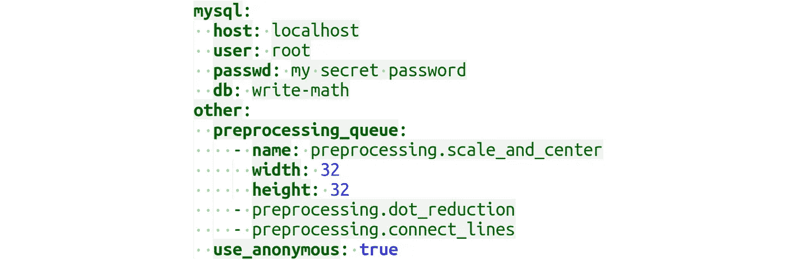

# 6 大多数程序员不知道的 YAML 特性

> 原文：<https://levelup.gitconnected.com/6-yaml-features-most-programmers-dont-know-164762343af3>

## 提升你的 YAML 知识，写更干净的 YAML 文件



YAML 是一种常用于数据序列化的文件格式。使用 YAML 文件进行配置的项目不胜枚举，比如 [Docker-compose](https://docs.docker.com/compose/) 、 [pre-commit](https://pre-commit.com/#2-add-a-pre-commit-configuration) 、 [TravisCI](https://docs.travis-ci.com/user/build-config-yaml) 、 [AWS Cloudformation](https://docs.aws.amazon.com/AWSCloudFormation/latest/UserGuide/template-formats.html) 、 [ESLint](https://eslint.org/docs/user-guide/configuring) 、 [Kubernetes](https://kubernetes.io/docs/concepts/configuration/configmap/#configmaps-and-pods) 、 [Ansible](https://docs.ansible.com/ansible/latest/reference_appendices/YAMLSyntax.html) 等等。了解 YAML 的特色对你所有这些都有帮助。

让我们先来看看基础知识:YAML 是 JSON 的超集([来源](https://yaml.org/spec/1.2/spec.html#id2759572))。每个有效的 JSON 文件也是一个有效的 YAML 文件。这意味着您拥有所有您期望的类型:整数、浮点数、字符串、布尔值、空值。还有序列和地图。根据您的编程语言，您可能会说“数组”或“列表”而不是序列，说“字典”而不是映射。

它通常看起来像这样:

# 等价符号

YAML 有很多相同的写作方式:

```
list_by_dash:
  - foo
  - bar
list_by_square_bracets: [foo, bar]
map_by_indentation:
  foo: bar
  bar: baz
map_by_curly_braces: {foo: bar, bar: baz}
string_no_quotes: Monty Python
string_double_quotes: "Monty Python"
string_single_quotes: 'Monty Python'
bool_english: yes
bool_english_no: no
bool_python: True
bool_json: true
```

这里需要注意的是:

```
language: no  # ISO 639-1 code for the Norwegian language
```

这个`no`解释为`false`。你需要写`"no"`或者`'no'`。

一般来说，我推荐使用`true`和`false`，就像 JSON 对布尔值的处理一样，但是 [YAML 支持 11 种写布尔值的方法](https://yaml.org/type/bool.html)。如果你想对字符串使用引号，我也会像 JSON 一样使用`"`。你仍然需要记住`"no"`，但是至少这个文件对于 YAML 初学者来说看起来更熟悉一些。

还有更多类似危险的例子，如汤姆·瑞奇福德[来源](https://medium.com/u/23f9fb348b29#id2782457))的简称。

您可以像这样进行简单的转换:

```
price: !!float 42
id: !!str 42
```

或者更复杂的类型，例如映射到 YAML 没有直接指定的默认 Python 类型:

```
tuple_example: **!!python/tuple**
  - 1337
  - 42
set_example: **!!set** {1337, 42}
date_example: **!!timestamp** 2020-12-31
```

你可以这样读:

```
import yaml
import pprintwith open("example.yaml") as fp:
    data = fp.read()pp = pprint.PrettyPrinter(indent=4)pased = yaml.unsafe_load(data)
pp.pprint(pased)
```

你会得到这个:

```
{   'date_example': **datetime.date**(2020, 12, 31),
    'set_example': {1337, 42},
    'tuple_example': (1337, 42)}
```

这个例子使用了 Python 特有的标签`!!python/tuple`和一些标准的 YAML 标签。 [PyYaml 有一个很好的概述](https://pyyaml.org/wiki/PyYAMLDocumentation#yaml-tags-and-python-types):

```
## Standard YAML tags
YAML               Python 3
!!null             None
!!bool             bool
!!int              int
!!float            float
!!binary           bytes
!!timestamp        datetime.datetime
!!omap, !!pairs    list of pairs
!!set              set
!!str              str
!!seq              list
!!map              dict## Python-specific tags
YAML               Python 3
!!python/none      None
!!python/bool      bool
!!python/bytes     bytes
!!python/str       str
!!python/unicode   str
!!python/int       int
!!python/long      int
!!python/float     float
!!python/complex   complex
!!python/list      list
!!python/tuple     tuple
!!python/dict      dict## Complex Python tags
!!python/name:module.name         module.name
!!python/module:package.module    package.module
!!python/object:module.cls        module.cls instance
!!python/object/new:module.cls    module.cls instance
!!python/object/apply:module.f    value of f(...)
```

请注意，加载非标准标签是不安全的！使用`!!python/object/apply:module.f`可以执行任意代码。在 PyYaml 中，你需要`yaml.unsafe_load`来使用它。因此，您可能不应该使用它！

# 一个 YAML 中的多个文档

在 YAML，三个破折号分隔文档:

```
foo: bar
---
fizz: buzz
```

在 Python 中，可以像这样用 [PyYAML](https://pypi.org/project/PyYAML/) 加载它:

```
import yamlwith open("example.yaml") as fp:
    data = fp.read()parsed = yaml.safe_load_all(data)  # parsed is a generator
```

如果您将`parsed`转换成一个列表并打印出来，您会得到:

```
[{'foo': 'bar'}, {'fizz': 'buzz'}]
```

请注意，这不是写列表的替代符号。是不同的文件。

静态站点生成器 [Pelican](https://github.com/getpelican-plugins/pelican-md-yaml#usage) 用这个来区分元数据和内容。我还没见过其他应用使用这个功能。
编辑: [Clemens Tolboom](https://medium.com/u/2cf3a229c9cc?source=post_page-----164762343af3--------------------------------) 提醒我静态站点发生器 Jekyl 也用。并且[主席指出`oc process`也产生这种 YAMLs。谢谢评论！](https://medium.com/u/c349bdf2ae99?source=post_page-----164762343af3--------------------------------)

# 下一步是什么？

有大量的配置文件格式，如 TOML、INI、JSON、XML、dotenv，以及数据序列化格式，如 Pythons pickle、HDF5、Numpys NPZ、XML。如果你有兴趣了解其中一个，请告诉我！

# 分级编码

感谢您成为我们社区的一员！ [**订阅我们的 YouTube 频道**](https://www.youtube.com/channel/UC3v9kBR_ab4UHXXdknz8Fbg?sub_confirmation=1) 或者加入 [**Skilled.dev 编码面试课程**](https://skilled.dev/) 。

[](https://skilled.dev) [## 编写面试问题+获得开发工作

### 掌握编码面试的过程

技术开发](https://skilled.dev)