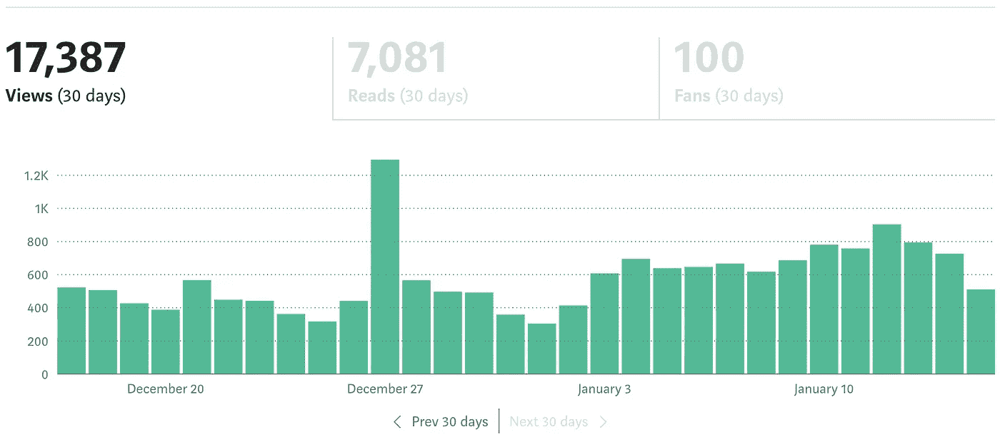

# 4 个月 62 篇文章…

> 原文：<https://levelup.gitconnected.com/62-articles-in-4-months-74b2374a4340>

## 我作为一个作家在媒体上的旅程，更新进展

来自 Adobe Stock 的许可图像

 [## 我在 2.5 个月内发表了 50 多篇文章——这是我学到的！

### 现在开始看到一些回报…

levelup.gitconnected.com](/ive-published-over-50-articles-in-2-5-months-this-is-what-i-have-learned-e4f747e9463d) 

## 只是为了重新封顶…

*   2020 年 9 月 8 日至 2020 年 9 月 30 日

第 15 篇
收入:9.04 美元

*   2020 年 10 月 1 日至 2020 年 10 月 31 日

第 19 篇
收入:44.43 美元

*   2020 年 11 月 1 日至 2020 年 11 月 30 日

第 19 篇
收入:84.76 美元

*   2020 年 12 月 1 日至 2020 年 12 月 31 日

第 6 篇
收入:71.14 美元

*   2021 年 1 月 1 日至 2020 年 1 月 15 日(进行中)

文章:3(迄今为止)
收入:51.62 美元(看起来这个月过半)

## 我发现的是…

在前两个半月，我写了很多。一个月差不多 20 篇质量好的文章。我有点担心我会跟不上进度或者没有话题可谈。如果发生这种情况，我的收入会大幅下降吗？2020 年 12 月将是一个考验，因为我没有太多时间去写，那个月只发表了六篇。与前一个月相比略有下降，但并不那么糟糕。我很高兴地看到，前几个月的努力仍然有助于我的收入。

2021 年 1 月对我来说又是一个忙碌的月份，但我已经设定了一周写两篇文章的目标。现在才 1 月 15 日，我的收入有望创下纪录。我确实认为有所帮助的是，我喜欢写的一些主题是加密货币、交易和数据科学，这些都是目前非常热门的话题，比特币正在经历另一轮大规模牛市。几个月前，只有发烧友才会阅读这些文章，但现在似乎每个人都想参与其中，这些文章非常受欢迎。尤其是关于我的交易机器人的系列。

## 以下是我目前的统计数据…

不知道 2020 年 12 月 27 日发生了什么导致了如此大的峰值。我不是在抱怨，但每天都这样就好了；)

## 我的 2021 年目标…

我不知道这有多现实，但我希望我的追随者超过 1000 人，让我的滚动 30 天浏览量在 2021 年底超过 100，000。我会随时告诉你进展情况。

我希望你觉得这篇文章有趣并且有用。如果您想随时了解情况，请不要忘记关注我，注册我的[电子邮件通知](https://whittle.medium.com/subscribe)。

# 迈克尔·惠特尔

*   ***如果你喜欢这个，请*** [***跟我上媒***](https://whittle.medium.com/)
*   ***更多有趣的文章，请*** [***关注我的刊物***](https://medium.com/trading-data-analysis)
*   ***有兴趣合作？*** [***咱们上领英***](https://www.linkedin.com/in/miwhittle/) 连线
*   ***支持我和其他媒体作者*** [***在此报名***](https://whittle.medium.com/membership)
*   ***请别忘了为文章鼓掌:)←谢谢！***