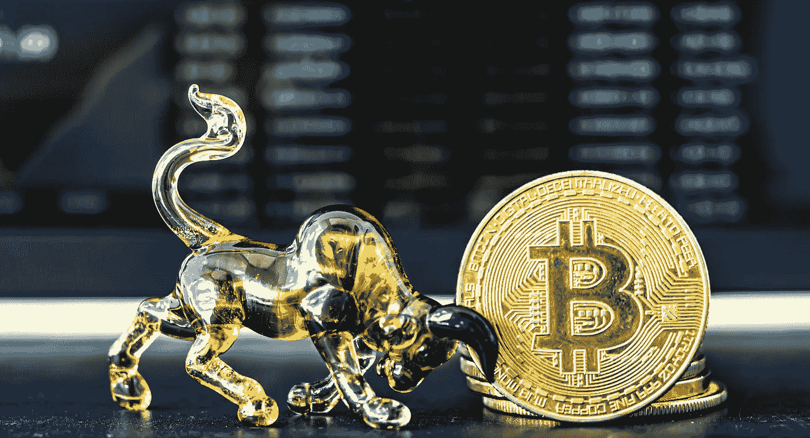
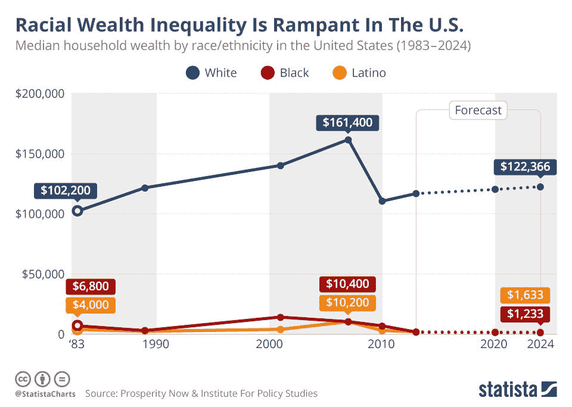
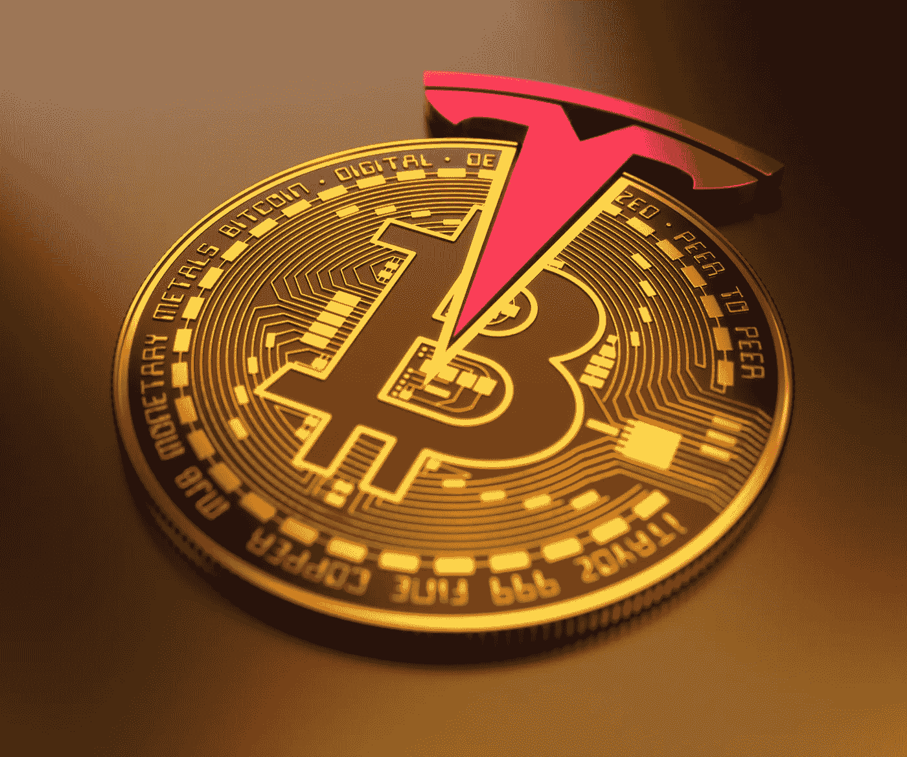

# 62%的加密投资者相信他们会变得富有——他们是对的吗？

> 原文：<https://levelup.gitconnected.com/62-of-crypto-investors-believe-theyll-get-rich-are-they-right-a5bcec78aae1>

## 快速致富计划还是全民投资机会？

图片: [Shutterstock](https://www.shutterstock.com/image-photo/bitcoin-coin-bull-model-lay-on-1498185320)

【2020 年 1 月，LendingTree 的首席经济学家 Tendayi Kapfidze 在[坚持分享他对比特币的看法](https://finance.yahoo.com/news/economist-bitcoin-is-a-pyramid-scheme-204217615.html?guccounter=1)；“这是一个金字塔计划”，他接着说，“它在这个世界上没有真正的用途。这是一个寻找问题的解决方案，但它仍然没有找到要解决的问题。”

这是一种懒惰的、不了解情况的、毫无根据的观点，以前已经被那些应该更了解情况的人推出过很多次，即使他们仍然对此持怀疑态度。

15 个多月后，Tendayi 得知最近对其公司客户的调查显示 [62%的人相信比特币等加密货币会让他们变得富有](https://www.newsweek.com/majority-crypto-investors-believe-it-will-make-them-rich-1583964)，他会怎么想？《新闻周刊》还[报道称，截至 2021 年 5 月](https://www.newsweek.com/46-million-americans-now-own-bitcoin-crypto-goes-mainstream-1590639)至少有 4600 万美国人拥有一些比特币——鉴于其当前价值接近 60，000 美元，可能不是整个硬币，但至少是硬币的一小部分(被称为 Satoshis，允许部分所有权)。

《新闻周刊》的文章还透露，在这些个人(占美国成年人口的 17%)中，四分之三的人热衷于将加密货币整合到他们的个人金融计划中，包括人寿保险。

这些投资者是被数字黄金的光芒所诱惑而误入歧途、绝望地乐观吗？还是说加密货币给普通人提供了一个赚一笔改变生活的钱的机会？

# 富人越来越富

许多人都真切地感受到富人越来越富，而穷人越来越穷，尤其是在新冠肺炎事件之后，许多亿万富翁的财富大幅增长。2020 年，埃隆·马斯克的财富增长了 1400 亿美元。紧随其后的是亚马逊的杰夫·贝索斯，他又积累了 760 亿美元。2020 年，脸书的马克·扎克伯格的个人财富仅增加了 260 亿美元，他可能会觉得有些不够。

除了拥有如此巨大财富份额的少数个人的道德之外，当种族被纳入考虑范围时，收入的不平等就更加明显了。来自 Statista 的这份[数据显示了美国国内与种族相关的巨大家庭财富鸿沟——它描绘了一幅更加暗淡的画面。](https://www.statista.com/chart/11096/racial-wealth-inequality-is-rampant-in-the-us/)

来源:[统计局](https://www.statista.com/chart/11096/racial-wealth-inequality-is-rampant-in-the-us/)

似乎确实需要一种手段来解决普通家庭和超级富豪之间的财富差距，同时也要为所有公民提供平等的机会，无论其种族或社会地位如何。

对更多财富的渴望将被一些人视为快速致富计划的渴望，即徒劳地寻求快速、改变生活的收益，而不付出努力。但是有些人有不同的感觉(包括我自己)。我们认为，所有人都应该有机会从资产增值中受益，而不仅仅是那些最低投资额高得令人望而却步的人，或者那些因为已经很富有而只能获得机会的人。出于各种原因，加密货币可能就是这一资产类别。

我试图通过持有比特币等加密货币的少量股份，至少从加密行动中分得一杯羹。我不认为这是一个快速致富的计划，而是一个有点风险的投资，我希望会有回报。我不会把我的未来押在这上面，但如果其他人也能赢，能在小范围内受益也不错。这是对我的财务状况适度(但受欢迎)改善的一种潜在方式。

像比特币这样的资产提供了一种令人信服和吸引人的方式来做到这一点——也许不会变得富有，肯定不会达到埃隆·马斯克的规模，但至少有望对我们的个人经济产生微小但受欢迎的提振。

# 比特币——所有人的加密货币

比特币是所有加密货币中最知名的。这是我第一次投资的项目(直到最近，2021 年 1 月)，当时一个比特币的价格是 34000 美元。如今，价格徘徊在 55000 美元左右。

据推测，60%的投资回报率是促使 LendingTree 的调查受访者相信他们正在致富的那种收益。虽然比特币因其价格波动而闻名，因为在它存在的 12 年左右的时间里，它的价格曾几次大幅下跌，但现在价格已经稳定了几个月。包括保罗·都铎-琼斯(Paul Tudor-Jones)和最近的 T2(Stan drucken miller)在内的许多传统金融领域公认的权威人士已经宣布，他们相信加密货币是我们未来金融系统中持久而稳定的一部分。

虽然它被许多人贴上了过于危险的标签，作为[罪犯](/cryptocurrency-is-not-just-a-tool-for-criminality-6996c949c42)和[环境污染者](/is-bitcoin-an-environmental-disaster-waiting-to-happen-d770e4bea5e9)的工具，每一点都有有效和可信的反驳。也许一个更有效的问题，而不是试图从伦理或结构上拆除它，是考虑它是否是一个向所有人开放的[机会——一个社会均衡器甚至](/bitcoin-could-be-a-force-for-social-good-heres-how-2a4150f2a1e)？

# 是否所有人都有平等的机会投资加密技术？

鉴于财富相对于种族的不平衡，以及 LendingTree 所在的北卡罗来纳州夏洛特等城市的人口构成(52.3%的公民是黑人、西班牙裔或亚裔)，考虑加密货币是否真的可以为所有人所用似乎是有意义的。

商业内幕报道的 [FDIC 的一项调查显示，超过 1400 万美国人没有银行账户，无法使用传统的银行设施。这使得他们无法涉足金融领域(贷款、储蓄、投资等等)。这个问题对黑人和西班牙裔家庭的影响更大(分别占两组家庭的 17%和 14%)。](https://www.businessinsider.com/coronavirus-stimulus-check-payment-no-bank-account-waiting-2020-5?r=US&IR=T)

比特币等加密货币的美妙之处在于，它们绕过了与银行接洽的需要。个人可以使用简单、低成本的硬件钱包或软件钱包应用程序拥有和持有比特币，这些应用程序可以免费获得，并可以存储在基本的智能手机上。一旦一个人有了钱包，他们就可以很容易地用他们的美元购买比特币，然后当价格上涨时，他们可以自由分享价值的增加。

比特币也没有最低投资额——例如，你不需要有足够的美元来开设投资基金或购买一整盎司的黄金。如果这是你能负担得起或愿意下注的，你可以买价值 20 美元的股票。当然，在一个不断上涨的市场中持有少量股份总比没有好？

最后，它是一个均衡器，任何有钱包的人(有一个唯一但容易共享的数字地址)都可以收到比特币来支付商品和服务。居住在阿富汗的[博主 Parisa Ahmadi 的案例就证明了这一点，她已经能够通过用比特币写作获得报酬，有效地绕过了原本会阻止她赚钱和拥有金钱的文化规则。](https://arqgroup.com/insights/many-sides-to-a-bitcoin/)

图片: [Shutterstock](https://www.shutterstock.com/image-illustration/united-states-february-2021tesla-buys-dollar-1913763295)

# 那么比特币会让我们变得富有吗？

没有快速或简单的致富方法。

比特币(像所有投资一样)可以升值，也可以贬值。许多人指出，在过去的 12 年里，比特币的价格大幅下降，这是假设未来比特币价格会再次暴跌的一个理由——他们可能是对的，或者它可能已经稳定下来，正如许多比特币最大主义者所确信的那样。

许多人通过投资大大小小的加密货币赚得盆满钵满——不仅仅是那些已经很富有的人，还包括普通的普通人，他们进行小额但适时的投资。当然，许多其他人也遭受了重大损失——通常是因为押了超出他们承受能力的赌注。但是对于那些采取谨慎态度的人来说，有理由保持乐观。

随着世界各地的银行和金融机构开始认识到比特币，并开始提供与比特币相关的服务和投资基金，许多人认为“失控”的波动性开始得到解决。像[特斯拉](https://www.cnbc.com/2021/02/08/tesla-buys-1point5-billion-in-bitcoin.html)和 MicroStrategy 这样的公司将他们的公司金库投资于比特币，也在稳定价格波动方面发挥了作用。

从很多方面来说，有很多好的理由，比特币和加密货币*确实有潜力让很多人变得富有，正如 LendingTree 的调查受访者所认为的那样。它的美妙之处在于，这个机会对夏洛特这样的城市的普通居民和埃隆·马斯克这样的亿万富翁一样开放。*

*警告是不要把你所有的可用资本都投入进去，不要冒超过你在最坏情况下愿意完全失去的风险。但是如果你对加密货币有兴趣，也许[买你能买得起的](/the-exact-process-i-used-to-buy-my-first-bitcoin-in-under-an-hour-bee2df1ee001)(不管数量有多小)并长期安全地持有你的加密货币。其余的由市场决定。*

*如果你喜欢阅读这样的故事，并且愿意支持 Medium 上的作家，考虑注册成为 Medium 会员。一个月 5 美元，给你无限的故事。如果你注册使用我的链接，我会赚一小笔佣金。*

* [## 阅读托比·黑兹伍德(以及媒体上成千上万的其他作家)的每一个故事

### 作为一个媒体会员，你的会员费的一部分会给你阅读的作家，你可以完全接触到每一个故事…

tobyhazlewood.medium.com](https://tobyhazlewood.medium.com/membership)* 

*注意:*本文仅供参考。不应将其视为财务或法律建议。在做任何重大财务决定之前，先咨询财务专家。**

## *如果你喜欢这篇文章，请随时加入我的邮件列表。*