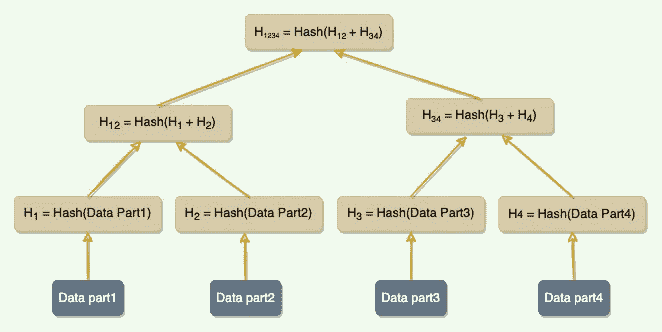
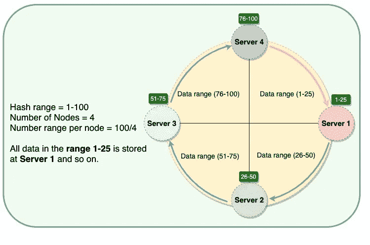
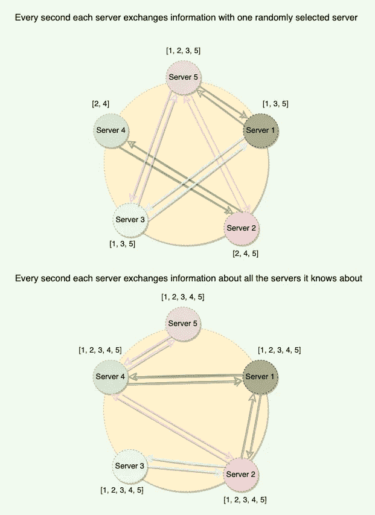
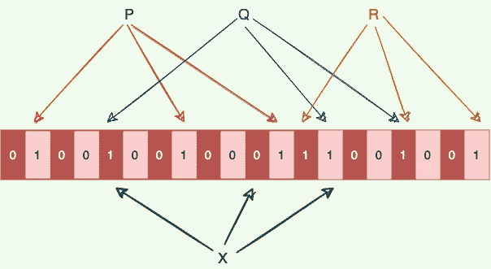
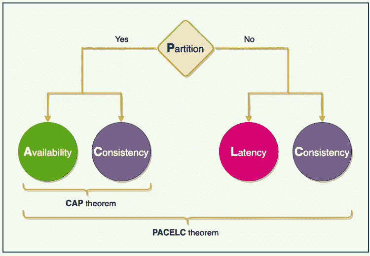

# 下一次系统设计面试前需要了解的 7 种算法

> 原文：<https://levelup.gitconnected.com/7-algorithms-to-know-before-your-next-system-design-interview-d1de2f374ffa>

让你的下一次系统设计面试有一个好的开始。

在本帖中，我们将讨论七个系统设计概念，它们可以用来解决与分布式系统相关的设计问题。由于这些概念可以应用于所有类型的分布式系统，它们在系统设计面试中变得非常方便。

下面是我们将要讨论的概念列表:

1.  Merkle 树
2.  一致散列法
3.  读取修复
4.  八卦协议
5.  布隆过滤器
6.  心跳
7.  CAP 和 PACELC 定理

让我们开始吧。

# 1.Merkle 树

用于识别服务器之间的数据不一致。

Merkle 树

## 背景

分布式系统在不同的服务器上维护多个数据副本(称为副本),以实现容错和更高的可用性。为了保持所有副本服务器之间的数据同步，系统需要一种有效的机制来比较两个副本之间的数据。在分布式环境中，我们如何快速比较驻留在两个不同副本上的一系列数据的两个副本，并准确找出哪些部分不同？

## 定义

副本可以包含大量数据。天真地分割整个范围来计算校验和进行比较是不太可行的；要传输的数据实在太多了。相反，我们可以使用 **Merkle 树**来比较范围的副本。

## 解决办法

一棵 [Merkle 树](https://designgurus.org/path-player?courseid=grokking-the-advanced-system-design-interview&unit=grokking-the-advanced-system-design-interview_1626009840592_0Unit)是一棵二进制散列树，其中每个内部节点是它的两个孩子的散列，每个叶子节点是原始数据的一部分的散列。比较 Merkle 树在概念上很简单:

1.  比较两棵树的根哈希。
2.  如果相等，停止。
3.  在左右孩子身上递归。

最终，这意味着复制品确切地知道范围的哪些部分是不同的，但是交换的数据量被最小化。Merkle 树的主要优点是可以独立检查树的每个分支，而不需要节点下载整个树或整个数据集。因此，Merkle 树最大限度地减少了同步所需传输的数据量，并减少了磁盘读取次数。

使用 Merkle 树的缺点是，当一个节点加入或离开时，许多键范围可能会改变，此时需要重新计算树。

## 例子

为了反熵和解决后台冲突，亚马逊的**发电机**使用 Merkle 树。

详情:[https://lnkd.in/gZpt67uU](https://lnkd.in/gZpt67uU)

# 2.一致散列法

分布式系统使用一致的散列法在服务器之间分发数据。

一致散列环

一致散列有助于两件事:

1.  它将数据映射到物理服务器。每当系统想要读取或写入数据时，一致散列告诉我们哪个服务器保存数据。
2.  它确保在添加或删除服务器时，只有一小部分键会移动。

更多详情:[https://lnkd.in/dJQKjN6i](https://lnkd.in/dJQKjN6i)

# 3.读取修复

当跨多台服务器复制数据时，读取修复用于将最新版本的数据推送到具有旧版本的服务器。

在读取操作期间修复陈旧数据，因为此时，我们可以从多个服务器读取数据，以比较和查找具有陈旧数据的服务器。

详情:[https://lnkd.in/g6kCVgvr](https://lnkd.in/g6kCVgvr)

# 4.八卦协议

用于在服务器之间高效共享状态信息。

八卦协议(designgurus.org)

每台服务器都会跟踪集群中其他服务器的状态信息，并每秒钟与一台随机服务器分享这些信息。通过这种方式，最终，每台服务器都可以了解集群中所有其他节点的状态。

详情:[https://bit.ly/3D2w14j](https://bit.ly/3D2w14j)

# 5.布隆过滤器

布隆过滤器数据结构告知元素**是否可能在集合中，或者肯定不在**中。唯一可能的错误是误报，即搜索不存在的元素可能会给出不正确的答案。随着滤波器中元件的增加，误差率增加。空的布隆过滤器是全部设置为 0 的`m`位的位阵列。还有`k`个不同的散列函数，每个函数将一个集合元素映射到一个`m`位位置。

*   要添加一个元素，将其提供给哈希函数以获得`k`位的位置，并将这些位置的位设置为 1。
*   为了测试一个元素是否在集合中，将它提供给哈希函数以获得`k`位的位置。
*   如果这些位置的任何位为 0，则该元素是集合中的**而不是**。
*   如果都是 1，那么元素**可能是集合中的**。

这是一个布隆过滤器，有三个元素`P`、`Q`和`R`。它由 20 位组成，使用三个哈希函数。彩色箭头指向集合元素映射到的位。

由 20 位组成的布隆过滤器。

由 20 位组成的布隆过滤器。

*   元素`X`肯定不在集合中，因为它散列到一个包含 0 的位位置。
*   对于固定的错误率，添加新元素和测试成员资格都是恒定时间的操作，并且具有用于“n”个元素的空间的过滤器需要 ***O*** (n)个空间。

详情:【https://bit.ly/3TbSAsR 

# 6.心跳

用于广播服务器的健康状态。

## 背景

在分布式环境中，数据(或工作)分布在服务器之间。这种设置要求服务器知道系统中还有哪些服务器，以便有效地路由请求。此外，服务器应该能够判断其他服务器是否启动并运行。在分散式环境中，每当请求到达服务器时，服务器应该能够决定哪个服务器负责处理该请求。这样，及时检测服务器故障至关重要，使系统能够采取纠正措施，将数据(或工作)移动到另一台健康的服务器，并阻止环境进一步恶化。

## 定义

在分布式环境中，每台服务器都会定期向中央监控服务器或系统中的其他服务器发送心跳消息，以表明它仍在运行。

## 解决办法

心跳是分布式系统中检测故障的机制之一。如果有中央服务器，所有服务器都会定期向其发送心跳消息。如果没有中心服务器，所有服务器随机选择一组服务器，每隔几秒钟向它们发送一次心跳消息。这样，如果有一段时间没有从服务器接收到心跳消息，系统可以怀疑服务器可能已经崩溃。如果在配置的超时期限内没有心跳，系统可以断定服务器不再活动，并停止向其发送请求，并开始处理其替代品。

## 例子

**谷歌文件系统(GFS)** 和 **HDFS** 使用心跳与系统中的服务器相互通信，以给出指令和收集状态。

详情:[https://bit.ly/3eFnT04](https://bit.ly/3eFnT04)

# 7.CAP 和 PACELC 定理

CAP 和 PACELC 定理

在这两个定理的帮助下，分布式系统可以在一致性、可用性、分区容忍度和延迟之间选择一个好的平衡。

详情:[https://lnkd.in/dTFksWj9](https://lnkd.in/dTFksWj9)

# 结论

➡实践这些系统设计概念来使自己与众不同！

➡在“ [**探索系统设计面试**](https://www.designgurus.io/course/grokking-the-system-design-interview)**”**和**[**探索高级系统设计面试**](https://www.designgurus.io/course/grokking-the-advanced-system-design-interview) 中了解了更多关于这些方法的信息**

**➡在 Linkedin 上关注我，了解系统设计和编码面试的技巧。**

**阅读更多关于系统设计和编码的访谈:**

** [## 不要只是 LeetCode 请遵循编码模式

### 编码面试越来越难通过了。为了准备编码面试，你需要几周甚至几个月的时间…

designgurus.org](https://designgurus.org/blog/dont-just-leetcode)  [## 系统设计面试生存指南(2023):准备策略和实用技巧

### 2023 年系统设计面试剧本。

levelup.gitconnected.com](/system-design-interview-survival-guide-2023-preparation-strategies-and-practical-tips-ba9314e6b9e3)**