# 每个 Python 程序员都应该避免的 7 个坏习惯

> 原文：<https://levelup.gitconnected.com/7-bad-habits-that-every-python-programmer-should-avoid-d477ea91e7da>

## 用 python 写代码时应该避免的事情


Ethan Dow 在 [Unsplash](https://unsplash.com?utm_source=medium&utm_medium=referral) 上拍摄的照片

就其语法和应用而言，Python 是一种非常简单和通用的编程语言。由于其简单的语法和易学性，它在初学者中也很受欢迎。

在本文中，我们将介绍一些开发人员通常在不知不觉中犯的常见错误和坏习惯，以及改进它们的方法。以便我们可以提高代码的可读性，并以更 pythonic 化的方式编写代码。

我们开始吧！

# 1.避免列表理解

列表理解是 python 的一个独特特性，也是我最喜欢的特性之一。这不仅提高了代码的可读性，也是以 pythonic 方式编写代码的一个好习惯。

许多开发人员不使用 list comprehension 并利用它的特性，因为他们发现它并不方便。但是，在这里您可以看到使用列表理解编写的代码是如何更加高效和可读的。

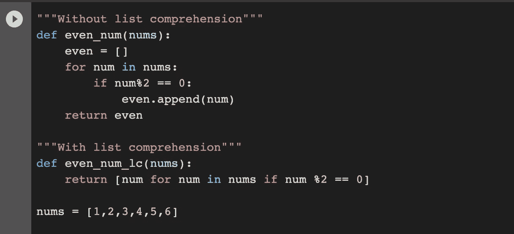

列表理解示例

与简单循环相比，列表理解更具声明性。因此，它们可读性更强，更容易理解，被认为是编写代码的 pythonic 方式。

# 2.使用裸除

许多开发人员使用 bare `except`子句进行异常处理。这需要避免，因为这样我们就没有任何异常要检查，也不知道为什么会发生错误。

Bare `except`子句捕获所有异常，包括所有我们不希望捕获的异常，如 **SystemExit** 和 **KeyboardInterrupt。**这使得使用`ctrl+c`中断程序变得困难，并可能导致其他问题。

这里有一个光秃秃的`except`子句的例子:

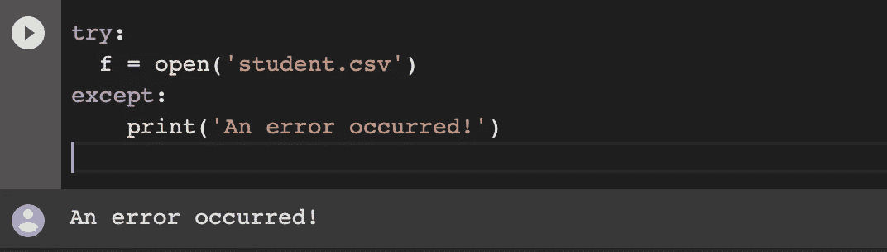

在这里，我们可以看到，虽然我们捕捉到了错误，但我们现在并不知道由于光秃秃的`except`条款而导致这种异常的确切原因。

有一种更好的方法可以通过指定异常来捕捉异常。

**示例**:

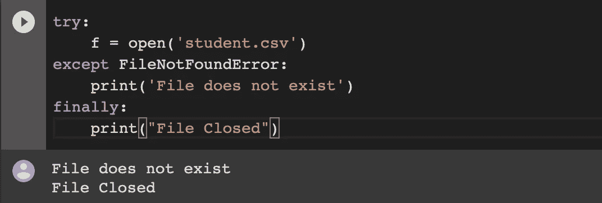

这里，我们指定了异常 **FileNotFoundError** 和`except`。

# 3.滥用列表理解

现在我们知道列表理解是 python 中的一个强大特性，它使代码更具可读性，但是有很多开发人员过度使用列表理解并误用它的例子。

这不仅使 python 代码非 python 化，而且降低了可读性，违背了使用列表理解的全部目的。

这里有一个例子:

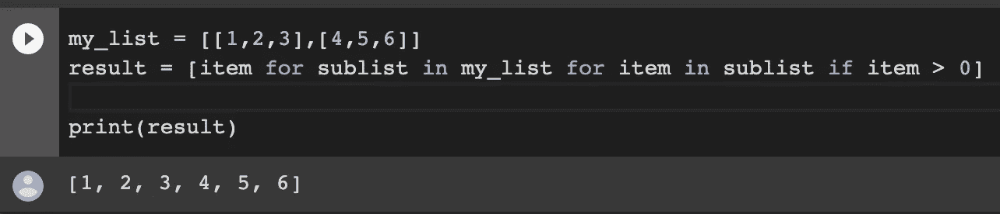

使用列表理解时，逻辑必须简洁。并且应该避免在列表理解中编写长的嵌套循环。

# 4.使用空列表作为默认参数

在 python 中，当函数的缺省参数是可变对象(如列表或字典)时，如果函数修改该可变对象，则该缺省参数的缺省值实际上被修改。

大家讨论一下。

这里有一个相同的例子:

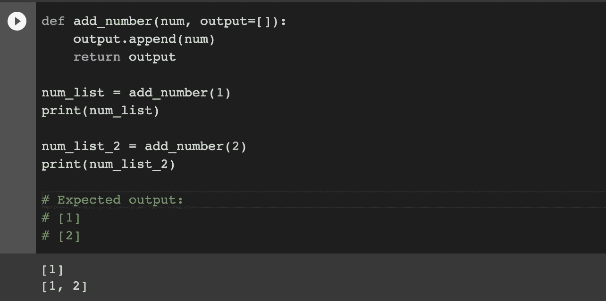

这里，我们使用两个不同的变量`num_list`和`num_list_2`，但是得到的是输出[1]和[1，2]。这不是我们期望得到的，对吗？

这是因为默认参数只为一个函数创建一次**。由于 list 是一个可变对象，所以每次我们调用同一个函数时，默认参数的值实际上都被修改了。**

****这是我们应该做的事情****

**一种解决方法是使用`None` 作为默认参数的默认值。**

****示例**:**

**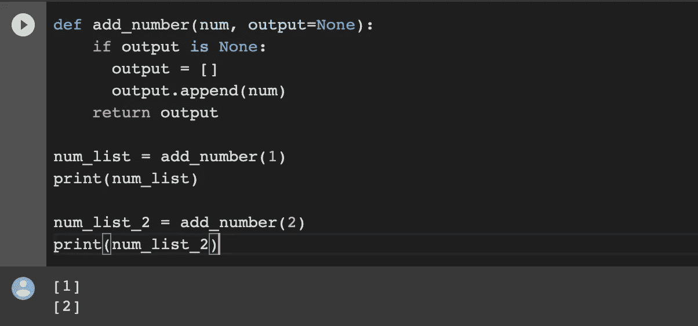**

# **5.对文件操作使用打开和关闭**

**在 Python 中，对文件进行读写等操作是很常见的事情。通常，我们用`open()`打开一个文件，用`close()`关闭一个打开的文件。**

**这里有一个例子:**

****

**这很简单吧？但是，很多时候我们只是打开了一个文件，却没有/忘记关闭它。这可能对我们的系统不利，因为:**

*   **太多打开的文件会占用 RAM 空间，这可能会影响性能并降低系统速度。**
*   **对于大多数部件，对文件所做的更改只有在文件关闭后才会生效。**

## ****使用 with 语句的更好方式****

**在 python 中处理文件操作时我们可以使用`with`语句。**

**With 语句创建一个执行块，当该块的执行完成时，file 对象的 close 函数被自动调用，文件被关闭。**

****举例**:**

**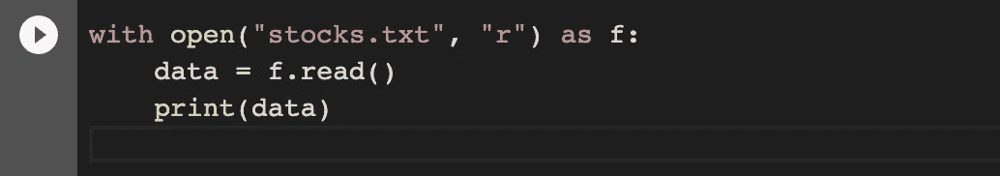**

# **6.使用`==`和是错误的方式**

**许多开发人员经常混淆`==`和`is`操作符，并交替使用它们。但是，这两个是不同的运算符，应该相应地使用。**

*   **`==`运算符用于检查值是否相等。当我们需要知道两个对象是否有相同的值时，我们应该使用它。**
*   **`is`运算符用于检查参考值是否相等。当我们需要知道两个引用是指向同一个对象还是存在于同一个内存位置时，我们应该使用它。**

**永远记住:**

```
x is y
```

**与相同:**

```
id(x) == id(y) 
```

**这里，`id()`是 python 内置函数。返回指定对象的唯一 id。**

****举例**:**

**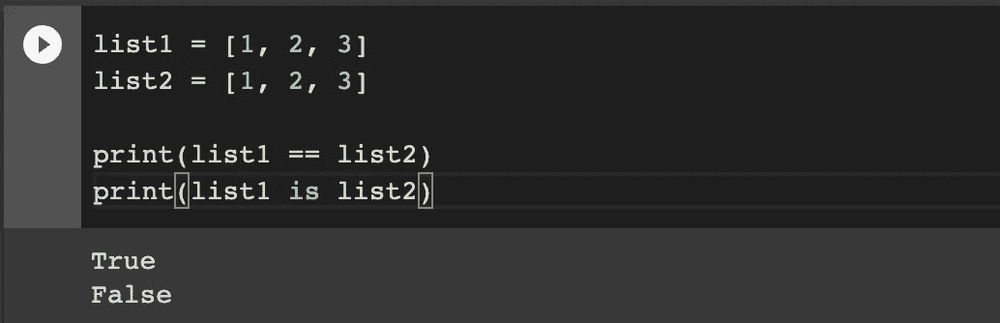**

**这里，`list1 == list2`为真，因为两个列表有相同的元素。但是，`list1 is list2`是假的，因为两个列表的内存引用是不同的。**

**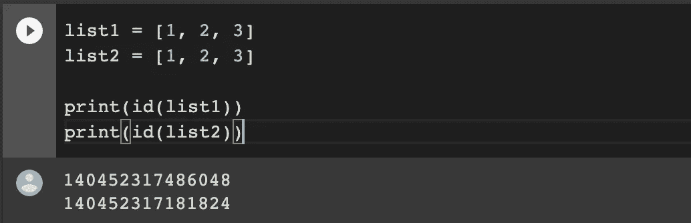**

**这里，我们可以看到两个列表有不同的 id(内存位置)。因此`list1 is list2`为假。**

# **7.使用 caret(^)求幂**

**许多初学者使用脱字符`(^)`运算符，这是一种按位运算符，用来计算一个数的幂。在 Python 中，我们有一个单独的指数操作符`**`来计算一个数的幂。**

****示例:****

**这里有一个指数运算符的例子`**`**

**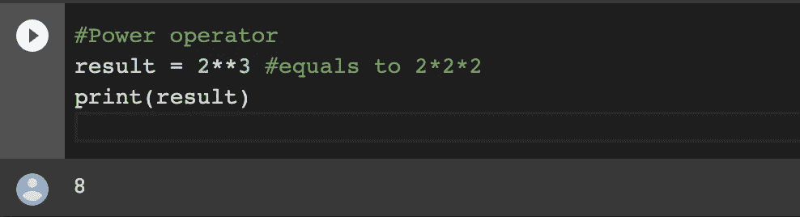**

**这里有一个按位异或`^`运算符的例子**

**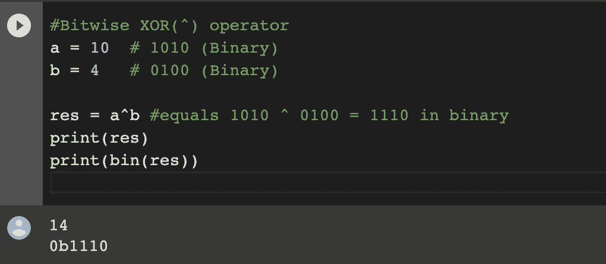**

## **结论**

**这就是这篇文章的全部内容。在本文中，我们讨论了 python 中的一些坏习惯以及改进它们的方法。动手实践以 pythonic 式的高效方式编写代码。**

**感谢阅读！**

> ***在你走之前……***

**如果你喜欢这篇文章，并希望**继续关注**更多**精彩的**文章，请考虑使用我的推荐链接[https://pralabhsaxena.medium.com/membership](https://pralabhsaxena.medium.com/membership)成为一名中级会员。**

**此外，你可以在这里免费订阅我的时事通讯: [Pralabh 的时事通讯](https://pralabhsaxena.medium.com/subscribe)。**

# **分级编码**

**感谢您成为我们社区的一员！在你离开之前:**

*   **👏为故事鼓掌，跟着作者走👉**
*   **📰查看[升级编码出版物](https://levelup.gitconnected.com/?utm_source=pub&utm_medium=post)中的更多内容**
*   **🔔关注我们:[Twitter](https://twitter.com/gitconnected)|[LinkedIn](https://www.linkedin.com/company/gitconnected)|[时事通讯](https://newsletter.levelup.dev)**

**🚀👉 [**加入升级人才集体，找到一份惊艳的工作**](https://jobs.levelup.dev/talent/welcome?referral=true)**