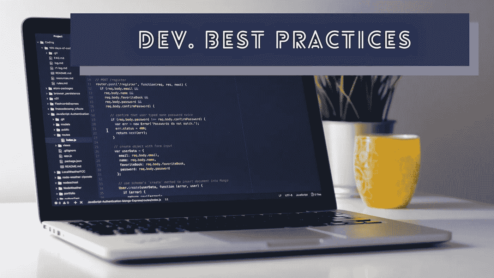
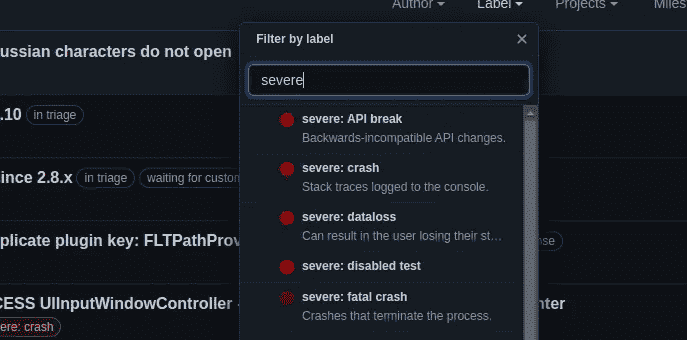
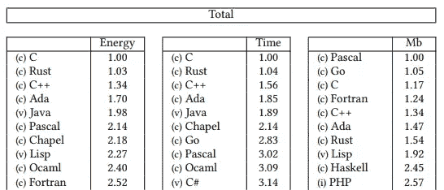

# 计算机编程的 7 个最佳实践

> 原文：<https://levelup.gitconnected.com/7-best-practices-for-computer-programming-880ee281337f>

## 考虑使用这些实践来高效地开发高质量的软件

照片由 [Unsplash](https://unsplash.com/s/photos/coding?utm_source=unsplash&utm_medium=referral&utm_content=creditCopyText) 上的 [Clément Hélardot](https://unsplash.com/@clemhlrdt?utm_source=unsplash&utm_medium=referral&utm_content=creditCopyText) 拍摄，由 Canva 编辑

程序员使用各种实践来更好地进行软件开发活动。例如，一些程序员总是倾向于编写可读和干净的代码，以保持代码库的质量。同时，一些程序员往往倾向于使用令人印象深刻的优化技术来编写高效且硬件友好的源代码。这些都是好的实践，每个开发人员都可以遵循它们来更好地开发软件。因此，大多数高级工程师甚至会记录这些编程实践，以指导整个软件开发团队。

编程最佳实践是大多数程序员接受并遵循的几个行为——但这些不是规则，因此每个人在软件开发期间无疑都可以忽略众所周知的最佳实践。因此，后果将随着耗时的工作负载而来。举个例子，还记得上次你忽略的 bug 是怎么回事吗？在快速变化的现代代码基础上，忘记一个 bug 会成倍地增加 bug 修复时间。

因此，在头脑中维护一个最佳实践清单是构建高质量软件的好主意——并且享受编程生涯。我十多年前开始编程，从事过不同领域的工作，如桌面应用程序开发、移动应用程序开发和 web 开发。根据我在软件开发旅程中的大量学习，我准备了下面的编程实践列表。这些最佳实践对于您每天从事的任何软件开发项目都是有效的。

# 永远不要隐藏错误，而是预防和修复它们

软件缺陷是不可避免的，但我们可以更早地发现它们并应用必要的修复。我们可以通过在开发人员测试或开发阶段识别软件缺陷来防止它们。例如，当您实现一个算法时，您可以通过仔细查看每个可能的边缘情况来防止大多数错误。

然而，在现代快速软件开发文化中，早期的 bug 检测有些困难。此外，在获得无 bug 证书之前，改进每个代码片段是不实际的。因此，几乎所有的软件开发团队都在初始开发阶段后优先考虑 bug 修复。了解 Flutter 团队如何对关键错误进行分类:

Flutter repository 的 bug 分类，作者截图。

在大多数情况下，代码评审通常关注代码风格、设计模式和语言语法。因此，我们可以很容易地将 bug 隐藏在代码库中。但是，隐藏的 bug 会悄悄地增长——你需要更多的时间和精力来修复它们。因此，永远不要隐藏 bug——预防并修复它们，以节省您将来修复 bug 的时间。

# 只有在理解的情况下才添加代码片段

每个官方文档并不提供我们完成编程任务所需的每个代码示例。因此，程序员通常从在线论坛、教程和开源项目中获取代码片段。这些公共代码片段是由像我们一样的其他开发人员编写的，因此这些代码片段可能包含错误和兼容性问题。

因此，在将代码片段复制粘贴到软件项目中之前，仔细检查每一个代码片段总是很好的。检查是否存在不推荐使用的 API、不兼容的功能、代码样式问题和性能问题。

此外，始终充分理解您的代码更改的作用——它将帮助您修改代码库，而不会引入新的错误、软件质量相关问题和安全漏洞。

# 努力写出好的代码，而不是完美的代码

完美的代码不存在，但好的代码存在。如果你努力编写完美的代码，你的代码库最终会变成一个过度设计的组件。另一方面，好的代码通过可管理的、最小的和干净的代码结构产生预期的结果。

通过使用最合适的数据结构和设计模式，使用定义良好的代码风格指南来编写好的代码。在开发阶段重构代码以提高可管理性。

但是，不要试图通过引入不想要的设计模式、严格的代码风格指南和复杂的数据结构来使您的代码完美。即使从你的角度来看，你使代码库完美，其他团队成员也不会同意——完美的代码对每个开发人员来说都是独一无二的，但是每个开发人员通常都钦佩好的代码。

下面的故事解释了如何通过几个干净的代码实践来编写好的代码:

 [## 每个软件项目的 5 个干净代码实践

### 提高前端、后端、CLI、桌面或移动应用程序代码库质量的想法

better 编程. pub](https://betterprogramming.pub/5-clean-code-practices-for-every-software-project-479443b31c3c) 

# 编写环保代码

你认为你写代码可以拯救环境吗？发电(特别是基于燃料的发电)的副作用经常造成环境污染。另一方面，当计算机做更多的计算工作时，它会产生更多的热量，需要更多的能量。最近的计算机科学研究项目将 C、Rust 和 C++确定为顶级环境友好语言，因为它们消耗的资源较少。

流行编程语言的能量、时间和内存。“跨编程语言的能效”[研究论文](https://greenlab.di.uminho.pt/wp-content/uploads/2017/10/sleFinal.pdf)的结果表。

当您编写的源代码消耗较少的物理内存(RAM)和 CPU 周期时，您的软件进程不会更快地耗尽设备电池。我们需要编写优化的代码来减少进程的资源使用。因此，在处理算法任务时，一定要估计时间和空间的复杂性。

此外，如果你努力使你的代码生态友好，选择正确的技术起着巨大的作用。想象一下，如果一个用户同时运行几个基于电子或基于 React 的应用程序，会占用多少资源。考虑到快速软件开发的好处，在选择框架时也要考虑性能和资源消耗。

# 首先稳定核心，然后在功能上下功夫

有时，我发起了一个开源项目，用一些特性扩展了一个研究原型。但是，后来，我不得不几乎重写它，以使它为开源开发者社区的生产和使用做好准备。向不稳定的软件系统核心添加功能会导致耗时的软件重写。

因此，在添加任何特性之前制造一个稳定的系统核心无疑是非常好的，因为核心稳定性定义了你的软件系统的生命周期。 [MVP](https://en.wikipedia.org/wiki/Minimum_viable_product) (最小可行产品)和类似插件架构的概念支持了这个想法。

大多数软件开发团队通常分解核心和功能模块，以获得更好的稳定性和可维护性。例如，苹果维护着一个名为 [Darwin](https://github.com/apple/darwin-xnu) 的核心开源操作系统，并为 iOS 和 macOS 等其他特定设备的操作系统增加了功能。与此同时， [Golang](/5-lessons-that-golang-teaches-to-all-programmers-71b332504cf2) 团队很少修改语言核心，而是经常向标准库添加特性。

# 使用最合适的架构和技术

软件架构模式定义了程序员如何组织和设计特定软件系统的基本结构。比如可以选择微服务架构来构建基于云的应用。您也可以设计每个组件的内部结构。例如，您可以使用带有类似 MVC 的模块化代码结构的同步 RESTful 模式来开发您的微服务。

第一次尝试就选择最合适的基础架构和实现架构，因为后期的架构更改非常耗时。例如，大约三年前，Meta 宣布了 React 原生框架的几个架构变化，以取代 JavaScript 桥概念，但这些变化尚未以稳定的公共版本发布。下面的故事进一步解释了 React Native 的新架构:

 [## 你不用再比较 Flutter 和 React Native 了

### React Native 修复了主要的性能问题，并与 Flutter 等同

better 编程. pub](https://betterprogramming.pub/you-dont-have-to-compare-flutter-and-react-native-anymore-15ddc4c1342a) 

此外，根据您的需求选择正确的技术，而不要考虑当前的趋势——如果当前的趋势不能解决您的问题，那也没关系。例如，与 Go 和 Rust 趋势相比，C/C++仍然是生产轻量级二进制文件的好选择。

# 不要再做同样的手动任务——为每个人实现自动化

还记得[干](https://en.wikipedia.org/wiki/Don%27t_repeat_yourself)(不要重复自己)原则吗？DRY 原则激励程序员通过重用代码段来编写高度可维护的代码。类似地，我们可以重用自动化脚本并提高我们的编程效率。

如果您重复地做一个手工任务，其他团队成员或者贡献者也必须在开发活动中做同样的手工任务。投入一些时间为手动任务编写 shell 脚本，因为自动化节省了每个人的时间。

自动化是在您的软件项目中启动 DevOps 原则的第一步，因此在软件开发期间重复执行手动任务之前要三思。此外，您可以使用[元编程](https://en.wikipedia.org/wiki/Metaprogramming)概念自动化您的源代码语句。

# 结论

最佳实践不是规则或官方标准——编程最佳实践是指几个被广泛接受的活动，每个程序员都可以遵循这些活动来开发高质量的软件。我们已经讨论了一些通用的编程实践，您可以在本文中的任何软件项目中使用它们。

每个开发人员确实可以根据他们的开发经验建立他们自己的最佳实践。因此，将您的编程经验与上面的列表结合起来，创建一个个性化的最佳实践集，在您的日常编程任务中应用。

感谢阅读。