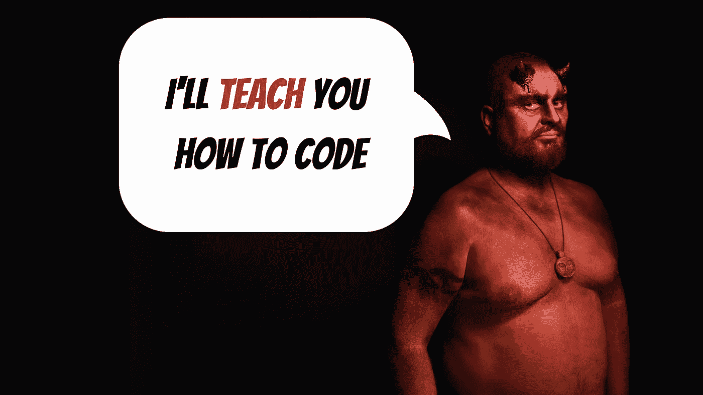

# 软件开发人员的 7 大罪

> 原文：<https://levelup.gitconnected.com/7-capital-sins-of-a-software-developer-7cb66f6abeca>

## 对任何软件开发人员来说都是大忌

由[максимвласенко](https://unsplash.com/@maksymvlasenko?utm_source=unsplash&utm_medium=referral&utm_content=creditCopyText)在 [Unsplash](https://unsplash.com/s/photos/devil?utm_source=unsplash&utm_medium=referral&utm_content=creditCopyText) 上拍摄的原始照片，由作者编辑

作为软件开发人员，我们不应该犯的大罪只不过是一系列我们应该不惜一切代价避免的大忌。

要么是因为他们让我们在同事眼中看起来很糟糕，要么是因为他们对我们不利，不利于我们的职业发展。

然而，不管我们认为自己有多伟大(即使你是对的，你是一个伟大的开发人员)，在我们职业生涯的某个时刻，我们已经成为其中一些的牺牲品。这就是为什么为了我们行业中的每个新人(以及不那么新的人)，我将带你经历我认为作为软件开发人员你能做的 7 件最糟糕的事情。

# 自我

关于这个我们还能说什么？软件开发人员非常自负。也许这是我们把自己视为创造者后，多年来形成的[上帝情结](https://en.wikipedia.org/wiki/God_complex)。

也许是因为我们工作在一个不是每个人都了解的行业，正因为如此，我们被视为技术大师。我不得不承认，由于不同的教育系统试图将人们变成数字公民，这种情况每年(和每一代人)越来越少。向人们展示技术是如何工作的，将会打破我们行业开始时产生的鸿沟。

但是不管原因是什么，我们需要明白自我不是正确的方法。我们不能认为自己比别人强。

你有没有发现自己称非技术人员为“麻瓜”？因为我有。这本来是一个内部笑话，但话又说回来，这是我们多年来形成的不受控制的自我的一个小小的缩影。

其他人甚至懒得去控制它，因为他们混淆了自信和自我。一个会帮助你达到你从未想象过的角色和职位，而另一个只会让你看起来像个白痴。确保你明白其中的区别。

自信是指相信你可以完成一项任务，或者学习一门新的编程语言，或者理解一个复杂的逻辑，而其他人在这项任务中失败了。自我就是相信你是唯一能做这些事情的人，因为你是特别的。

最新消息。你并不特别。所以，保持自我，这将帮助你营造一个更好的工作环境，通过接受他人的帮助学习得更快，并在你的职业生涯中前进。

# 爱上你的代码

当然，这个可能有点夸张，因为我用它来表达“欲望”)，但我还是忍了一下。

[爱上自己的代码](https://betterprogramming.pub/should-you-be-deleting-your-own-code-ba77700cf4b8)对我们来说绝对是大忌。为什么？因为解决一个问题，设计一个算法，甚至架构一个完整的平台，从来都不是你一个人的事。它只与项目有关，当你爱上自己的工作时，你会很难看到可能有更好的解决方案，一个可能运行更快、需要更少代码或更容易理解的解决方案。

不管原因是什么，我们需要记住保持客观地思考代码。如果您需要替换一段代码，因为替代方案会提高整体结果，那么就去做吧。不要仅仅因为你花了 3 天时间就犹豫不决。

谁会在乎你修改的代码是你的还是别人的？任何人都不应该。唯一重要的是项目、开发进度和总体时间表。如果你影响了他们中的任何一个，因为当它迎面而来时，你太盲目而看不到更好的选择，那么你就有问题了，我的朋友。

我们倾向于认为我们的工作类似于艺术作品，相信我，我同意你的观点。当我们写一个软件时，不管它有多小，我们都把自己的一部分放在了里面。无论是我们编写代码的方式，还是我们解决问题的方式，甚至是我们编写代码注释的方式。我们可以用许多不同的方式留下我们的足迹。

但是我们也必须考虑这个项目。如果你非常喜欢你的解决方案，那就把它保存在别的地方，以便以后使用，或者打印出来挂在墙上。谁在乎呢。只要记住，有一个更大的大局，不能被你个人对一段代码的感受所影响。

# 尝试自己做所有的事

虽然这个可能也属于“骄傲”的范畴，但我是从“贪婪”的角度来考虑这个问题的。不管怎样，这是另一个我们需要尽可能避免的大禁忌。

对于付费客户，您的一般项目应包括:

*   编码。
*   自动化测试。
*   人工测试。
*   文档。
*   部署。
*   维护。

在“编码”部分，你还需要选择合适的技术栈，了解你必须使用哪些第三方库(例如，你将使用哪个 UI 框架，什么数据库驱动程序，等等)。

一个项目的创建涉及很多内容，根据每个案例的具体情况，这个列表可能会呈指数级增长。那么，是什么让你认为你可以按时交付，并拥有预期的质量和你自己需要的文档呢？

你一天工作几个小时？

即使你每天工作 18 个小时，并且你知道如何自己做每件事，让我问你一个简单的问题:你认为你是测试你自己的代码的最佳人选吗？你不觉得可能有一点造物主的偏见让你看不到自己的错误吗？

软件公司通常有由非常不同的角色组成的团队，这是有原因的:因为一个人不可能把所有事情都做对。

如果你认为你可以，你只是在伤害你自己，你的个人生活和项目本身。

另一个变体是，认为你需要编码整个东西，而不依赖于任何第三方库。就好像这样做，你会在系统中引入某种杂质。

我见过一些开发人员认为他们不能依赖第三方代码，因此需要开发自己的库和框架。

我的意思是，我明白，依赖项总是有可能被弃用或者引入安全风险。是的，过去也发生过[，但是也有减轻这种风险的方法，你应该研究一下。否则你会陷入我上面描述的场景。](https://blog.logrocket.com/the-latest-npm-breach-or-is-it-a427617a4185/)

# 把我们自己和名人比较，并认为我们永远也不会到达那里

嫉妒是一种母狗，社交网络是嫉妒的可怕来源。在我的案例中，我看到许多开发人员在 Twitter 上与他人比较而受到影响(社交网络可能会改变，但结果是一样的)。

我们都见过#TechTwitter 场景中的[弗罗林·波普](https://twitter.com/florinpop1705) s、[特尔莫斯](https://twitter.com/telmo)和[杰克·弗基斯](https://twitter.com/TheJackForge)。拥有庞大的观众和成功的事业。他们绝对值得，但你不能把自己和他们相比，实际上，你可以，但你不应该。

看看其他开发人员如何展示他们作为自由职业者在海滩上工作的照片，或者“感谢”编程语言给他们带来的巨大房子或昂贵汽车的最新趋势。

我知道他们来自哪里，我也知道新来者有时会迷失的一个非常重要的观点:这不是一夜之间发生的。

看到别人成功了，却认为自己失败了，因为自己还没有成功，这种感觉很糟糕。但是当你把你自己和你的道路与你在社交网络上看到的进行比较时，这就相当于在纸牌游戏中作弊(你知道吗？你自己玩的那个纸牌游戏？).

社交网络上的帖子倾向于展示来之不易的奖励的最终结果，但却没有展示出实现奖励的途径。无论是因为“影响者”(请注意这里的引用)认为旅程的这一方面对其他人来说不感兴趣，还是因为他们想传达“一夜成功”的信息，事实是他们必须努力工作才能达到他们的目标。如果你已经付出了那么多努力，那么你不应该对这些帖子感到难过，而是把它们看作是你未来的一瞥。

> 好事降临在付出血价的人身上。

这句话应该是引用自某处，但也是千真万确的。如果你每天都出现，并持续努力，你会达到你的目标。无论是在沙滩上工作、旅行、创业还是其他。当你看这些图片时，记得比较“苹果和苹果”(而不是苹果和橘子)。

# 在整个代码中留下“待办事项:稍后修复”

我是说，我要说多少才能让你明白这是真正的罪恶？

见鬼，也许这些评论中的一个确实需要足够大的努力，值得等待一段时间来修复它。然而，我敢打赌，90%的评论可能已经被修复了。

拖延对于开发人员来说是一个真正的问题，我们添加这个评论是假设我们以后有时间解决这个问题。问题？我们从来不这样做，总是有其他的事情要做，一些其他的问题要解决，你的评论将会存在，并且很可能会被部署到生产中，除非你有某种 linter 自动检查它们。

即使这样，解决 linter 阻塞您的部署的方法是删除评论，而不是修复实际问题。

有两种潜在的方法可以解决这个罪恶:

1.  不惜一切代价避免它。每当你发现自己写了这条评论，**解决问题**。不要逃避工作，即使你认为这会花费你一些时间，你可能会从中学到一些新的东西，下一次，你会做得更快。
2.  将每个评论变成你积压工作中的一个问题。无论您使用什么系统来跟踪未完成的工作，请确保您将这些“待办事项”注释中的每一个都转化为实际问题，以便稍后添加到您的工作迭代中。这样，您就可以确保需求不会在代码的海洋中丢失。你可能要花 3 天或 3 个月来处理它，但你会成功的。

有时候时间不在我们这边，解决那些“琐碎”问题的想法似乎是不可能的，只要确保你或者腾出时间或者跟踪未完成的工作，这样你就可以在将来做它。

# 永远不要停止使用教程

许多新开发人员都渴望学习，害怕在开始项目之前不知道所有的事情。

他们称之为“教程地狱”，其他人称之为“分析瘫痪”，无论你觉得哪个名字合适，症状都是一样的:你一直在看教程，记下如何处理某些任务，但你总是会发现一些你从未做过的新东西，所以你没有试图自己解决它，而是决定看或读另一个教程。

这是一个永无止境的循环，你总会发现你从未见过的东西。打破这种恶性循环的唯一办法就是跳入水中。

毕竟，最好的学习方法是通过实践和面对未知的情况，这些会让你的技能更上一层楼。

我喜欢称之为“不成功便成仁”的方法。这里的诀窍是，迟早你会发现你永远都可以游泳。当你试图解决一个你无法解决的问题时，你会带着一个问题回到网上。不过这一次，它会非常具体和集中，所以你找到的答案也将是简短和具体的。

这反过来又会给你一些你自己继续下去所需要的信息。

无论成败，下次你在思想上选择去参加另一个辅导，而不是开始你一直忽视的项目时，想想这个问题。

# 在代码评审期间烘烤其他开发人员

对于评审者和被评审者来说，代码评审意味着学习的时刻。

相反，如果你花时间诋毁其他开发人员的工作，你实际上是在浪费每个人的时间。

不管你这么做是出于恐惧还是嫉妒，因为他们的工作比你好，还是因为你对自己没有那么好感到愤怒，你都需要记住:这不是针对你个人的。

代码评审不是对开发人员技能的个人评估。相反，它们是“双重检查”,以确保编写代码的人没有遗漏任何重要的东西。无论是一个 bug、一个缺失的编码标准还是一个完整的用例。这是那些类型的错误被发现和强调的时候。

当你处于代码评审的接收端时，同样的事情也可以对另一方说。确保你不会将反馈视为对自己的评估。您应该将它作为您所写代码的客观印象，并且在此过程中发现的任何问题都应该被视为一次学习经历。你被建议的任何改进都是一个学习的机会，也是你在下一次承诺时应该考虑的事情。

把批评当成人身攻击，只会让你看不到实际的学习。尽量把自己和工作分开，客观分析给出的反馈。这样你就能充分利用这次评估。

我们都有过这样的经历，在某个时候你(和我)犯了这 7 个错误中的一个，我不是在这里指责你是一个糟糕的开发者。相反，我希望你能看到其中的问题，并在未来尽量避免它们。

无论你是骄傲、欲望、贪婪、嫉妒、懒惰、暴食还是愤怒的牺牲品，你现在都可以理解有一种更好的做事方式。

你目睹过这些罪恶在野外发生的例子吗？请在评论中分享你的故事，这样我们就可以展示其他我们应该避免的例子！