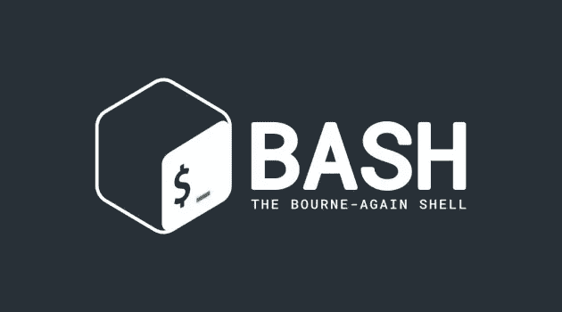
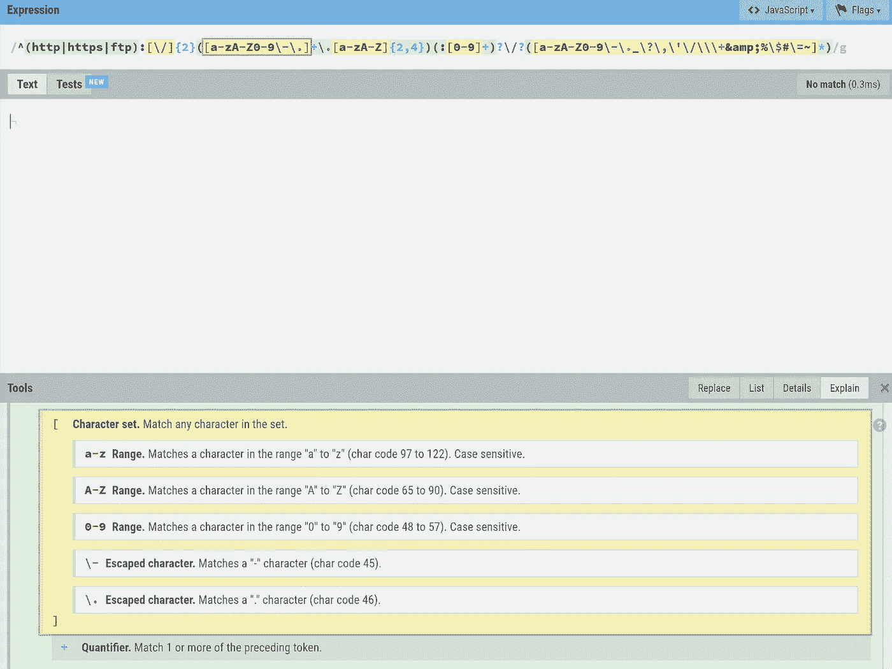

# 将最大化你的效率的 7 个编码工具

> 原文：<https://levelup.gitconnected.com/7-coding-tools-that-will-maximize-your-effectiveness-2c6b59ab7479>


当学习编码时，未来的开发人员通常被教导编码普通软件。然而，在工作场所，开发人员使用许多工具来加速他们的编码。测试、运行各种脚本和编程环境控制等常见任务只是额外工具派上用场的几个例子。

问题是，市场上有很多这样的工具，很难知道哪一个是最好的。通常需要几年的反复试验才能发现哪些工具最有帮助。为了节省您的精力，我们向一些有经验的开发人员询问了帮助他们成为更好的程序员并最大限度地提高工作效率的工具。

## 今天，我们将研究这 7 种工具:

*   I3 窗口管理器
*   精力
*   尝试
*   函数式编程
*   显示
*   正则表达式
*   RegExr

# 1.Linux I3 窗口管理器

开发人员长期以来一直使用 Linux，因为它具有灵活性和定制选项。I3 进一步扩展了这些选项，提供了对编程环境近乎完全的控制。

I3 是一个用于 Linux 的轻量级开源平铺窗口管理器。窗口管理器用于控制窗口在屏幕上的外观和位置。平铺窗口管理器通过自动调整窗口大小和重新排列窗口来更进一步，总是使用全屏空间而不重叠。这种平铺在操作系统图形用户界面(GUI)的顶部直接进行更改。

以下是 I3 窗口管理器(i3wm)的一些突出之处:

*   **轻量级:** I3 简单高效。它只包含基本的功能，没有额外的麻烦，是专门为开发人员设计的，使用最小的处理能力。
*   **键盘控制:** I3 内置了丰富的键盘快捷键，可以实现任何想要的行为。您也可以直接将附加快捷方式添加到您的`config`文件中。您可以移动磁贴、打开终端、更改布局等等，而无需触摸鼠标。
*   **总屏幕使用量:**通过使用平铺，I3 确保您永远不必为一个窗口搜索一堆标签。您可以打开任意多的图块，同时使用更大的窗口来最大限度地减少眼睛疲劳。这种平铺系统非常适合需要多个终端的系统管理员或任何需要测试和绘制终端的人。
*   定制主题: I3 的外观完全可以定制，以符合您的审美。像 Windows 或 macOS 这样的操作系统将某些视觉元素设置为不可更改。有了 I3，屏幕的每一寸都是你可以定制的。微调您的背景、窗口外观/行为、通知外观等。

## 专家提示:使用 I3 的工作空间

I3 最有用的工具之一是能够将窗口分组到编号的工作区中。开发人员经常为他们工作流程的不同部分设置工作区。通过按下`super`和工作区的索引，可以在工作区之间快速切换。这将隐藏所有当前窗口，并定位所选工作区的窗口。

最佳利用工作空间可提高生产率。它们对于双显示器设置也很有用，因为您可以在每个显示器上打开一个工作区，只需一次按键就可以快速切换工作区当前所在的显示器。


Vim 徽标

# 2.精力

Vim 是大多数编程语言的文本编辑器。这个面向开发人员的文本编辑器主要关注键绑定定制和编码效率。

这是一个模态文本编辑器，这意味着它可以有多种模式，每个模式都由用户针对特定任务进行优化。例如，您可能为 Python 和 C++分别设置了一种模式。这些模式允许一次击键根据语言具有不同的行为，例如特定于语言的快捷键。

像 I3 一样，Vim 完全由键盘控制。通过减少鼠标的使用，您可以减少停机时间和工作流程中断。Vim 还被设计成可以在几乎任何主流平台上工作，这对于团队协作来说是理想的。

最后，Vim 的快捷方式都配置在一个可共享的`.vimrc.`文件中。许多开发人员在 Github 上发布他们测试过的文件。从这些文件中的一个开始，您可以从同行的经验中受益，同时保留您的个人版本以供个人编辑。

## 专家提示:使用 DRY 原则设置 Vim 快捷方式

程序员持有的一个最核心的范式是干巴巴的:不要重复自己。

我们在代码中认为这是识别和提取重复代码行为到模块化方法中的能力。这种模块化的思想允许您只需输入一次每个行为，然后在以后需要该行为时调用该方法。

使用同样的范例来建立你的 Vim 快捷方式以提高效率。例如，如果您注意到您的工作经常需要您用 Java 实现一个二叉查找树，您可以设置一个快捷方式来粘贴一个二叉查找树模板。



Bash 徽标

# 3.尝试

Bash 是为 GNU 项目开发的免费 Unix shell。它长期以来一直被用作 Linux 的默认登录 shell，最近又被用作 MacOS 和 Windows 10 的默认登录 shell。除了登录之外，Bash 还支持数百个可以从应用程序内部调用的命令。

Bash 以其可脚本化而闻名。您可以保存一个包含所有这些命令的 shell 脚本文件，而不是每次需要时都键入一组命令。每个命令将按照输入的顺序执行。

Bash 在接近底层的级别上运行，这意味着这些命令可以操作文件和内存，而无需打开桌面应用程序介质。例如，您可以创建一个 shell 脚本，系统地将硬盘的全部内容传输到另一个设备，而无需打开文件管理器，如文件资源管理器。

通过绕过桌面应用程序，Bash 可以更有效地工作，并且通常允许更专门的任务。

## 专家提示:利用你的狂欢历史

有效利用 Bash 历史可以区分能力和精通。为了确保您能从历史记录中获取所有信息，以下是一些您不想忘记的有用命令:

**多窗口启用历史**

默认情况下，Bash 只记录第一个打开的实例的历史记录，而所有后续窗口的历史记录都会丢失。下面的命令允许所有活动的 Bash 窗口写入历史，这样您就不会再丢失命令了。`shopt -s histappend`

**重复上一条命令**

重复上一次执行的命令是 Bash 中的一个常见功能。您可以输入以下 4 个命令中的任何一个:

*   向上按箭头键查看最后一个命令，按`enter`执行该命令
*   按`ctrl+p`查看最后一条命令，按`enter`执行该命令
*   在命令行中键入`!!`
*   在命令行中键入`1-!`

> *您可以在* `*!!*` *重复的命令前或后添加附加元素:* `*sudo !!*`

**反向搜索历史**

您可以在 Bash 的历史中搜索过去的命令。只需按下`ctrl-r`并开始输入您的搜索，Bash 就会自动填充匹配的行。如果多行匹配，再次按下`ctrl-r`在它们之间循环。

# 4.函数式编程

函数式编程是一种声明式编程形式。程序是通过没有副作用的单个或组合的一级小函数构建的。声明式编程关注于构建解决方案，遵循*要做什么*，而不是*如何做*。由于范式的数学和逻辑根源，您可以轻松地设计声明性程序。

函数式编程比其他方法更加模块化。将你的程序分成更小的函数允许你在你的程序中重用它们。更大的问题可以通过组合这些更小的模块功能来解决。这允许您单独重用解决方案的任何部分。

最后，函数式编程函数没有副作用。这意味着在函数式编程中数据永远不会改变。

比如说我想做一个程序，以`n`开始，然后将`n`传递给`function1`，最后将`function1`的结果传递给`function2`。让我们看看这在伪代码中有何不同:

**闭塞方式**

```
int n = 5;
n = function1(n);
n = function2(n);
return n;
```

**功能方法**

```
int n = 5;
return function2(function1(n));
```

在函数方法中，我们的函数没有副作用，因为使用了`n`的值，但从不改变。通过将`function1(n)`直接传递给`function2`而不是一个扩展的`n`，我们以声明的方式解决了这个问题。

## 专家提示:功能性思维，而不是语言

有一些函数式编程语言执行这种范式，比如 Clojure、 [Scala](https://www.educative.io/blog/scala-101-a-beginners-guide) 或 Haskell。虽然这些功能很强大，但是如果您不习惯函数式编程，它们可能是一个困难的过渡。

首先，尝试使用函数式思维用你当前的语言编程。这里有几种方法可以做到这一点:

*   使用`map`、`reduce`和类似的计数器和循环操作来转移你对块编程的思考
*   使用局部范围变量和函数来练习减少负面影响。每次编码时都要注意并减少副作用。
*   优先考虑递归解决方案，因为递归解决方案需要功能性思维来创建。这将提供有效的实践，然后才能完全发挥作用。


反映徽标

# 5.显示

回归测试是确认开发的软件在更新后仍能运行的行为。这是开发人员生活中的一个重要部分，因为更新是如此普遍。不幸的是，当我们必须涵盖所有可能的错误条件时，这个过程会非常乏味。

Reflect 通过为任何网站创建自动化回归测试来解决这个问题。这个软件不需要任何安装，可以和任何 JavaScript 框架一起使用。

**它是这样工作的:**

1.  进入“记录测试”模式
2.  加载网站当前的工作页面
3.  点击您希望测试的功能
4.  停止记录测试；这将生成一个测试脚本来复制您的点击
5.  输入您站点的测试版本的 URL
6.  激活测试脚本
7.  查看记录的网站结果。

测试的结果将会是一个视频，以及网络请求和 JavaScript 控制台的打印结果。一次获得所有这些信息可以让您快速诊断问题并找到问题的根源。

您可以创建一次测试用例，并在一个站点的生命周期中无限地重复它。这不仅会为您节省大量的手工测试时间，而且还会自动生成每次测试的视频记录，以记录确切的错误情况。

简而言之，Reflect 因其简单性、可重复性和准确性而受到开发人员的欢迎。

## 专家提示:反射的高级功能

对于 Reflect 能做什么，我们上面所介绍的只是冰山一角。以下是您可以在 Reflect 中使用的一些其他有用函数的列表:

*   安排测试在任何时间间隔完成，以确保即使您不在时，您的站点也能正常运行。
*   将计划的测试与故障通知结合起来，以缩短对站点中断的响应时间
*   如果您需要更改测试，您可以编辑并重新记录反射测试中的单个点击或多个部分，而不是重新记录整个过程
*   当改变场地外观时，使用自动视觉检测工具来检测与输入预期情况相差太大的故障元素

# 6.正则表达式

正则表达式是一组描述搜索模式行为的字符。它们通常用于字符串搜索算法来查找与模式匹配的部分。

Bash 有一个独特的正则表达式操作符`=~`，它搜索给定正则表达式模式的匹配。例如，`if [[ $digit =~ [0-9] ]]; then`将在字符串中搜索数字的任何实例。

除了 Bash，Python 和 Java 都支持 regex 参数。

这对于数据验证和其他文本处理任务非常有用，因为它们可以用几个字符实现非常复杂的搜索参数。它们也能被世界各地的开发者所识别，因为它们是由计算机语言理论家建立的*常规语言*的一部分。

总的来说，它们学起来很快，被广泛理解，并且有很大的复杂性潜力。学习 regex 是拓宽您的技能集的一个很好的方式，并让您能够使用 Bash、Java 或 Python 上的强大工具。

## 专家提示:使用正则表达式进行网页抓取

如今，regex 最常见的用途之一是 web 抓取，这是一个从大量网站中提取精选信息的过程。这是因为您可以使用 regex 从更大的搜索字符串中提取匹配参数的子字符串。

这有许多应用，例如，您可以在竞争对手的网站上搜索给定产品的价格:

```
$:\s+([^\s]+)
```

这个正则表达式搜索美元符号之后的任何内容，并将其提取到一个单独的文件中。一旦完成，这个文件将允许您的公司完全访问比较几十种产品的价格。

上面只是一个只使用单一表达式的例子。网络抓取对于现代公司来说是一个强大的工具，并且会越来越受欢迎。学习网页抓取的正则表达式可以让你在更多的分析开发职位上获得竞争优势。


RegExr 徽标

# 7.RegExr

虽然 regex 开始很容易，但它们很快会变得非常复杂。只需使用这个正则表达式来匹配特定类型的 URL。

```
^(http|https|ftp):[\/]{2}([a-zA-Z0-9\-\.]+\.[a-zA-Z]{2,4})(:[0-9]+)?\/?([a-zA-Z0-9\-\._\?\,\'\/\\\+&amp;%\$#\=~]*)
```

你可以清楚地看到它们会变得多么复杂。

RegExr 是一个免费的正则表达式可视化和测试工具，旨在使理解复杂的正则表达式函数变得更加容易。因为正则表达式是标准化的，所以正则表达式解析正则表达式的所有部分，并把它们的意思翻译成解释性的句子形式。您还可以将鼠标悬停在这些解释上，以查看它在表达式中的确切位置的突出显示。

下面，我输入了上面使用的复杂示例，并使用了解释函数。查看解释是如何用颜色标记的，并突出显示给定的部分:



RegExr 的解释和测试接口

RegExr 为您节省了使用较长正则表达式的时间。它也消除了图书馆记忆的需要。在网站的另一边，你可以找到一个完整的正则表达式库和它们的用法。只需单击它们，就可以将这些公式插入到表达式中。

最后，通过用示例文本填充“test”区域，RegExr 可用于测试您的表达式。RegExr 将应用草拟的正则表达式来搜索示例文本，以突出显示任何匹配。您可以将鼠标悬停在这些匹配项上以获得更多信息，例如表达式的哪一部分导致了这些匹配项被选中。

## 专家提示:避免长正则表达式

虽然 RegExr 有助于解释长正则表达式，但它们总是比短表达式更难理解。优先考虑较短的表达式会让你和你的团队一眼就能更好地理解表达式。此外，用一个表达式来完成所有搜索参数是一个耗时的过程，而且更容易出错。

尝试应用多个较小的表达式，每个表达式搜索一个或两个事物。这不仅解决了上述问题，还允许您在以后的项目中重用一些或所有的表达式。

# 总结和更多资源

至此，我们已经看完了 7 个工具和软件，它们可以帮助你成为一个更高效的程序员。从 Vim 到 Reflect，再到 RegExr，我们探索了开发人员建议的一些最常用和最受欢迎的工具。

虽然其中一些工具有一个学习曲线，但我向您保证，通过掌握它们，您最终将节省数小时的时间和数千次击键。

## 继续阅读关于生产力的文章

*   [管理编码项目时间估计的 10 个技巧](https://www.educative.io/blog/10-tips-for-managing-time-estimations-on-coding-projects)
*   [新冠肺炎在家工作系列](https://www.educative.io/blog/work-from-home-devices-for-developers)
*   [15 个 JavaScript 技巧:简化代码的最佳实践](https://www.educative.io/blog/javascript-tips-simplify-code)