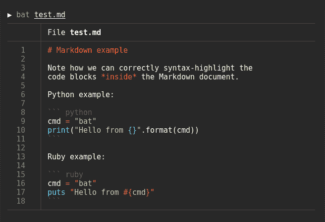

# 让您的生活更轻松的 7 个命令行工具

> 原文：<https://levelup.gitconnected.com/7-command-line-tools-that-make-your-life-easier-d69c38850d6c>

照片由[克里斯蒂安·休姆](https://unsplash.com/@christinhumephoto?utm_source=medium&utm_medium=referral)在 [Unsplash](https://unsplash.com?utm_source=medium&utm_medium=referral) 上拍摄

## 每个开发人员都应该考虑使用这些

开发人员拥有的最强大的工具之一是命令行。命令行允许任何开发人员以快速的方式完成很多事情。一个经验丰富的开发人员仅仅使用命令行可以做的事情是没有限制的。

为了创造一个更好的使用命令行的体验，我创建了一个包含七个你可以使用的命令行工具的列表。你真的应该试一试，因为这些工具都有自己的用处。

# 1.增强

终端中最常用的命令之一是 *cd* 。然而，这个命令非常基本，因为它没有任何工具可以为您提供帮助。除此之外，您必须提供目录的完整名称，以便该命令能够工作。你不能提供目录的一部分，因为那根本行不通。

加强救援！Enhancd 将记住用户访问的所有目录，并将其用于路径名解析。如果 enhancd 的日志有多个同名的目录路径，这将为用户选择正确的目录提供一种简单的方法。

你可以在这里找到增强版。

# 2.他妈的

是的，你没看错…不，这不是我在诅咒。他妈的是一个伟大的工具，纠正错误，在以前的控制台命令。我们时不时都会把输入的命令搞砸。或者更频繁一点。

所以每当你弄乱了一个命令，你就输入`fuck`作为下一个命令。这个包为您提供了可以执行的选项。

假设我们在拼错`git`的地方输入了`gti branch`。您将看到一条类似于`No command 'gti' found`的消息。你只需键入`fuck`，而不必再次键入整个命令。这将提示您是否要执行`git branch`来代替。你所要做的就是按回车键，然后你的命令就被执行了。

这是该工具运行时的样子:

如果你想仔细看看这个工具，你可以在这里找到库。

# 3.Git 统计

Git Stats 工具允许您显示您在一段时间内提交的所有统计数据。你也可以在知识库中获得每个作者的所有贡献的统计数据。

别担心，你不必从头开始你的 git 提交日历，因为还有一个 [Git 统计导入](https://github.com/IonicaBizau/git-stats-importer)包可用。

你可以点击查看 Git 统计库[。](https://github.com/IonicaBizau/git-stats)

# 4.自动跳转

自动跳转允许您更快地浏览文件系统。它从命令行跟踪您最常用的目录，并将这些信息存储在数据库中。这就是为什么在跳转到目录之前必须首先访问它们。

您可以通过键入 *autojump* 来使用自动跳转，这有点长，但是您也可以使用它的别名 *j.*

例如，`j image`移动到包含*图像*的目录。在导航文件系统时，Autojump 有更多的选项。我建议你检查一下自动跳转库——你可以在这里[做](https://github.com/wting/autojump)。

# 5.蝙蝠

Bat 基本上是带有语法高亮和 Git 集成的 *cat* 命令的克隆。Bat 支持多种编程和标记语言的语法突出显示。

如果您不喜欢语法突出显示的方式，您可以使用其他可用的语法突出显示主题。如果您不喜欢任何默认的可用主题，您还可以选择添加自定义主题。

你可以在这里找到 bat 库[。](https://github.com/sharkdp/bat)

# 6.哦，我的 ZSH

哦，我的 ZSH 让你的终端更上一层楼。一旦安装完毕，你就可以利用命令行上数百个强大的插件和漂亮的主题。

哦，我的 ZSH 如果完全可配置，所以如果你缺少一个插件，你可以手动添加它。同样适用于如果你不喜欢某个插件。你也可以选择删除一个插件。

因为《哦，我的 ZSH》有太多的功能，我强烈推荐你自己去看看——链接到资源库。

# 7.Fony

Fony 是一个简单的命令行工具，它从提供的模板中生成虚拟 JSON 数据。在幕后，应用程序利用了 [Chance.js](http://chancejs.com/) 。这意味着任何由 Chance.js 支持的数据类型也受 fony 支持。

Fony 旨在为最常见的数据生成需求提供一个简单的解决方案。fony 最棒的地方在于，你可以使用命令行将输出传输到其他工具，并将其集成到你的工作流程中。

你可以在这里看一下 fony 知识库[。](https://github.com/captainsafia/fony)

