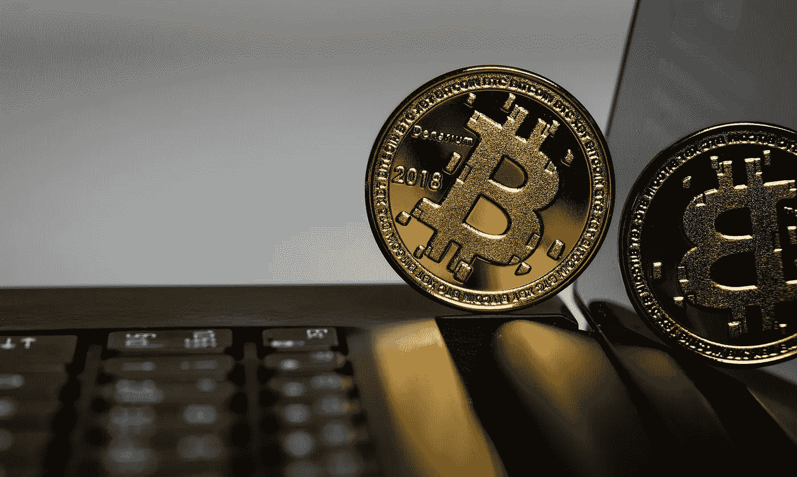
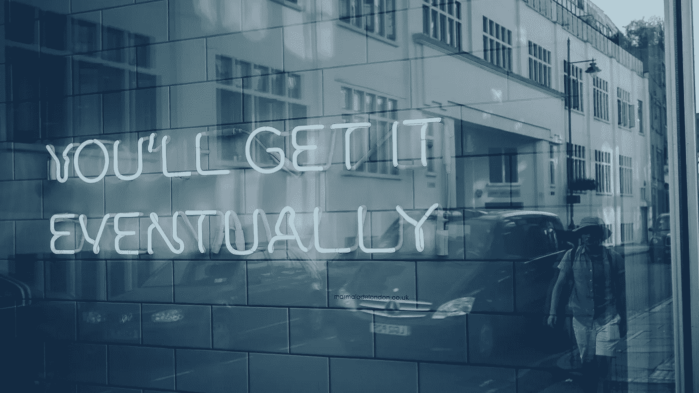

# 关于比特币的 7 个常见问题和误解

> 原文：<https://levelup.gitconnected.com/7-common-concerns-and-misconceptions-about-bitcoin-114dc5c45f6d>

## 让你犹豫的事情，以及你为什么想要重新考虑

阿列克西·里斯在 [Unsplash](https://unsplash.com/s/photos/bitcoin?utm_source=unsplash&utm_medium=referral&utm_content=creditCopyText) 上的照片

我在说服你投资比特币方面没有既得利益。我们都有自己固有的对风险和安全的偏好，更不用说对现代世界许多方面的怀疑了。

比特币和加密货币属于许多人怀疑和困惑的范畴。我想做的是解决这些问题——不仅是为了你，也是为了我自己！

2021 年初，随着比特币和以太坊价格的飙升，我开始投资 crypto。我采取了先买后学的愚蠢做法。

我现在正在回顾性地教育自己，并通过分享我的发现来巩固所学的知识。

我之前已经描述了我用来购买比特币的确切过程，以及我对常用术语和技术的解释。

在这篇文章中，我想分享一些关于比特币投资的常见异议、恐惧和怀疑。我也解释了为什么我认为它们是没有根据的，或者在很多情况下被夸大了。

# 如果它只是虚拟地存在，它怎么会有价值呢？

从设计上来说，比特币没有实物形态、资金支持或集中控制机构，许多人拒绝相信它会有任何实际价值。

持这种观点就是忽略了其他货币本质上是一样的。

政府发行的纸币之所以有价值，只是因为我们都同意它有价值，因为我们参与了围绕其使用而存在的人类集体系统。当我们在网上或自动取款机上查看我们的银行余额时，我们相信屏幕上的数字代表了货币价值，尽管我们不能触摸它们。

纵观历史，人类已经集体签署并接受了从贝壳到鹅卵石和珠子的任何东西都可以用来代表价值和购买力的储存。这种集体认可是货币体系得以运转的原因——比特币也是如此。

有些人可能会说，黄金具有先天和内在的价值，即使我们不再认为黄金每盎司具有很高的货币价值，它也会有用途，因此在电子产品和制作珠宝方面具有价值。

人们认为*如此*有价值的事实，部分是基于人类对它的集体认同，但也是由于它的相对稀缺和供应有限(基于可以开采和加工的矿石量)。

比特币与黄金有着共同的特点，更像是黄金的价值储存手段，而不是我们所知的货币。

存在和流通的比特币最多只有 2100 万个。失去的永远不会被取代。没有人会决定创造更多的纸币(不像纸币，政府可以随心所欲地印刷更多的纸币),因为这种对纸币总数的限制是建立在代码和支持它的协议中的。

# 它的价值不是会急剧上升和下降吗？

是的，的确如此——在比特币和加密货币的交易中，波动性是一种公认的行为。

投资它不适合胆小的人，如果你担心投资可能会赔钱，那么你可能应该避开它。

随着时间的推移，波动可能会平静下来，特别是随着它的进一步成熟。主要机构(如 Square、PayPal 和 MicroStrategy)现在要么作为支付处理器，要么作为投资者参与比特币。这应该意味着它被更认真地对待，并有助于平息一点波动。当像比尔·米勒和斯坦利·德鲁肯米勒这样的投资大师也对 T2 感兴趣时，这意味着变化正在发生。

时间当然会告诉我们，但是现在考虑一下易变性是加密的一个特征——接受它是一个充满起伏的狂野和令人兴奋的旅程！

# 难道它没有消耗大量的电力，破坏环境吗？

维护比特币的大部分能量被节点使用，这些节点持有和维护交易的分类账，并挖掘尚未被创造的比特币。

据估计，比特币每年消耗的能源相当于瑞士运转所需的能源总量——这是一个惊人的数据。

我的直觉是，思考银行和机构所使用的相应权力，它们通过自己的办公室、数据中心、服务器场等支撑着现有的货币基础设施。但是这种比较很大程度上是学术性的，当然不是同类比较。

关于比特币能源使用的一个有趣观点可以在石头岭资产管理公司首席执行官罗斯·史蒂文斯 2020 年致股东的信中找到。对于一个完整的比特币背景来说，阅读是必不可少的。

史蒂文斯认为，支撑比特币和区块链的技术可能会比支持传统银行的基础设施和遗留系统表现更好、能效更高。更重要的是，他认为从长远来看，寻找新的比特币节点的机会是存在的，这些节点可以利用清洁能源(比如偏远瀑布和河流产生的水力发电)。

正如史蒂文斯所说:

> “在比特币出现之前，能源的问题从来就不是它的稀缺，而只是我们在地理上把它引导到最需要的地方的能力。在比特币出现之前，这是人类唯一的居住地。相比之下，比特币的矿业能源正在解决一个不同的问题。由于卫星和无线互联网连接，比特币挖掘可以在任何地方进行。”

这种位置的灵活性意味着，比特币开采节点将来可以位于绿色能源容易产生的地方，而不必将其引导至需要的人口中心。

比特币的电力使用可以逐渐减轻能源供应的负担，减少不可再生能源产生的环境污染物。

# 你不担心它不受监管吗？

英国的银行、保险公司和投资提供商由政府监管和担保，前提是它们符合行业监察员规定的标准。

如果英国的一家银行因为你的钱而破产，或者一家机构向你做假账或诈骗，那么政府会保证你的钱会被退回(至少是有限度的)。其他国家可能也是如此。

密码货币存在于政府控制、监管和所有权之外。它作为一个系统运作*正是因为*没有一个单一的控制实体管理或调节它。

因此，我怀疑任何政府会为投资者提供担保。他们*肯定会*[寻求控制和影响它](https://www.investopedia.com/news/bitcoin-has-regulation-problem/)。

考虑到这种风险，像比特币基地这样的密码交易所这样有声望的公司已经寻求在当局注册，而不是试图在雷达下运作。我建议使用更大、更有声望的名字，而不是那些提供折扣或优惠条件的“飞来飞去”的人，这些条件看起来好得令人难以置信。

当人们毫无疑问地与为敲诈和欺骗而设立的公司进行交易时，他们就会赔钱。做好你的功课，勤奋行动，保护你自己的利益— [买者自负](https://en.wikipedia.org/wiki/Caveat_emptor)！

奈杰尔·塔迪亚恩多在 [Unsplash](https://unsplash.com/s/photos/confusion?utm_source=unsplash&utm_medium=referral&utm_content=creditCopyText) 上的照片

# 它被偷或丢失怎么办？

有一种看法认为，黑客瞄准加密货币是因为它只存在于网上。我在银行业的 IT 安全部门工作了 9 年多，我可以向你保证，坏人从受监管的银行提取和勒索“正常”资金的动机就像他们提取和勒索加密货币一样。

crypto 的主要额外风险是缺乏监管(见上文)。如果你的比特币在网上被盗，而存放在一个加密交易所，那么它很可能永远消失了——你将无法从监管机构获得任何追索权，也无法通过保险索赔。

至于离线损失——有很多例子表明投资者购买了比特币，小心翼翼地将它存储在离线加密的硬件钱包中，然后迅速丢失、扔掉或丢失了密码。这种损失当然是不幸的，但在大多数情况下，可能也是可以避免的。

也要记住，每天都有人被抢走现金和贵重物品。传统资产丢失、被盗或放错地方。

像任何有价值的物品一样，你有责任保管对你有价值的东西——比特币也不例外。

# 现在介入还来得及吗？

随着比特币在 2021 年创下历史新高(当其价格突破 40，000 美元时)，许多人会觉得他们来到派对已经太晚了，无法尽情享受。

2017 年，价格接近 2 万美元，然后降至 3000 美元多一点，过去的表现可能表明价格将再次下跌。我没有理由认为它会或不会像以前那样大幅下跌，但我天生的怀疑态度让我做好了最坏的打算。

如果价格下降，我可能会抓住机会以更低的价格购买更多。历史表明，之后很可能还会回升。

至于你是否错过了投资比特币赚钱的机会，可以考虑一下亚马逊股票的例子。

普通人可能会倾向于对亚马逊股票进行小额投资，认为它是一家持续繁荣的公司，也是我们大多数人的购物来源。自 2008 年以来，亚马逊的股价逐年稳步上升，从 2008 年底的每股 50 美元升至 2020 年底的每股 3200 美元。

12 年来，一个潜在的投资者可能会说服自己，现在介入为时已晚，利润已经到手。12 年来他们一直后悔自己的不作为。

金融机构开始考虑比特币的长期未来，并预测其可能的价值— [摩根大通估计](https://www.reuters.com/article/us-crypto-currencies-astrology/when-to-trade-bitcoin-when-saturn-crosses-mercury-of-course-idUSKBN29J0JX)比特币可能达到 146，000 美元，而花旗集团预测价格为 300，000 美元。其他更古怪的估计猜测每枚硬币高达 100 万美元——也许更多地基于希望和乐观，而不是科学。

从某种程度上来说，比特币作为一种投资资产仍处于相对初级阶段，因此会持续波动。

如果你有承受这种波动的胃口，并渴望分享未来收益的潜在份额，无论它们可能是什么，那么仍然有机会。你只需要对得失保持开放的态度。

请记住，现在加密的指导原则是只投资于你愿意失去的东西。

# 不就是犯罪分子敲诈和清洗犯罪所得的一种方式吗？

比特币的一些早期支出可能涉及到它在毒品和武器自由交易的黑暗网络上作为匿名货币的使用。

我们中的许多人还会收到垃圾邮件或钓鱼邮件，警告他们的笔记本电脑已经受损，并威胁要破坏、羞辱或两者兼而有之，除非他们用无法追踪的比特币向发件人支付赎金。虽然这种骗局通常是一种机会主义的社会工程，但这是许多人首次接触比特币的更深层次的方式——作为一种犯罪工具。

比特币的匿名性无疑吸引了此类活动，但我认为传统纸币和电子转账已经被广泛用于赎金、勒索和敲诈(并将继续如此)。

我们中的大多数人可能也遇到过商人为“现金”付款提供折扣价格，这样他们就可以避免申报收入和相关税收。现金也有它的问题和诋毁者！

虽然比特币可能对犯罪阶层有吸引力，但这并不意味着这是它的唯一用途。这并不意味着所有使用它的人都是犯罪的同谋，也不意味着他们更有可能被罪犯挑出来。

# 它不是一种真正的货币，是吗？

这种反对意见来自两个方面。

首先，有一种观点认为，因为与其他货币相比，它的价值会剧烈而频繁地升值和贬值，所以用它来购买商品是没有意义的。今天，你可能会用比特币买一个披萨。明天，同样数量的比特币可能足以购买 100 份披萨。在这种程度上，这一论点是正确的，比特币作为与美元、日元或英镑竞争的在线货币的最初使用案例并不实用。

虽然比特币的价值仍然相对不稳定，但随着时间的推移，它可能会稳定下来，从而成为一种稳定的货币。不管怎样，今天它可以用来交换商品和服务，如果你愿意，也可以通过传统渠道，包括贝宝。

反对比特币作为一种货币的地位和可行性的第二个理由是，比特币的吸收和完成交易所需的时间意味着，比特币永远无法与 Visa 这样的在线渠道竞争，Visa 声称每天可以处理 1.5 亿笔交易。这种观点有一定的道理，但这并不是真正的同类比较。

当然，目前比特币交易较少(2021 年初每天约 40 万笔)，尽管随着 PayPal 和 Square 等平台接受比特币，比特币交易量正在逐渐增加。

主要区别在于，Visa 和 Mastercard 不会在交易在线完成时完全处理支付。相反，实体之间的对账和最终资金转账通常需要几天时间。

使用比特币支付时，比特币(或比特币的一部分)所有权的变更被记录在区块链中，并在网络上的多个节点之间进行核对，以确认交易。完成这一过程所需的额外时间代表了价值从一方到另一方的全部转移。

虽然花费的时间更长，但它更全面，而且通过将交易的细节永久锁定在多个分类账中的区块链中，它使交易永远无可辩驳、无可争议。

这方面的技术细节很复杂，仍然有点超出我的理解，但希望这一点是清楚的。

未来的技术进步可能会加快比特币的交易速度，但比特币的价格可能需要稳定下来，才能被更广泛地用作货币。与此同时，我更愿意将比特币视为一种投资的资产类别或价值储存手段，而不是一种消费货币。事实上，我的策略是买入并长期持有(在比特币圈子里被称为 HODL，原因我还不清楚！).

# 最终想法

正如我在开头所说，我的目的不是说服你投资比特币——它不会适合所有人。但是，有时批判性地分析与我们的观点相冲突的观点会有所帮助，这是检验我们的理解和理性的一种方式。

如果你怀疑比特币是否适合你，那么我建议你继续阅读这个主题。如果你仍然像我一样怀疑，也许可以像我一样做一笔小投资，看看它是否能抓住你的想象力。

*如果你喜欢阅读这样的故事，并且愿意支持 Medium 上的作家，考虑注册成为 Medium 会员。一个月 5 美元，给你无限的故事。如果你注册使用我的链接，我会赚一小笔佣金。*

 [## 阅读托比·黑兹伍德(以及媒体上成千上万的其他作家)的每一个故事

### 作为一个媒体会员，你的会员费的一部分会给你阅读的作家，你可以完全接触到每一个故事…

tobyhazlewood.medium.com](https://tobyhazlewood.medium.com/membership) 

注:*本文仅供参考。不应将其视为财务或法律建议。在做任何重大财务决定之前，先咨询财务专家。*

如果你喜欢这篇文章，请随时加入我的电子邮件列表。