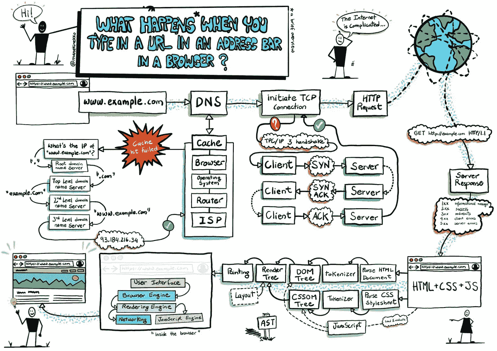
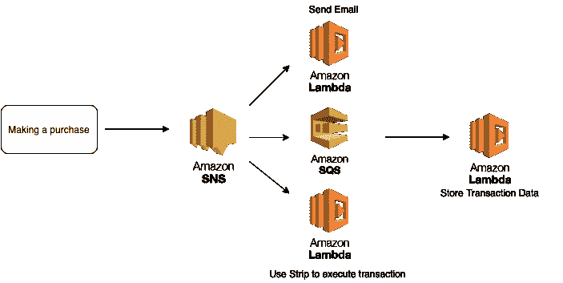

# 7 个常见的前端面试问题

> 原文：<https://levelup.gitconnected.com/7-common-frontend-interview-questions-c8dddd3a9382>

## 它们不全是关于白板编码的


来自 [Pexels](https://www.pexels.com/photo/women-standing-beside-whiteboard-3861952/?utm_content=attributionCopyText&utm_medium=referral&utm_source=pexels) 的 [ThisIsEngineering](https://www.pexels.com/@thisisengineering?utm_content=attributionCopyText&utm_medium=referral&utm_source=pexels) 摄影

当准备软件工程面试时，我们经常会直接进入行为、白板编码和系统设计问题。

但是还有其他问题，虽然是技术性的，但与算法或数据结构无关。公司问他们是因为他们想知道你在这个领域的潜力，以及你是否更深入地了解这些。公司不想雇佣“只会”编码的人。

在这篇文章中，我想分享一些我在前端面试中多次遇到的“连珠炮式”问题。希望他们也能帮助你做好准备。

## 1.React/Vue 中的“key”有什么用？

Key 是一个惟一的属性，React/Vue 将它与列表中的一个条目相关联，以给它们一个稳定的标识。当只更新列表的一部分时，这很有帮助。

React 和 Vue 不会完全重新呈现列表中的每一项，如果只是其中的一部分被更新的话。使用密钥将有助于图书馆准确识别哪个项目已被修改。

这是一个常见的面试问题，特别是如果工作需要一些前端框架/库。官方的 [Vue](https://vuejs.org/v2/guide/list.html#Maintaining-State) 和 [React](https://reactjs.org/docs/lists-and-keys.html) 文档用例子更详细地解释了这个概念。

## 2.油门和去抖的区别

当用户重复触发一个事件时，去抖和节流是限制函数调用次数的技术。

当事件处理函数 ***去抖动*** 一段时间后，只有在用户停止触发事件一段时间后，才会调用该函数。

它通常与搜索框一起使用，用户将在搜索框中重复输入字符。我们只想在他们完成输入时搜索字符串，以减少 API 调用。

当某个事件处理程序在某个时间**被节流**，**时，它将在给定的时间内只执行一次。例如，节流可以用在无限可滚动的网页中。当用户向下滚动页面时，会触发许多滚动事件。我们可以用 1 秒钟的延迟来控制处理程序，这样就不会在一次滚动中多次调用它。**

**下面是一篇如何用香草 JavaScript 实现节流和去抖的文章: [*用 JavaScript*](https://codeburst.io/throttling-and-debouncing-in-javascript-b01cad5c8edf) *节流和去抖。***

## **3.JavaScript 中的 Set、WeakSet、Map、WeakMap 有什么区别？**

**WeakSet 和 Set 都是 ***唯一*** 值的集合。主要区别在于 WeakSet 只存储 object，不能包含任何类型的任意值，但是 sets 可以。**

**当您需要将数据一个接一个地追加到数据结构中，但又想删除重复项时，集合非常有用。集合操作平均起来是`O(1)`的，这使得它们具有时间效率。**

**WeakMap 和 Map 是键/值对的集合。主要区别在于，在 WeakMap 中，键必须是对象。在 Map 中，键可以是任何类型。**

**同样重要的是要知道 WeakMap 值是不能迭代的，它们保持一个对键的[弱引用。例如，如果您手动删除 WeakMap 中引用的键，它将被垃圾回收。](https://www.mattzeunert.com/2017/01/31/weak-maps.html)**

## **4.经典的超时面试问题**

```
**for (var i = 0; i <5; i ++) {
    setTimeout (function () {
        console.log ('i:', i);
    }, 1000);
}**
```

**这输出了什么？你是怎么解决的？这是一个经典的 JavaScript 闭包问题，在我的采访中多次出现。**

**输出肯定不是`0, 1, 2, 3, 4` 否则就没必要问这个问题了。它将实际输出`5, 5, 5, 5, 5` ,因为 for 循环是同步的，但是`console.log`是在回调中完成的，所以它是在 for 循环结束运行后执行的。**

**解决方案是使用 ES6 `let`或者将`i`变量传递到`setTimeout`中一个立即被调用的函数中:**

**这个问题涉及闭包、设置超时和作用域。如果你感兴趣，这篇文章提供了这个问题的更深入的解释和解决方案。**

## **5.当你在浏览器中输入 Google.com 时会发生什么？**

****

**[https://Twitter . com/lisabyrnedev/status/1288480503184539648？s=20](https://twitter.com/lisabyrnedev/status/1288480503184539648?s=20)**

**这个问题测试你对网络的基本理解，我想说我在 40%的面试中被问到这个问题。**

**简单来说，当你输入一个 URL 时，浏览器试图使用 DNS(域名系统)找到请求 URL 的 IP 地址。**

**然后，它将使用 TCP(通常)与位于解析的 IP 地址的服务器建立连接。建立连接后，浏览器将向服务器发送 HTTP 请求并检索内容。**

**如果你了解深入的概念，如[三次握手](https://www.geeksforgeeks.org/tcp-3-way-handshake-process/)或负载均衡，你会在面试中获得更多分数。关于这个问题更详细的解释，[这里有一篇很棒的文章](https://medium.com/@maneesha.wijesinghe1/what-happens-when-you-type-an-url-in-the-browser-and-press-enter-bb0aa2449c1a)。**

## **6.解释重画和回流**

**重画是指网页上的元素改变了外观，但不影响整个布局。例如轮廓或背景颜色的变化。**

**当元素需要以影响文档整体布局的方式进行更改时，就会进行重排。一个元素的重排将导致 DOM 中所有子元素和它后面的任何元素的重排。**

**重涂和回流都是昂贵的操作。知道如何改进它们可以优化性能。这就是为什么 React 很快，因为通过保存 DOM 树的副本，它可以找出发生了什么变化，并最小化回流/重绘的次数。**

**[这篇文章](https://medium.com/swlh/what-the-heck-is-repaint-and-reflow-in-the-browser-b2d0fb980c08)更详细地解释了浏览器呈现页面背后的整个概念。**

## **7.解释发布-订阅架构**

**发布者-订阅者是一种软件架构。有些发布者会向某个主题发布消息。订阅者可以订阅该主题，以便在消息发布时接收消息。订阅者可以订阅多个主题，发布者在发送消息时不知道单个订阅者。**

**一个例子是 AWS SNS(简单通知服务)。使用 SNS，您可以向某个主题发布消息，其他服务可以订阅该主题，以便在有新消息时得到通知。**

****

**由作者创建**

**例如，您可能有一个购物 web 应用程序，当用户进行购买时，您向购买的主题发布一条消息。您可以用一个订阅主题的 lambda 向该用户发送确认电子邮件，用另一个 lambda 处理事务，用一个 SQS 队列存储事务数据。每当在该购买的主题下有新消息时，它们都将被触发。**

**许多这样的问题模拟了你在日常工作中将要面临的挑战和决定。了解了这些，你就让面试官知道你确实了解堆栈，而不仅仅是如何使用它。**

**这也显示了你在软件工程领域发展的潜力。毕竟，软件工程师不仅仅是编码。**

**希望这些问题能对你以后的面试准备有所帮助！**