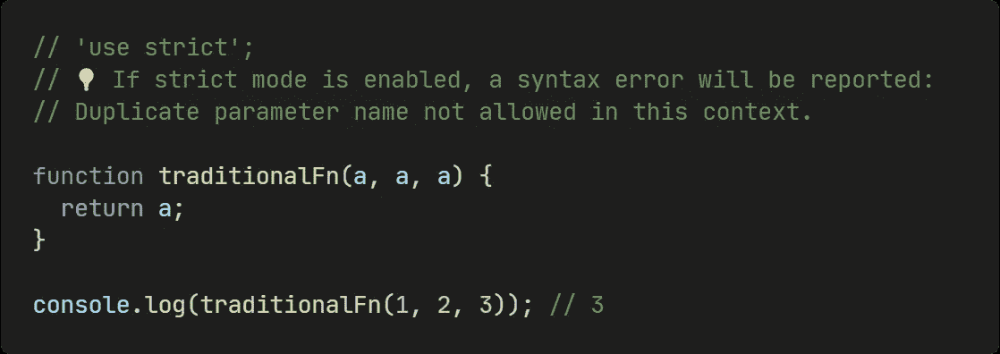
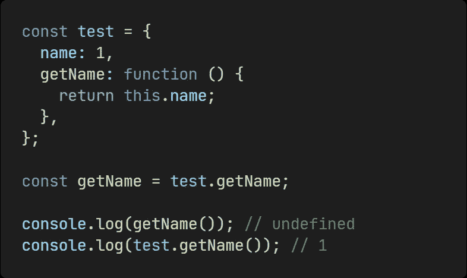

# 7 箭头功能和传统功能的区别

> 原文：<https://levelup.gitconnected.com/7-differences-between-an-arrow-function-and-a-traditional-function-bbf8a6dc8ca4>

## 箭头函数能完全取代传统函数吗？


本·罗宾斯在 [Unsplash](https://unsplash.com?utm_source=medium&utm_medium=referral) 上的照片

ES6 中出现的箭头功能给我们带来了很大的便利，但是和传统的功能还是有区别的。开发中稍有不慎就可能出问题，那就跟我来看看箭头函数和传统函数的 7 大区别吧！

# 1.没有争论

在传统函数中，有一个`arguments`局部变量。如果函数的参数数量是动态的，使用`arguments`可以让我们很容易地计算传递参数的最大数量:


```
function traditionalFn() {
  **return Math.max(...arguments);**
}// 3
console.log(traditionalFn(1, 2, 3));
```

`arguments`是一个类似阵列的物体。类数组对象和数组对象的相似之处在于，它们都可以使用下标来访问相应的元素，并且都具有长度属性。不同的是，类数组对象在数组上没有内置方法，但是我们可以使用`Array.from`将类数组对象转换成数组对象。

在箭头函数中，没有`arguments`，如果我们在箭头函数中访问参数，将返回最近的非箭头父函数的参数。


```
const arrowFn = () => {
  **// ❌ Uncaught ReferenceError: arguments is not defined
  console.log(arguments);**
};function wrapArrowFn() {
  const arrowFn = () => {
    **// ✅ `arguments` for the wrapArrowFn function
    console.log(arguments);**
  };
}
```

但是我们可以用 [**rest 参数**](https://developer.mozilla.org/en-US/docs/Web/JavaScript/Reference/Functions/rest_parameters) 来代替，从而得到一个普通的数组对象。


```
const arrowFn = (...rest) => {
  **// ✅
  return Math.max(...rest);**
};// 3
console.log(arrowFn(1, 2, 3));
```

# 2.返回值可以省略花括号


```
function traditionalFn() {
  return Math.max(...arguments);
}const arrowFn = (...rest) => Math.max(...rest);
```

你可以看到，在一个只包含一个表达式的内联箭头函数中，我们可以省略花括号来返回值，这使得代码更加清晰。

# 3.不允许重复的命名参数

在非限制模式下，传统函数允许我们使用重复的命名参数。但是在严格模式下，是不允许的。



```
**// 'use strict';
// 💡 If strict mode is enabled, a syntax error will be reported:
// Duplicate parameter name not allowed in this context.**function traditionalFn(a, a, a) {
  return a;
}console.log(traditionalFn(1, 2, 3)); // 3
```

在箭头函数中，无论是否启用严格模式，都不允许有同名的参数。


```
**// ❌ SyntaxError: Duplicate parameter name not allowed in this context.**
const arrowFn = (a, a, a) => a;console.log(arrowFn(1, 2, 3));
```

# 4.没有原型


```
function traditionalFn() {
  return Math.max(...arguments);
}const arrowFn = (...rest) => {
  return Math.max(...rest);
};**// {constructor: ƒ traditionalFn()}**
console.log(traditionalFn.prototype);
**// undefined**
console.log(arrowFn.prototype);
```

传统函数我们可以得到`prototype`，但是箭头函数没有`prototype`。

# 5.不，这个

在传统函数中，其内部的`this`值是**动态的**，这取决于函数是如何被调用的。例如:



```
const test = {
  name: 1,
  **getName: function () {
    return this.name;
  },**
};const getName = test.getName;console.log(getName()); **// undefined**
console.log(test.getName()); **// 1**
```

在箭头函数中，没有`this`，如果我们在箭头函数中访问它，它将返回最近的非箭头父函数的`this`。


```
**globalThis.name = 2;**const test = {
  name: 1,
  **getName: () => {
    return this.name;
  },**
};const getName = test.getName;console.log(getName()); **// 2**
console.log(test.getName()); **// 2**
```

注意，一个箭头函数的`this`是在声明的时候确定的，永远不会改变。所以`call`、`apply`、`bind`不能改变箭头功能`this`的值。

# 6.不能用 new 调用

我们可以在传统函数上使用`new`关键字来创建一个新对象。


```
function Animal(name) {
  this.name = name;
}const cat = new Animal('cat');**// Animal { name: 'cat' }**
console.log('cat: ', cat);
```

但是箭头函数不能用`new`调用。


```
const Animal = (name) => {
  this.name = name;
};**// ❌ TypeError: Animal is not a constructor.**
const cat = new Animal('cat');
```

这是因为当调用`new`时，我们会经历以下四个步骤:

1.  创建新对象
2.  将新对象的`__proto__`指向构造函数的`prototype`
3.  用新对象调用构造函数`this`
4.  如果调用的结果是一个对象，则返回该对象，如果不是，则返回第一步中创建的新对象。

我们可以实现一个模拟的新函数:


```
const _new = (fn, ...args) => {
  const newObj = Object.create(null);
  Object.setPrototypeOf(newObj, fn.prototype); const callResult = fn.apply(newObj, args);
  return typeof callResult === 'object' ? callResult : newObj;
};
```

所以你可以看到 arrow 函数不能被 new 关键字调用，因为它有**没有原型**和**没有 this** 。

# 7.不能用作生成器函数

由于历史原因，规范不允许在箭头函数中使用 **yield** 命令，因此箭头函数不能用作生成器函数。

总而言之，箭头函数避免了很多可能导致误解的代码场景，它使我们的代码更清晰，更可控。简单越好，不是吗？

*最后，我是扎卡里。我会继续输出与 web 开发相关的故事。如果你喜欢这样的故事，想支持我，请考虑成为* [*中等会员*](https://medium.com/@islizeqiang/membership) *。每月 5 美元，你可以无限制地访问媒体内容。如果你通过* [*我的链接*](https://medium.com/@islizeqiang/membership) *报名，我会得到一点佣金。*

你的支持对我来说非常重要——谢谢。