# JavaScript 中箭头函数和常规函数的 7 个区别

> 原文：<https://levelup.gitconnected.com/7-differences-between-arrow-functions-and-regular-functions-in-javascript-9152883a839f>

## 本文讨论了常规函数和箭头函数之间的主要区别。

箭头与 JavaScript 中的常规函数

在 JavaScript 中，函数是用来执行特定任务的代码块。函数允许程序员使用函数将一个大程序分解成多个更小、更易管理的组件。因此，不再需要重复编写相同的代码。

JavaScript 中有两种类型的函数

1.  常规函数
2.  箭头功能(在 **ES6** 中介绍)

## 常规函数

我们可以用两种方式编写正则函数，即**函数声明、**和**函数表达式。**

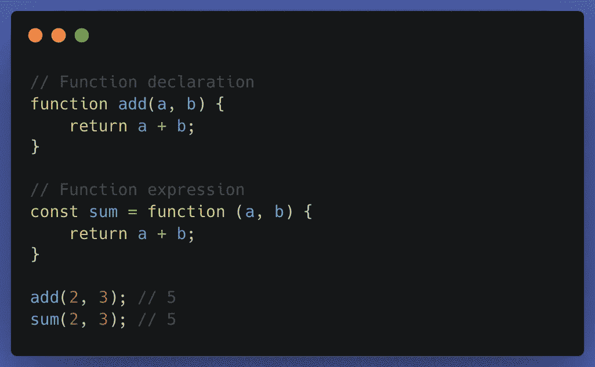

常规 JavaScript 函数

函数声明和函数表达式的主要区别在于，我们可以在函数声明前调用函数 **add(2，3)** 以及**，**，但是函数 **sum(2，3)** 需要在定义后调用。

## **箭头功能**

箭头函数——也称为粗箭头函数——是 ES6 中引入的新特性，它是一种用于编写**函数表达式**的更简洁的语法。与常规函数相比，它允许您更干净地创建函数。这里没有声明方法，我们可以只使用函数表达式来编写。

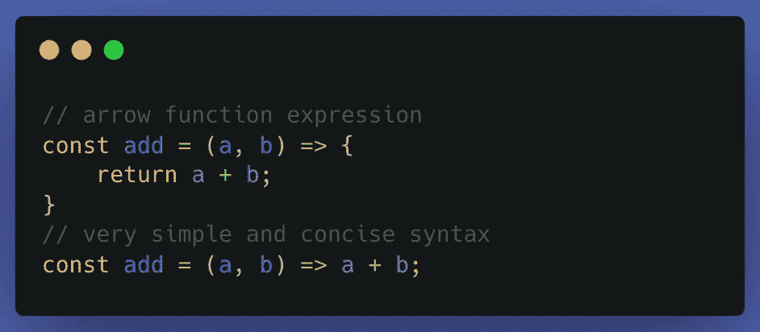

箭头功能

箭头与常规函数之间存在某些差异，即

1.  句法
2.  没有参数**(参数是类似数组的对象)**
3.  **箭头功能**没有原型对象
4.  不能用新关键字**(不是构造函数)**调用
5.  没有自己的这个**(调用，应用&绑定不会按预期工作)**
6.  它不能用作生成器功能
7.  不允许重复命名的参数

让我们详细讨论每一个

## **语法**

如果只有一个表达式，就不需要花括号，它会从函数中隐式返回这个结果。这使得代码更加清晰。

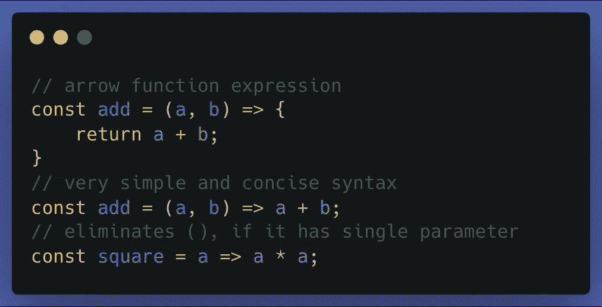

箭头函数是传统函数的语法糖

## 箭头函数中没有参数对象

如果我们函数的参数数量未知，我们可以将所有的`parameters`作为一个变量，即`arguments`。arguments 对象如下所示

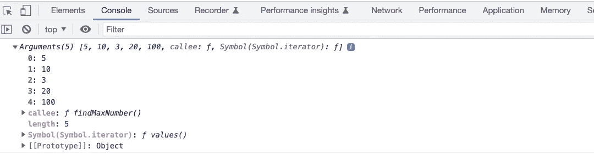

`arguments`是一个类似数组的对象。类数组对象和数组对象的相似之处在于它们都有长度属性。不同的是，类数组对象在数组上没有内置方法，但是我们可以使用`Array.from`或`spread operator`将类数组对象转换成数组对象。

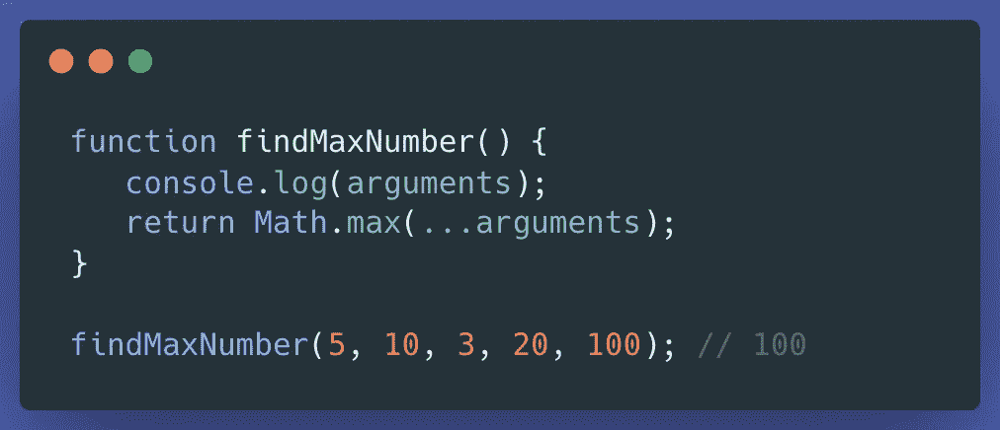

在**箭头函数**中，没有`arguments`，如果我们访问箭头函数中的参数将会抛出类似*未捕获的引用错误:* `arguments` *未定义。*

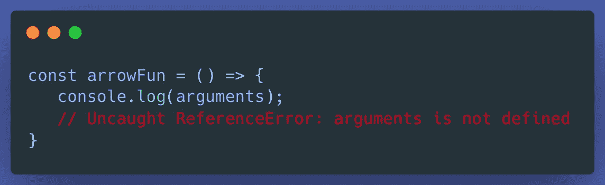

但是我们可以用 [**的其余参数**](https://developer.mozilla.org/en-US/docs/Web/JavaScript/Reference/Functions/rest_parameters) 来代替，从而得到一个普通的数组对象。

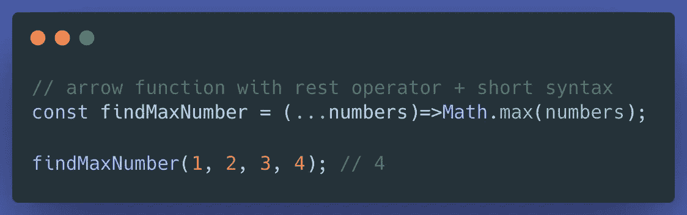

## 箭头函数没有原型对象

像常规函数一样，箭头函数没有原型对象，如果你试图访问箭头函数的原型，它将返回`undefined`。

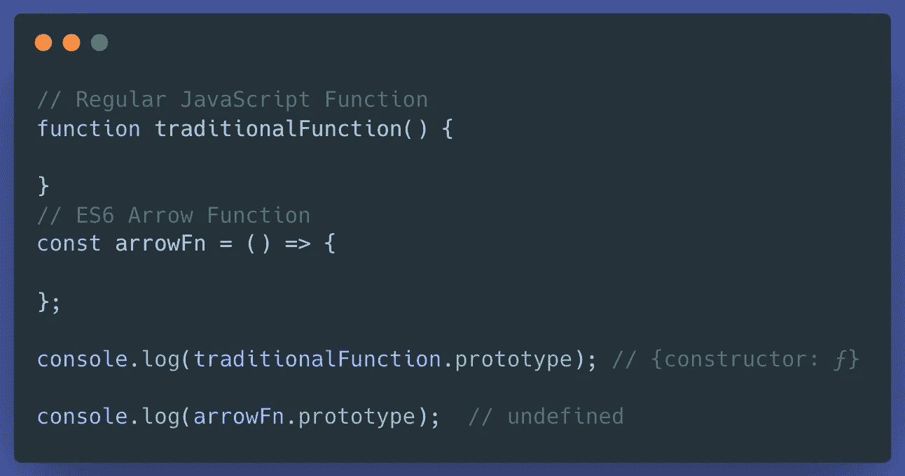

箭头函数没有原型对象

## 不能用新关键字调用

arrow 函数不能用 new 关键字调用，因为 arrow 函数没有构造函数。如果你试图用一个 **new** 关键字实例化，它会抛出一个错误。

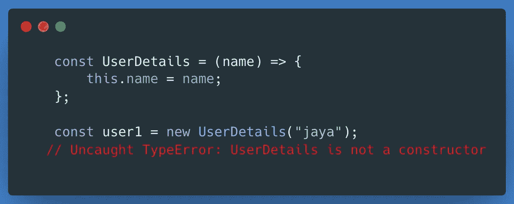

## 没有自己的这个**(调用，应用&绑定不会按预期工作)**

在传统函数中，其内部的`this`值是**动态的**，这取决于函数是如何被调用的。例如:

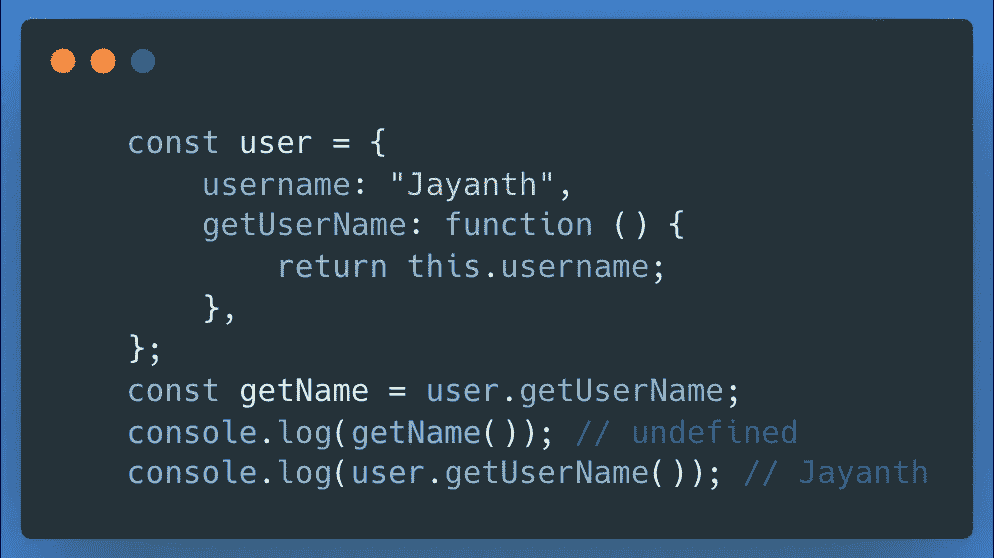

与常规函数不同，箭头函数没有自己的`this`绑定。如果我们在箭头函数中访问**这个**，它将返回最近的非箭头父函数的**这个**。

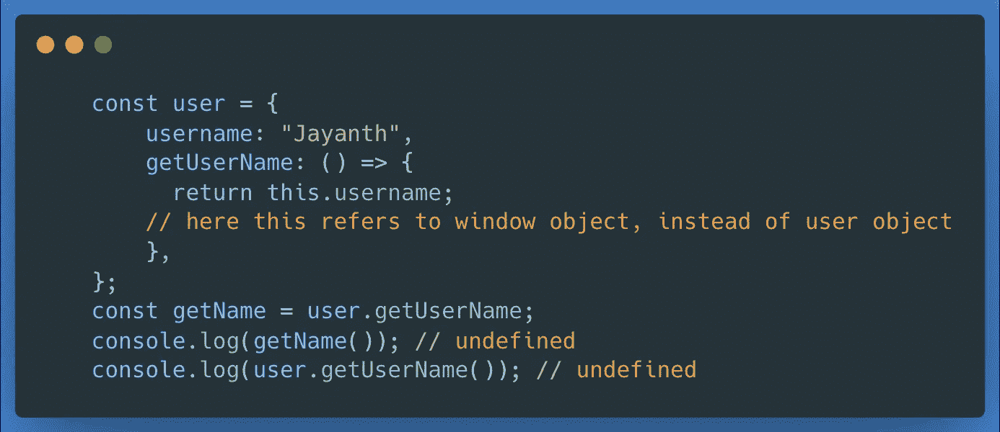

这个在 arrow 函数中的值是在声明时确定的，永远不会改变。所以`call`、`apply`、`bind`不能改变箭头功能`this`的值。

## 它不能用作生成器功能

根据 [MDN](https://developer.mozilla.org/en-US/docs/Web/JavaScript/Reference/Statements/function*)

> *`*function**`*语句(* `*function*` *关键字后跟星号)定义了一个生成器函数。**

*yield 关键字不能在 arrow 函数体中使用(除非在进一步嵌套的函数中允许)。因此，箭头函数不能用作生成器。*

*注意没有`yield`的[发生器](https://developer.mozilla.org/en-US/docs/Web/JavaScript/Reference/Statements/function*)没有意义。*

*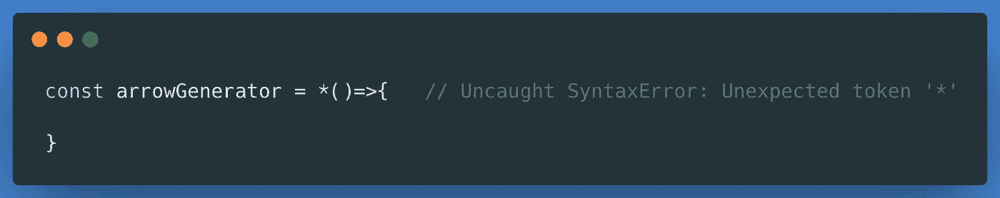*

## *不允许重复命名的参数*

*在非限制模式下，正则函数允许我们使用重复的命名参数。但是在严格模式下，是不允许的。*

*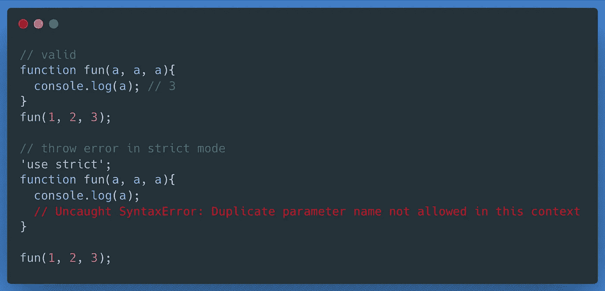*

*与常规函数不同，**箭头函数不允许重复的参数**，无论是在严格模式还是非严格模式下。重复的参数将导致引发语法错误。*

*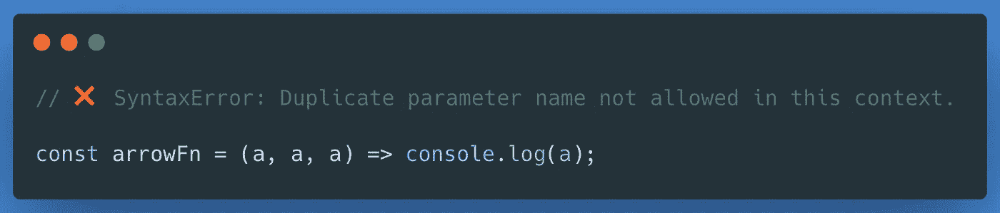*

***结论***

*在本文中，我讨论了 JavaScript 中常规函数和箭头函数之间的一些显著差异。*

*理解常规函数和箭头函数之间的差异有助于为特定需求选择正确的语法。*

*感谢您的阅读:)*