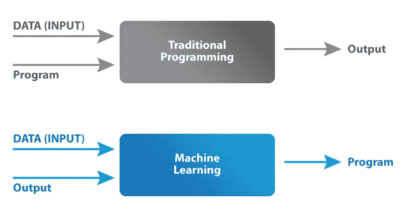
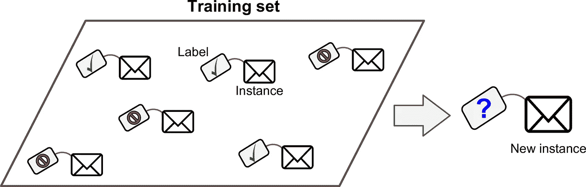
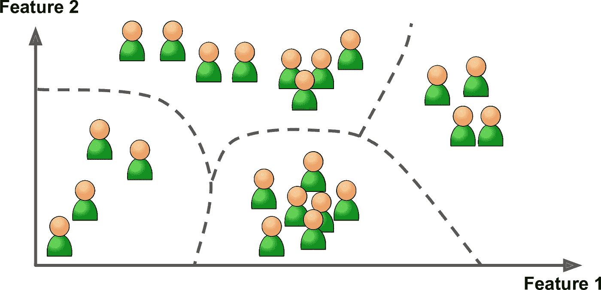
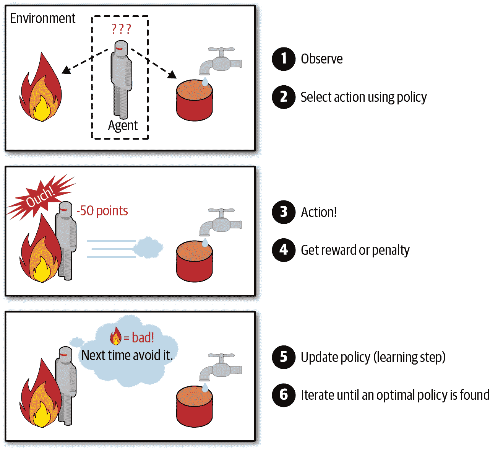
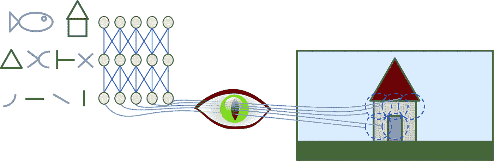
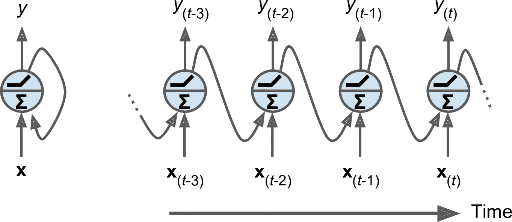

# 深度学习和机器学习的 7 个区别

> 原文：<https://levelup.gitconnected.com/7-differences-between-deep-learning-and-machine-learning-b5f2ff0ae00a>

## 深度学习与机器学习——有什么区别？

[腾雅特](https://unsplash.com/@tengyart?utm_source=medium&utm_medium=referral)在 [Unsplash](https://unsplash.com?utm_source=medium&utm_medium=referral) 上拍摄的照片

当今最热门的三个领域是人工智能、网络安全和云计算。特别是人工智能在最近几年有了巨大的飞跃。机器学习和深度学习是 AI 的两个重要领域。尽管这两个字段互不相同，但它们有时可以互换使用。我将在这篇文章中讨论以下主题。

*   什么是人工智能？
*   什么是机器学习？
*   什么是深度学习？
*   机器学习和深度学习有什么区别？

在开始之前，请不要忘记订阅[我们的 youtube 频道](https://youtube.com/c/tirendazacademy)，在那里我创建了关于人工智能、数据科学、机器学习和深度学习的内容。

让我们开始吧！

# 什么是人工智能？

在 20 世纪 50 年代，人工智能的想法是，“机器能像人类一样思考吗？”想到了这个问题。最近 10 年，随着产生的数据量的增加、计算机硬件的进步以及新算法的发现，人工智能取得了巨大的飞跃。现在，诸如语音识别、图像检测、决策以及语言之间的翻译等任务都由智能计算机程序来完成。

# 什么是机器学习？

机器学习是人工智能的一个子领域，可以发现数据中隐藏的模式。在过去，机器被明确地赋予规则，并且根据这些规则获得输入的输出。

机器学习与传统方法

机器学习使用数据集中的输入和输出来学习程序，而不是将规则显式输入到程序中。机器学习广泛应用于金融、教育、生物、医学等诸多领域。例如，机器学习技术被用于发现异常的账户移动并防止欺诈。

# 机器学习的类型

机器学习分为三个子领域。这些是监督学习、非监督学习和强化学习。让我们仔细看看这些区域。

## 监督学习

[监督学习](https://www.amazon.com.tr/Hands-Machine-Learning-Scikit-Learn-TensorFlow/dp/1492032646)

对于监督学习，数据必须有标签。在这种技术中，标签用于训练算法。回归和分类问题可以用监督学习算法来解决。如果您的输出变量是连续的数值，如房价，您可以使用回归。另一方面，如果输出变量是性别等分类值，则可以使用分类算法。

## 无监督学习

[无监督学习](https://www.amazon.com.tr/Hands-Machine-Learning-Scikit-Learn-TensorFlow/dp/1492032646)

如果数据集没有标注，可以使用无监督学习算法。这些算法帮助您在未标记的数据中找到隐藏的模式或组。无监督学习最常用的算法是 K-means、主成分分析(PCA)等技术。

## 强化学习

[强化学习](https://www.amazon.com.tr/Hands-Machine-Learning-Scikit-Learn-TensorFlow/dp/1492032646)

强化学习基于奖励最大化和惩罚最小化的原则。学习系统观察环境并采取行动。作为这一行动的结果，他得到奖励或惩罚。系统使用这些奖励和惩罚来选择最佳策略。比如可以考虑 DeepMind 的 AlphaGo 程序进行强化学习。这个程序在 2017 年的围棋比赛中击败世界冠军柯洁成为世界冠军。AlphaGo 通过分析数百万场比赛并与自己对弈，已经学会了如何赢得比赛。

# 什么是深度学习？

深度学习是机器学习的一个子领域，通过模仿人脑而出现。深度学习基于人工神经网络，这是一种机器学习算法。人工神经网络有一个隐含层，而深度神经网络有多个隐含层。经典的机器学习算法无法分析大数据。此外，很难用机器学习技术来分析图像或视频等非结构化数据。你可以使用深度学习算法来分析大数据和非结构化数据。

人工智能近年来发展的一个原因是深度学习算法。让我们仔细看看一些深度学习算法。

## 卷积神经网络

[美国有线电视新闻网](https://www.amazon.com.tr/Hands-Machine-Learning-Scikit-Learn-TensorFlow/dp/1492032646)

卷积神经网络(CNN)是一种由多个卷积层组成的人工神经网络。CNN 是受人类大脑视觉区域的启发而发展起来的。CNN 通常用于计算机视觉和物体发现等领域。

## 递归神经网络

[RNNs](https://www.amazon.com.tr/Hands-Machine-Learning-Scikit-Learn-TensorFlow/dp/1492032646)

您可以使用 RNN 模型通过时间序列或序列数据来预测未来。例如，您可以用 RNNs 预测股票价格。您可以在语言到语言的翻译中使用 RNNs。

# 机器学习和深度学习的区别

由[米哈伊尔·瓦西里耶夫](https://unsplash.com/@miklevasilyev?utm_source=medium&utm_medium=referral)在 [Unsplash](https://unsplash.com?utm_source=medium&utm_medium=referral) 上拍摄

到目前为止我讲了什么是机器学习和深度学习。机器学习和深度学习是人工智能的两个重要领域。这两个领域通常被认为是相同的。但这两个领域并不相同。现在让我们来看看这两个领域之间的区别。

## 1-数据量

机器学习和深度学习最重要的区别就是数据量。虽然机器学习算法可以处理小型或中型数据，但深度学习算法需要更大的数据。

## 2-硬件

虽然中低级别计算机足以执行机器学习分析，但需要功能强大的计算机来执行深度学习分析。

## 三属性工程

虽然机器学习需要特征工程，但深度学习不需要特征工程。换句话说，在执行机器学习分析时，一些特征可能彼此相关。这种关系会让你的分析有偏差。所以为机器学习选择特征很重要，而不是深度学习。

## 4-培训时间

由于机器学习算法处理的是小型或中型数据，因此训练时间较短(最多一两个小时)。但是因为深度学习算法是和大数据一起工作的，所以训练时间很长(几天或者几周)。

## 5-缩放

虽然更简单的问题可以用机器学习来解决，但复杂的问题，如人脸识别和语言之间的翻译，可以用深度学习来解决。

## 6-数据结构

虽然机器学习技术只能分析结构化数据，但深度学习算法也可以分析图像、音频或视频等非结构化数据。

## 7-算法结构

一些机器学习算法，如回归，已知是可行的。但是深度学习算法是一个黑匣子，它们是如何工作的无法解释。

# 结束语

随着技术和互联网的发展，人工智能有了很大的进步，特别是在最近 10 年。机器学习和深度学习是 AI 的两个重要子领域。尽管这两个领域有着重要的区别，但它们经常被混淆。在这篇文章中，我解释了这两个领域之间的 7 个重要区别。

就是这样。我希望你喜欢它。感谢阅读。别忘了关注我们的[YouTube](https://www.youtube.com/channel/UCFU9Go20p01kC64w-tmFORw)|[GitHub](https://github.com/tirendazacademy)|[Twitter](https://twitter.com/TirendazAcademy)|[Kaggle](https://www.kaggle.com/tirendazacademy)|[LinkedIn](https://www.linkedin.com/in/tirendaz-academy)*👍*

* [## 8 种最佳机器学习算法

### 数据科学家和机器学习工程师应该知道的最好的机器学习算法。

medium.com](https://medium.com/geekculture/top-8-machine-learning-algorithms-df30277b2056)  [## 8 个最好的 Seaborn 可视化

### 使用企鹅数据集与 Seaborn 一起动手绘制统计图。

medium.com](https://medium.com/geekculture/8-best-seaborn-visualizations-20143a4b3b2f) 

# 参考

*   [Geron A，2019，用 Scikit-Learn、Keras 和 TensorFlow 进行动手机器学习](https://www.amazon.com.tr/Hands-Machine-Learning-Scikit-Learn-TensorFlow/dp/1492032646)。

如果这篇文章有帮助，请点击拍手👏按钮几下，以示支持👇*