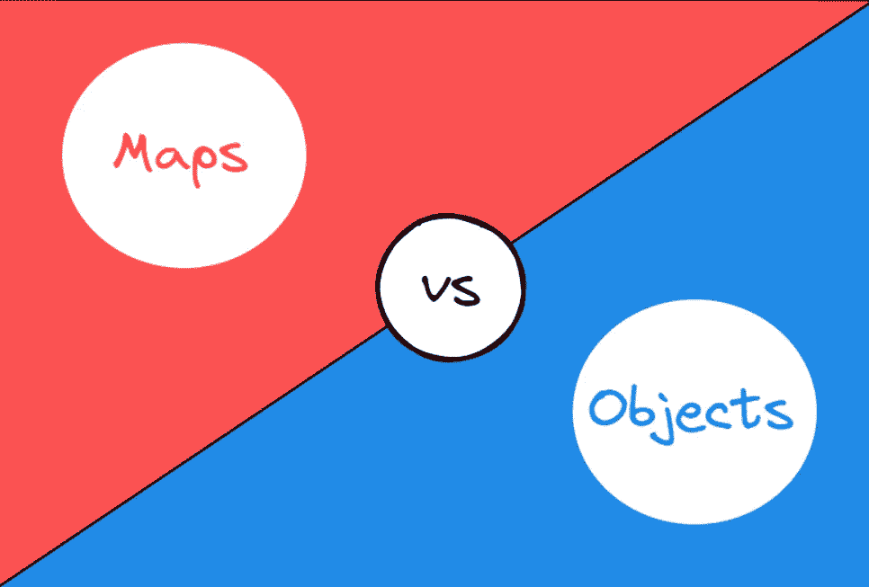

# 7 地图对象和普通对象的区别

> 原文：<https://levelup.gitconnected.com/7-differences-between-map-objects-and-plain-objects-9690a78fbc06>

## 地图物体能代替平面物体吗？



作者图片

在 JavaScript 中，普通对象和 ES6 的新 Map 都可以存储键值对，但它们之间有什么区别呢？本文将为您揭晓。

# 1.初始化和使用

普通对象可以直接用文字初始化，而 Map 需要 Map()构造函数来初始化，如果想要有初始值，就需要传递一个数组或者其他元素是键值对的可迭代对象。这些键值对中的每一个都将被添加到一个新的映射中。

```
const obj = {
  name: 1,
  age: 2,
};
const map = new Map([
  ['name', 1],
  ['age', 2],
]);
```

与普通对象相比，Map 作为哈希表提供了许多有用的功能。比如判断一个键是否在哈希表中，在 map 中可以用`has`方法轻松判断，但在 plain 对象中可能会增加复杂度。详情请参考我的[上一篇](https://javascript.plainenglish.io/in-vs-hasown-vs-hasownproperty-in-javascript-885771d2d100)。

另外，`set`方法可以为 Map 设置键值，`get`方法可以获取值，size 属性可以返回当前 Map 中键/值对的个数，而普通对象需要使用自己的方法手动计算等等。详见 [MDN](https://developer.mozilla.org/en-US/docs/Web/JavaScript/Reference/Global_Objects/Map#instance_methods) 。

# 2.关键类型

普通对象只接受字符串和符号作为键，其他类型会被强制为字符串类型，而 Map 可以接受任何类型的键(包括函数、对象或任何原语)。

```
const obj = {};
const map = new Map();const key = function () {};obj[key] = 1;
map.set(key, 1);// { 'function () {}': 1 }
console.log('obj: ', obj);// Map(1) { [Function: key] => 1 }
console.log('map: ', map);
```

# 3.意外钥匙

普通对象从原型继承了很多属性键，比如构造函数等等。所以自己的键很可能与原型上的键冲突。但是默认情况下，Map 不包含任何键，它只包含那些显式放入的键。

```
const obj = {};
const map = new Map();console.log(obj.constructor); // ƒ Object() { [native code] }
console.log(map.get('constructor')); // undefined
```

# 4.关键订单

虽然普通对象的键现在是有序的，但以前并不总是这样，而且排序很复杂。例如，如果对象中有需要转换为字符串的键，则不保留对象键的原始顺序。尽管 Map 以一种简单的方式排序，但它总是按照我们插入的顺序排序。

```
const obj = {
  name: 1,
  age: 2,
  3: 4,
};const map = new Map([
  ['name', 1],
  ['age', 2],
  [3, 4],
]);// The original order is not preserved.
// {3: 4, name: 1, age: 2}
console.log('obj: ', obj);// Map(3) { 'name' => 1, 'age' => 2, 3 => 4 }
console.log('map: ', map);
```

# 5.循环

我们可以使用`for...of`语句或 Map.prototype.forEach 直接迭代映射的属性，而不能直接迭代普通对象。

```
const obj = {
  name: 1,
  age: 2,
};const map = new Map([
  ['name', 1],
  ['age', 2],
]);for (const [key, value] of map) {
  console.log(`${key}: `, value); // name: 1, age: 2
}map.forEach((value, key) => {
  console.log(`${key}: `, value); // name: 1, age: 2
});// Plain objects are not iterable directly.
// But we can use functions like `Object.keys` to help us.
Object.keys(obj).forEach((key) => {
  console.log(`${key}: `, obj[key]); // name: 1, age: 2
});
```

[了解更多关于迭代对象的信息。](https://javascript.plainenglish.io/difference-between-for-of-and-for-in-7244104133bf)

# 6.序列化和解析

普通对象支持 JSON 序列化，但是默认情况下 Map 不能获得正确的数据。

```
const obj = {
  name: 1,
  age: 2,
};const map = new Map([
  ['name', 1],
  ['age', 2],
]);console.log(JSON.stringify(obj)); // "{"name":1,"age":2}"
console.log(JSON.stringify(map)); // "{}"
```

# 7.表演

Map 对象在涉及频繁添加和删除键-值对的场景中性能更好，而普通对象则没有得到优化。

# 结论

那么平面对象是否应该用地图对象来代替呢？

> 不，如果我们想在 JSON 和原始数据之间进行转换，或者包含特定的业务逻辑，那么我们应该使用普通对象。当您只想存储键值对和循环操作或者不断添加和删除属性时，使用 Map 对象是更好的选择。

虽然 Map 对象在底层也是继承了 Object.prototype，但是它为我们提供了很多实用的方法来减轻我们的认知负担，比 plain object 更高级。

*感谢阅读。如果你喜欢这样的故事，想支持我，请考虑成为* [*中等会员*](https://medium.com/@islizeqiang/membership) *。每月 5 美元，你可以无限制地访问媒体内容。如果你通过* [*我的链接*](https://medium.com/@islizeqiang/membership) *报名，我会得到一点佣金。*

你的支持对我来说非常重要——谢谢。