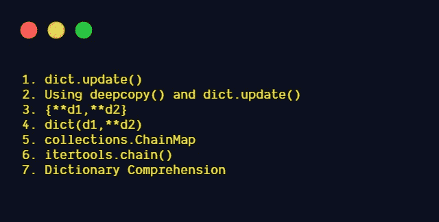

# 用 Python 合并字典的 7 种不同方法

> 原文：<https://levelup.gitconnected.com/7-different-ways-to-merge-dictionaries-in-python-30148bf27add>

## Python 中合并字典的不同方式


照片由 [bongkarn thanyakij](https://www.pexels.com/@bongkarn-thanyakij-683719?utm_content=attributionCopyText&utm_medium=referral&utm_source=pexels) 从 [Pexels](https://www.pexels.com/photo/person-holding-white-jigsaw-puzzle-piece-3740403/?utm_content=attributionCopyText&utm_medium=referral&utm_source=pexels) 拍摄

# 合并 Python 字典

在 python 中，我们可以使用不同的方法合并两个字典。让我们在这篇文章中了解一下这一点。

关于 [Python 字典，参考我的文章。](https://medium.com/analytics-vidhya/an-introduction-to-python-dictionary-520302924ef8)

# 两本词典合并的不同方法



图片来源:作者

# 1.字典更新()

`**update**([*other*])`

> 用来自 *other* 的键/值对更新字典，覆盖现有的键。返回`None`。— [python 文档](https://docs.python.org/3/library/stdtypes.html#dict.update)

**示例 1:使用 update()方法合并具有唯一关键字的两个字典 d1、d2。**

`d1.update(d2)`

用 d1 和 d2 中的键值对更新 d1 字典。

返回类型为`None`。它将更新原来的字典`d1`。

```
d1={**'a'**:1,**'b'**:2}
d2={**'c'**:3,**'d'**:4}
d1.update(d2)
print (d1)
*#Output:{'a': 1, 'b': 2, 'c': 3, 'd': 4}*
```

**示例 2:使用** `**update()**` **方法合并具有不同值的公共关键字的两个字典。**

`d1.update(d2)`
用 d1 和 d2 的键值对更新 d1 字典。d1 和 d2 中常见的键将包含 d2 中的值。


图片来源:作者

```
d1={**'a'**:1,**'b'**:2}
d2={**'a'**:99,**'c'**:3,**'d'**:4}
d1.update(d2)
print (d1)
*#Output:{'a': 99, 'b': 2, 'c': 3, 'd': 4}*
```

`d2.update(d1)`

用 d1 和 d2 中的键值对更新 d2 字典。d1 和 d2 中常见的键将包含 d1 中的值。


图片来源:作者

```
d1={**'a'**:1,**'b'**:2}
d2={**'a'**:99,**'c'**:3,**'d'**:4}
d2.update(d1)
print (d2)
*#Output:{'a': 1, 'c': 3, 'd': 4, 'b': 2}*
```

返回类型为 None。它只更新原始字典(d2)。

```
d1={**'a'**:1,**'b'**:2}
d2={**'a'**:99,**'c'**:3,**'d'**:4}
print (d2.update(d1))
*#Output:None*
```

# 2.使用 deepcopy()和 dict.update()

如果我们不想更新原始字典的意思，我们可以创建字典的副本并更新它。

要合并两个字典 d1 和 d2，将`deepcopy(d1)`创建为`d`，然后执行`update`方法。这样，原来的字典就不会被修改。

`d=deepcopy(d1)
d.update(d2)`

deepcopy 参考[我的故事。](https://medium.com/analytics-vidhya/shallow-copy-vs-deep-copy-vs-assignment-in-python-921d7e413a3a)

```
**from** copy **import** deepcopy
d1={**'a'**:1,**'b'**:2,**'c'**:3}
d2={**'a'**:99,**'d'**:4}
d=deepcopy(d1)
d.update(d2)
print (d)
*#Output:{'a': 99, 'b': 2, 'c': 3, 'd': 4}*
```

# 3.{**d1，**d2}

`d3={**d1,**d2}`

*双星号* `****` *表示字典解包。它的操作数必须是映射。每个映射项都被添加到新字典中。较晚的值替换由较早的密钥对和较早的字典解包已经设置的值。-* [*python 文档*](https://docs.python.org/3/reference/expressions.html#dictionary-displays)


图片来源:作者

**使用**kwargs 合并两个具有唯一键的字典**

`d3={**d1,**d2}`

它将把字典 d1 和 d2 的内容扩展为键值对的集合，并更新字典 d3。

```
d1={**'a'**:1,**'b'**:2}
d2={**'c'**:3,**'d'**:4}
d3={**d1,**d2}
print (d3)
*#Output:{'a': 1, 'b': 2, 'c': 3, 'd': 4}*
```

**使用**kwargs 合并具有公共关键字的两个字典**

`d3={**d1,**d2}`

它将把字典 d1 和 d2 的内容扩展为键值对的集合，并更新字典 d3。d1 和 d2 中常见的键将包含 d2 中的值。

如果`d3={**d2,**d1}`-d1 和 d2 中共同的键将包含 D1 中的值。


图片来源:作者

```
d1={**'a'**:1,**'b'**:2}
d2={**'a'**:99,**'c'**:3,**'d'**:4}
d3={**d1,**d2}
print (d3)
*#Output:{'a': 99, 'b': 2, 'c': 3, 'd': 4}*
```

**使用**kwargs 合并两个以上的字典**

`d4={**d1,**d2,**d3}`

它将把字典 d1、d2、d3 的内容扩展为键-值对的集合，并更新字典 d4。

d1 和 d2 中常见的键将包含 d2 中的值。
D1 和 d3 共有的关键字将包含 d3 的值。
D1、d2 和 d3 共有的键将包含 d3 的值。


图片来源:作者

```
d1={**'a'**:1,**'b'**:2}
d2={**'a'**:99,**'d'**:4}
d3={**'c'**:3,**'b'**:77}
d4={**d1,**d2,**d3}
print (d4)
*#Output:{'a': 99, 'b': 77, 'd': 4, 'c': 3}*
```

# 4.字典(d1，**d2)

d3 =字典(d1，**d2)

d3 将包含来自 d1 和 d2 的键值对。d1 和 d2 中常见的键将包含 d2 中的值。


图片来源:作者

```
d1={**'a'**:1,**'b'**:2}
d2={**'a'**:99,**'c'**:3}
d3=dict(d1,**d2)
print (d3)
*#Output:{'a': 99, 'b': 2, 'c': 3}*
```

d3=dict(d1，* * d2)——这只有在 D2 完全由**字符串键控**时才有效。

如果`**int**`作为 d2 中的一个键给定，将会升高`**TypeError**`。

```
d1={**'a'**:1,**'b'**:2}
d2={**'a'**:99,1:3}
d3=dict(d1,**d2)
print (d3)
*#Output:TypeError: keywords must be strings*
```

d1 不必是字符串键控的。给定 `int`作为 d1 的键。

```
d1={**'a'**:1,1:2}
d2={**'a'**:99,**'c'**:3}
d3=dict(d1,**d2)
print (d3)
*#Output:{'a': 99, 1: 2, 'c': 3}*
```

# 5.收藏。链式地图

> **ChainMap:**
> 一个 ChainMap 组的多个字典或其他映射一起创建一个单一的、可更新的视图。— [python 文档](https://docs.python.org/3/library/collections.html#collections.ChainMap)

`collections.ChainMap(*maps)`

返回类型是**collections . chain map .** 我们可以使用 **dict()** 构造函数转换成 dict。


图片来源:作者

```
d3=ChainMap(d1,d2)
```

d1 和 d2 中常见的键将具有来自 d1 的值(第一次看到的值)

**使用 collections.ChainMap 合并两个具有唯一关键字的字典**

```
**from** collections **import** ChainMap
d1={**'a'**:1,**'b'**:2}
d2={**'c'**:3,**'d'**:4}
d3=ChainMap(d1,d2)
print (d3)
*#Output:ChainMap({'a': 1, 'b': 2}, {'c': 3, 'd': 4})* print (dict(d3))
*#Output:{'c': 3, 'd': 4, 'a': 1, 'b': 2}*
```

**合并具有相同关键字的两个字典。d1 和 d2 中的公共键将只包含 d1 中的值(第一次看到的值)**

```
**from** collections **import** ChainMap
d1={**'a'**:1,**'b'**:2}
d2={**'c'**:3,**'d'**:4,**'a'**:99}
d3=ChainMap(d1,d2)
print (d3)
*#Output:ChainMap({'a': 1, 'b': 2}, {'c': 3, 'd': 4, 'a': 99})* print (dict(d3))
*#Output:{'c': 3, 'd': 4, 'a': 1, 'b': 2}*
```

# 6.itertools.chain():

> 创建一个迭代器，从第一个 iterable 开始返回一个元素，直到元素用尽，然后继续下一个 iterable。它会将连续的序列视为单个序列。- [巨蟒](https://docs.python.org/3/library/itertools.html#itertools.chain)`itertools.chain(*iterables)`

Dictionary 也是可迭代的，所以我们可以使用 itertools.chain()合并两个字典。返回类型将是 *itertools.chain 对象。*我们可以使用 **dict()** 构造函数转换成 dict。

**使用 itertools.chain()** 合并两个具有唯一关键字的字典

```
**import** itertools
d1={**'a'**:1,**'b'**:2}
d2={**'c'**:3,**'d'**:4}
num1=itertools.chain(d1.items(),d2.items())
*#Returns an iterator object*
print (num1)
#Output:<itertools.chain object at 0x029FE4D8>
*#converting iterator object to dict object*
print(dict(num1))
#Output:{'a': 1, 'b': 2, 'c': 3, 'd': 4}
```

**使用 itertools.chain()** 合并具有公共关键字的两个字典


图片来源:作者

```
**import** itertools
d1={**'a'**:1,**'b'**:2}
d2={**'a'**:99,**'d'**:4}
num1=itertools.chain(d1.items(),d2.items())
*#Returns an iterator object* print (num1)
*#Output:<itertools.chain object at 0x029FE4D8>
#converting iterator object to dict object* print(dict(num1))
*#Output:{'a': 99, 'b': 2, 'd': 4}*
```

# 7.词典理解

我们可以使用字典理解合并两本字典。

参考我的[字典理解的故事](https://medium.com/analytics-vidhya/list-set-dictionary-comprehensions-in-python-8a0a7c06115e)。

**使用字典理解合并具有公共关键字的两个字典**


图片来源:作者

```
d1={**'a'**:1,**'b'**:2}
d2={**'c'**:3,**'d'**:4,**'a'**:99}d3={k:v **for** d **in** (d1,d2) **for** k,v **in** d.items()}
print (d3)
*#Output:{'a': 99, 'b': 2, 'c': 3, 'd': 4}*
```

**使用字典理解合并两个具有唯一关键字的字典**

```
d1={**'a'**:1,**'b'**:2}
d2={**'c'**:3,**'d'**:4}d3={k:v **for** d **in** (d1,d2) **for** k,v **in** d.items()}
print (d3)
*#Output:{'a': 1, 'b': 2, 'c': 3, 'd': 4}*
```

# 结论

*   所有示例中使用的 Python 版本: **Python 3.8.1**
*   **D1 . update(D2)**-返回类型为`None`。它将更新原始字典本身(d1)。
*   **{**d1，**d2}** —返回类型为`dictionary`。
*   **收藏。链图** -返回类型为 `**collections.ChainMap.**`
*   **ITER tools . chain()**-返回类型为 `itertools.chain object`
*   **dict(d1，* * d2)**-只有当 D2 完全由**字符串键入**时，这才会起作用。
*   **“上次显示的赢”** —上次显示的值将覆盖现有的键。

```
**1\. d1.update(d2)
2\. {**d1,**d2} 
3\. dict(d1,**d2)
4\. itertool.chain()
5\. dictionary comprehension.**
```

*   **“第一次看到的获胜”**而不是“最后一次看到的获胜”

`**1\. collections.ChainMap**`

## 我的其他博客链接

[在 Python 中合并列表](https://medium.com/analytics-vidhya/merging-lists-in-python-4a386e4b2f21)

[Python 中的列表、集合、字典理解](https://medium.com/analytics-vidhya/list-set-dictionary-comprehensions-in-python-8a0a7c06115e)

## 资源

[PEP-584](https://www.python.org/dev/peps/pep-0584/)

[PEP-448](https://www.python.org/dev/peps/pep-0448/)

[字典显示](https://docs.python.org/dev/reference/expressions.html#dictionary-displays)

*关注此空间，获取更多关于 Python 和数据科学的文章。如果你喜欢看更多我的教程，就关注我的* [***中***](https://medium.com/@IndhumathyChelliah) ，[***LinkedIn***](https://www.linkedin.com/in/indhumathy-chelliah/)***，*** [***推特***](https://twitter.com/IndhuChelliah) ***。***

感谢阅读！