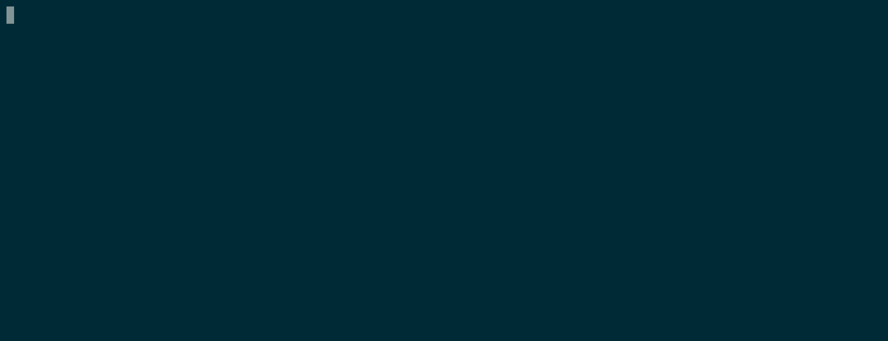
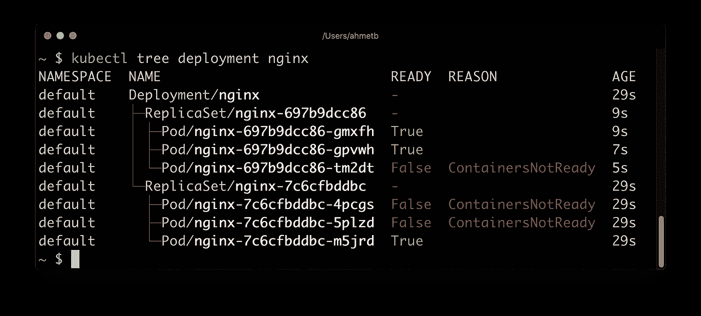
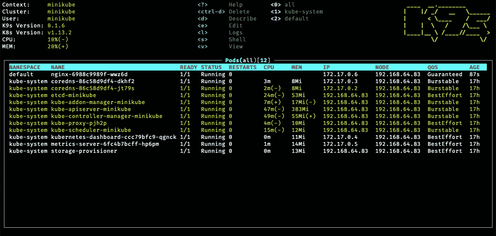

# 仅仅 7 个非凡的 K8S 工具就能提高你的效率

> 原文：<https://levelup.gitconnected.com/7-essential-tools-to-be-more-efficient-on-kubernetes-874b1b75d878>

## 厌倦了重复 kubectl 命令行？在 Kubernetes 上简化您的生活并提高您的效率


照片由[media modifier](https://unsplash.com/@mediamodifier?utm_source=ghost&utm_medium=referral&utm_campaign=api-credit)/[Unsplash](https://unsplash.com/?utm_source=ghost&utm_medium=referral&utm_campaign=api-credit)拍摄

Kubernetes 是一项编排容器和微服务的伟大技术。它提供了一个丰富的生态系统，其中有大量不同的对象和概念来启动和运行应用程序。`kubectl`是你学会通过命令行与集群交互的数字 1。

虽然知道`kubectl`很重要，但你可能会发现自己重复同样的动作，浪费时间。在这里，我们将回顾在使用 Kubernetes 时效率提高 10 倍的 7 个工具。目标是让你发现它们，我希望之后你会采纳它们。在每个工具部分，您都可以找到官方资源的参考资料。

# 1.库贝壳牌公司



用 kube-shell 自动完成

在输入 kubectl 命令时，如果能得到一些帮助来减少错误和提高速度，那就太好了。`kube-shell`是 Kubernetes CLI 的集成外壳。它提供了易于使用的`kubectl`以提高工作效率:

安装它的简单方法是:

```
$ pip install kube-shell
```

[](https://github.com/cloudnativelabs/kube-shell) [## GitHub-cloudnativelabs/kube-shell:Kubernetes shell:一个集成的 shell，用于处理…

### Kube-shell:一个集成的 shell，用于在幕后使用 Kubernetes CLI，kube-shell 仍然称之为 kubectl…

github.com](https://github.com/cloudnativelabs/kube-shell) 

# 2.库贝克斯—库本斯

您是否正在管理多个 Kubernetes 集群？`kubectx`帮助您在集群之间来回切换:


使用 kubectx 在 Kubernetes 集群之间切换

在每一个`kubectl`命令中，我们指定了与所需资源交互的名称空间。`kubens`允许避免每次都必须指定:


使用 kubens 在名称空间之间切换

[](https://github.com/ahmetb/kubectx) [## GitHub - ahmetb/kubectx:在 kubectl 中更快地在集群和名称空间之间切换的方法

### 这个存储库提供了 kubectx 和 kubens 工具。安装→在 v0.9.0 中，kubectx 和 kubens 现在在…

github.com](https://github.com/ahmetb/kubectx) 

# 3.库贝泰尔

`kubetail`将来自多个 pod 的日志聚合到一个流中。它与运行中的`kubectl logs -f`一样，但适用于多个 pod。

```
$ kubectl get pods NAME READY STATUS RESTARTS AGE app1-v1-aba8y 1/1 Running 0 1d app1-v1-gc4st 1/1 Running 0 1d app1-v1-m8acl 1/1 Running 0 6d app1-v1-s20d0 1/1 Running 0 1d app2-v31-9pbpn 1/1 Running 0 1d app2-v31-q74wg 1/1 Running 0 1d my-demo-v5-0fa8o 1/1 Running 0 3h my-demo-v5-yhren 1/1 Running 0 2h $ kubetail app2
```

您可以在窗格中指定容器:

```
$ kubetail app2 -c container1 $ kubectail app2 -c container1 -c container2
```

[](https://github.com/johanhaleby/kubetail) [## GitHub-johanhaleby/kubetail:Bash 脚本，用于同时跟踪多个 pods 中的 Kubernetes 日志…

### Bash 脚本，使您能够将来自多个 pod 的日志聚合(跟踪)到一个流中。这和…是一样的

github.com](https://github.com/johanhaleby/kubetail) 

# 4.库贝特里

一个应用程序可以有很多不同的资源，映射它们总是很明显的。`kubetree`是一个`kubectl`插件，用于探索 Kubernetes 对象之间的所有权关系:

```
$ kubectl krew install tree
```



使用 kubetree 探索 NGINX 部署

[](https://github.com/ahmetb/kubectl-tree) [## GitHub-ahmetb/ku bectl-tree:ku bectl 插件，以树的形式浏览 Kubernetes 对象层次结构🎄…

### 以树的形式浏览 Kubernetes 对象层次结构的 kubectl 插件🎄(如果您正在使用，请启动回购)- GitHub …

github.com](https://github.com/ahmetb/kubectl-tree) 

# 5.K9S

`k9s`提供了一个终端 UI 来与您的 Kubernetes 集群进行交互。它可以与流程的`top`命令相比较。您可以使用它轻松导航、观察和管理您的应用程序。



带 K9 的 pod 概述

最棒的是 Kubernetes 资源的变化是实时出现的。调试正在发生的事情非常有用。这里有一段视频展示了使用`k9s`可以做些什么:

[](https://asciinema.org/a/305944) [## K9s 之旅

### 突出 CLI 功能的 K9s 快速演示

asciinema.org](https://asciinema.org/a/305944) [](https://github.com/derailed/k9s) [## GitHub -出轨/k9s:🐶Kubernetes CLI 以时尚的方式管理您的集群！

### K9s 提供了一个终端 UI 来与您的 Kubernetes 集群进行交互。这个项目的目的是使它更容易…

github.com](https://github.com/derailed/k9s) 

# 6.库伯容量

`kube-capacity`是一个简单的 CLI，概述了 Kubernetes 集群中的资源请求、限制和使用情况。

检查集群节点:

```
$ kube-capacityNODE              CPU REQUESTS    CPU LIMITS    MEMORY REQUESTS    MEMORY LIMITS
*                 560m (28%)      130m (7%)     572Mi (9%)         770Mi (13%)
example-node-1    220m (22%)      10m (1%)      192Mi (6%)         360Mi (12%)
example-node-2    340m (34%)      120m (12%)    380Mi (13%)        410Mi (14%)
```

现在包括豆荚:

```
$ kube-capacity --podsNODE              NAMESPACE     POD                   CPU REQUESTS    CPU LIMITS    MEMORY REQUESTS    MEMORY LIMITS
*                 *             *                     560m (28%)      780m (38%)    572Mi (9%)         770Mi (13%)example-node-1    *             *                     220m (22%)      320m (32%)    192Mi (6%)         360Mi (12%)
example-node-1    kube-system   metrics-server-lwc6z  100m (10%)      200m (20%)    100Mi (3%)         200Mi (7%)
example-node-1    kube-system   coredns-7b5bcb98f8    120m (12%)      120m (12%)    92Mi (3%)          160Mi (5%)example-node-2    *             *                     340m (34%)      460m (46%)    380Mi (13%)        410Mi (14%)
example-node-2    kube-system   kube-proxy-3ki7       200m (20%)      280m (28%)    210Mi (7%)         210Mi (7%)
example-node-2    tiller        tiller-deploy         140m (14%)      180m (18%)    170Mi (5%)         200Mi (7%)
```

# 7.镜头

Lens 是用于监控和调试的 Kubernetes IDE。它是一个运行在桌面上的应用程序(Windows、Linux 和 Mac)。如果您想在 Kubernetes 上舒适地开发，这是最佳选择:

[](https://k8slens.dev/) [## 镜头 Kubernetes IDE

### 酒吧。主导航，允许用户在桌面内构建他们的“工作流”和“自动化”

k8slens.dev](https://k8slens.dev/) 

# 结论

这 7 个工具并不详尽。我已经展示了我每天最常用的方法。我建议你去下面的链接去探索和发现别人。你一定会找到你的幸福！

[](https://github.com/tomhuang12/awesome-k8s-resources) [## GitHub-tomhuang 12/awesome-k8s-resources:awesome Kubernetes 工具和…

### 令人敬畏的 Kubernetes 工具和资源的精选列表。灵感来自牛逼榜和 donne Martin/牛逼-aws。回购…

github.com](https://github.com/tomhuang12/awesome-k8s-resources)