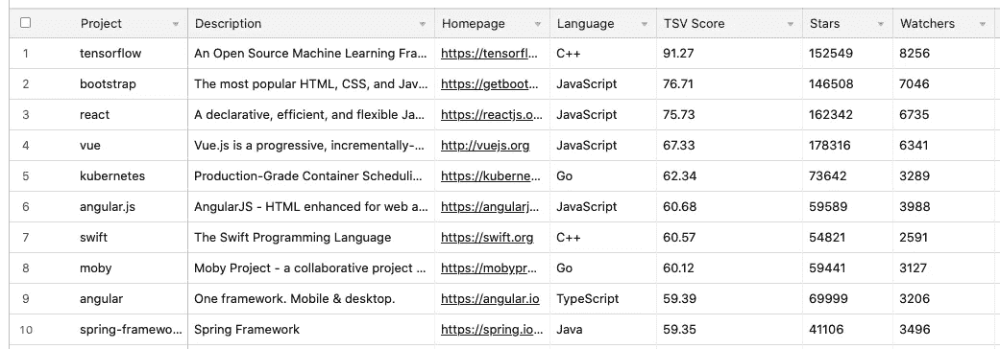

# 你会爱上的 7 个迷人的开源项目

> 原文：<https://levelup.gitconnected.com/7-fascinating-open-source-projects-you-will-fall-in-love-with-9402b3fabbbc>

## 如果你是一名开发人员，开源可能会在你的工作中发挥重要作用


由 [Unsplash](https://unsplash.com/s/photos/free?utm_source=unsplash&utm_medium=referral&utm_content=creditCopyText) 上的 [KAL 视觉](https://unsplash.com/@kalvisuals?utm_source=unsplash&utm_medium=referral&utm_content=creditCopyText)拍摄的照片

就在几年前，投资者对开源作为一种商业模式的增长持相当大的怀疑态度。人们普遍认为，只有极少数开源公司[会在软件领域做得很好](https://www.cio.com/article/2944334/why-the-open-source-business-model-is-a-failure.html)。

快进到今天，开源社区正在发展。[红帽正被 IBM](https://techcrunch.com/2018/10/28/forget-watson-the-red-hat-acquisition-may-be-the-thing-that-saves-ibm/) 以 320 亿美元收购(是其 2014 年市值的 3 倍)；MuleSoft 在上市[后以 65 亿美元](https://techcrunch.com/2018/09/25/with-mulesoft-in-fold-salesforce-gains-access-to-data-wherever-lives/)被收购；MongoDB 现在价值超过 40 亿美元；Elastic 现在的首次公开募股估值为 60 亿美元。

开源非常受欢迎。基于这篇[文章](https://simplabs.com/blog/2019/11/11/why-companies-invest-in-oss/)，67%的公司声明他们正在为开源做贡献。大量的人在日常生活中依赖开源软件。

根据手表的数量，下面是[十大](https://twosigmaventures.com/open-source-index/)开源项目。



最初发表于[https://twosigmaventures.com/open-source-index/](https://twosigmaventures.com/open-source-index/)

在我的软件工程旅程中，我依赖于一些开源项目。有些是我完全崇拜的，有些是我离不开的，有些是令我着迷的。

所以，这里是我最喜欢的 5 个开源项目，任何软件工程师都应该知道。

# 库伯内特斯

```
Watches: 3.3k
Stars: 80k
Language: Go
```

近年来， [Kubernetes](https://github.com/kubernetes/kubernetes) 深刻地改变了开发和运营团队部署和管理现代软件的方式。它已经成为容器编排的事实标准，并且是[云本地计算基金会(CNCF)](https://www.cncf.io/) 的旗舰项目。它是由谷歌、AWS、微软、IBM、英特尔、思科和红帽等大公司支持的[。](https://newrelic.com/blog/how-to-relic/what-is-kubernetes)

这个开源项目最初是由 Google 开发的，很快就成为了每个软件工程师的家喻户晓的名字。

# 卡桑德拉

```
Watches: 500
Stars: 6.8k
Language: Java
```

Apache Cassandra 是一个开源的 NoSQL 分布式数据库，因其可伸缩性、高可用性和容错性而受到数千家公司的信任。

它最初是在脸书为他们的收件箱搜索功能开发的。脸书在 2008 年开源了它，卡珊德拉在 2009 年成为 Apache 孵化器的一部分。自 2010 年初以来，它一直是一个顶级的 Apache 项目。

随着数据量的快速增长，组织对数据又爱又恨，Cassandra 由于其架构，提供了其他 NoSQL 和关系数据库无法提供的超快速查询，因此是数据分析的首选项目。

# 姜戈

```
Watches: 2.3k
Stars: 59k
Language: Python
```

[Django](https://github.com/django/django) 是一个高级 Python Web 框架，让你看起来超级聪明。它旨在帮助开发人员通过干净、实用的设计实现超快速开发。

Django 受到 Python 开发人员的喜爱，因为它使程序员能够快速地将应用从概念推向完成，而没有 web 开发中常见的麻烦。随着 python 越来越受欢迎，我预计 Django 也会增长。

# 莫比

```
Watches: 3.1k
Stars: 61k
Language: Go
```

[莫比](https://github.com/moby/moby)是 Docker 为容器生态系统创建的一个协作项目，用于组装基于容器的系统。这是一个由强有力的原则指导的项目，目标是模块化、灵活，并且对用户体验没有太强的意见

莫比提供了一套“乐高”工具包组件，将它们组装成定制的基于容器的系统的框架，以及所有容器爱好者和专业人士进行实验和交流想法的地方。组件包括容器构建工具、容器注册中心、编排工具、运行时等等，这些可以与其他工具和项目一起用作构建块

# Ansible

```
Watches: 2k
Stars: 49.3k
Language: Python
```

Ansible 是一个非常简单的 IT 自动化系统。它处理配置管理、应用部署、云供应、临时任务执行、网络自动化和多节点协调。Ansible 使复杂的变化变得简单，如使用负载平衡器的零停机滚动更新。

自 2016 年以来，它还被贡献者列入了 GitHub Octoverse 的顶级开源项目名单。

人们喜欢这个开源项目，因为它消除了应用程序开发和交付中固有的许多复杂、冗余的任务。

# 他妈的

```
Watches: 846
Stars: 63.3k
Language: Python
```

[Fuck](https://github.com/nvbn/thefuck) 是一个令人兴奋的项目，纠正了以前控制台命令中的错误。只要安装他妈的，并享受犯错的乐趣。


# 支出

```
Watches: 12
Stars: 350
Language: Python
```

expynt 是一个很小的库，它提供了通用的正则表达式模式。如果您不想手动编写正则表达式，这可能很有用。此外，您可以将该库用作测试框架的[夹具](https://docs.pytest.org/en/latest/fixture.html)，如 [py.test](https://docs.pytest.org/en/latest/) 。

它有一个支持的模式列表，如

→ `CREDIT_CARD` → `IP_V6` → `LONGITUDE`等

让你的生活如此简单。

我们不断地被社区构建的所有酷的新开源项目所震惊。如果你有问题，我相信社区有解决方案。开源项目几乎总是可以作为付费软件的替代品。

作为一个开发者，我相信每个人都用过其中的一些。以上是我的最爱。也分享你的。我肯定错过了很多精彩的。