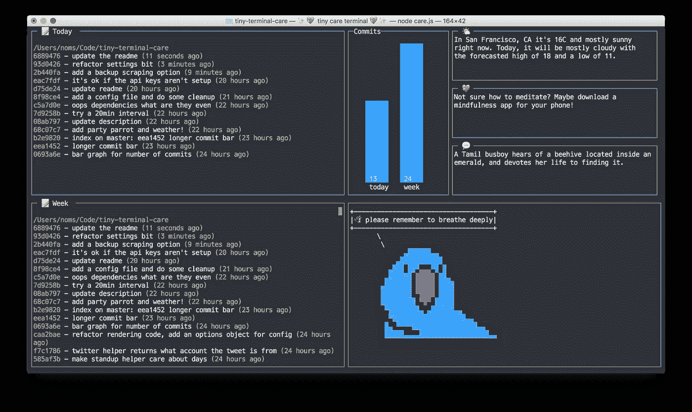
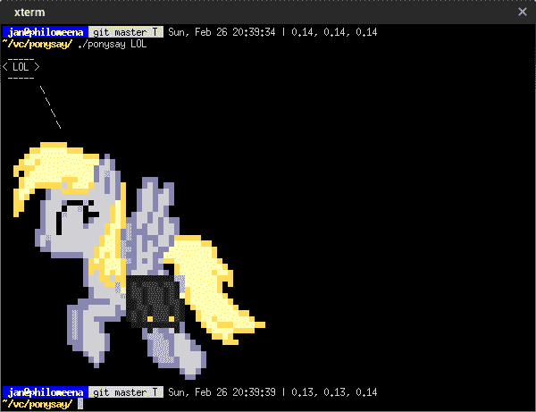
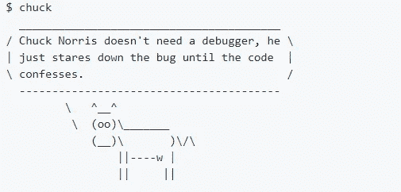
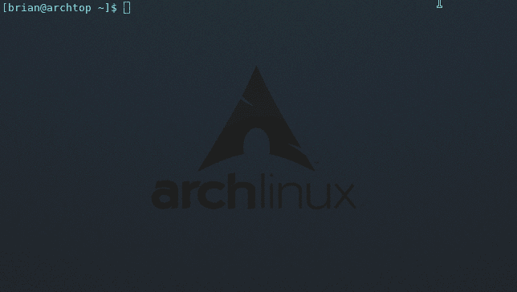
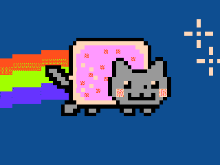

# 您可以在终端中使用的 7 个有趣的命令

> 原文：<https://levelup.gitconnected.com/7-fun-commands-you-can-use-inside-your-terminal-19273530cabb>

照片由 [ETA+](https://unsplash.com/@etaplus?utm_source=medium&utm_medium=referral) 在 [Unsplash](https://unsplash.com?utm_source=medium&utm_medium=referral) 上拍摄

## 是时候找点乐子了，因为你不必一直严肃

我们时常会厌倦我们的日常工作和激情项目。是时候找点乐子了。这篇文章中的命令没有任何实用性。你很可能不会每天都使用它们——这没关系。这些命令的目的是让你脸上露出笑容！

在漫长的一天工作结束或情绪低落时使用这些命令。希望他们能让你振作起来！

# 1.微小的关心

Tiny care 是一个小仪表板，当你使用终端时，它会尽力照顾你。它告诉你可爱的，自我照顾的事情，并尽量不要给你压力。

你所要做的就是输入`tiny-care-terminal` 来启动微型护理终端，这就是它的样子。

tiny care 仪表盘显示了来自 Twitter 账户 [@tinycarebot](https://twitter.com/tinycarebot) 、 [@selfcare_bot](https://twitter.com/selfcare_bot) 和 [@magicrealismbot](https://twitter.com/magicrealismbot) 的最新消息。前两个倾向于在推特上提醒休息、喝水和看外面。最后一个 Twitter 账号告诉你奇怪的，异想天开的故事。对于那些不喜欢这些 Twitter 账户的人来说，它们是可配置的，所以你可以用你更喜欢的账户来替换它们。

最重要的是，您可以看到从今天到上周的所有 git 提交。这样你就不必担心你没有效率，因为它会提醒你所有你做过的工作。

你可以点击查看微型护理库[。](https://github.com/notwaldorf/tiny-care-terminal)

# 2.波尼赛

这是相当于 cowsay 的小马。就像最初的 cowsay 命令一样，ponysay 实际上并不做任何有用的事情。然而，ponysay 比 cowsay 有更多的选项，因为您可以使用`-f`选项指定您想要的小马类型。

ponysay 存储库可以在这里找到[。](https://github.com/erkin/ponysay)

# 3.矩阵

cmatrix 命令基于 matrix 网站的屏幕保护程序。它显示文本在终端中飞进飞出，就像电影中看到的那样。您可以调整矩阵的显示方式。你可以以相同的速度滚动每一行，或者以不同的速度异步滚动每一行。

这是不精通技术的人对编写代码的看法——就像你在电影中看到的那样(只是那些真正糟糕的)。你可以点击查看这个令人敬畏的知识库[。](https://github.com/abishekvashok/cmatrix)

# 4.查克说

谁不喜欢恰克·诺里斯的名言呢？有了 Chuck 说库[你就能在你的终端里得到 Chuck Norris 的事实！](https://github.com/franccesco/chuck-says)

你需要做的就是在你的终端中输入`chuck`来获得一些 Chuck 的智慧。这个包里有 600 多个查克·诺里斯的事实。每当你启动你的终端或登录到一个服务器时，显示这些查克·诺里斯事实中的一个。相信我，你会喜欢的！

# 5.管道. sh

sh 在终端上随机绘制路径管道，既可以用作功能性屏幕保护程序，也可以作为娱乐。有很多选项可以传递给`pipes.sh`命令——比如管道的颜色和尺寸。

这个 bash 脚本已经存在了很长一段时间，但是仍然很有趣。你可以在这里查看资源库[。](https://github.com/pipeseroni/pipes.sh)

# 6.不再有秘密

“不再有秘密”库提供了一个名为`nms`的命令行工具，重现了 1992 年黑客电影《运动鞋》中屏幕上出现的著名数据解密效果。

您可以对管道数据使用`nms`命令。例如，你可以输入`ls -al | nms`。这将把您的命令的输出变成一串神奇的字符。

这个项目中还包括一个名为`sneakers`的程序，它重现了电影《运动鞋》中的效果。

你可以在这里看看不再有秘密储存库[。](https://github.com/bartobri/no-more-secrets)

# 7.Nyan 猫

Nyan cat repository 完全符合您的预期。它在你的终端里呈现了令人敬畏的 Nyan 猫。这种流行的网络文化从 2011 年就开始了。幸运的是，这个库不包括典型的 Nyan 猫音乐。相反，它只是给那只猫赋予了活力。

点击查看 Nyan 猫库[。](https://github.com/klange/nyancat)

