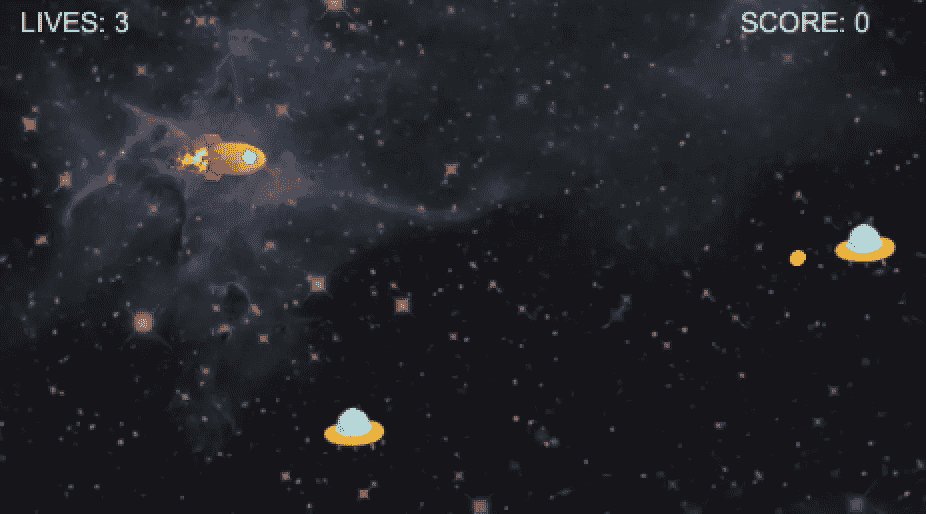
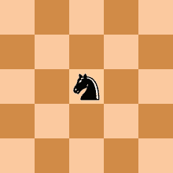

# 7 个有趣的兼职项目来扩展你的技能

> 原文：<https://levelup.gitconnected.com/7-fun-side-projects-to-expand-your-skill-set-9ad6d15d46ed>

在 [Unsplash](https://unsplash.com?utm_source=medium&utm_medium=referral) 上由 [Jantine Doornbos](https://unsplash.com/@jantined?utm_source=medium&utm_medium=referral) 拍摄的照片

## 既有挑战性又有乐趣，提升自己的最佳方式

作为一名开发人员，提高自己的最快方法是做一个你热爱的有趣的业余项目。这不同于你的日常工作，在日常工作中，你没有选择你要做什么的自由。当你在做一个你真正喜欢的副业时，它不会让你觉得是工作。但是通过投入所有这些额外的练习时间，你会迅速提高你的技能。

尽管大多数开发人员都同意这样一个事实，即从事兼职项目是提高技能的最快方法，但他们很难找到他们可以从事的很酷的兼职项目。

因此，我列出了七个有趣的兼职项目，你可以去做。我希望这份清单上的兼职项目能激励你开始自己动手做——或者至少在找到一个有趣的兼职项目时，它能把你推向正确的方向。

# 项目 1:社交媒体仪表板

照片由[莎拉·库菲](https://unsplash.com/@stereophototyp?utm_source=medium&utm_medium=referral)在 [Unsplash](https://unsplash.com?utm_source=medium&utm_medium=referral) 拍摄

大多数人都离不开社交媒体。我们每隔 15 分钟浏览一次时间线，看看是否有有趣的事情出现。糟糕的是，在这些时间线中出现了许多噪音和无趣的东西。还有各种不同的平台，它们都有自己的应用程序。

如果我们可以将所有不同社交媒体平台的所有时间表和新闻提要合并到一个仪表板中，会怎么样？

这个项目的想法是创建一个仪表板，每当你从不同的社交媒体平台之一收到更新时，它就会自动更新。

您将学到的内容:

*   Web 开发基础，比如 HTML5 和 CSS。
*   从 API 获取数据。
*   基于特定标准过滤数据。比如帖子的话题或者作者。
*   你可以通过跟踪你的兴趣，跟踪哪些作者，哪些不跟踪，来更进一步。

# 项目 2:白板

由[万花筒](https://unsplash.com/@kaleidico?utm_source=medium&utm_medium=referral)在 [Unsplash](https://unsplash.com?utm_source=medium&utm_medium=referral) 上拍摄的照片

这个项目的目标是创建一个白板，你可以在上面画画和添加注释。用户可以使用鼠标绘图。您可以提供几个选项来增加用户体验，比如绘制不同的形状、颜色和铅笔大小。

如果你想在这个项目上更进一步，你可以增加插座。这样你就可以和多人同时在白板上画画了。如果这对你来说还不够挑战，你可以考虑做一个猜谜游戏。一个玩家画一个物体，其他玩家要猜这个物体是什么。

您将学到的内容:

*   Web 开发基础，如 HTML5 和 canvas。
*   侦听来自用户的鼠标事件。
*   使用套接字。

# 项目 3:太空游戏

[来源](https://github.com/albertobeta/2D-SpaceShooter)

创造一个太空游戏可以如此有趣，这是我自己的经历。当我涉足游戏开发的时候，我创造了一个太空游戏，在这个游戏中，你控制一艘飞船，你必须保持完整。

基本原理很简单。你需要能够随着你的宇宙飞船在太空中移动。因此你需要两样东西:一艘你能控制的宇宙飞船和一个环境——在这个例子中是太空。

你可以让这个项目像你喜欢的那样具有挑战性。例如，你可以引入视差滚动。这是一种背景比前景移动更慢的技术。通过这种方式，玩家真的有一种在空间中移动的感觉。

一旦你实现了这个环境，你就可以在你的宇宙飞船周围移动，你可以走得更远。你可以开始引入知道如何移动的 NPC。你可以实现像漫游和跟随这样的行为。

您几乎可以无止境地继续添加功能。你可以添加玩家和 NPC 可以获得的物品，比如燃料和额外速度。没有燃料，飞船会坠毁，所以你也需要学习 NPC 如何在燃料耗尽之前找到燃料。

您将学到的内容:

*   游戏开发。
*   按键的检测。
*   视差滚动。
*   为 NPC 实现不同的行为。
*   如果你需要一个更大的挑战，你可以添加碰撞检测。

# 项目 4:建设管道

现代软件需要一种自动化的方法来检查和验证代码库的质量。最重要的是，管道为您省去手动部署代码的麻烦。

在构建管道时，您有几种选择，但是最常用的是 GitHub 和 BitBucket 管道。从哪一个开始都可以。我建议你继续使用你熟悉的平台。

构建管道可能是一项挑战，尤其是如果您以前从未做过任何管道方面的工作。您可能会遇到这样一个事实，即很难调试为什么您的管道有时不工作。

这个项目的伟大之处在于，你可以向你的管道中添加任何你想要的东西。最基本的管道只允许您部署代码。如果您想确保代码的高质量，您可以在管道中添加额外的步骤。例如，在这些步骤中，您可以运行 linter 并运行单元测试。

您将学到的内容:

*   建立管道。
*   CI/CD 基础。
*   在添加额外步骤的同时，您将学习很多不同的东西，比如配置 linter 和运行测试。

# 项目 5:葡萄酒质量

Maksym Kaharlytskyi 在 [Unsplash](https://unsplash.com?utm_source=medium&utm_medium=referral) 上的照片

葡萄酒质量数据集包括在给定每种葡萄酒的化学测量的范围内预测白葡萄酒的质量。对于那些机器学习初学者来说，这是一个完美的项目。

这是一个多类分类问题，但也可以作为一个回归问题。这个数据集中有近 4，900 个观察值，有 11 个输入变量和一个输出变量，这对于初学者来说非常完美。

如果这个项目对你来说很有趣，你可以看看这里的，在那里你会找到更多的信息和数据。

您将学到的内容:

*   你会掌握机器学习。

# 项目 6:骑士之旅

尽管这可能是这个列表中最小的项目，但它肯定会让你头疼。骑士之旅是一个经典的编程问题，可以让你忙上好一阵子。

但是骑士之旅到底是什么？

根据维基百科，骑士之旅是一个骑士在棋盘上的一系列移动，这样骑士恰好访问每个方格一次。

[来源](https://en.wikipedia.org/wiki/Knight's_tour)

在上面的例子中，你可以在 5x5 的棋盘上看到骑士之旅。如果你想给自己更多的挑战，你可以改变董事会的大小——至少五个。

您将学到的内容:

*   你将学习算法以及如何实现它们。
*   如果你想更进一步，你可以实现不同的算法来解决这个问题。例如，回溯算法和暴力算法。

# 项目 7:表情

照片由[真诚媒体](https://unsplash.com/@sincerelymedia?utm_source=medium&utm_medium=referral)在 [Unsplash](https://unsplash.com?utm_source=medium&utm_medium=referral) 上拍摄

这个列表的最后一个项目是深度学习项目，是机器学习的子集。在这个项目中，您将构建一个深度学习模型来从图像中对面部表情进行分类。这些面部表情的分类情绪被映射到表情符号或头像上。

您可以使用 FER2013 数据集来训练您的神经网络。如果你想了解更多关于这个项目的信息，请看这里。

您将学到的内容:

*   深度学习的一些基础知识