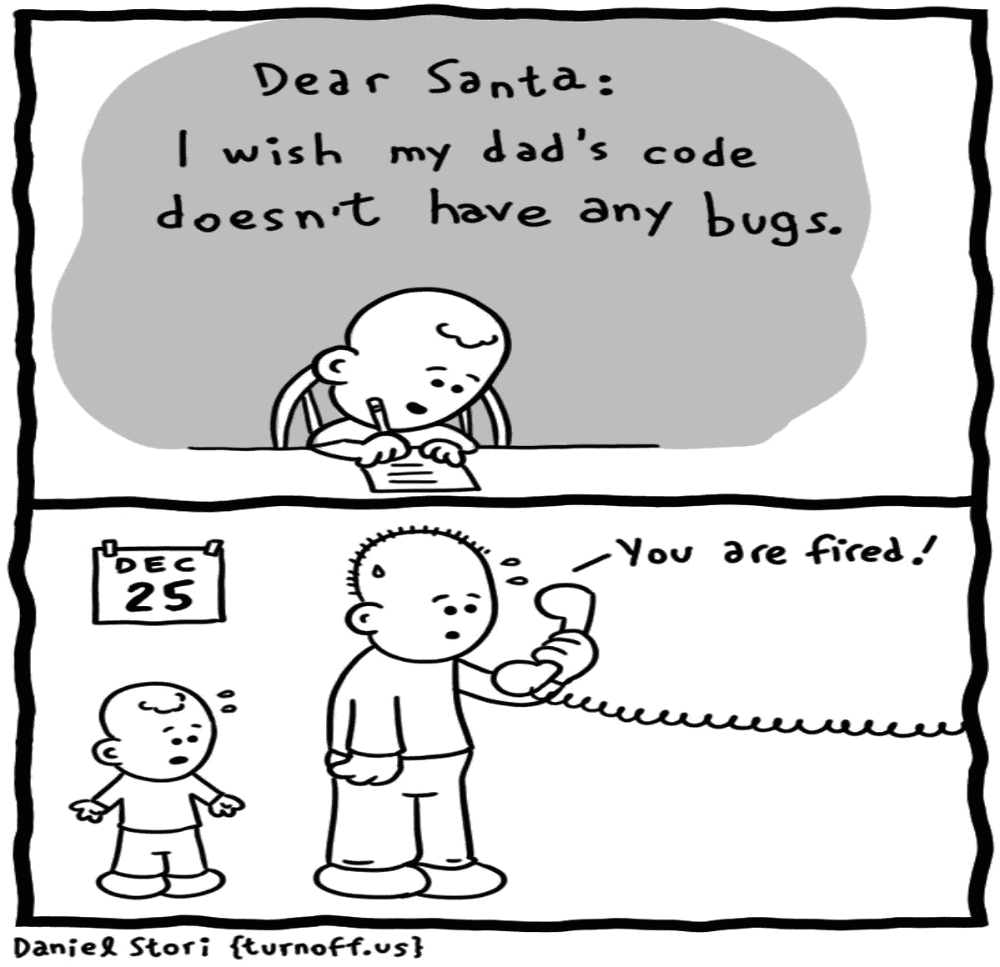
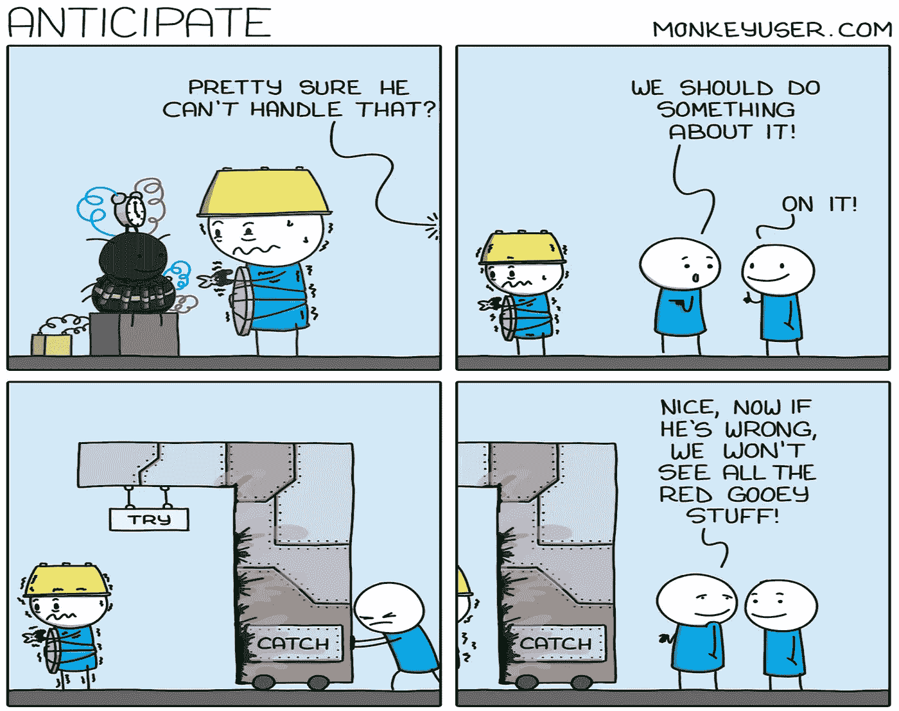
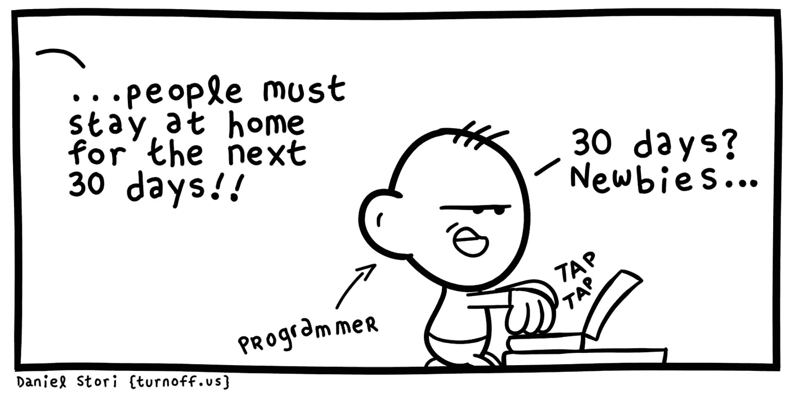
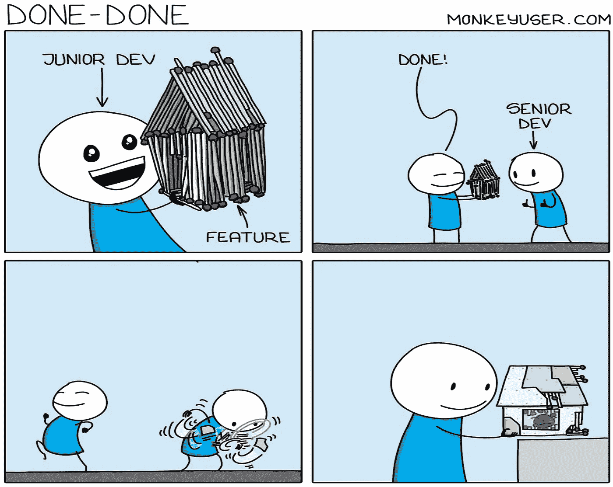
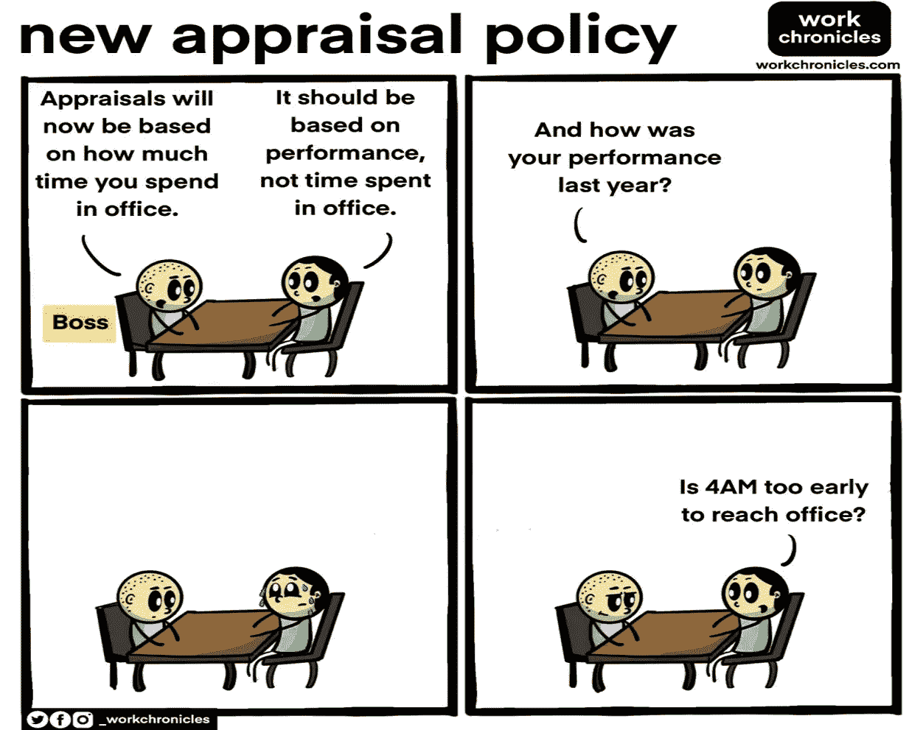
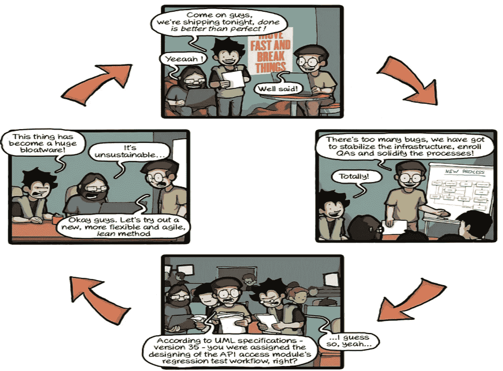
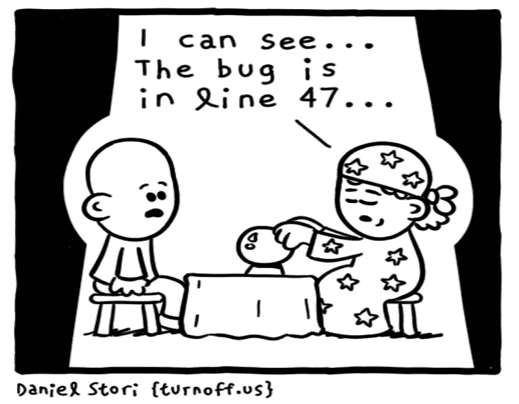

# 7 个有趣的编程笑话让你开怀大笑

> 原文：<https://levelup.gitconnected.com/7-funny-programming-jokes-to-make-you-laugh-ee2f4bcd698b>

## 幽默

## 你可以尝试，但如果你是一个真正的程序员，你会笑个不停

使用 Canva 创建

程序员有着坚定不移的永不放弃的承诺，这也是他们所生产的软件如此不可思议的原因。

让我们来看看这些大胆的程序员的日常生活——他们不仅认真对待自己的工作，还知道如何以自己独特的方式享受生活。

同时，不要忘记查看奖金部分，见证最新的神奇服务，可以缓解所有开发人员的问题。

# 0.不可能的

每个程序员在编码时都必然会产生一些缺陷。我们不可能在没有缺陷的情况下编码。

那么，只有一种方法可以做到——如果你不再写代码的话！

信用:[关闭](https://turnoff.us/geek/letter-to-santa/)

# 1.试着接住

一个 catch 块是一个救生员(应用程序节省！)如果知道正确使用的话。

但是，当开发人员编写 catch 块，吃掉异常，并且不留下发生了什么的任何痕迹时，它们可能是一种痛苦。

信用:[猴子用户](https://www.monkeyuser.com/2022/anticipate)

# 2.当你知道该回答什么的时候

我不知道你怎么想，但是安全问卷总是很难填写。这通常是一个很长的清单，其中一半会跳过我的脑袋。

如果您在开发生涯中从未经历过，请认为自己是幸运的。😃

信用: [CommitStrip](https://www.commitstrip.com/en/2022/02/22/security-questionnaire)

# 3.封锁。没问题

在 covid 感染世界的过去两年中，每个人都对连续的封锁感到沮丧。但不是程序员。只要我们有一个系统，不间断的互联网，和电力备份，我们是黄金几年。

信用:[关断](https://turnoff.us/geek/quarantine/)

# 4.资深开发者——救世主

做一个初级开发者很有趣。他们总是很乐观。他们对任何需求的第一次尝试就是他们的最终产品。

因此，没有一个初级开发人员的代码是真正完成的，直到他们的前辈给他们一点(可能很多)最后的润色。

信用: [MonkeyUser](https://www.monkeyuser.com/2022/done-done/)

# 5.评估总是主观的

我不知道你对此有何感受，但我发现绩效评估相当令人困惑。这是一年一度的讨论，讨论你的经理根据他们对你的贡献的看法，认为你应该得到什么样的提升。

信用:[工作时间](https://workchronicles.com/comics/page/20/)

# 6.应用开发生命周期

如果你已经从事软件开发至少六个月了，你就知道这是真的。

并且，永远记住——没有完美的代码！😊

信用: [CommitStrip](https://www.commitstrip.com/en/2014/11/24/a-coders-puzzle)

# 奖金:我知道我们都喜欢一点点奖金

如果我们能有这样的服务，那将是梦想成真。我知道肯定有很多开发者希望有一个。

信用:[岔道](https://turnoff.us/geek/the-last-resort/)

*感谢阅读。如果你喜欢我的文章，* [*你可以使用这个推荐链接*](https://lokajit-tikayatray.medium.com/membership) *成为一个中等会员。*

**您可能也想阅读:**

 [## 你具备成为技术领导者的素质吗

### 学习七个简单的技巧，成为您组织中最有效的技术领导者之一

levelup.gitconnected.com](/do-you-have-what-it-takes-to-be-a-tech-lead-d6f0ca3cd37c)  [## 这就是为什么大多数程序员没能成为高级开发人员

### 5 个习惯可以证明你还没有为下一个角色做好准备

levelup.gitconnected.com](/this-is-why-most-programmers-fail-to-become-senior-developer-143bc8c1342d)  [## 这就是优秀的软件开发人员努力奋斗的原因

### 知道成为一名优秀开发人员的不利之处，以及如何制定解决方案来克服这些困难

levelup.gitconnected.com](/this-is-why-good-software-developers-struggle-2267b5daf33)