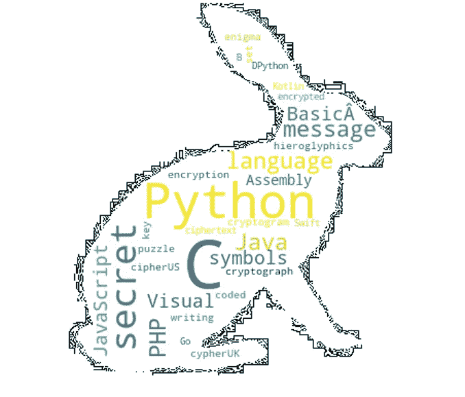

# 7 个带代码的金色 Python 包

> 原文：<https://levelup.gitconnected.com/7-golden-python-packages-with-code-d730b22d5835>

## 每个程序员都必须知道的很少使用的 python 库

照片由使用 [canva](http://canva.com) 创建的 [Freepik](http://www.freepik.com/) 上的 [benzoix](https://www.freepik.com/benzoix) 拍摄

Python 有无限数量的包用于日常编程。一些软件包激发了人们使用 Python 的兴趣。这里列出了 7 个很少使用的奇妙的包，但是这对 Python 开发者来说是必须知道的。所有的包都用一个简单的代码来解释，以说明这些包在代码中的用法。

# 1.词云:

有时我们想知道如何实现一个被文字掩盖的图像。有了这个包和 Python，我们可以创建大量的单词云图像。使用这个包可以很容易地实现屏蔽区域中单词的可视化，如输出中所示。这个软件包提供了单词云、阿拉伯语单词云、中文单词云、图像彩色单词云等选项。

**安装:** `pip install wordcloud`

**输出:**

# 2.Pywhatkit:

我在 Python 中遇到的一个多功能包是 Pywhatkit。在代码中，我们将字符串转换成手写笔记。CO \ ode 会将输出以图像格式保存在 python 脚本的源代码中。

安装:`pip3 install pywhatkit`

**输出:**

你可以用这个软件包做很多事情，其中一些是你最喜欢的:

*   把图像变成艺术。
*   将字符串转换为手写笔记。
*   通过 Whatsapp 发送信息。

# 3.Pyfiglet:

有了这个软件包，终端打印和显示变得容易多了。许多不同的字体和设计可以在您的终端上访问和显示。Pyfiglet 包含将 ASCII 文本转换为 ASCII 艺术字体的方法。在本例中，单词“Medium”使用包的一种字体打印在终端上。要使用和了解不同的字体，请查看此[链接](http://www.figlet.org/)。

安装:`pip install pyfiglet`

**输出:**

# 4.叶子:

当您需要使用 Python 代码的交互式地图时，follow 非常有用。一个简单的代码输出一个交互式地图，编码人员可以在网站或应用程序上使用。在代码中，我们使用了波兰的经度和纬度来显示地图。您可以使用坐标显示交互式地图。

安装:`pip install folium`

**输出:**

# 5.钟摆:

钟摆是处理代码中日期和时间属性的一个很有价值的包。这是这个包的一个特色，你可以轻松地访问时区数据。有许多方法可用，如 now()、datetime()，它们创建日期和时间的实例。我们有一个程序，用代码中的方法找出两个时区和时间显示之间的差异。

安装:`pip install pendulum`

**输出:**

# 6.散景:

Bokeh 是一个软件包，编码人员可以在现代 web 浏览器中使用它来创建交互式可视化。这有助于从各种设计中构建图形，从简单的技术到复杂的技术。Bohek 对于构建基于 web 的仪表板非常有用。在代码中，我们只是简化了一个情节。

安装:`pip install bokeh`

**输出:**

# 7.PSUTIL:

Psutil 代表过程和系统实用程序。该软件包有助于收集与系统相关的信息。程序员可以用这个软件包访问关于网络、磁盘、内存、Cpu 数据的系统信息。

安装:`pip install psutil`

## 输出:

**这里有一个订阅链接，可以用 Medium 阅读成千上万篇文章。请考虑订阅，支持众多作家:**

 [## 通过我的推荐链接加入媒体

### 作为一个媒体会员，你的会员费的一部分会给你阅读的作家，你可以完全接触到每一个故事…

swathiarun63.medium.com](https://swathiarun63.medium.com/membership)