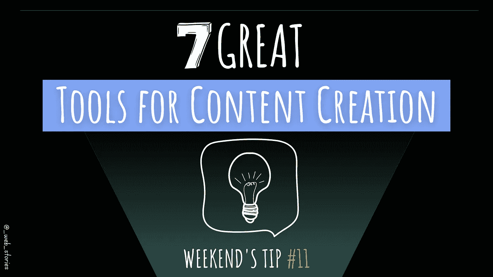
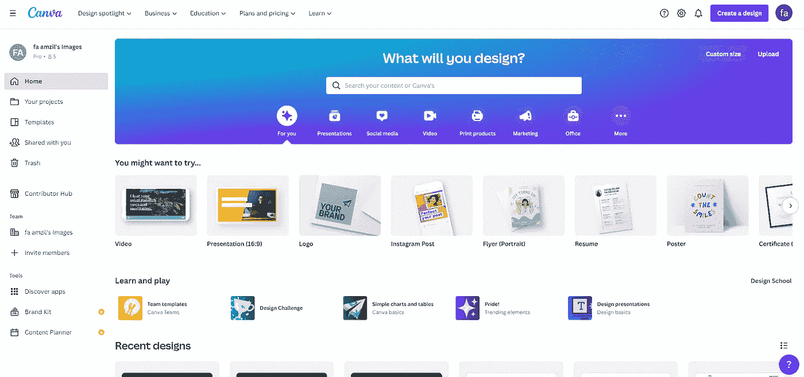
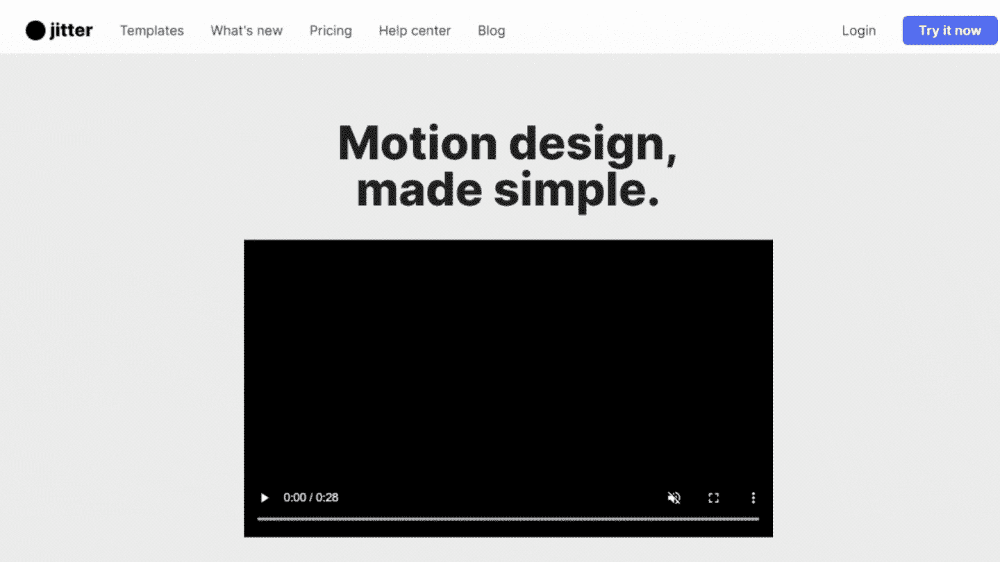
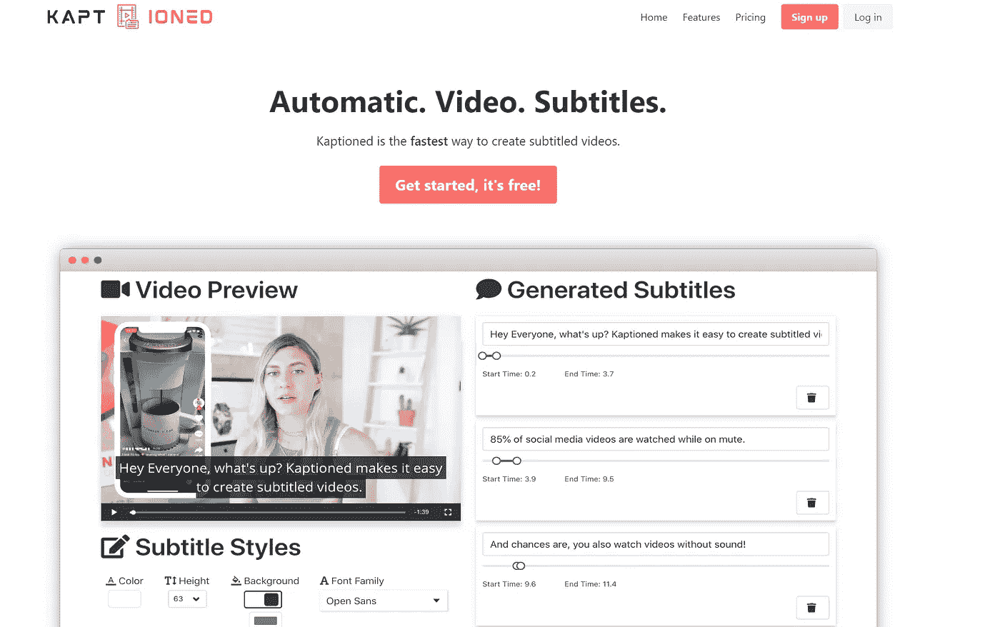
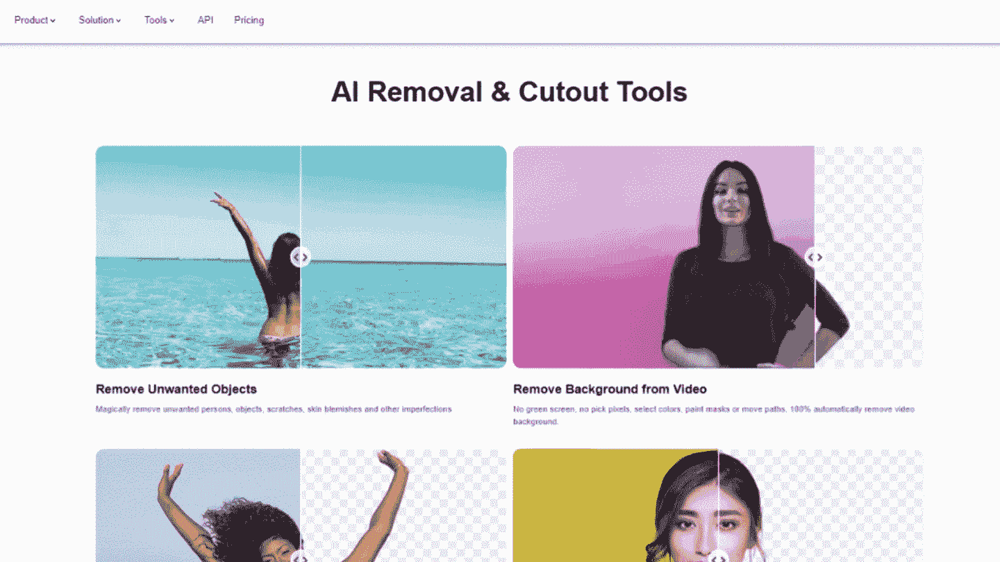
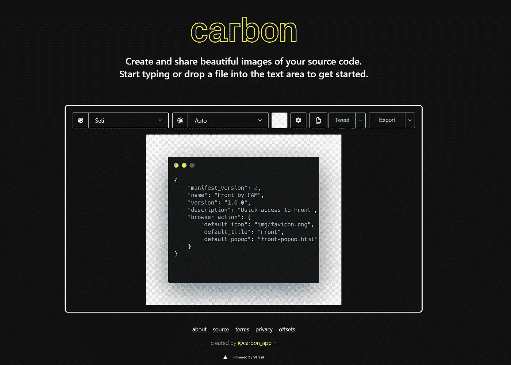
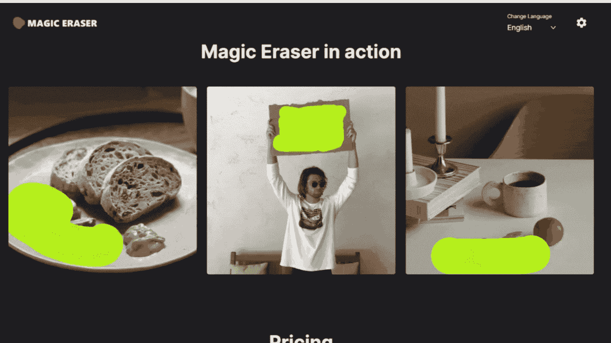
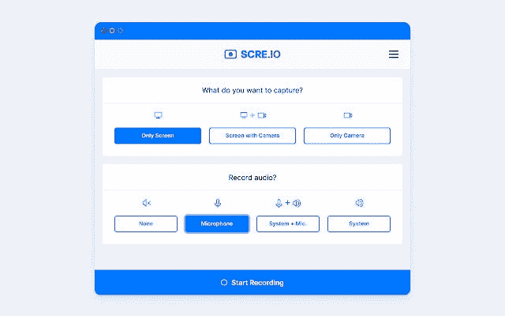

# 7 大内容创作工具

> 原文：<https://levelup.gitconnected.com/7-great-tools-for-content-creation-78db4b242249>

## 使用这些工具节省时间并提高生产力

作者:FAM

## 你好👋

我经常被问到我在媒体上使用的工具。本周末的提示是关于我发现并一直在使用的用于内容创作的顶级工具。

顺便说一下，我分享这些工具是没有报酬的。我只是分享我过去和现在在内容创作中使用的东西。

如果你也有很棒的工具，请与我们分享😉

> 亲爱的 Instagramers，请复制/粘贴我的作品，但不要忘记添加来源。让我们一起成长😉…谢谢你。

# 第一名- Canva

Canva 是我的爱。没有它我无法创作任何内容。我用它来:

→我的文章封面、文档封面、徽标等。

→我的动画、gif 和我的 [**youtube 视频**](https://www.youtube.com/channel/UCaxr-f9r6P1u7Y7SKFHi12g) 。

我用了一年的 canva 免费版。我喜欢它，并发现它是一个有用的工具，值得为它付费。所以我转了保费计划，不后悔。

虽然随着时间的推移，我学到了很多技术，但这个工具非常直观，你会学得很快。

坎瓦

# #2-抖动

[抖动](https://jitter.video/)帮你做动作设计。我最近发现了它，有点喜欢它。我还没有使用它的所有功能，但我给它一个机会，因为我发现它很有前途。我是被一个朋友发现的，他用它来创建推文推荐，并把它们添加到他的网站上。

振动

# 第三名- Kaptioned

如果你是一个博客爱好者，你会发现[非常有用。它可以给你的视频添加自动字幕。是不是很牛逼？你不需要额外的努力就能让你的视频变得可读。](https://kaptioned.com/)

我还没有使用这个工具，因为视频需要太多时间，而且我已经被我的工作、我的 [**2022 网络程序**](https://medium.com/geekculture/2022-web-program-is-launched-f38a3280af1a) 和我对学习新事物的好奇心(目前正在学习 ionic😜)，所以没时间留视频了。

Kaptioned

# #4- Cutout pro

[Cutout pro](https://www.cutout.pro/) 是一个具有 AI 能力的视频背景去除构建。我最近发现了这个工具，我很高兴我做到了。很长时间以来，我一直在寻找一种工具来使我的 gif 背景透明，以便如果我的介质阅读器的自定义背景不是白色的，我的 gif 仍然会很性感。

这个工具的另一个优点是它还有其他功能，比如移除照片背景、移除照片中不想要的对象、制作照片动画等等。

## 🔥 🔥 🔥真的很棒的工具，绝对推荐！

# #5-碳

如果你是一个开发技术内容的开发者，你可能已经使用过这个工具了。每当我想在我的动画或一般内容中添加代码片段时，我都会使用这个工具。

[碳](https://carbon.now.sh/)

# #6-魔法橡皮擦

我经常发现一个奇妙的图像，但有一个我不喜欢的小东西。这个工具非常强大，可以根据你的喜好定制令人惊叹的图像。

自从我发现了 **cutout pro** ，我就完全转用它了。但是神奇的橡皮擦仍然值得一提，因为它是如此强大。

魔法橡皮擦

# #7-屏幕记录器扩展

上面所有的 gif 都是由[屏幕录制扩展](https://chrome.google.com/webstore/detail/screen-recorder/hniebljpgcogalllopnjokppmgbhaden?hl=en) + canva(用于转换成 gif)制作的。

你可以记录整个屏幕，激活相机，或者不。音频也是如此。我经常用它来记录浏览器标签，但它有许多令人兴奋的功能来创建 vlogs 和博客内容。

屏幕记录器

## 其他提示:

 [## 提高编码逻辑的 6 个技巧

### 如何增强编码技能？

levelup.gitconnected.com](/6-tips-to-improve-your-logic-in-coding-d33e575ff8e6)  [## CSS 中响应式设计的 4 个最佳技巧

### 让它处处漂亮！

medium.com](https://medium.com/geekculture/4-best-tips-for-responsive-design-in-css-43f3a3de286c) 

今天就到这里，看阿雅🙋

如果您有任何问题或反馈，请点击评论或通过 LinkedIn 联系我— **我洗耳恭听！**

[**想请我喝杯咖啡吗？☕️**](https://www.buymeacoffee.com/fatimaamzil)

> 让我们为 2022 年打造一个更好的‘我们’！

> 如果你喜欢我的文章， [**订阅**](https://famzil.medium.com/subscribe) 获取我的最新。如果你自己喜欢体验媒介，可以考虑通过[**注册**](https://famzil.medium.com/membership) 会员来支持我和其他成千上万的作家。它每个月只需要 5 美元，它支持我们，作家，你也有机会用你的作品赚钱。当然，你可以随时取消会员资格。通过注册[这个链接](https://famzil.medium.com/membership)，你将直接用你的一部分费用来支持我，不会花你更多的钱。如果你这样做了，万分感谢！

让我们在 [**上**取得联系****](https://medium.com/@famzil/)**[**Linkedin**](https://www.linkedin.com/in/fatima-amzil-9031ba95/)**[**脸书**](https://www.facebook.com/The-Front-End-World)**[**insta gram**](https://www.instagram.com/the_frontend_world/)**[**YouTube**](https://www.youtube.com/channel/UCaxr-f9r6P1u7Y7SKFHi12g)**或**********

****** [## 通过我的推荐链接——FAM 加入 Medium

### 作为一个媒体会员，你的会员费的一部分会给你阅读的作家，你可以完全接触到每一个故事…

famzil.medium.com](https://famzil.medium.com/membership)******