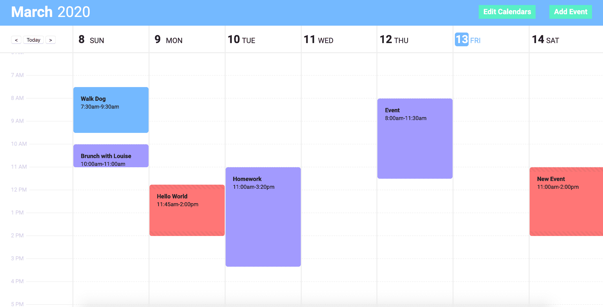

# 7 个很棒的 Vue3 教程和资源，立即开始学习

> 原文：<https://levelup.gitconnected.com/7-great-vue3-tutorials-and-resources-to-start-learning-today-2322189d252f>

内森·赖利在 [Unsplash](https://unsplash.com?utm_source=medium&utm_medium=referral) 上拍摄的照片

有了这些在家的额外时间，这是学习新技能的好机会。对于 Vue 开发者来说，我们现在能做的最有用的事情之一就是开始熟悉 Vue3 的最大变化。

到目前为止，只有相对较少的资源来更新 Vue3 的所有新特性。

这个列表中有一些 Vue3 教程和其他资源，我发现它们是最有用的，同时我会尽可能多的去学习。希望你和我一样觉得它们很有用。

让我们直接开始吧。

## 1. [Vue 精通— Vue3 精要](https://www.vuemastery.com/courses/vue-3-essentials/why-the-composition-api)

一如既往，Vue Mastery 是 Vue 课程的最佳资源之一。除了几门 Vue 课程之外，他们现在还有一门很棒的介绍 Vue3 主要变化的课程。

它解释了它们是什么，它们是如何工作的，以及为什么改变是必要的。

总的来说，这是获得一些背景知识和对 Vue3 的高层次理解的好方法。

## 2. [Vue 学校博客 Vue 3 中激动人心的新特性](https://vueschool.io/articles/vuejs-tutorials/exciting-new-features-in-vue-3/)

Vue School 是每个 Vue 开发者都应该熟悉的另一个资源。除了为每个级别的 Vue 开发者提供课程之外，网站上还有很棒的文章。

Filip Rakowski 的这篇文章强调了 Vue3 中一些将改变我们编码方式的最大特性。

这包括:

*   组合 API
*   组件碎片
*   门户网站
*   暂记组件
*   更大的

所以如果你想知道这些，一定要去看看。

## 3. [LearnVue Vue3 应用构建与](https://courses.learnvue.co/p/build-along-vue3-time-blocking-app/)

**无耻的塞到这里。**

但是最近，我发布了我的第一个 Vue3 课程 build，其中我们实际上使用了 Vue3 Alpha 版本来创建一个真正的应用程序。

这是一个时间阻塞(调度)应用程序，它对 Vue3 的最大变化进行了很好的实践，并深入到复合 API 和将 HTML 拖放 API 集成到 Vue 中。

如果你是一个中级 Vue 开发人员，并且想知道你的代码在 Vue3 中会有怎样的变化，我真的认为这是一个很好的资源来看看 Vue3 是如何工作的。

我们将要构建的应用程序的屏幕截图

## 4.[vue 3——新店](https://medium.com/@mario.brendel1990/vue-3-the-new-store-a7569d4a546f)

Mario Brendel 的这篇文章展示了一个非常酷的组合 API 用例——在不使用 Vuex 的情况下构建一个全球商店。

由于 Vue3 公开了一些核心反应性 API，开发者可以真正充分利用 Vue 切换到的新的基于代理的反应性系统。

一旦你理解了 Composition API 的基础，我真的认为这篇文章写得很好，会让你思考新特性的其他用途。

## 5. [VueJS 开发者— Vue3 教程](https://vuejsdevelopers.com/2020/03/16/vue-js-tutorial)

这个由 VueJSDevelopers 的 Anthony Gore 编写的 Vue3 教程很好地介绍了如何构建你的第一个 Vue3 应用。它回顾了关键的变化和**为什么**它们是必要的。

通过解释为什么会发生这些变化，本教程对于想要了解 Vue3 设计背后的推理的中级开发人员来说是非常棒的。

它涵盖了组合 API 中的设置方法，声明了一个根组件，以及每个应用程序都需要的其他要素。

## [6。Vue 组合 API RFC](https://vue-composition-api-rfc.netlify.com/)

Vue Composition API Request for Comments(RFC)是真正了解 Composition API 内部工作的地方。

它讨论了变化的原因、确切的语法，甚至还有您需要使用的新方法/属性的 API 参考。

在我看来，这是学习组合 API 和了解如何将 Vue2 代码迁移到 Vue3 的最佳资源。

## 7. [Vue Next Github Repo](https://github.com/vuejs/vue-next)

如果你愿意深入一些代码和 Github 回购，Vue next 回购是一个很好的方式来真正了解 Vue 正在发生什么变化。

repo 包含当前的代码库，并随着新的更改、修复和优化的推出而不断更新。

对于普通开发人员来说，这可能不是最容易的事情，但是如果你真的要投入一些工作，那么让你完全理解 Vue3 是很棒的。

希望这个列表给了你一些开始学习 Vue3 的好地方。

这绝不是一个完整的列表，所以如果有什么对你了解 Vue3 有真正帮助的，请留下评论，我一定会查看的。

编码快乐！

[如果你有兴趣了解更多关于 Vue 3 的知识，请下载我的免费 Vue 3 备忘单，里面有一些基本知识，比如组合 API、Vue 3 模板语法和事件处理。](https://learnvue.co/vue-3-essentials-cheatsheet/)

 [## 学习 Vue.js -最佳 Vue.js 教程(2020) | gitconnected

### 29 大 Vue.js 教程-免费学习 Vue.js。课程由开发人员提交并投票，使您能够…

gitconnected.com](https://gitconnected.com/learn/vue-js)