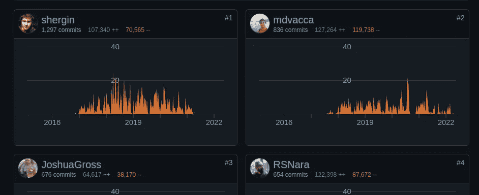
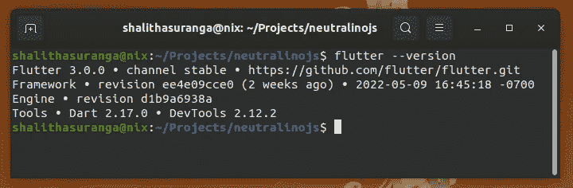
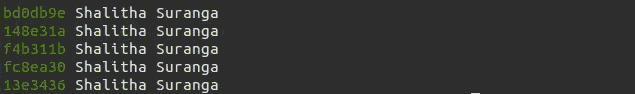
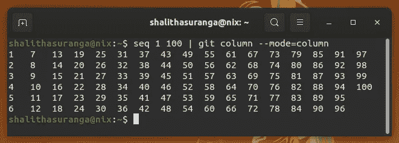
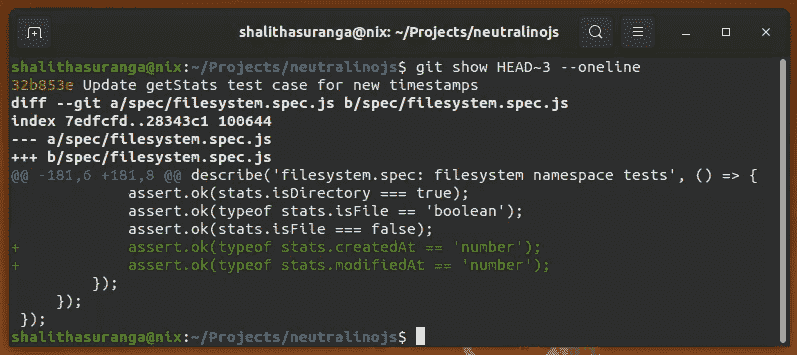

# 7 个鲜为人知的 Git 命令和技巧

> 原文：<https://levelup.gitconnected.com/7-lesser-known-git-commands-and-tricks-9915e9caeb70>

## 使用这些命令来处理 Git repos 并提高您的工作效率，而无需 GUI 工具


照片由[克莱门特·赫拉尔多](https://unsplash.com/@clemhlrdt?utm_source=unsplash&utm_medium=referral&utm_content=creditCopyText)在 [Unsplash](https://unsplash.com/s/photos/coding?utm_source=unsplash&utm_medium=referral&utm_content=creditCopyText) 拍摄，由 Canva 编辑

如今，Git 是软件行业默认的源代码管理解决方案——每个软件开发团队都倾向于使用 Git 和远程 Git 托管服务来维护他们的代码库。开发人员使用各种独特的方式来处理基于 Git 的软件代码库。有些开发人员只使用官方的 Git CLI。一些开发人员使用官方的 Git CLI 和一些可视化工具，如 [Gitk](https://en.wikipedia.org/wiki/Comparison_of_Git_GUIs#:~:text=free-,gitk,-GPLv2) 。与此同时，一些开发人员很少使用 CLI 工具，而经常使用 GUI 工具，即使是为了准备和提交。

官方 Git CLI 提供了一个完整的解决方案，用于通过终端接口管理 Git 存储库。此外，它还提供了许多简化的命令行选项，以便在软件开发活动中最大限度地提高开发人员的生产力。

我们都知道日常的 Git 命令，我们可以用它们来暂存、提交、分支、合并和管理远程存储库。尽管 Git CLI 提供了许多命令行选项和子命令，但我们通常每天都使用相同的命令集，因此 Git 中有一些有用的隐藏命令。让我们学习一些有用的隐藏命令和技巧！

# 1.查找主要贡献者

软件开发团队通常由不止一个开发人员组成。即使你提供了一个免费的开源软件项目，你也会收到来自开源社区的令人印象深刻的代码贡献。因此，我们的 Git 存储库包含来自许多作者的提交。如果您需要根据提交情况列出排名靠前的贡献者，该怎么办？最简单的方法是检查 GitHub(或类似的 Git 托管服务)上的 contributor 选项卡，如下所示:



React Native 项目前四名贡献者，作者截图

我们确实可以使用下面的内置 Git 命令，根据提交次数对所有贡献者进行本地排名:

```
git shortlog -sn
```

通过将上面的 Git 命令与 Unix `head`命令结合起来，您可以获得顶级的`n`贡献者:

```
git shortlog -sn | head -3        # Lists the top 3 contributors
```

您甚至可以通过提供`--email`标志来获得每个作者的电子邮件。此外，如果您使用特定的提交消息[约定](https://www.conventionalcommits.org/en/v1.0.0/)，您可以使用以下命令找到谁修复了大多数 bug:

```
git shortlog -sn --grep="^fix" --no-merges | head -1
```

注意，这里我们跳过了对带有`--no-merges`标志的合并提交进行计数。

# 2.正在检索 DevOps 脚本的当前提交哈希

开发人员通常将当前的 Git 提交散列包含在特定的软件版本中，以将代码快照与发布的软件版本联系起来。如果您使用 Flutter 并要求 Flutter CLI 返回版本细节，您将获得几个缩写的提交散列，如下所示:



Flutter 版本选项显示简短的提交散列，由作者截屏

这些提交散列通常通过 DevOps 脚本包含在软件二进制文件中。例如，如果您需要将提交散列添加到 GNU/GCC 编译的 GNU/Linux 二进制文件中，您可以获取当前提交并通过 CLI 宏定义将其发送到 GCC:

```
gcc main.c -o main -DGIT_COMMIT_HASH="\"<commit-hash>\""
```

您可以使用以下命令接收当前提交:

```
git rev-parse HEAD
```

现在，您可以在 DevOps 脚本中使用上面的 Git 命令，如下所示:

```
gcc main.c -o main -DGIT_COMMIT_HASH="\"$(git rev-parse HEAD)\""
```

最后，您可以在代码中访问上述宏定义，如下所示:

```
#include <stdio.h>int main() {
    printf("Commit: %s\n", GIT_COMMIT_HASH);
    return 0;
}
```

我使用上述方法将当前的提交散列包含在我们的开源应用程序框架中——您可以在 GitHub 上浏览[源代码。](https://github.com/neutralinojs/neutralinojs/blob/8b13560ce14c86fe19770aa85110983a0ef671c8/scripts/bz.py#L45)

# 3.提交和分支之间的 Git 差异

每个顽固的程序员通常在修改代码库后输入`git diff`来验证发生了什么变化，即使现代 GUI 编辑器在编辑器中显示了 Git 差异。与其他 Git 命令一样，`git diff`命令也非常灵活。例如，我们可以根据文件扩展名找到 diff，如下所示:

```
git diff *.txt
```

我们也可以区分两次提交。请看下面的例子:

```
git diff HEAD~2 HEAD~1
```

上面的命令显示了前一个提交和第二个祖先提交之间的差异。此外，您可以使用`diff`命令比较分支——尝试输入分支名称，而不是提交标识符。

# 4.查询和格式化 Git 日志

使用 Git 存储库就像在日记中记录特殊事件——我们可以看到过去几天发生了什么。开发人员经常使用`git log`命令来查看最近的修改。`log` Git 命令带有几个命令行选项，用于查询提交和格式化输出。例如，我们可以根据特定的作者姓名过滤掉提交:

```
git log --author="John Smith" --oneline
```

您还可以使用`--grep` CLI 选项根据提交消息过滤结果，就像我们之前使用`shortlog`命令一样。

默认情况下，`log` Git 命令显示了详细的输出，但是我们可以使用一些简写的 CLI 标志(如`--oneline`)得到最小的响应。Git 也提供了定制日志条目格式的方法。看下面的预告:



一个定制的 Git 日志输出，由作者截图

我们可以使用以下命令获得上面的输出:

```
git log --format="%Cgreen%h%Creset %an"
```

从[官方 Git 文档](https://git-scm.com/docs/pretty-formats)中了解更多关于 Git pretty 格式化语法的信息。漂亮的格式化语法有助于用 Bash、Python 和类似 JavaScript 的流行脚本语言编写面向 Git 的 [DevOps](/how-to-improve-your-programming-skills-by-learning-devops-73071b9ea507) 脚本。

# 5.将非结构化原始输出格式化为表格

你知道像`git branch`这样的 Git 命令接受`--column`标志来将基于行的输出格式化成列吗？Git 通过`git column`命令为开发人员提供了与通用助手命令相同的核心特性——它根据各种输入参数将标准输出数据格式化成表格。假设您正在使用`seq` Unix 命令生成一个换行符分隔的模式。我们可以通过将`seq`命令输出传送到`git column`来创建一个包含这些数据的表格。

请看下面的命令:

```
seq 1 100 | git column --mode=column
```

现在我们可以看到，根据当前终端窗口的大小，整个数字序列被格式化为一个表格:



用 column 命令格式化原始命令输出，作者截图

我们可以在任何 Bash 脚本中使用`git column`以结构化和用户友好的方式返回输出。

# 6.向提交添加简短注释

开发人员倾向于编写简洁明了的提交消息来维护更好的开发历史。由于流行的提交约定，一些开发团队甚至自动生成带有提交消息的发布说明。如何给提交添加一些额外的注释？如果您在提交消息中添加了一些内容，它将出现在远程 Git 托管的 GUI 上。如何添加隐藏注释以记住一些技术工作或为 CI/CD 服务器记录消息？

内置的 Git notes 特性帮助我们为提交添加额外的注释。运行以下命令将注释链接到当前提交:

```
git notes add -m "Test note"
```

不提供`-m`选项，你可以通过编辑器程序写一个多行的长注释。您可以使用`git notes show`命令阅读当前便笺。另外，`git log`命令默认显示注释。GitHub 过去使用 Git notes 作为注释，但是现在 GitHub [弃用了](https://github.blog/2010-08-25-git-notes-display/)notes 支持，支持基于网络的注释。

默认情况下，Git 不推/拉注释，但是您可以使用以下命令显式处理远程注释:

```
git push <remote> refs/notes/*
git fetch origin refs/notes/*:refs/notes/*
```

# 7.检查提交

我们通常检查 GitHub 等远程 Git 托管服务上的 Git 提交，以分析代码更改。GitHub 显示了一个包含文件更改的 commit，并允许您在那里开始讨论。内置的 Git 特性还允许您在本地检查特定的提交。例如，输入以下命令查看当前提交的详细信息:

```
git show
```

我们可以用`HEAD~n`语法或提交散列来浏览过去的提交。例如，您可以使用以下命令获取第三个祖先提交的详细信息:

```
git show HEAD~3
```

众所周知的`--oneline`选项在这里也可以使用——它将产生一个最小的提交细节输出，如下所示:



使用 show 命令检查过去的提交，作者截图

我向您展示了一个用 C 程序检索当前提交的示例，因为学习 C 有显著的好处——下面的故事证明了这一点:

[](https://shalithasuranga.medium.com/why-every-developer-should-start-programming-with-c-39b3a87392bf) [## 为什么每个开发人员都应该从 C 开始编程

### 你可以用任何语言开始编程——但是用 C 开始有更多的好处！

shalithasuranga.medium.com](https://shalithasuranga.medium.com/why-every-developer-should-start-programming-with-c-39b3a87392bf) 

感谢阅读。

# 分级编码

感谢您成为我们社区的一员！升级正在改变技术招聘。 [**在最好的公司找到你的完美工作**](https://jobs.levelup.dev/talent/welcome?referral=true)**。**

**[](https://jobs.levelup.dev/talent/welcome?referral=true) [## 升级—转变技术招聘

### 升级—转变技术招聘🔥使软件工程师能够找到完美的角色…

作业. levelup.dev](https://jobs.levelup.dev/talent/welcome?referral=true)**