# Java 开发新手容易犯的 7 个错误！

> 原文：<https://levelup.gitconnected.com/7-mistakes-that-novice-java-developers-commit-c54eac99cd3>

> 如果你是 Java 新手，这篇文章将帮助你理解 7 个容易混淆的概念。

Andrea Piacquadio 拍摄的照片

# **1。忽略 P *按值排序*Java 的本质**

> 你看到这里的虫子了吗？

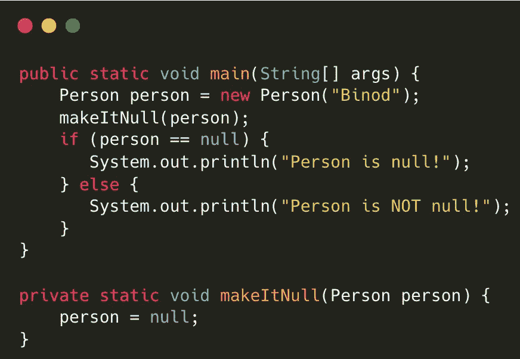

这里， *person* 不会为 *null* ，因为 Java 是*传值*而不是*传引用*。那是什么意思？

这里有三个部分，实际的 person 对象是在堆上创建的，然后有一个引用指向堆上的 person 对象，引用本身有一个表示对象在堆上的位置的值，这里的 *bob* 是一个指向堆上的 person 对象的引用，作为引用的 *bob* 也有一些表示对象位置的值。(这不是确切的地址)

所以，

当 *bob* 作为参数传递给 *makeItNull()* 方法时，bob 引用的值被复制到 *bob1* 引用，而不是实际的堆对象，当 *bob1* 被赋值给 *null* 时， *bob1* 引用的值变为 *null* ，但原始 *bob* 引用的值不变。

> 当传递原始数据时，JVM 复制原始数据类型的值。如果 int x=5，那么 5 本身也会被复制。
> 
> 当传递对象时，引用的值被复制到另一个变量，而不是实际的对象。

因此 java 被认为是*按值传递*而不是*按引用传递。*

在按引用传递的语言中，原来的 *bob* 会变成 null。

# 2.破坏 Hashcode-Equals 契约

> 这里缺少什么？

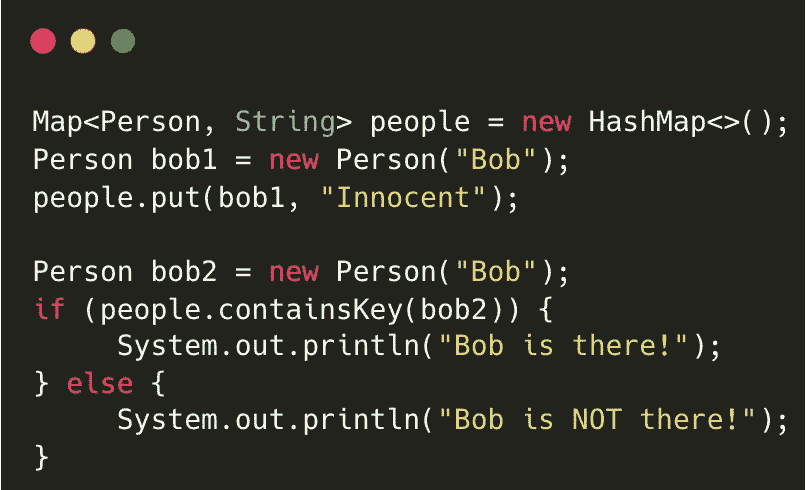

如果不在 Person 类中覆盖 hashcode-equals 方法， **Bob 将不会出现在那里**，即使从业务角度来看它们是相同的对象。

为什么？

HashMap、HashSet 和 Hashtable 使用 hashcode 和 equals 方法标识重复键，

存储对象时，使用 *hashcode* 方法计算散列码整数，如果映射已经包含该散列码，那么 equals 方法将被调用以检查对象是否真的相同，如果相同，那么值将被替换。

类似地，在检索对象时，如果 *hashcode()* 相同，则调用 *equals()* 检查是否是相同的键，如果是，则返回值。

这里，在存储对象时，由于没有覆盖 *hashcode()* 和 *equals()* 方法，所以将调用对象类的 hashcode 和 equals 方法

> Object 类的 hashcode 方法为 JVM 中的每个新对象返回不同的值。
> 
> 对象类的 equal 方法引用比较。

所以 bob 和 bob1 的 hashcode 是不同的。 *bob1* 的哈希将不会出现在地图中。

**还记得那个简单的契约:**

如果*等于*方法在某个类中被覆盖，

1.  您必须以这样一种方式覆盖 *hashcode* 方法，如果 equals 方法为两个对象返回 true，那么 hashcode 方法必须为这些对象返回相同的整数。
2.  如果 equals 方法中的对象不相同，那么它们可能会也可能不会返回相同的 hashcode。

> 即使您已经覆盖了 hashcode-equals，使用可变对象作为键也不是一个好的做法，因为以后如果键被修改，它们将不能被检索，因为 hashcode-equals 会由于修改而改变结果。

# 3.迭代时修改集合

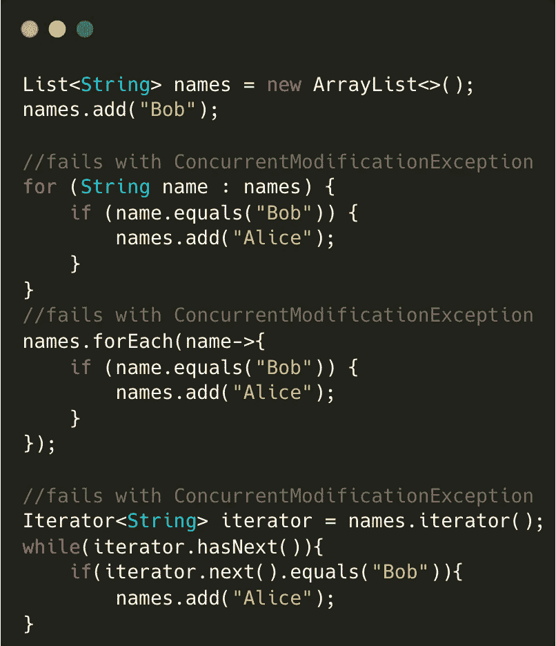

1.  如果在使用快速失败迭代器迭代对象时试图添加或删除对象，将会得到*ConcurrentModificationException。*
2.  Fail fast 迭代器在原始集合上工作，并使用一个内部标志 *modCount* 来检查集合中是否有任何结构变化。如果是，则执行失败。

## 解决方案:

1.  您可以使用线程安全的等价集合*Java . util . concurrent . copyonwritearraylist*或*Java . util . concurrent . copyonwritearrayset*，迭代器使用原始数组的副本遍历并修改原始数组。
2.  也可以使用 *ConcurrentHashMap* ，虽然它不使用原始集合的副本来遍历，但是它有一个无故障的快速实现。

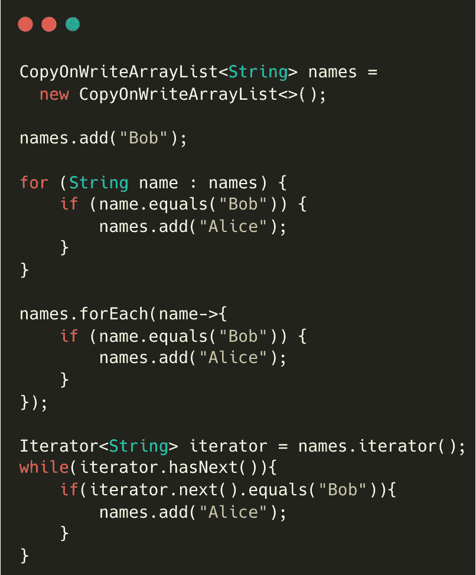

# 4.不关闭系统资源

1.  Java 应用程序使用几种类型的资源，如文件、流、套接字和数据库连接。我们需要确保他们获得自由，即使出现错误。
2.  由于每个应用程序分配的资源有限，过度使用资源会导致应用程序多次重启，并影响同一环境中的其他应用程序。

**如何关闭资源？**

可以使用 Java 7 中引入的 *finally* 块或者 *try-with-resource* 块。使用 *try-with-resource* 时，可以声明多个资源，每个资源都必须实现 *java.io.AutoCloseable* 接口，该接口有 *close()* 方法来指定如何关闭资源。在成功完成 try 块或出现异常后，JVM 总是会调用这个方法。

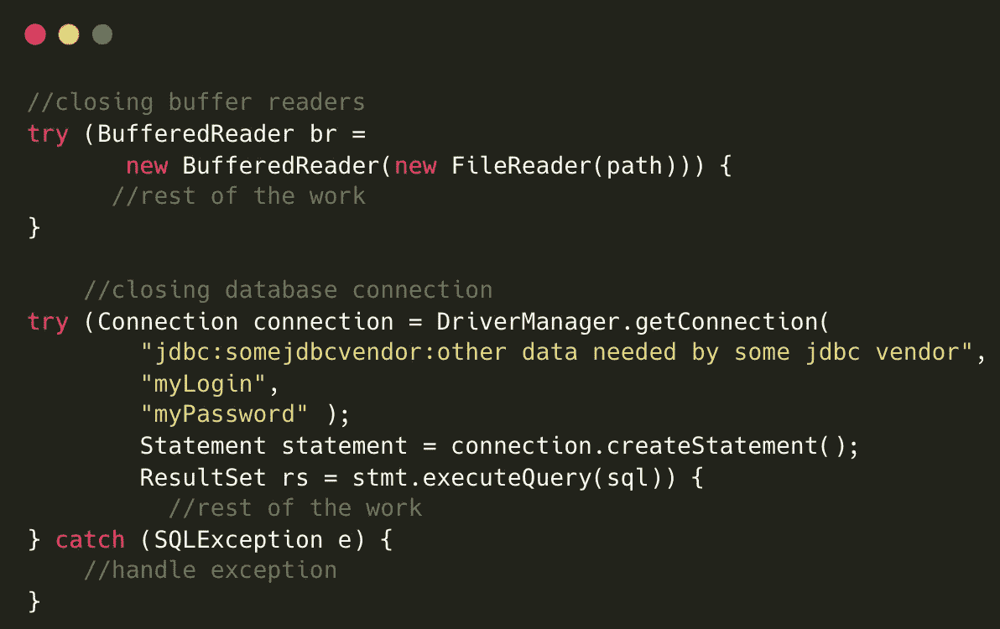

# 5.修改不可变对象

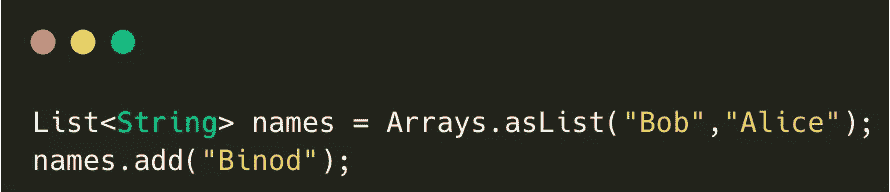

1.  这里 *Arrays.asList()* 给出了一个不可变列表，我们试图在其中添加另一个名称，因此我们将在这里*得到*UnsupportedOperationException*。*
2.  不可变对象的状态不能改变，也不应该改变。如果它是必需的，那么对象本身就不应该是不可变的。

# 6.多线程环境中变量的可见性

> 你以为 MyThread 会一直停在这里吗？

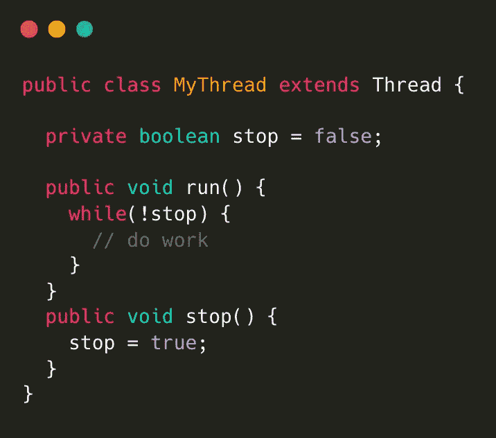

1.  如果 *stop()* 方法被其他线程执行，那么 *stop* 变量的 *true* 值可能永远不会被 MyThread 看到，如果它已经缓存了变量的值的话。
2.  如果一个变量被多个线程共享，那么一个线程所做的更改可能会被另一个线程看到，也可能看不到。为什么？
3.  当线程试图修改变量的值时，根据 CPU 架构，变量的值可以被复制到 CPU 核心的本地缓存，而不是总是从主存储器读取以提高性能，这对于同时处理它的另一个线程是不可见的。

**解决，**

> 所以使用一个*易变的*修饰符可以确保线程总是看到更新的值。

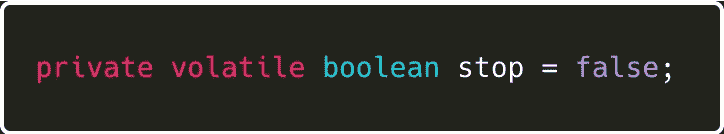

# 7.使用==而不是 equals 进行对象比较

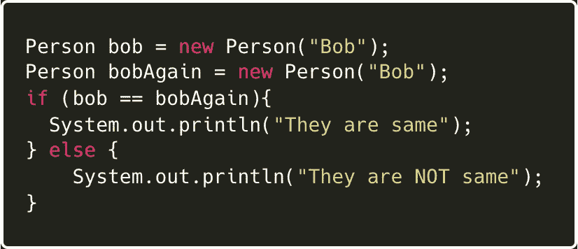

1.  这里*，bob* 和 *bobAgain* 引用了堆中的不同对象，因此引用比较(==)将返回 false，否则将执行块。只有两个引用都指向内存中的同一个对象，它才会返回 true。
2.  *等于(其他)*方法检查对象的实际内容。当然，这取决于你如何重写*等于*方法。

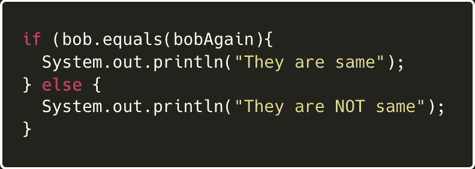

> 枚举在 Java 中默认是单例的，所以相同枚举的所有引用将指向相同的对象，因此引用比较适用于枚举。

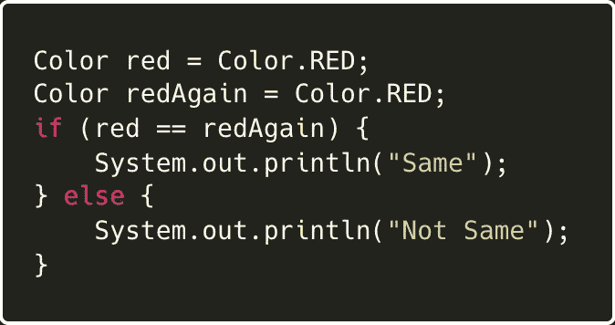

所以在这里， *If* 块将被执行

就是这样，如果你喜欢的内容，请跟随！查看我在 Java Streams 上的另一篇文章！

 [## 8 年 Java Stream API，通过 8 个问题了解 Streams！

### 是的，自从 Java SE 8 发布流 API、函数接口、时间 API 等等以来，已经有 8 年了…

levelup.gitconnected.com](/8-years-of-java-stream-api-understand-streams-through-8-questions-bd9e5d9d8bc) 

谢谢！