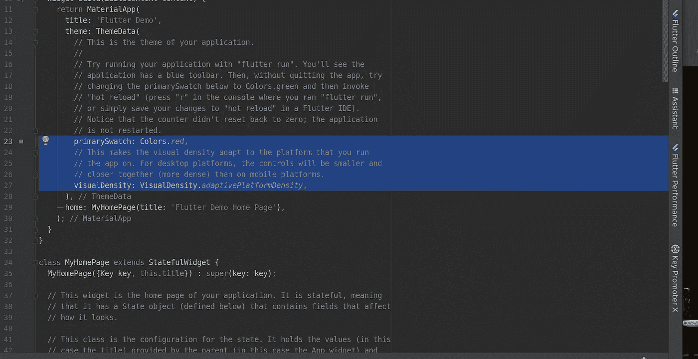
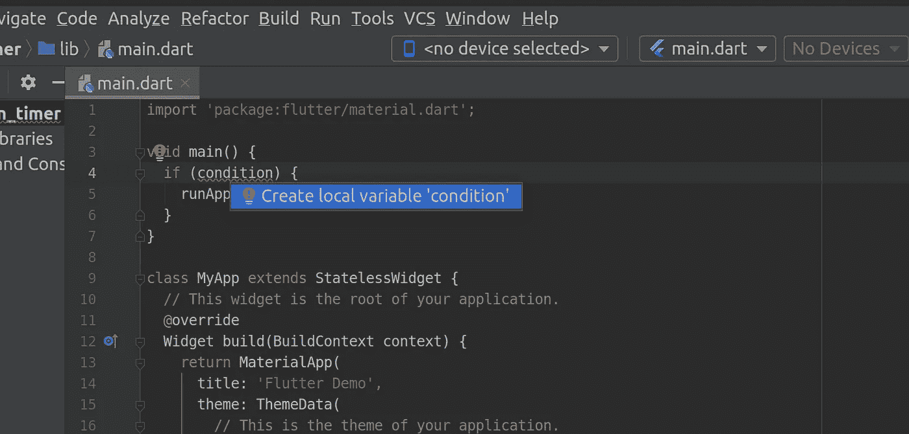
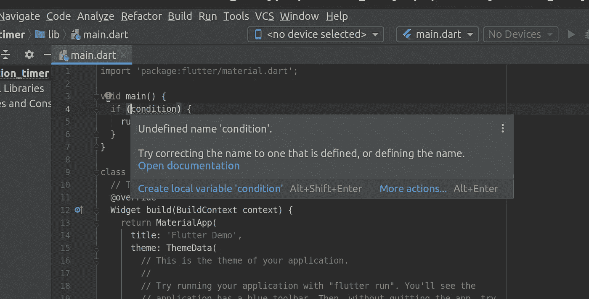
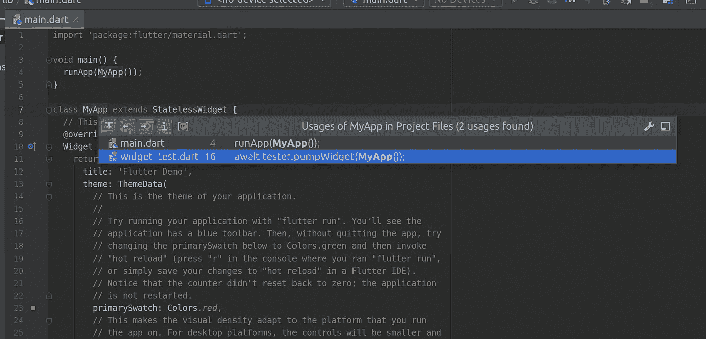
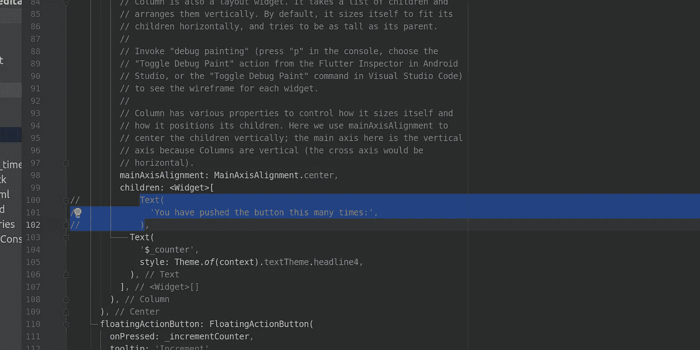

# 你应该牢记的 7 个最重要的 IntelliJ IDEA 键盘快捷键

> 原文：<https://levelup.gitconnected.com/7-most-crucial-intellij-android-studio-keyboard-shortcuts-6b08ffffcbc4>

## 如果你使用 Android Studio、PyCharm、WebStorm、PhpStorm、CLion、GoLand 或 Rider，请阅读本文

作者截图

虽然有很多很好的选择，但是 Jetbrains 的编辑们有一个庞大的粉丝群。有几个基于 Jetbrains IntelliJ 平台的 IDE:IntelliJ IDEA、Android Studio、PyCharm、WebStorm、PhpStorm、CLion、GoLand、Rider 等等！

在这些编辑器中学习最重要的捷径是值得的，我相信这 7 个是最重要的。他们会为你节省大量的时间！

# 1.选择代码的递增/递减部分

Windows、Linux:**ctrl+w**/**shift+ctrl+w**
MAC:**⌥+↑**和 **⌥ + ↓**

您可以通过分别按下 **Ctrl + W** 或 **Ctrl + Shift + W** 来选择光标附近增加或减少的代码段。编辑器将智能地检测有用的选择的边界。当您需要缩进或删除一整段代码时，这个选项非常有用。

# 2.应用修复或修正

所有平台: **Alt + Enter**

Alt + enter 显示修复问题的建议(作者截图)

如果只学一个快捷键，那一定是 **Alt + Enter** 。它显示解决问题的建议。您可以使用箭头键选择其中一个修复，然后按 enter 键直接应用它。

作为一个额外的快速选项， **shift +Alt + Enter** 应用第一个建议。由于 IntelliJ 将按照最可能的适用性对建议的修复进行排序，这通常就足够了！

# 3.转到下一个错误、警告或建议

所有平台 **: F2**

F2 带你到下一个错误、警告或建议(作者截图)

用这个键，你可以进入下一个错误、警告或建议。这个和`Alt` + `Enter`结合使用效果很好。使用它在当前文件中导航并逐个修复所有问题。

# 4.转到申报单

Windows，Linux:**ctrl+b**MAC OS:**⌘b**

Ctrl + B 导航到声明或显示用法(作者截图)

若要转到符号声明，请按 Ctrl + B。例如，在变量上按此键会将光标带到变量声明。在类名上使用它将打开一个新的选项卡，并带您到类文件。使用 **⌥ + ⌘ + B** (MacOS)或**ctrl+alt+b**(windows/Linux)，您也可以导航到一个实现。

# 5.打开项目窗口

Windows，Linux:**alt+1**t34】MAC OS:**⌘+1**

您使用鼠标在左侧项目窗口中导航项目的频率如何？我打赌肯定很多。

使用 **Alt + 1** ，您可以打开项目窗口并将焦点放在那里。您可以使用箭头键在项目树中导航，并通过简单地开始键入您要查找的内容来进行搜索。完成后，使用 **ESC** 返回编辑器。

# 6.将焦点放回编辑器/取消更改

所有平台: **ESC**

这个和其他快捷键结合起来很好，比如上面的 **Alt + 1** 。无论打开什么工具窗口，它都将焦点放回编辑器。此外，escape 键允许您在不应用更改的情况下关闭任何弹出窗口。

# 7.注释掉一行或一组代码

Windows、Linux:**ctrl+/**
MAC OS:**⌘+/**

通过按 **Ctrl + /** 注释掉当前行或选择(作者截图)

如果你想暂时注释掉一段代码，你可以首先选择该段代码(记得使用**Ctrl+W**/**Shift+Ctrl+W**)，然后点击 **Ctrl + /** 。

如果你想注释掉当前代码行，只需点击 **Ctrl + /** 即可——无需选择。

感谢阅读。你最常用的捷径是什么？请在评论中分享！