# 2023 年开发者 7 大生产力 Chrome 扩展

> 原文：<https://levelup.gitconnected.com/7-must-have-productivity-chrome-extensions-for-developers-4320abaec24b>

## 这五个 Chrome 扩展每周为我节省了很多时间

安德里亚斯·克拉森在 [Unsplash](https://unsplash.com?utm_source=medium&utm_medium=referral) 上拍摄的照片

可能没有多少人像开发人员——尤其是 web 开发人员——一样在笔记本电脑和浏览器上花这么多时间。

因此，使用正确的工具来最有效地工作是非常重要的。我的五大 Chrome 扩展每周都为我节省了大量时间。

# 1.Web 亮点— PDF 和 Web 荧光笔

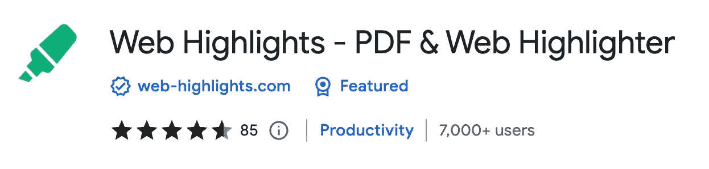

[网页亮点 Chrome 扩展](https://chrome.google.com/webstore/detail/web-highlights-pdf-web-hi/hldjnlbobkdkghfidgoecgmklcemanhm)

当然，自从开发了这个扩展之后，我在这一点上就有点偏了。然而， [Web Highlights](https://web-highlights.com) 解决了一个你们很多人以前肯定遇到过的问题。

***你有没有在网上看过一些有趣的东西，然后在你的浏览器历史里永远的搜索？***

这个[荧光笔扩展](https://chrome.google.com/webstore/detail/web-highlights-pdf-web-hi/hldjnlbobkdkghfidgoecgmklcemanhm)可以让你在任何网页或 PDF 上保存文本，以便在任何地方都能轻松地重新找到。您可以创建标签并做笔记来组织您的重点和书签。你所有的精彩片段都会同步到[web-highlights.com](https://web-highlights.com/)上相应的网络应用程序中。

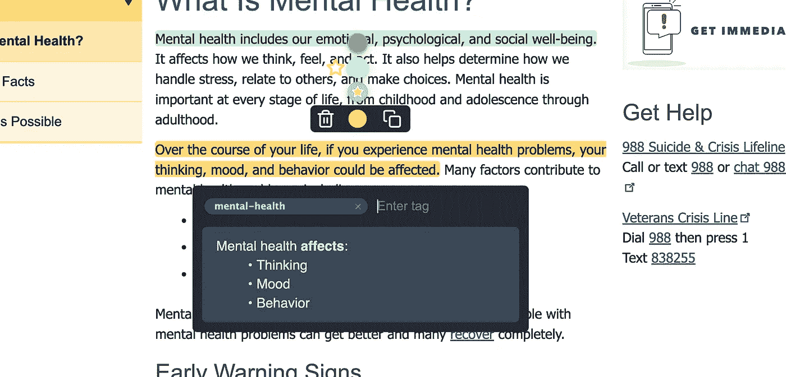

用 [Web 高亮显示文本](https://web-highlights.com)

这听起来好像这个扩展不是直接为开发者构建的，但是它帮助我每天保持研究和**书签**有序。存储带有网页亮点的书签是内置 Chrome 书签管理器的一个很好的替代选择，特别是因为你可以在**网络应用**上用手机轻松访问你保存的页面。

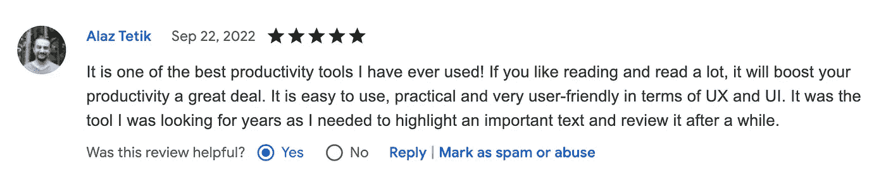

[网页集锦用户评论](https://chrome.google.com/webstore/detail/web-highlights-pdf-web-hi/hldjnlbobkdkghfidgoecgmklcemanhm)。

您也可以将您的研究导出为 PDF 或 HTML 文件，并将其复制到 Markdown 或 HTML。这样，你就可以通过将你的工作粘贴到你选择的工具上来同步你的工作，例如**概念**或**遗忘**。

# 2.Usersnap —捕捉视觉反馈和缺陷

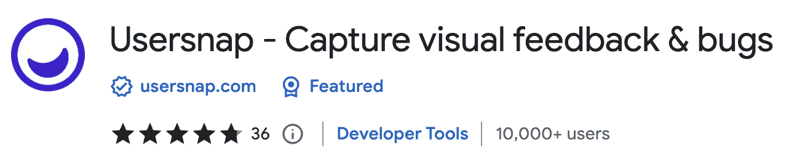

[Usersnap Chrome 扩展](https://chrome.google.com/webstore/detail/usersnap-capture-visual-f/khehmhbaabkepkojebhcpjifcmojdmgd)

[Usersnap](https://usersnap.com) 让你捕捉你的屏幕，收集用户反馈，并跟踪任何网站、原型或应用程序上的错误报告。直接在浏览器中发送反馈和报告任何网站上的错误，并提供截图和注释。

[Usersnap](https://usersnap.com) 让数字产品团队更容易进行用户验收测试(UAT)以及交流设计和开发反馈。

# 3.Web 开发人员

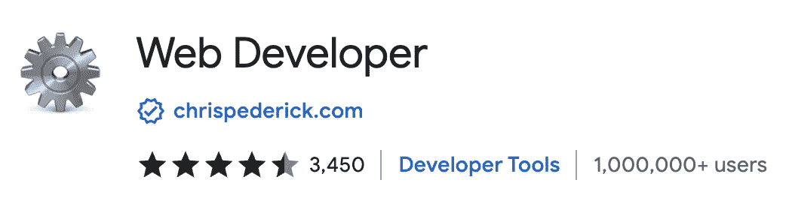

[Web Developer Chrome 扩展](https://chrome.google.com/webstore/detail/web-developer/bfbameneiokkgbdmiekhjnmfkcnldhhm)

我再也无法想象没有 [Web Developer extension](https://chrome.google.com/webstore/detail/web-developer/bfbameneiokkgbdmiekhjnmfkcnldhhm) 的工作生活。它给你的浏览器添加了一个小工具栏，里面有各种 web 开发工具。它提供了许多开发者经常需要的功能:删除 cookies、隐藏图像、验证 HTML、显示密码等。

这个扩展的伟大之处在于它统一了如此多的工具，以至于可以取代许多其他的扩展。例如，我经常需要一个页面标尺来检查元素是否正确对齐。过去，我为此安装了一个单独的扩展。现在，我可以快速转到杂项部分，并单击显示标尺。

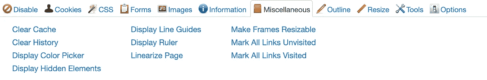

Web Developer 扩展及其工具栏

# 4.响应观众

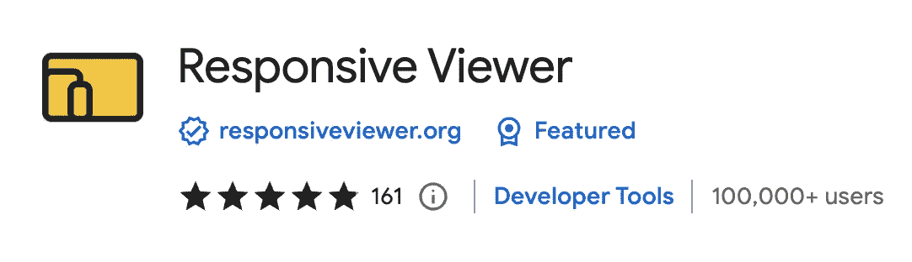

[响应查看器](https://chrome.google.com/webstore/detail/responsive-viewer/inmopeiepgfljkpkidclfgbgbmfcennb)

这个[响应式查看器扩展](https://chrome.google.com/webstore/detail/responsive-viewer/inmopeiepgfljkpkidclfgbgbmfcennb)对于前端开发人员来说尤其有趣。它使您能够在一个视图中显示多个屏幕。这是开发和测试响应网站和应用程序的理想选择。

我希望 Chrome 开发者工具能提供类似的东西。在他们这么做之前，我会继续这个出色的扩展。

响应查看器扩展

# 5.搜索引擎优化爪牙

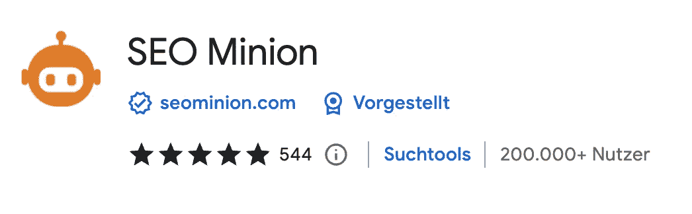

[SEO Minion Chrome 扩展](https://chrome.google.com/webstore/detail/seo-minion/giihipjfimkajhlcilipnjeohabimjhi?hl=de)

当谈到搜索引擎优化扩展，没有办法绕过我的搜索引擎优化 Minion。SEO Minion 帮助您完成日常的 SEO 任务，例如页面 SEO 分析、断开的链接检查、SERP 预览等等。

如果你还在学 SEO，可以看看我的初学者文章:

 [## 提高你的谷歌排名的 3 个即时方法

### 任何人都可以实现这三个要点，让他们的产品在 Google、Bing 和 Co .搜索引擎上可见

web-highlights.com](https://web-highlights.com/blog/3-instant-ways-to-increase-your-google-ranking/) 

# 6.ModHeader

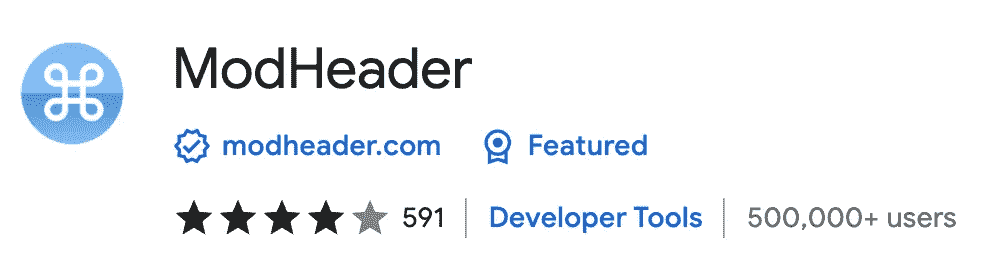

[ModHeader Chrome 扩展](https://chrome.google.com/webstore/detail/modheader/idgpnmonknjnojddfkpgkljpfnnfcklj)

ModHeader 是另一个帮助修改 HTTP 请求的扩展。它使您能够轻松地更改 HTTP 头。我经常用它来做测试。尤其是手动设置`Authentication`表头。

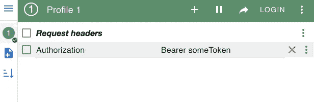

ModHeader 扩展的屏幕截图

# 7.ModResponse

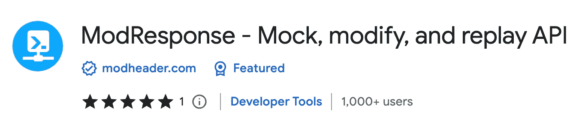

[ModResponse Chrome 扩展](https://chrome.google.com/webstore/detail/modresponse-mock-modify-a/bbjcdpjihbfmkgikdkplcalfebgcjjpm)

这个扩展与 ModHeader 来自同一个发行商，是一个相当新的扩展。我尝试过许多模拟 HTTP 请求的扩展。不幸的是，它们中的大多数并没有像我希望的那样工作。现在我很高兴我可以使用与我习惯的 ModHeader 类似的界面来使用 ModResponse。

使用 ModResponse，您可以修改 API 数据，返回不同的 HTTP 状态代码，为您的请求添加延迟，等等。您还可以将 HTTP 请求重新路由到不同的服务器，从而允许您在几秒钟内测试生产域中的本地更改。与其他类似的扩展不同，ModResponse 不需要额外的代理或进行任何代码更改。它几乎可以修改任何 HTTP 请求，而不仅仅是 XHR 请求。安装它，你就可以开始了！

例如，我经常使用它将我部署的前端的服务器重定向到我的本地服务器，以测试部署的前端中的新特性。在扩展中应该是这样的:

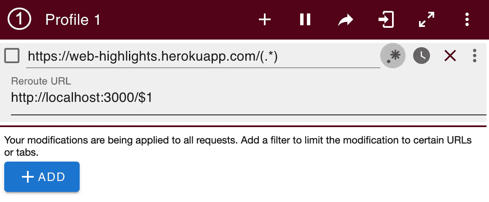

Modresponse 扩展的屏幕截图

# 最后的想法

我希望你喜欢阅读这篇文章。我总是乐于回答问题，并乐于接受批评。请随时联系我😊

通过**[**LinkedIn**](https://www.linkedin.com/in/marius-bongarts-6b3638171/)**联系我或者在 [**Twitter**](https://twitter.com/MariusBongarts) 上关注我。****

*******如果你想支持我的写作，*** [***成为中等会员***](https://medium.com/@mariusbongarts/membership) ***。如果你这样做，我会得到一小笔佣金。谢谢！*******

**** [## 通过我的推荐链接加入 Medium-Marius bong arts

### 作为一个媒体会员，你的会员费的一部分会给你阅读的作家，你可以完全接触到每一个故事…

medium.com](https://medium.com/@mariusbongarts/membership)**** 

# ****进一步阅读****

**** [## 构建您自己的新标签 Chrome 扩展

### 如何用普通的 HTML、CSS、JavaScript 和 Web 组件构建一个漂亮的新标签 Chrome 扩展

javascript.plainenglish.io](https://javascript.plainenglish.io/building-your-own-new-tab-chrome-extension-fa4adfd733c5)  [## 如何使用 React 构建 Chrome 扩展

### 了解如何创建 Chrome 扩展，以及如何使用 React 构建应用程序的前端部分。

javascript.plainenglish.io](https://javascript.plainenglish.io/how-to-build-a-chrome-extension-using-react-28ec1a16c44b)  [## 如何构建一个 Chrome 扩展

### 按照这个循序渐进的指南创建你的第一个 Chrome 扩展

javascript.plainenglish.io](https://javascript.plainenglish.io/how-to-build-a-chrome-extension-d165f5cde793)  [## 如何使用 Angular 构建 Chrome 扩展

### 了解如何创建 Chrome 扩展，以及如何使用 Angular 构建应用程序的前端部分。

blog.devgenius.io](https://blog.devgenius.io/how-to-build-a-chrome-extension-using-angular-d6b15578324e)****