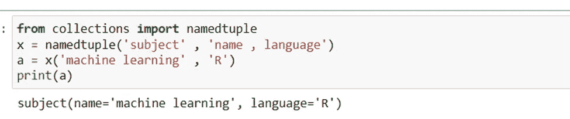
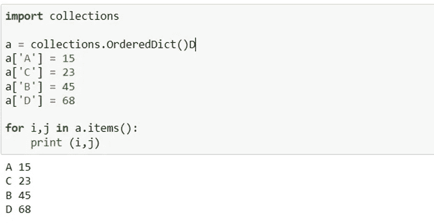
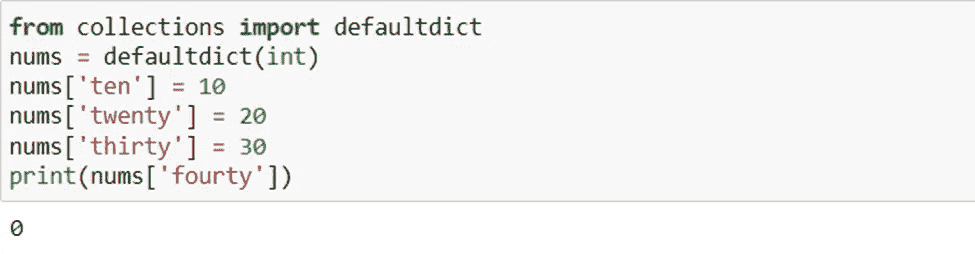
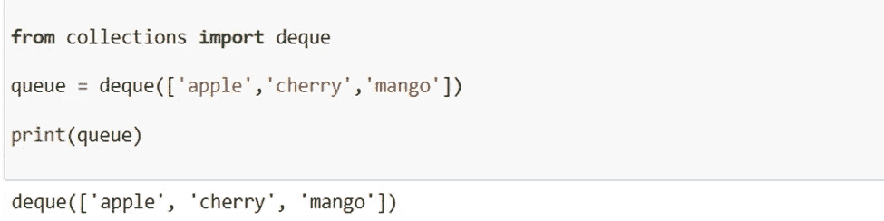
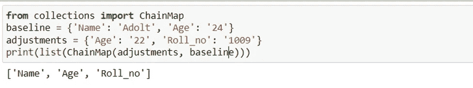
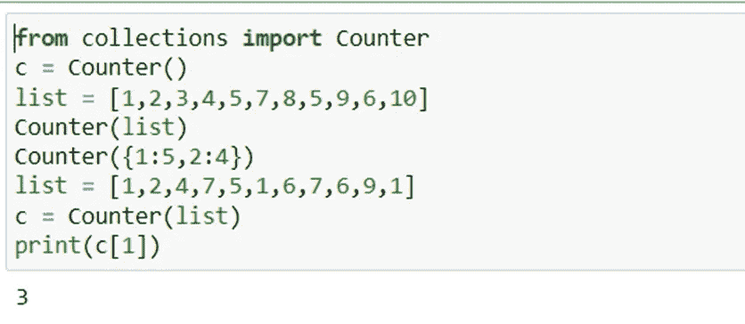

# 7 必须了解 Python 集合的功能，以便进行竞争性编程

> 原文：<https://levelup.gitconnected.com/7-must-know-functions-of-python-collections-for-competitive-programming-a9167c5e7d7e>

## 有助于竞争性编程


普里西拉·杜·普里兹在 [Unsplash](https://unsplash.com?utm_source=medium&utm_medium=referral) 上的照片

Python 的集合模块提供了几个不同的容器供选择。容器是一种对象，可以用来保存各种其他东西，并提供检索它所容纳的项目和迭代这些对象的方法。

列表、集合、元组和字典是 Python 计算机语言中可用的四种集合数据类型。

然而，Python 的集合模块提供了额外的、专门的数据结构，可以用来弥补四种基本数据类型的局限性。这篇博文将对这些特定的数据结构进行深入分析。

Python 集合模块是一个容器，用于保存数据集合，如列表、字典、集合和元组等。这个定义对集合模块的描述如下:它的实现使得内置的集合容器可能由于它的实现而具有改进的功能。Python 的 2.4 版本是最初包含集合模块的版本。

收集模块有多种类型，可分为以下几类:

# 1.命名元组( )

它返回一个带有名称的元组，表明将有一个名称与元组返回的每个值相关联。它通过使用索引值解决了难以访问项目的问题。因为您不再需要记忆索引值来获取某些元素，所以当您使用 namedtuple()函数时，访问这些值要简单得多。

> 例子

```
from collections import namedtuplex = namedtuple(‘subject’ , ‘name , language’)a = x(‘machine learning’ , ‘R’)print(a)
```

> 输出



作者截图

# 2.OrderedDict()

Python 的 OrderedDict()方法可能类似于普通的字典对象。另一方面，它会记住钥匙最初放入插槽时的顺序。

> 例子

```
import collectionsa = collections.OrderedDict()a[‘A’] = 15a[‘C’] = 23a[‘B’] = 45a[‘D’] = 68for i,j in a.items():print (i,j)
```

> 输出



作者截图

# 3.默认字典()

Python 的 Defaultdict 功能与标准字典相同。唯一的区别是，当您试图访问一个不存在的键时，它不会引发异常或严重错误。

当我们试图访问下面代码中的第 4 个索引时，即使它没有被创建，编译器仍然返回值 0，表示它可以被访问。

> 例子

```
from collections import defaultdictnums = defaultdict(int)nums[‘ten’] = 10nums[‘twenty’] = 20nums[‘thirty’] = 30print(nums[‘fourty’])
```

> 输出



作者截图

# 4.双端队列

Deque 代表“双端队列”，是一个优化的列表，允许从容器的两端更快地进行追加和弹出操作。与时间复杂度为 O(n)的 list 相比，它只需要 O(1)时间来执行追加和弹出操作。

> 例子

```
from collections import dequequeue = deque([‘apple’,’cherry’,’mango’])print(queue)
```

> 输出



作者截图

# 5.链式地图

一个链表类是用来从众多的字典中生成一个列表的。因为它是公共的并且存储在列表中，所以可以通过使用 map 属性来检索链接词典。以下面的例子为例。

> 例子

```
from collections import ChainMapbaseline = {‘Name’: ‘Adolt’, ‘Age’: ‘24’}adjustments = {‘Age’: ‘22’, ‘Roll_no’: ‘1009’}print(list(ChainMap(adjustments, baseline)))
```

> 输出



作者截图

# 6.计数器

集合库为用户提供了一个计数器对象。你已经编译了一些任意整数的列表。如果您希望确定每个数字出现的频率，该怎么办？

可以在计数器的帮助下计算频率。它不仅能正确处理整数，还能正确处理字符串和列表等其他可迭代对象。

计数器是 dict 的一个子类，用于计算可散列的事物。它将生成一个字典，条目本身作为键，计数(元素出现的次数)作为值。

> 例子

```
from collections import Counterc = Counter()list = [1,2,3,4,5,7,8,5,9,6,10]Counter(list)Counter({1:5,2:4})list = [1,2,4,7,5,1,6,7,6,9,1]c = Counter(list)print(c[1])
```

> 输出



作者截图

# 7.用户列表

用户列表是一种容器数据类型，其行为类似于列表，并充当列表的包装类。当调用 UserList 时，您向它提供一个常规列表作为它的参数。这个列表保存在 data 属性中，必须使用 UserList.data 方法来检索它。

> 例子

```
from collections import UserListmy_list=[21,32,43,54]user_list=UserList(my_list)print(user_list.data)
```

> 输出


作者截图

# 结论

阅读这篇博客，我们已经了解了 Python 中集合模块包含的特定数据结构。优化可以提高最终产品的性能和质量。我们研究了如何实现这些 Python 集合模块。

> *在你走之前……*

如果你喜欢这篇文章，并希望**继续关注**更多关于 **Python &数据科学**的**精彩文章**——请点击这里[https://pranjalai.medium.com/membership](https://pranjalai.medium.com/membership)考虑成为一名中级会员。

请考虑使用 [**我的推荐链接**](https://pranjalai.medium.com/membership) 报名。通过这种方式，会员费的一部分归我，这激励我写更多关于 Python 和数据科学的令人兴奋的东西。

# 分级编码

感谢您成为我们社区的一员！在你离开之前:

*   👏为故事鼓掌，跟着作者走👉
*   📰查看[升级编码出版物](https://levelup.gitconnected.com/?utm_source=pub&utm_medium=post)中的更多内容
*   🔔关注我们:[Twitter](https://twitter.com/gitconnected)|[LinkedIn](https://www.linkedin.com/company/gitconnected)|[时事通讯](https://newsletter.levelup.dev)

🚀👉 [**将像你这样的开发人员安置在顶级创业公司和科技公司**](https://jobs.levelup.dev/talent/welcome?referral=true)