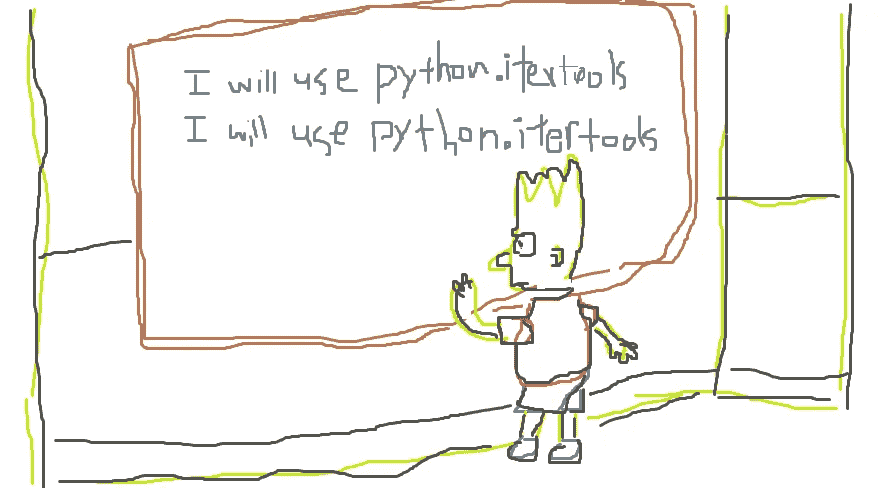

# 7 个必须知道的 Python 内置库

> 原文：<https://levelup.gitconnected.com/7-must-know-python-built-in-libraries-c03b06c7fb8d>



Python 标准库通过提供广泛的功能，让我们程序员的生活变得更加轻松。我们选择了跨越数据结构、文件系统、数据持久性和函数式编程的几个库——我们认为这些库是最重要的——进行检查。无论你是在为面试做准备，还是仅仅想成为一名更熟练的 Python 程序员，这些都是我们最重要的 7 个必须知道的库。

# 1.收集

集合模块定义了一些有用的数据结构，包括数组和字典的扩展。

## 收藏。计数器

收藏。计数器很有用，因为它将不存在的键的默认值设置为零。可以像删除字典中的键一样删除键。

```
>>>from collections import Counter
>>>c = Counter()
>>> c['nonexistent_key']
0
>>> c['a']=3
>>> c['b']=4 
>>> c
Counter({'a': 3, 'b':4})
>>> del c['a']
>>> c 
Counter({'b'}:4)
```

## Collections.deque

双端队列是一种双端队列。deque 上最常见的操作是 append、appendleft、pop 和 popleft。所有这些函数的运行时间都是 O(1)，因为底层数据结构是一个链表。

```
>>>from collections import deque
>>>d.append('c')
>>> d.appendleft('b')
>>> d.appendleft('a')
>>> print(d)
['a', 'b', 'c']
```

## Collections.defaultDict

defaultDict 允许您将字典的值设置为某个预先设置的值。默认的 dict 可以使用一种类型(比如 list)来初始化，在这种情况下，值将被设置为

```
from collections import defaultdict
s = [('a', 1), ('a', 2), ('b', 3)]
>>>d = defaultdict(list)
>>>for k, v in s:
**... **    d[k].append(v)
**...**
>>>sorted(d.items())
>>> [('a':[1, 2]), ('b':[3])]
```

## Collections.orderedDict

在一个常规的 Python Dict 对象中，键是没有顺序的。另一方面，OrderedDict 维护键的顺序。

```
>>> form collections import OrderedDict
>>>d = OrderedDict.fromkeys('xyz')
>>>d.move_to_end('x')
>>>''.join(d)
'yzx'
>>>d.move_to_end('y', last=False)
>>>''.join(d)
'zxy'
```

# 2.Itertools

当处理像排列和笛卡尔积这样的运算时，可以使用 Itertools 来代替定义自己的迭代器。尽管创建自己的迭代器并不难，但使用 Itertools 会使代码更简洁，而且被认为更符合习惯。

## Itertools.accumulate

accumulate 函数接受一个数组的前缀和。

```
>>> from itertools import accumulate
>>> x = [1, 2 ,3]
>>> res = accumulate(x)
>>> for item in result:
...    print(item)
[1, 3, 6]
```

## Itertools.product

product 函数返回一个迭代器，它遍历两个或更多列表的笛卡尔积。

```
>>> from itertools import product
>>> x = [1, 2]
>>> y = ['a', 'b']
>>> res = product(x, y) 
>>> for item in result:
...    print(item)
(1, 'a')
(2, 'a')
(1, 'b')
(2, 'b')
```

## Itertools .置换

给你一个列表的所有排列。

```
>>> from itertools import permutations
>>> x = [1, 2, 3]
>>> res= permutations(x)
>>> for each in res:
...    print(each)
(1, 2, 3)
(1, 3, 2)
(2, 1, 3)
(2, 3, 1)
(3, 1, 2)
(3, 2, 1)
```

## Itertools .重复

Itertools.repeat 返回一个迭代器，该迭代器以设定的次数产生某个值。

```
>>> from itertools import product
>>> for i in itertools.repeat("a", 3):
...    print(i)a
a
a
```

# 3.把…分为两个部分

## 平分 _ 左和平分 _ 右

[平分](https://docs.python.org/3/library/bisect.html#module-bisect)给你超级有用的二分搜索法函数:平分 _ 左和平分 _ 右。例如，sector _ left 返回插入项的最左边的索引(将其他元素推到右边)，以对数组进行排序。在最右边的索引处插入。

二分搜索法是一个常见的面试话题——您可以将这个内置函数用作子例程，这样您就不必从头开始实现自己的二分搜索法了！

```
>>> from bisect import bisect_left
>>> x = [1, 2, 3, 3, 7, 9]
>>> bisect_left(x, 3)
2
```

# 4.Heapq

堆是最常见的数据结构之一。默认情况下，使用 *heapify* 创建的堆是最小堆。堆推送和弹出操作具有对数时间复杂度。Min-heap 也是编码面试中常用的数据结构。

```
>>> from heapq import heappush, heappop, heapify
>>> x = [6, 2, 1, 4, 5]
>>> heapify([x)
>>> x[0]
1
>>> heappop(x) 
1 
>>> x[0]
2
```

# 5.操作系统（Operating System）

os 模块提供与操作系统相关的功能，包括操作文件系统的功能。

## os.listdir

这个函数列出了一个路径中的所有文件和目录(到一个目录)。

```
>>> import os
>>> os.listdir("/my_project")
.git 
.gitignore
src
tests
```

## os.mkdir

此功能允许您创建一个新目录。

```
>>> import os
>>> os.mkdir("/my_new_project")
```

## 操作系统.重命名

此函数将文件或目录从 src 重命名为 dst。

```
>>> import os
>>> os.rename("/note1.txt", "/note2.txt")
```

## os。 **is_dir & os.is_file**

这些函数让你发现一个路径是否对应于一个文件或目录。

```
>>> import os
>>> os.is_file("/note.txt")
true
>>> os.is_directory("/note.txt")
```

# 6.舒蒂尔

shutil 模块提供了对文件和目录的高级操作。

## shutil.copyfile

Copyfile 将文件 src 复制到文件 dst。

```
>>> import shutil
>>> src = "/tmp/note.txt"
>>> dst = "/usr/tom/note.txt"
>>> shutil.copyfile(src, dst)
```

## shutil.copy

Copy 将文件 src 复制到新文件或目录 dst。

# 7.泡菜

数据序列化和反序列化在任何编程语言中都很重要。Pickle 允许您将 Python 数据结构转换成字节流。

```
>>> import pickle
>>> owner_to_pets = { "fred": "bunny", "dawson": "dog" }
>>> pickle.dump(owner_to_pets, open( "save.p", "wb" ) )
```

要加载 pickle 文件，我们使用 load:

```
>>> owner_to_pets = pickle.load(open( "save.p", "rb"))
>>> owner_to_pets
{ "fred": "bunny", "dawson": "dog" }
```

“wb”和“rb”表示写二进制和读二进制。

感谢阅读！

# 分级编码

感谢您成为我们社区的一员！在你离开之前:

*   👏为故事鼓掌，跟着作者走👉
*   📰查看更多内容在[关卡升级编码](https://levelup.gitconnected.com/)
*   🔔关注我们: [Twitter](https://twitter.com/gitconnected) | [LinkedIn](https://www.linkedin.com/company/gitconnected)
*   🚀👉 [**软件工程师的顶级工作**](https://jobs.levelup.dev/)