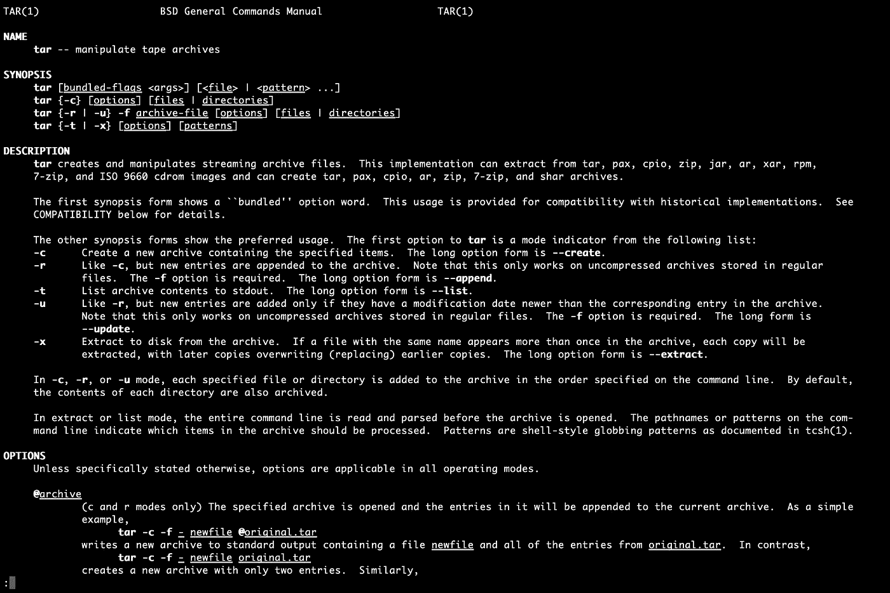

# GitHub 在 NodeJS 中发现了 7 个漏洞——这对你意味着什么？

> 原文：<https://levelup.gitconnected.com/7-nodejs-vulnerabilities-149094e441c2>

## [网页开发](https://rakiabensassi.medium.com/list/software-engineering-7a179a23ebfd)

## 漏洞演练和给用户的建议

来自 [Pixabay](https://pixabay.com/?utm_source=link-attribution&utm_medium=referral&utm_campaign=image&utm_content=2964100) 的[方法商店](https://pixabay.com/users/methodshop-1460919/?utm_source=link-attribution&utm_medium=referral&utm_campaign=image&utm_content=2964100)的图像

一年前，从 2018 年开始已经属于微软的 GitHub 接管了 JavaScript 包管理器`npm`。2021 年 9 月 8 日，该公司已经承认在`[tar](https://www.npmjs.com/package/tar)`和`[@npmcli/arborist](https://www.npmjs.com/package/@npmcli/arborist)` Node.js 包中存在 7 个漏洞。

今天，我们将探讨这些漏洞是什么，它们意味着什么，以及您应该如何避免受到影响和保护您的项目。但是在我们开始之前，让我们解决一下`[tar](https://www.npmjs.com/package/tar)`和`[@npmcli/arborist](https://www.npmjs.com/package/@npmcli/arborist)`包到底是什么。

# 焦油是什么？

`tar`是一个 API，用于在 Unix 系统上模拟`tar(1)`的行为。

“tar 文件”或“tarball”是文件系统条目的存档，如目录、文件和链接。这个名字来源于**磁带档案馆**。如果您在 Unix 命令行上运行`man tar`,您将获得如下所示的更多细节:

tar(1) manual:在 Mac 上运行“man tar”命令的输出(作者截图)

`tar`有 5 个主要顶层命令:

*   `c`创建一个档案。
*   `r`替换一个档案内的条目。
*   `u`更新档案中的条目。
*   `t`列出一个档案的内容。
*   `x`将一个归档文件解压到磁盘。

还有其他标志和选项可以改变这些顶级命令的工作方式。

开发人员每周下载`tar`数千万次，因为它用于提取和安装 npm 包，并作为 npm CLI 之外的数千个其他项目的核心依赖。

# 什么是树木学家？

`@npmcli/arborist`是 npm CLI 的核心依赖项，用于管理`node_modules`树。

@ NPM CLI/树师在左([树师图片来源](https://github.com/npm/arborist)，右图作者)

`node_modules`文件夹实际上是一个依赖图，而不是一个依赖树。因为您在项目中使用的包之间的关系实际上是一个具有循环和重叠连接的*图*。

包管理器考虑依赖约束声明，找到解决约束的图，然后将该图具体化到磁盘上。磁盘上的模块看起来像一个离散的文件树，程序将在运行时加载这些文件，并根据它们创建一个图形。

Arborist 的角色是构建满足依赖图的树。

> “树构建方法建立在 npm v3 引入前期重复数据删除时由丽贝卡·图尔纳开发的“最大化原始重复数据删除”方法的基础上，但增加了两个新功能。
> 
> 简而言之，最大朴素重复数据删除从树中的给定节点(通常是根节点)开始，并创建当前缺失或无效的依赖关系队列。然后，对于每个节点，它从节点的`node_modules`文件夹开始，沿着树向上走到根，找到不会引起任何冲突的最浅的放置位置。新放置的节点被添加到队列中，因此*可以放置它的*依赖项，并且该过程继续。”— [树木学家深潜](https://blog.npmjs.org/post/618653678433435649/npm-v7-series-arborist-deep-dive.html)

npm 依赖关系树示例(作者图片)

# 有哪些漏洞，它们意味着什么？

GitHub 已经确认了与`tar`和`@npmcli/arborist`相关的 7 个常见漏洞和暴露(CVE)，其中 4 个是针对 npm CLI 的:

*   [CVE-2021–32803](https://github.com/npm/node-tar/security/advisories/GHSA-r628-mhmh-qjhw)
*   [CVE-2021–32804](https://github.com/npm/node-tar/security/advisories/GHSA-3jfq-g458-7qm9)
*   CVE-2021–37701
*   [CVE-2021–37712](https://github.com/npm/node-tar/security/advisories/GHSA-qq89-hq3f-393p)
*   [CVE-2021–37713](https://github.com/npm/node-tar/security/advisories/GHSA-5955-9wpr-37jh)
*   [CVE-2021–39134](https://github.com/npm/arborist/security/advisories/GHSA-2h3h-q99f-3fhc)
*   [CVE-2021–39135](https://github.com/npm/arborist/security/advisories/GHSA-gmw6-94gg-2rc2)

npm CLI 应该确保在安装软件包时，软件包的内容只出现在`node_modules`目录层次结构中的相应文件夹中。但是，一些安全漏洞可能会超过这个限制。

如果在某些文件系统条件下使用`tar`提取不受信任的 tar 文件，使用 npm CLI 安装不受信任的 npm 软件包，这可能会导致文件被覆盖和意外/任意代码执行，即使您使用`--ignore-scripts`标志来阻止软件包生命周期脚本的处理。

# 给用户的建议

2021 年 7 月 29 日，GitHub 开始阻止发布带有符号链接、硬链接或绝对路径的 npm 包。

它还推出了漏洞修复程序，并向可能受影响的用户发送了 1670 万条依赖机器人警报和 180 万条通知。

*   GitHub 建议将 npm CLI 升级到版本 6.14.15、7.21.0 或更高版本。
*   如果使用`tar`依赖，需要更新到 4.4.19、5.0.11、6.1.10 或更高版本。
*   因为`tar`的 v3 分支被弃用，你应该用 v6。
*   npm 团队也用一条推文作出了回应，要求 npm 用户将 Node.js 更新到版本 12、14 或 16，或将 npm 更新到版本 6 或 7，并更新你可能对`tar`的任何依赖。

你可以在 GitHub 博客上找到关于所有简历的更多细节。

🧠💡我为一群聪明、好奇的人写关于工程、技术和领导力的文章。 [**加入我的免费电子邮件简讯，独家获取**](https://rakiabensassi.substack.com/) 或在此报名媒体。

*可以在 Udemy 上查看我的* ***视频课程****:*[*如何识别、诊断、修复 Web Apps 中的内存泄漏*](https://www.udemy.com/course/identify-and-fix-javascript-memory-leaks/) *。*

 [## TypeScript 4.4 中的新功能和突破性变化

### 控制流分析、作为索引签名的符号、拼写建议等等

levelup.gitconnected.com](/features-in-the-new-typescript-release-e5ef6ebba750)  [## 作为网络开发人员，你的老板希望你知道的 11 个流行词汇

### 获得关于工具箱中术语的更多见解

better 编程. pub](https://betterprogramming.pub/programming-buzzwords-9e94a3544eed)