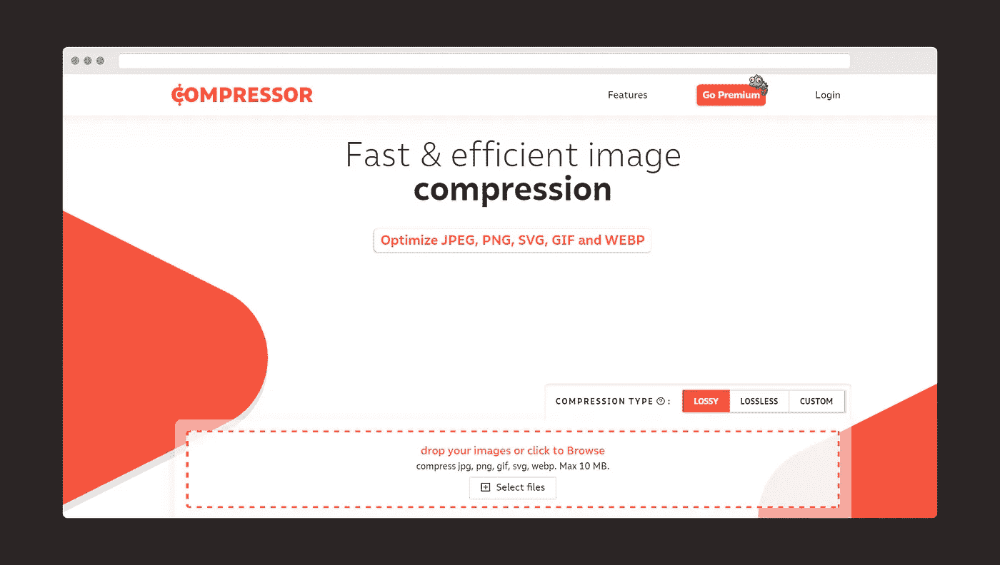
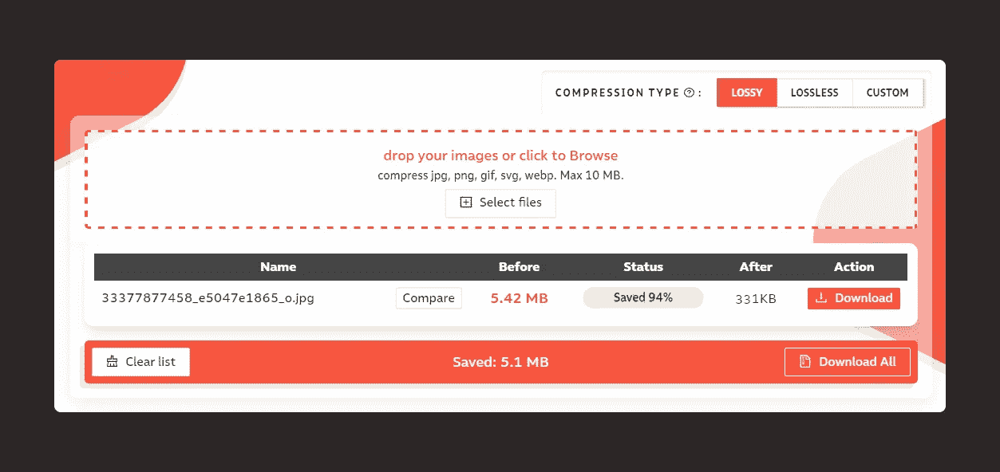
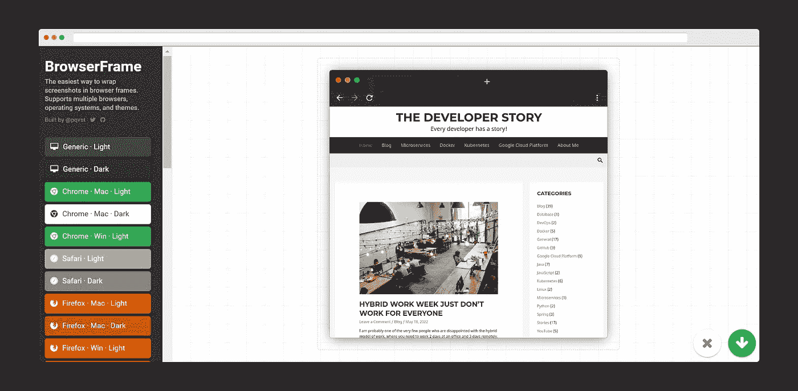
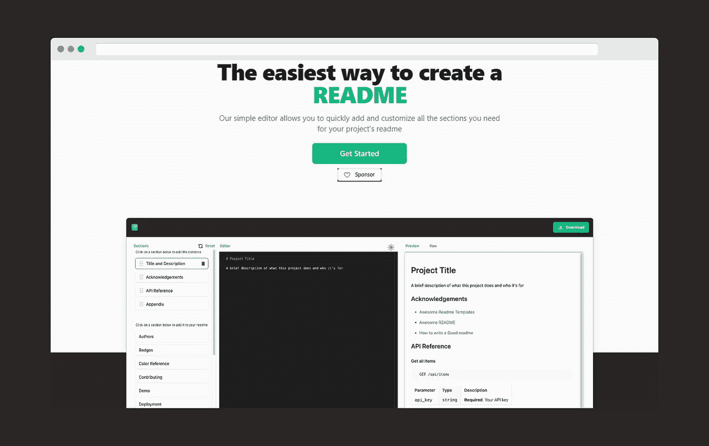
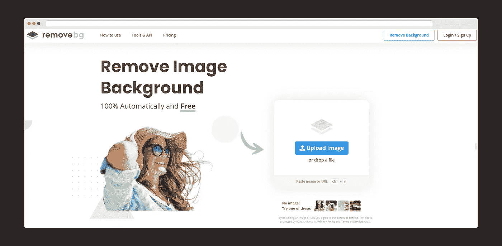
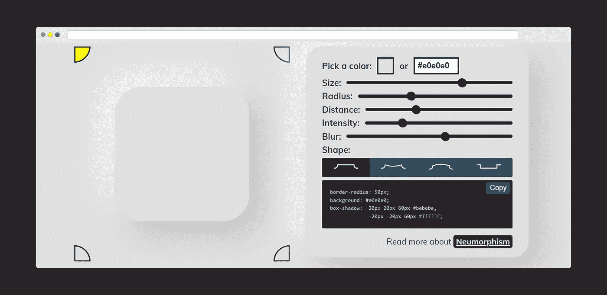
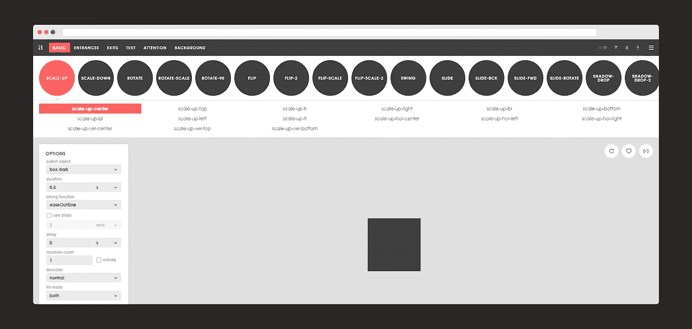
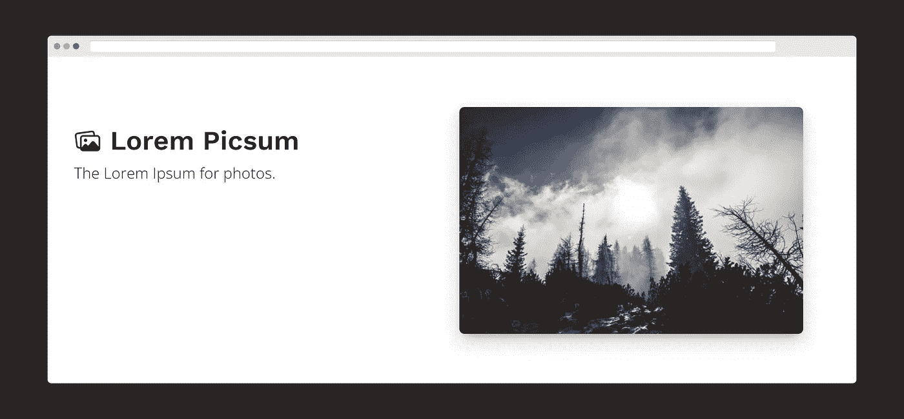

# 7 个非凡的网站，每个开发者都希望他们能早点知道

> 原文：<https://levelup.gitconnected.com/7-phenomenal-websites-that-every-developer-wish-they-knew-earlier-7cc35669859a>

## 一个鲜为人知的网站列表，为您的软件开发之旅提供最大价值。

[爆发](https://burst.shopify.com/young-adult?utm_campaign=photo_credit&utm_content=Free+Stock+Photo+of+Student+Works+On+Laptop+%E2%80%94+HD+Images&utm_medium=referral&utm_source=credit)阿德里安·奥利雄的照片

几个月前，我[发表了一篇文章](/9-incredible-websites-that-every-developer-should-bookmark-1534d52f3f7d)，获得了很多积极的反馈，因为它对一些读者(主要是开发人员)很有帮助。我意识到我所分享的只是当今众多有用网站的一小部分。

因此，在过去的两个月里，我整理了另一份*非凡*网站的清单。这些网站不仅有用，而且在工作方面提供了令人难以置信的价值，同时有些网站使工作更有效率。

# Compressor.io

*网站链接:*[**https://compressor.io/**](https://compressor.io/)

从最近几周我最喜欢的一个网站开始。这个网站是我推荐每个人使用的。为什么？让我解释一下。这个网站是一个智能图像压缩器，它可以在不影响图像尺寸的情况下缩小图像。

我试着上传了一张 *5.42 MB* 的图片，它把图片压缩到了 *331 KB* 而没有改变尺寸或者质量。你必须尝试这个网站来看看它的神奇之处。我用过很多图像压缩器，但这一个最突出。

# 浏览器框架

*网站链接:*[【https://browserframe.com/】T21](https://browserframe.com/)

该网站包装了 Safari、Chrome、Firefox 等不同浏览器中任何网站的截图。并且在不同的主题和操作系统中。你所需要做的就是输入网址，然后在左窗格中选择任何操作系统/浏览器/主题选项，你就可以下载了。

# Readme.so

*网站链接:*[**https://readme.so/**](https://readme.so/)

这是最好的在线自述文件编辑器之一，使您能够方便地创建和自定义项目自述文件。这个网站是由 GitHub 的软件开发人员 Katherine Oelsner 创建的。

# 移除. bg

【https://www.remove.bg/】网站链接:

**网站，顾名思义，去除任何图片的背景。是的，还有其他 web 应用程序也可以做到这一点。例如，Canva 还可以删除任何图像的背景，但您需要支付溢价。这个网站有效地删除任何图像的背景，而不收你一分钱。你也可以给图片添加新的背景。**

# **神经形态**

****

***网站链接:***[**https://neumorphism.io/**](https://neumorphism.io/)****

****Neumorphism 是一个相对较新的设计趋势，也是一个最近很热门的术语。它的美学以最小化和真实的用户界面为标志。然而，创建神经形态的形状是有挑战性的，问问任何一个前端开发者。这个由 Adam Giebl 创造的生成器可以让你无缝地创造出任何你想象的形状。****

# ****泛灵论者****

********

*****网站链接:***[**https://animista.net/**](https://animista.net/)******

****另一个有用的网站，让您创建各种 CSS 动画效果。动画完成后，您可以简单地生成代码并在项目中使用。****

# ****Lorem Picsum****

********

*****网站链接:*[**https://picsum.photos/**](https://picsum.photos/)****

****这个网站是一个图像占位符生成器，有许多修改的可能性。您可以直接在 URL 中提供图像参数。****

****如果你喜欢读这篇文章，你可能也会发现下面的文章值得你花时间去读。****

**** [## 每个开发者都应该收藏的 9 个不可思议的网站

### 这些网站不仅会帮助你的软件开发之旅，还会帮助你的内容…

levelup.gitconnected.com](/9-incredible-websites-that-every-developer-should-bookmark-1534d52f3f7d)  [## 作为 Python 开发者应该关注的 8 个 YouTube 频道

### 如果你想了解 Python 的一切，包括它的框架，强烈推荐这些渠道…

levelup.gitconnected.com](/8-youtube-channels-that-you-should-follow-as-a-python-developer-6c4f725f72ca) 

如果你喜欢阅读有助于你更好地学习、生活和工作的故事，可以考虑 [*成为*](https://viveknaskar.medium.com/subscribe) *的订阅者。成为会员后，你可以无限制地阅读 10000 篇故事、文章和作家。每月只要 5 美元。* [*如果你使用我的链接*](https://viveknaskar.medium.com/membership) *注册，我将获得一点佣金，帮助我写更多的文章。*****