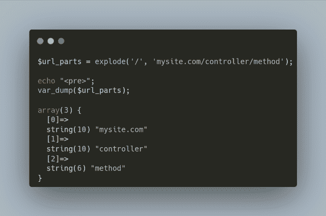
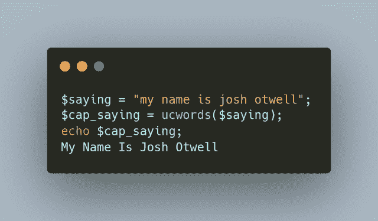
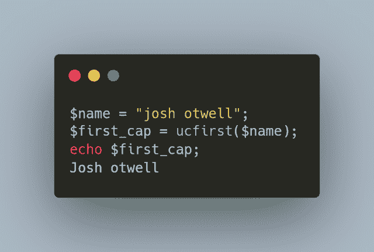
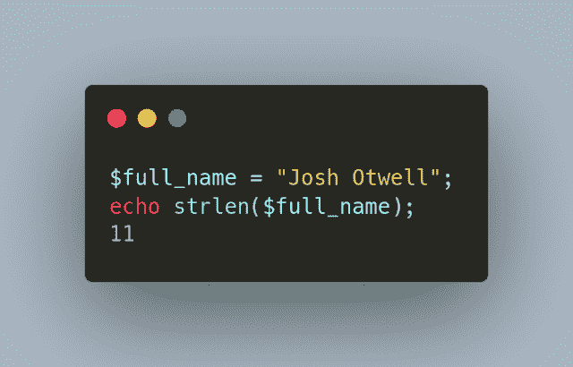
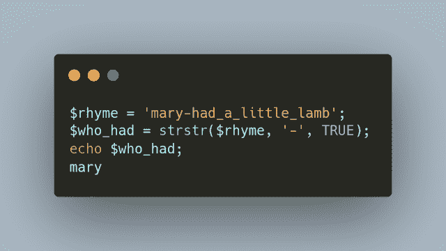
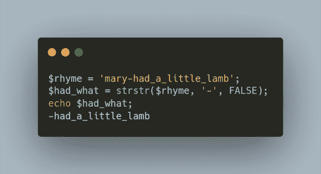
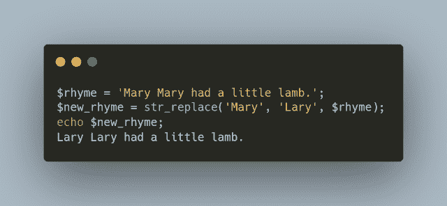
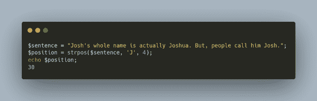
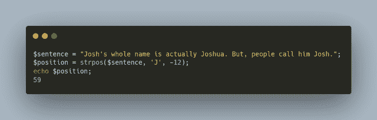

# 你应该知道的 7 个 PHP 字符串函数以及如何使用它们

> 原文：<https://levelup.gitconnected.com/7-php-string-functions-you-should-know-and-how-to-use-them-c2727397158f>

就像我经常说的，在今天的数据环境中，您将定期处理字符串和文本数据。PHP 在语言中内置了许多字符串函数。这里有 7 个你可能不知道但应该知道的


当你[订阅 ***OpenLampTech*** 时事通讯](http://openlamptech.substack.com)时，就能收到一本我的电子书*《给每个人的 10 个 MySQL 小贴士】。*

我将介绍每个字符串函数的简单示例，尽管这些函数的实际使用可能更加复杂。

## 1.爆炸()

`explode()`函数从`$target_string`参数中返回一个字符串数组，该数组在所提供的`$separator`参数上被拆分。

语法很简单:

```
explode(string $separator, string $target_string);
```

一个很好的例子是使用`explode()`将一个 URL 的所有部分分离出来:



## 2.ucwords()

`ucwords()`函数返回所有单词首字母大写的字符串:

```
ucwords(string $target_string, string $separators = " \t\r\n\f\v");
```



## 3.ucfirst()

如果字符串的第一个字符是按字母顺序排列的，那么`ucfirst()`函数会将该字符大写:

```
ucfirst(string $target_string);
```



## 4.斯特伦()

`strlen()`函数是 7 个函数中最简单的一个。它只是返回字符串参数的长度(也计算空格)。

```
strlen(string $target_string);
```



通过在 ***OpenLampTech*** 时事通讯中投放价格合理的分类广告，让您的品牌、产品或服务获得其所需的关注度[。谢谢大家的支持！](https://ko-fi.com/s/7dfe9ce108)

## 5.strstr()

`strstr()`函数返回第一次出现的字符串，根据第三个参数(如果在函数调用中提供)可以有两种不同的用法。语法如下:

```
strstr(string $haystack, string $needle, bool $before_needle = false);
```

## strstr()选项 1: before_needle = true

如果`$before_needle`参数是`TRUE`，则`strstr()`返回在 之前出现的字符串 ***搜索`$needle`参数，但不包括$needle:***



## strstr()选项 2: before_needle = false

但是，如果`$before_needle`参数为`FALSE`，则`strstr()`返回搜索`$needle`参数 之后的字符串出现 ***，包括`$needle`本身:***



**注意** : `strstr()` *区分大小写*。

## 6.str_replace()

`str_replace()`函数用另一个字符串替换所有出现的特定字符串。语法看起来有点复杂，但是，老实说，还不算太糟:

```
str_replace(array|string $search, array|string $replace, string|array $subject, int &$count = null);
```



## 7.strpos()

`strpos()`函数返回特定子字符串在目标搜索字符串中第一次出现的数字位置。

```
strpos(string $target_string, string $search_string, int $offset = 0);
```

根据第三个`$offset`参数(如果有),`strpos()`函数有 3 种不同的用法。

## strpos()选项 1:偏移量= 0

如果`$offset`参数在`strpos()`函数调用中不存在，则其值为 0，搜索从`$search_string`开始:


## strpos()选项 2:偏移量为正

如果`$offset`参数在`strpos()`函数调用中是一个正数值，则从`$search_string`的开头开始搜索，偏移相应数量的字符:



## strpos()选项 3:偏移量为负

如果在`strpos()`函数调用中`$offset`参数是一个负数值，则从`$search_string`的末尾开始搜索，偏移相应数量的字符:



你可以支持我的博客，并向我的小费罐捐款。非常感谢！

我希望你对这 7 个 PHP 字符串函数中的任何一个都有所了解。在评论区告诉我一个你最喜欢或最常用的 PHP 字符串函数。感谢阅读！

喜欢你读过的？看到什么不正确的吗？请在下面评论，感谢阅读！！！

# 行动的号召！

感谢你花时间阅读这篇文章。我真心希望你发现了一些有趣和有启发性的东西。请在这里与你认识的其他人分享你的发现，他们也会从中获得同样的价值。

访问[投资组合-项目页面](https://wp.me/P28ctb-3KD)查看我为客户完成的博客帖子/技术写作。

咖啡是我最喜欢的饮料！

要在最新的博客文章发表时收到来自本博客(“数字猫头鹰散文”)的电子邮件通知(绝不是垃圾邮件)，请点击“点击订阅！”按钮在首页的侧边栏！(如有任何问题，请随时查看 [Digital Owl 的散文隐私政策页面](https://wp.me/P28ctb-3gI):电子邮件更新、选择加入、选择退出、联系表格等)

请务必访问[“最佳”](https://joshuaotwell.com/where-blog_post-in-digital-owls-prose-best-of/)页面，收集我的最佳博文。

[作为一名 SQL 开发人员和博客写手，Josh Otwell](https://joshuaotwell.com/about/) 热衷于学习和成长。其他最喜欢的活动是让他埋头于一本好书、一篇文章或 Linux 命令行。其中，他喜欢桌面 RPG 游戏，阅读奇幻小说，并与妻子和两个女儿共度时光。

免责声明:本文中的例子是关于如何实现类似结果的假设。它们不是最好的解决方案。所提供的大多数(如果不是全部)示例都是在个人发展/学习工作站环境中执行的，不应被视为生产质量或就绪。您的特定目标和需求可能会有所不同。使用那些最有利于你的需求和目标的实践。观点是我自己的。

***有什么可以帮你的*** ？

*   免费 [MySQL 查询语法口头禅 PDF](https://ko-fi.com/s/3631fc7d00) 备忘单。记住这个咒语的查询语法顺序。
*   你想开一个博客吗？我用 WordPress 写博客。让我们都在提供的计划上省钱。
*   通过在 ***OpenLampTech*** 时事通讯中投放可负担得起的分类广告，让您的品牌、产品或服务获得其所需的关注度。
*   需要托管你的下一个网络应用程序或 WordPress 网站吗？我使用并强烈推荐 [Hostinger](https://www.hostg.xyz/aff_c?offer_id=6&aff_id=94641) 。他们有很好的价格和服务。
*   作为一名自学成才的开发人员，我逐渐认识到的 5 个事实
*   今天就在我的 [Kofi 商店](https://ko-fi.com/joshlovescoffee#)发现优质的 MySQL 学习资料吧！

***披露*** :本帖部分服务和产品链接为附属链接。在没有额外费用给你，你应该通过点击其中一个购买，我会收到佣金。

收到一本我的电子书，*“给每个人的 10 个 MySQL 技巧”*，**，*绝对免费*** 当[你订阅](http://openlamptech.substack.com)到 ***OpenLampTech*** 时事通讯。

通过在 ***OpenLampTech*** 时事通讯中投放可负担得起的分类广告，让您的品牌、产品或服务获得所需的关注。谢谢大家的支持！

*原载于 2022 年 7 月 20 日 https://joshuaotwell.com*[](https://joshuaotwell.com/7-php-string-functions-you-should-know-and-how-to-use-them/)**。**

# *分级编码*

*感谢您成为我们社区的一员！在你离开之前:*

*   *👏为故事鼓掌，跟着作者走👉*
*   *📰查看[升级编码](https://levelup.gitconnected.com/)中的更多内容*
*   *🔔关注我们:[Twitter](https://twitter.com/gitconnected)|[LinkedIn](https://www.linkedin.com/company/gitconnected)|[时事通讯](https://newsletter.levelup.dev)*
*   *🚀👉 [**软件工程师的顶级工作**](https://jobs.levelup.dev/)*