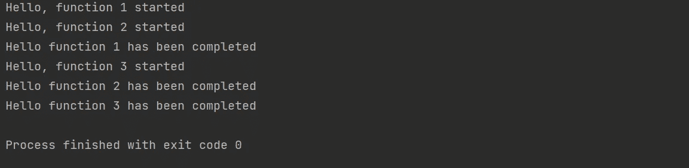
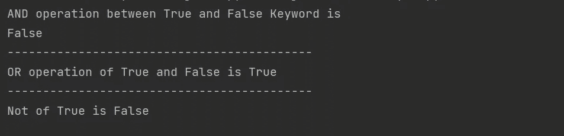
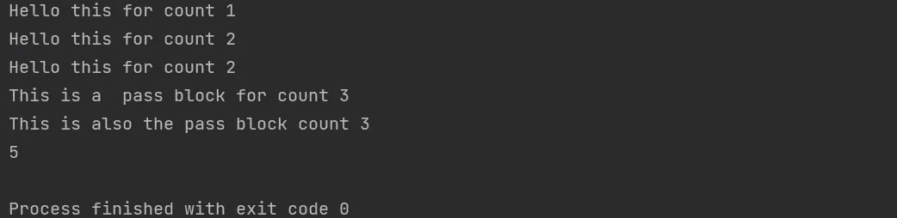
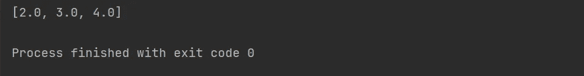
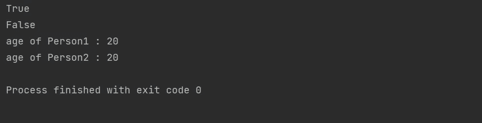
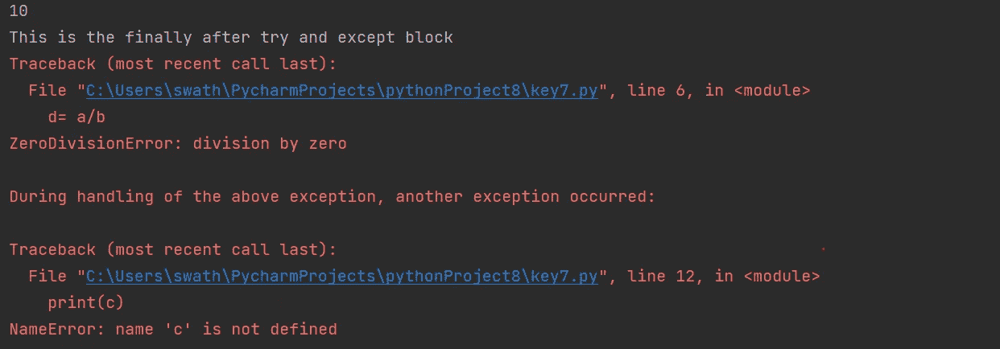
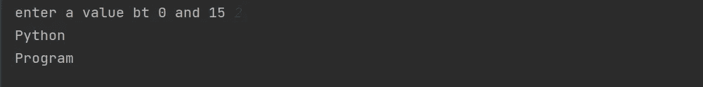

# 理解 Python 中所有 35 个关键字的 7 个程序

> 原文：<https://levelup.gitconnected.com/7-programs-to-understand-all-35-keyword-in-python-fc0278dd37b7>

## 所有的关键词都用代码详细解释

詹姆斯·哈里森在 [Unsplash](https://unsplash.com?utm_source=medium&utm_medium=referral) 上的照片

关键词是每个人都必须知道的 Python 编程基础。这些是 Python 中的保留字。有些关键词很有趣，但很少使用。这就是为什么有必要考虑有多少关键字和它们的功能。每个关键字都是唯一的，有不同的功能。在本文中，我将尝试详细解释所有 35 个 Python 关键字。

# 1.异步和等待:

默认情况下，所有程序同步运行。使用这些关键字，您可以让程序异步运行。当您并行处理输入和输出操作时，这有助于提高程序的性能。

> 一个**程序，通过使用 asyncio 函数创建 3 个任务并等待来理解 asyncio。**

**输出:**

**注:**

*   await 和 async 也被称为 promise 关键字。当关键字 async 用在一个函数之前时，它会让函数暂停你的代码，直到承诺实现。
*   `asyncio.run()` 和`asyncio.create_task()`是代码中用来运行程序和创建任务的函数。
*   还要注意，由于等待时间的原因，功能 1 甚至在功能 3 开始之前就完成了。

# 2.真、假、与、或、非:

True 和 False 是布尔(bool)类类型的值。创建 And、Not 和 Or 是为了表示 Python 中的逻辑操作。我尝试在这个程序中使用逻辑运算符 and、or 和 not。

> **通过逻辑运算符(与、或、非)使用真或假的程序**

**输出:**

**注:**

*   `and`-第一个操作是 and 操作，只有当两者都为真时，结果才会为真。这就是为什么输出是假的
*   `or`-在 or 运算中，如果其中一个为真，则输出为真
*   `not`——最后一种是非运算，真的逆是假的

# 3.中断，继续，通过，同时，为了，在:

迭代是在给定条件为真的情况下重复代码的过程。关键字 break、continue 和 pass 是唯一的。如果你看到它们在一个程序中工作，就很容易理解这些关键字的工作原理。

> 一个**程序，用于理解 pass 继续和中断**的工作

**输出:**

**注:**

*   `for,in`-使用范围功能重复执行特定次数的代码。
*   `while` — while 循环执行，直到条件为真。在此示例中，代码在小于 3 的计数时执行。
*   `pass`-这是一个空操作符，当代码执行 pass 语句时，它会执行 pass 块中的所有代码。在示例中，检查计数 3 将进入通过块。
*   `continue`-当代码到达 continue 时，它拒绝所有剩余的语句，并将控制移回循环。在示例中，请注意 print 语句没有被执行
*   `break` —该语句停止整个循环的执行。在本例中，尽管范围是从 1 到 10，但执行在 5 处停止，这就是输出计数为 5 的原因。

# def，from，import，as，yield:

在这里，我们将尝试定义一个函数，并使用 yield 代替 return。并从 math 包中导入平方根函数。

> **一个演示 yield 关键字使用的程序**

**输出:**

**注:**

*   `from,import,as`-在代码中，使用 as 从别名中的数学包导入平方根函数。
*   `def`-该关键字用于定义一个函数。在程序中，创建了一个称为平方根的函数。
*   `yield`-当有 yield 语句而不是 return 时，yield 充当生成器。生成的输出是列表中所有元素的平方根。

# 5.class，none，是:

类是一个关键字，它主要用于面向对象编程语言。is 关键字用于检查两个变量是否相等，以及两个变量是否是相同的对象。如果它们是相同的对象，那么它将返回 true 作为输出。

> **检查两个变量和两个不同对象是否相同的程序**

**输出:**

**注:**

*   `is`-注意用 is 关键字检查两个变量。输出为真，因为两个变量引用同一个对象。
*   下一个输出是 false，因为我们已经使用 class 创建了两个不同的对象，它们不能相等。

# 6。尝试，除了，最后，提高，德尔:

异常处理机制使用一些特殊的关键字，如 try、except、finally。del 关键字删除 python 程序中的对象。用 del 删除后，输出会有一条错误消息。

> 一个**程序产生一个零除法错误并删除一个对象**

**输出:**

**注:**

*   `try`-当代码中存在潜在异常时，该关键字用于一个块。
*   使用 except 块，你可以处理 try 块中出现的任何错误。
*   `finally`-该块将在 try 和 except 块之后执行。
*   `del`-del 关键字用于删除 python 程序中的任何对象。

# 7.with，return，非局部，if，else，elif，global，assert:

在这个程序中，我们试图检查条件。对于不同条件，发生不同的操作。assert 关键字有助于程序的 are for 条件，否则它将终止程序。

> **使用 if 循环检查不同条件并执行不同操作的程序**

**输出:**

**注:**

*   `if,elif,else`-这些关键字是最常用的。If 和 elif 检查一个条件，如果为真，则执行一个块。此后，如果条件不为真，则执行 else 块。
*   `assert`-assert 关键字接受布尔表达式。如果为假，那么程序将被终止。
*   `nonlocal` —使用嵌套函数时，使用非局部关键字来声明变量。
*   `global` —该关键字用于在程序的顶层声明变量。这个变量可以从程序的其他范围访问。
*   `with` —该关键字主要用于管理程序的外部资源。