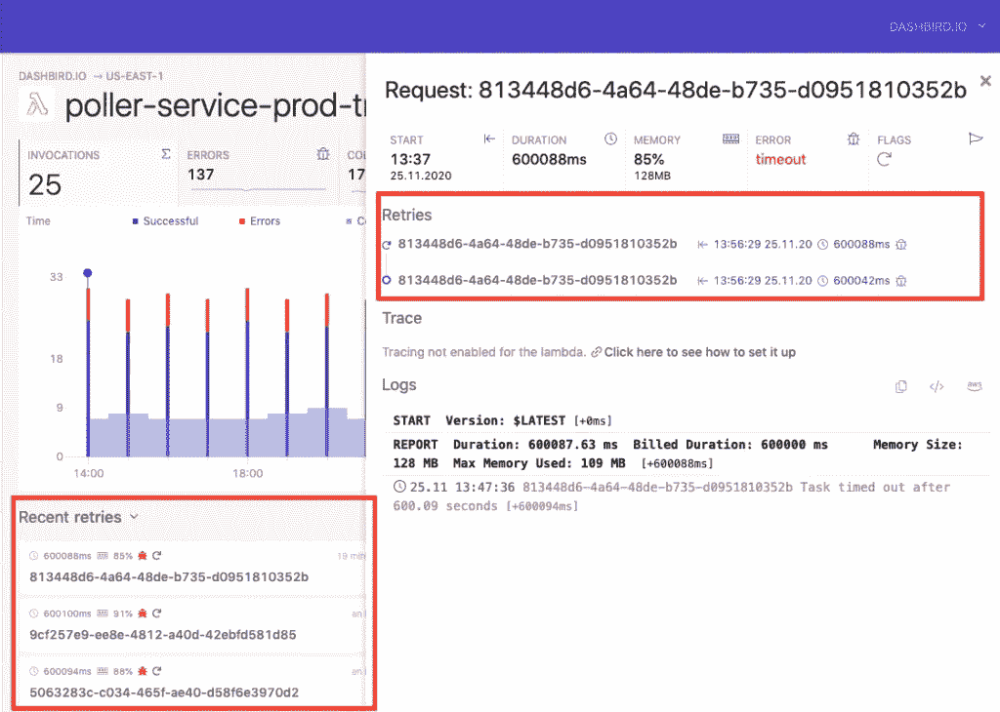

# 无服务器鼓励有用工程实践的 7 个原因

> 原文：<https://levelup.gitconnected.com/7-reasons-why-serverless-encourages-useful-engineering-practices-2e974c2e9b4e>

## **无服务器提供的优势远不止易于管理**

照片由 [Pixabay](https://www.pexels.com/@pixabay?utm_content=attributionCopyText&utm_medium=referral&utm_source=pexels) 从 [Pexels](https://www.pexels.com/photo/selective-focus-photography-of-turned-on-black-metal-framed-light-sconce-414144/?utm_content=attributionCopyText&utm_medium=referral&utm_source=pexels) | [品牌内容披露](https://www.annageller.com/disclosure)

很难确定什么是“好”或“坏”的工程实践。我们经常听说最佳实践，但是一切都可以归结为一个特定的用例。所以，我在题目中特意选择了“有用”这个词，而不是“好”。

现代 DevOps 文化引入了几个不管在什么情况下都*有用的*范例:以**声明性**和**可重复**的方式构建基础设施，利用**自动化**来促进无缝 IT 运营，以及以**敏捷**的方式开发以随着时间的推移不断改进我们的最终结果。我认为无服务器可以被认为是许多有用实践的促成者。

# 1.它鼓励组件做一件事

我不想争论微服务是否比单片应用更好。这完全取决于您的用例。但是我们可以肯定地同意，以这样一种方式构建单独的软件组件是有益的，即它们只负责一件事情。这些优势的例子:

1.  它们更容易更换。读完《实用程序员》这本书后，我意识到让你的软件易于更改是作为一名 IT 专业人士的生存原则。例如，当您利用带有纯 ( *理想幂等*)函数的函数编程时，您总是知道输入和输出是什么。因此，修改代码很简单。如果写得好，无服务器函数鼓励代码易于修改和无状态。
2.  它们**更容易部署**——如果您对单个服务所做的更改不影响其他组件，重新部署单个功能或容器应该不会破坏您架构的其他部分。这就是为什么许多人决定将他们的 Git 仓库从“ [monorepo](https://en.wikipedia.org/wiki/Monorepo) ”拆分为每个服务一个仓库的原因之一。

使用无服务器，你不得不把你的组件做得更小。例如，您不能用 AWS Lambda 运行任何长时间运行的流程(*，至少目前是*)。在撰写本文时，最大超时配置不允许任何进程花费超过 [15 分钟](https://docs.aws.amazon.com/whitepapers/latest/serverless-architectures-lambda/timeout.html)。您可以切换到包含 ECS 等服务的无服务器容器，但关键是，您需要将较大的功能分解成较小的组件。

**您的无服务器组件应该有多小？**没有单一的答案。这是只有通过经验才能学到的东西。在本文中，您可以找到在决定无服务器微服务的范围时需要考虑的事项。

当我们谈论无服务器时，我们并不局限于 AWS Lambda 或 ECS 等执行环境。当您使用**其他无服务器组件**时，您会注意到它们被设计为非常好地完成一件事情(再次使用*，给出 AWS 示例，但同样适用于其他云供应商*):

*   **SQS** —简单高效的消息队列服务，
*   **SNS**——顾名思义，一个简单却功能强大的通知服务，
*   SES——除了发送电子邮件，
*   **S3**——我想不出任何更简单的存储数据的服务——GCP 的云存储和 Azure 的 Blob 存储也是如此。

我们可以谈论更多的服务来展示在一个没有服务器的世界里做好一件事的范例，但是你已经明白了。

# 2.它强制实施自包含的执行环境

无服务器不仅迫使你把组件做得更小，而且**还要求**你**定义执行你的功能或容器所需的所有资源**。这意味着您不能依赖任何预先配置的状态——您需要指定**所有的包依赖关系、环境变量**以及运行您的应用程序所需的任何配置。无论您使用 FaaS 还是无服务器容器，您的环境都必须保持自包含，因为您的代码可以在任何时候在完全不同的服务器上运行。

> **TL；DR:** 你被迫构建可复制的代码。

# 3.它鼓励更频繁的部署

如果您的组件很小，是独立的，并且可以彼此独立执行，那么没有什么可以阻止您进行更频繁的部署。跨单个组件整合功能的需求仍然存在(*尤其是在底层数据方面！*)，但是单个部署本身变得更加独立。

# 4.它鼓励最低特权安全原则

理论上，您的无服务器组件可能仍然使用一个有权限访问和做任何事情的管理员用户。然而，AWS Lambda 等无服务器计算平台鼓励您将函数**权限仅授予函数执行严格需要的服务**，有效地利用了最小特权原则。最重要的是，通过使用 IAM 角色，您可以**避免硬编码凭证**或者依赖于在外部服务或环境变量中存储秘密。

对于小型无服务器组件，我们鼓励您在**每服务**甚至**每功能**级别上授予权限。

# 5.它允许您轻松实现高可用性和容错

大多数无服务器组件的设计都提供了**高可用性(HA)** 。例如，默认情况下，[AWSλ](https://docs.aws.amazon.com/lambda/latest/dg/security-resilience.html)被部署到多个可用性区域，并且在任何异步调用失败的情况下[重试](https://docs.aws.amazon.com/lambda/latest/dg/invocation-retries.html)两次。用非无服务器资源实现同样的目标是可行的，但绝非易事。

类似地，您的容器化 ECS 任务、DynamoDB 表和 S3 对象可以部署到多个可用性区域(*或子网*)以获得弹性。

# 6.它将基础设施作为代码来实施

把你的服务器当成牛而不是宠物 有很大的好处。大多数利用“基础设施即代码”范例的 DevOps 工程师都会同意这一点。

您可能在 IT 职业生涯的某个时候经历过这种情况:您小心翼翼地在您的计算实例上安装所有东西，并以这样的方式构建所有资源，使得这台服务器(*您的“宠物】*)配置完美。然后，有一天你来到办公室，你注意到你的**服务器宕机了**。你没有备份，也没有存储你用来配置整个系统的代码。原来你有一些环境变量负责定义用户对各种资源的访问。现在这一切都过去了，你需要完全从头开始。

我们不必只看这种极端的故障场景就能看出把服务器当成宠物的危险性。想象一下，您仅仅需要一个相同服务器和资源配置的副本来创建一个开发环境。也许您想要为同一服务器创建一个**新实例，以便扩展**或提供**高可用性**。

> 使用手动配置，您总是面临环境最终会不同的风险。

无服务器方法迫使您从一个完全不同的角度来定义应用程序所需的资源。你需要构建一个独立的*代码包*，它可以以一种**与环境无关的**方式在任何服务器上运行。如果这个服务器死了，你不会失去任何东西，因为**简单地重新运行**无服务器应用程序提供它运行所需的所有新资源(*即牛*)。

难度更大吗？当然是啦！但是一旦你建立了这个可重复的过程，你会获得很多好处，正如本文中所讨论的。

# 7.它鼓励使用现有的经过战斗考验的组件

如果您决定构建一个无服务器的体系结构，那么您不太可能最终构建自己的消息队列系统或通知服务。您更愿意依赖您的云提供商提供的常见的、众所周知的服务。基于 AWS 的一些示例:

*   需要**消息队列**吗？用 SQS。
*   需要发送**通知**吗？使用社交网络。
*   需要处理**机密**吗？使用机密管理器。
*   需要搭建一个 **REST API** 吗？使用 API 网关。
*   需要管理**权限**还是**用户权限**？使用 IAM 或 Cognito。
*   是否需要存储一些**键值对**或者**数据对象**？使用 DynamoDB 或简单地将数据转储到 S3。

为什么这是有益的？现实情况是，许多软件工程项目对开发人员来说通常不是特别具有挑战性，尤其是对于那些在过去已经反复解决过类似问题的非常有经验的程序员来说。鉴于软件工程师是非常聪明和有才华的人，当他们感到无聊时，他们经常开始构建自己的解决方案，有时过于复杂和难以维护。为他们提供一个平台，提供完全由云提供商管理的标准化的、众所周知的、记录良好的构建模块(*如 SQS、SNS、IAM、S3……*)，可以极大地提高整个架构的可维护性。上面提到的服务允许我们以一种弹性的和分离的方式构建各种类型的项目。

# 使用无服务器更难完成的事情

正如任何由许多小的独立组件组成的东西一样，通常很难**看到更大的画面**。可能更难看到系统中各个元素之间的关系。这就是**可观察性**平台如 [Dashbird](https://dashbird.io/) 大放异彩的地方。您可以构建一个包含属于特定应用程序的所有服务的仪表板，并查看(*和其他*)哪些组件是成功的，以及它们运行了多长时间。

您还可以进一步了解系统的整体健康状况。例如，在下图中，您可以看到第 5 点的确认— AWS Lambda 为您提供开箱即用的高可用性和弹性。在仪表板中，您可以立即看到您的功能重试的时间和原因(这里的*:由于超时错误*)。

Dashbird 可观测性平台通过提供关于重试的见解展示了 AWS Lambda 的弹性——来源:[由 Dashbird](https://dashbird.io/blog/aws-well-architected-framework-reliability/) 提供

# 结论

在本文中，我们研究了无服务器平台鼓励有用的工程实践的七个原因。其中，我们可以看到它鼓励**小型自包含组件**可以彼此独立部署。我们注意到它还有助于整体基础设施的**安全性**和**高可用性**。最后，我们看了不同的**无服务器构建模块**，它们允许我们构建弹性且经济高效的架构，以及 Dashbird 等可观察性平台如何帮助我们获得更多关于它的见解。

**感谢您的阅读！**

**资源:**

[1]微服务应该有多大？—[dash bird 的博客](https://dashbird.io/blog/microservices-serverless-pros-cons/)

[2] [关于采用 Lambda 的无服务器架构的 AWS 白皮书](https://docs.aws.amazon.com/whitepapers/latest/serverless-architectures-lambda/timeout.html)