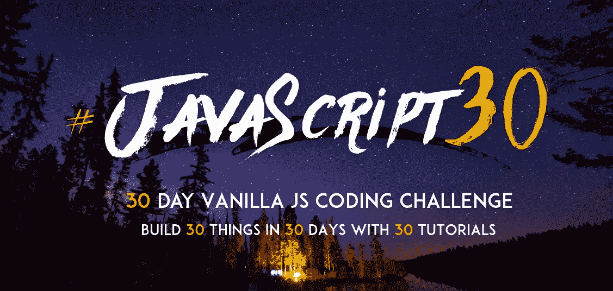

# 7 个 Repos 帮助你掌握 JavaScript

> 原文：<https://levelup.gitconnected.com/7-repos-to-help-you-master-javascript-c7d61792f59c>

帮助成为更好的 JavaScript 开发人员的资源列表。

JavaScript 徽标

近年来，JavaScript 已经成为最流行的编程语言之一。在我写这篇文章的时候，现在有超过 18 亿个网站在线，其中 95%使用 JavaScript。

我们应该感谢我们可以获得如此多的免费资源，我们所需要做的就是去寻找它。

下面是在我的 JavaScript 之旅中帮助过我的 7 个 GitHub 库的列表，我希望它们也能帮助你。

它们都很有用，尤其是对初学者，而且排序不分先后。

# 1.JavaScript 算法和数据结构

通过 GitHub 的 javascript 算法

**星星:116k**

【https://github.com/trekhleb/javascript-algorithms】来源:

许多自学的前端开发人员错过了学习算法和数据结构的机会，因为这些是你通常在大学里会学到的东西。

许多开发人员没有任何 C 或 Java 经验，而是从 JS 开始。所以他们做得很好，把所有重要的东西都放在一个 repo 中，而且全部用 JavaScript 编写。

如上图所述，每个算法和数据结构都有一个自述文件，包括解释和进一步阅读的链接。他们也帮了我们一个忙，将它们标记为初学者或高级资源。

**一些数据结构包括:**

*   链表
*   长队
*   堆
*   图表
*   双向链表

**一些算法:**

*   数学算法
*   用线串
*   搜索
*   整理
*   动态规划
*   机器学习

# 2.干净代码 JavaScript

**星星:55.2k**

**来源:**[https://github.com/ryanmcdermott/clean-code-javascript](https://github.com/ryanmcdermott/clean-code-javascript)

正如知识库所说，这是用 JavaScript 制作可靠的、可重用的和可重构的软件的指南。开发人员应该尽早尝试并实现干净的代码实践。即使你是一个单独的程序员，你也可以通过编写干净的代码来节省大量的时间和精力。

repo 使用 JavaScript 介绍了干净代码的概念，并提供了好的和不好的代码示例。

**一些概念包括:**

*   变量
*   功能
*   固体
*   测试
*   错误处理
*   评论

# 3.Node.js 最佳实践

通过 GitHub 的 Node.js 最佳实践

**星星:69.7k**

**来源:**[https://github.com/goldbergyoni/nodebestpractices](https://github.com/goldbergyoni/nodebestpractices)

这个存储库是 Node.js 最佳实践中排名靠前的内容的总结和管理。它也是最大的汇编，并且每周都在增长。

该库目前包含 80 多个最佳实践、风格指南和架构技巧。他们也对贡献开放，所以可以自由地提出代码修复、翻译或新想法的请求。下面是他们的[写作指导方针](https://github.com/goldbergyoni/nodebestpractices/blob/master/.operations/writing-guidelines.md)。

**一些话题包括:**

*   项目结构
*   错误处理
*   代码风格
*   投入生产
*   安全性
*   码头工人

每个主题还包括副主题。总的来说，他们有非常深入的解释和伟大的代码片段。

# 4.你还不知道 JS

你不知道 JS 叶书的封面——凯尔·辛普森【https://leanpub.com/ydkjsy-get-started 

**星星:143k**

**来源:**[https://github.com/getify/You-Dont-Know-JS](https://github.com/getify/You-Dont-Know-JS)

这是一系列深入 JavaScript 编程语言核心机制的书籍，可以在 GitHub 上阅读。作者提供了完全免费的在线阅读。

不过，你可以在这里购买实体书[。(我没有隶属关系，也没有从这次购买中赚到什么)。你甚至可以通过 GitHub 库上声明的其他方法来支持他。](https://leanpub.com/ydkjsy-get-started)

**您将了解的一些内容:**

*   JavaScript 如何发展以及 JS 程序实际上是如何工作的
*   打破关于 JS 的常见神话
*   JS 的根和支柱，例如类型、闭包和原型

此外，对于那些真正想知道 JS 的每一个肮脏的小秘密的人来说，这是一本很好的读物。

# 5.33-js-概念

33-js-通过 GitHub 的概念

**星星:42.1k**

**来源:**[https://github.com/leonardomso/33-js-concepts](https://github.com/leonardomso/33-js-concepts)

顾名思义，这是每个 JavaScript 开发人员都应该知道的 33 个概念。repo 几乎涵盖了构建 JavaScript 坚实基础所需的一切。

还为非英语人士提供了翻译。

我发现自己不时会回到这个回购，它真的包含了很多很棒的资源(视频、文章、教程……)。

一些概念包括:

*   原始类型
*   表达式 vs 语句
*   DOM 和布局树
*   映射、减少、过滤
*   高阶函数
*   递归
*   承诺
*   异步/等待
*   数据结构
*   算法
*   设计模式
*   干净的代码

# 6.30 秒的代码

30 秒代码通过 GitHub30 秒代码通过 GitHub

**星星:81.5k**

【https://github.com/leonardomso/33-js-concepts】来源:

这个 repo 包含简短的 JavaScript 代码片段，如 utils 或与时间相关的函数。您可以只声明您可能需要的两三个函数，而不是引入整个依赖/包来处理与时间相关的数据。

他们甚至有一个网站，你可以搜索和预览片段，他们甚至让你复制片段到你的剪贴板。

# 7.JavaScript 30

通过 GitHub 的 JavaScript 30 横幅

**星星:16.3k**

**来源:**[https://github.com/wesbos/JavaScript30](https://github.com/wesbos/JavaScript30)

**网址:**[https://javascript30.com/](https://javascript30.com/)

这本书的目标读者是希望熟悉 JS 基础知识的新手和中级开发人员或设计人员。在进入这个领域之前，如果你手头有一些 JS 经验，那是最好的。

它由全栈开发人员 Wes Bos 创建，目前仍在维护。

顾名思义，您可以构建 30 个 JS 项目，启动文件、视频教程和代码解决方案都可供您使用。

 [## 7 个回购帮助你掌握前端开发

### 帮助您踏上 web 开发之旅的资源列表。

javascript.plainenglish.io](https://javascript.plainenglish.io/7-repos-to-help-you-master-front-end-development-9b1b9cd065e3)  [## 什么才算是干净的代码

### 让开发人员定义干净的代码，他们都会告诉你一些不同的东西。

javascript.plainenglish.io](https://javascript.plainenglish.io/what-actually-counts-as-clean-code-cc5db5f74301)  [## 反应仍然是王道

### React 会长久保持王者地位吗？

javascript.plainenglish.io](https://javascript.plainenglish.io/react-is-still-the-king-7e70f9db8288)