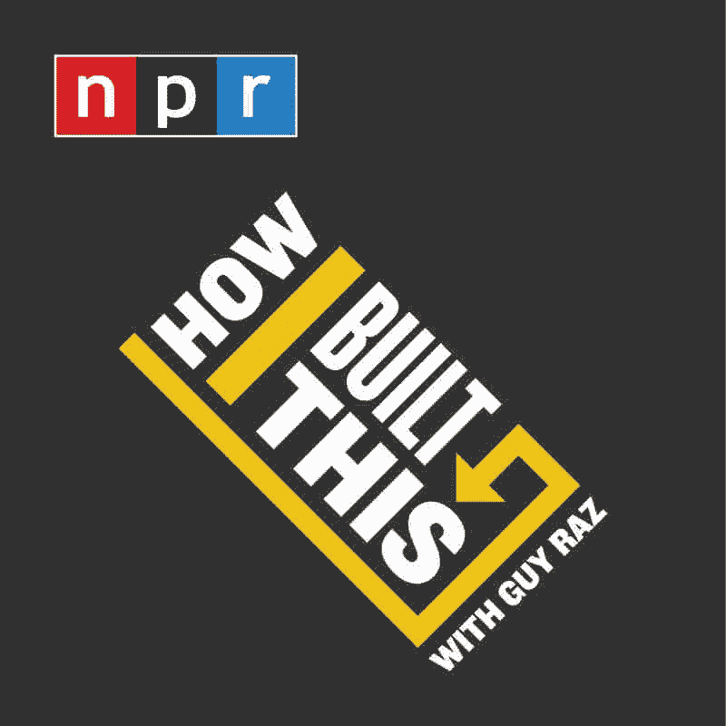
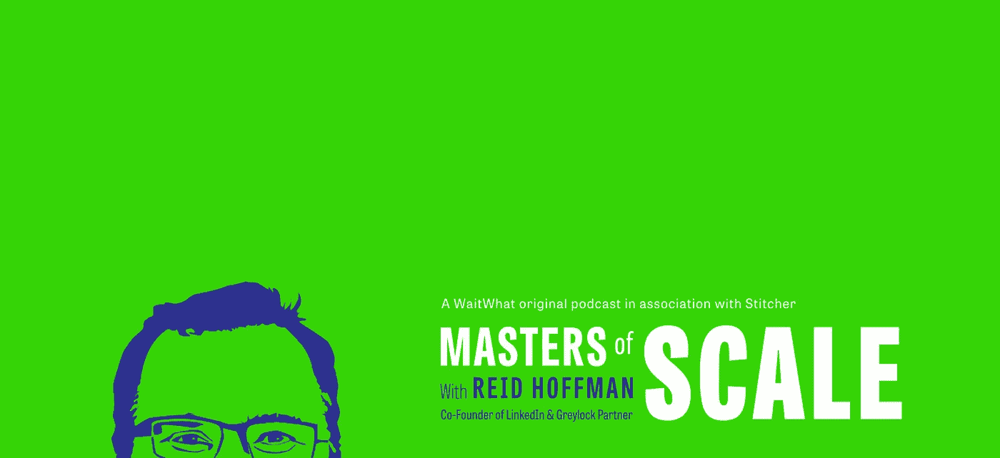
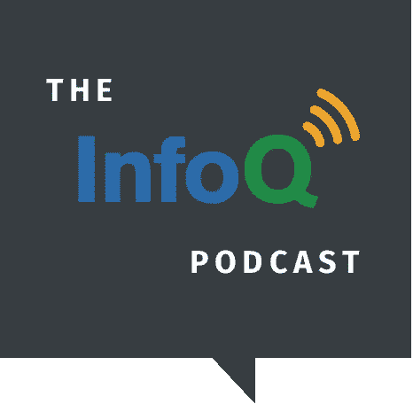

# 2021 年你必须听的 7 个软件工程播客

> 原文：<https://levelup.gitconnected.com/7-software-engineering-podcasts-you-must-listen-to-in-2021-7424a76af922>

## 播客是新的广播

汤米·洛佩兹从[派克斯](https://www.pexels.com/photo/greyscale-photography-of-condenser-microphone-765139/?utm_content=attributionCopyText&utm_medium=referral&utm_source=pexels)拍摄的照片

软件开发涉及许多快节奏的活动。对于软件开发人员来说，跟上影响环境的重要变化是很重要的。我们的领域变化如此之快，很容易在几个月内就对你的知识基础和技能感到厌倦。总是有新的东西需要学习——新概念、方法论、编程语言、框架、设计方法等等。

我个人并不热衷于追逐软件开发领域发生的所有变化。相反，我更关注影响我当前技能组合的变化，技术堆栈；我对新概念感兴趣，这些新概念有可能增强我的投资组合，也有可能改进我当前的开发工作流程——提高效率和生产率。我对倾听技术领域其他开发者和企业家的故事特别感兴趣。这些第一手讲述的故事总是增强我的信心，并在遇到困难时激励我。

在 2021 年，如果我说跟上我们空间中发生的所有这些变化并不困难，那将是不诚实的。有这么多的信息，痛苦变成了如何明智地从大量的在线内容中筛选出相关的内容，使你成为一名优秀的相关开发人员。

对我来说，我跟上软件开发领域变化的最好方法之一就是听播客。

这些入围的播客是我发现自己在过去几年中听得最多的。它们并不是我订阅的所有播客的详尽列表。我相信，如果你也听听他们的意见，这将会改变你作为一名软件开发人员的身份。

# 我是如何建造这个的

图片来自 [NPR](https://www.npr.org)

这是 NPR 拥有的播客。主持人是盖伊·拉兹。盖伊·拉兹(Guy Raz)在 NPR 担任记者、主持人和编辑总监已有 20 多年的经验，他采访了公司创始人、发明家和企业家，探讨他们如何打造自己的品牌和产品。Guy Raz 让他的客人讲述他们的故事，讲述他们如何经历高潮和低谷，克服障碍和挑战，创造他们创造的成功品牌。这些叙事是原始的，怀旧的，视觉上和精神上的刺激。

这是一个面向企业家和有抱负的企业家的播客。当你听播客时，它会鼓励你坚持那个疯狂的想法；它会激励你走出去追逐梦想。这是一个播客，它让你深入了解这些创始人和企业家做出的往往是动荡、风险和恐惧的决定和行动，从而拥有他们今天所拥有的成功公司。

这个播客的一个有趣的部分是盖伊经常问他的客人的问题，我总是热切地期待着每一集。问题:“你的成功有多少是运气的贡献”。这是一个非常有趣的问题。我一直期待着这些创始人、企业家和成功人士对这个问题的回答。

**播客链接** : [NPR 一个](https://rpb3r.app.goo.gl/3zxy)，[谷歌播客](https://www.google.com/podcasts?feed=aHR0cHM6Ly93d3cubnByLm9yZy9yc3MvcG9kY2FzdC5waHA_aWQ9NTEwMzEz)，[苹果播客](https://podcasts.apple.com/podcast/id1150510297?mt=2&at=11l79Y&ct=nprdirectory)， [Spotify](https://open.spotify.com/show/6E709HRH7XaiZrMfgtNCun)

# 音阶大师

图片来自[音阶大师](https://mastersofscale.com/)

这是一个由王牌企业家和 LinkedIn 的联合创始人雷德·霍夫曼主持的播客。Reid 每集都提供商业见解和知识，以及如何创业、经营和发展企业的实例。他采访了公司创始人、高管和其他人，探讨如何将企业从零增长到亿万。

Reid 在科技行业拥有数十年的经验，同时也是一名风险投资家，在每集的结尾都会给你留下很多值得思考的东西。他试图证明商业理论，包括来自他节目中嘉宾的经历和故事的实际例子。

我最喜欢的剧集越来越多，但我不能不佩服布莱恩·切斯基的魅力和故事。我一直很喜欢他出演的每一集，并从中受益匪浅。就在今年的[最近一集](https://podcasts.google.com/feed/aHR0cHM6Ly9yc3MuYXJ0MTkuY29tL21hc3RlcnMtb2Ytc2NhbGU/episode/Z2lkOi8vYXJ0MTktZXBpc29kZS1sb2NhdG9yL1YwL1Jkem8zMk95TVFSTUtFTGZ6S3JCVVZ1bnhKc2FmQTl4dWtaaHdFd3ZEVmc?sa=X&ved=0CAUQkfYCahcKEwjwy7Dnu8fvAhUAAAAAHQAAAAAQAg)中，Reid 让 Brian 讲述了 COVID 疫情对 Airbnb 的影响，他们如何不得不[解雇 25%的员工](https://news.airbnb.com/a-message-from-co-founder-and-ceo-brian-chesky/)，这其中的思维过程，考虑到疫情对旅游和酒店业的巨大影响，对他们收入的影响。

**播客链接** : [苹果播客](https://podcasts.apple.com/us/podcast/masters-of-scale-with-reid-hoffman/id1227971746)，[谷歌播客](https://podcasts.google.com/feed/aHR0cHM6Ly9yc3MuYXJ0MTkuY29tL21hc3RlcnMtb2Ytc2NhbGU?sa=X&ved=0CAMQ4aUDahcKEwjwy7Dnu8fvAhUAAAAAHQAAAAAQAQ&hl=en-GH)， [Spotify](https://open.spotify.com/show/1bJRgaFZHuzifad4IAApFR)

# 命令行英雄

来自[命令行英雄播客](https://www.redhat.com/en/command-line-heroes)

这是由 [Saron Yitbarek](https://saron.io/) 主持的红帽原创播客，他是 [CodeNewbie](https://www.codenewbie.org/) 的开发者和创始人。《命令行英雄》讲述了开发者、程序员、黑客、极客和开源反叛者如何革新技术领域的史诗般的真实故事。该播客目前正在播放第七季。

如果你对科技和网络历史上一些有趣事件背后的故事感兴趣，可以收听这个播客。想想这些过去的插曲:[连接网络公司](https://www.redhat.com/en/command-line-heroes/season-7/dot-com)，[操作系统战争](https://www.redhat.com/en/command-line-heroes/season-1/os-wars-part-1)，[创造 Javascript](https://www.redhat.com/en/command-line-heroes/season-3/creating-javascript) 。

**部分链接** : [苹果播客](https://geo.itunes.apple.com/podcast/us/id1319947289?mt=2&at=1010lbVy&ct=redhatclh_website)，[谷歌播客](https://www.google.com/podcasts?feed=aHR0cHM6Ly9mZWVkcy5wYWNpZmljLWNvbnRlbnQuY29tL2NvbW1hbmRsaW5laGVyb2Vz)， [Spotify](https://open.spotify.com/show/4Jgtgr4mHXNDyLldHkfEMz) ， [Stitcher](https://www.stitcher.com/s?fid=159833&refid=stpr)

# 堆栈溢出

来自[堆栈溢出播客](https://stackoverflow.blog/podcast/)

这是一个非常有趣和健谈的播客，来自流行的开发者问答平台[堆栈溢出](https://stackoverflow.com/)。每集都有 Stack Overflow 的内容总监[本·波普](https://www.linkedin.com/in/benjamin-popper-6b904a4/)、Stack Overflow 的产品总监[萨拉·奇普斯](https://www.linkedin.com/in/sarajchipps/)和保罗·福特讨论与软件开发相关的趣事。他们就真正有趣的话题进行对话，例如开发人员的生活方式、开发人员的工作流程、工作道德、软件工具、DevOps、软件开发领域的变化等等，所有这些都是值得一听的。

**播客链接** : [谷歌播客](https://podcasts.google.com/feed/aHR0cHM6Ly9mZWVkcy5zaW1wbGVjYXN0LmNvbS9YQV84NTFrMw==)，[苹果播客](https://podcasts.apple.com/us/podcast/the-stack-overflow-podcast/id1033688462)， [Spotify](https://open.spotify.com/show/0e5eoM6w7eW9Wu7wMA04Tr?si=6k4M_iTyT2yA2IV-mPloXA)

# InfoQ 播客

来自[的信息播客](https://www.infoq.com/podcasts/)

这个播客内容真的很丰富。它主要面向寻求中高级知识和经验的人。InfoQ 播客涵盖了这些类别下的主题:开发、建筑和设计、文化和方法、人工智能、ML、数据工程、DevOps 等等。

我不能对这个播客说太多，但我可以向你保证，每一集都会给你比你预想的更深刻的见解。它将为软件开发中解决问题的新概念和新思想打开一扇门。您将听到专家们分享他们在应用新老概念和原则的小型到大型数十亿美元公司工作的经验。

**播客链接** : [谷歌播客](https://podcasts.google.com/feed/aHR0cHM6Ly9mZWVkcy5zb3VuZGNsb3VkLmNvbS91c2Vycy9zb3VuZGNsb3VkOnVzZXJzOjIxNTc0MDQ1MC9zb3VuZHMucnNz)，[苹果播客](https://podcasts.apple.com/us/podcast/the-infoq-podcast/id1106971805)， [Spotify](https://open.spotify.com/show/4NhWaYYpPWgWRDAOqeRQbj)

# 软件工程无线电

本播客主要面向专业软件开发人员。每个月都会发布三到四集，内容是与软件工程领域的专家就一系列对专业开发人员至关重要的话题进行的对话。

你只能期待这个播客的高质量内容。它由 [IEEE Software](https://www.computer.org/csdl/magazine/so) 的志愿者和工作人员管理，IEEE Software 是由 [IEEE 计算机学会出版的面向软件专业人员的领先技术杂志。](https://www.computer.org/)

**播客链接** : [谷歌播客](https://podcasts.google.com/feed/aHR0cHM6Ly93d3cuc2VpLmNtdS5lZHUvcG9kY2FzdHMvZmlsZXNfcG9kY2FzdHMvaXR1bmVzRmVlZC54bWw=?nord=0)，[苹果播客](https://podcasts.apple.com/us/podcast/software-engineering-radio-podcast-for-professional/id120906714)， [Spotify](https://open.spotify.com/show/6UO3XQclSuNnGxB39QdAnL)

# 全栈无线电

这个播客由亚当·瓦森主持。他在使用 [Tailwind CSS](https://tailwindcss.com/) 的开发人员中已经很出名，这是一个实用至上的 CSS 框架，用于开发现代网站。他之所以出名，是因为他是这个流行框架的共同创造者。

全栈电台专注于如何构建伟大的软件产品。在每一集里，Adam 都和他的嘉宾讨论开发优秀软件产品的软硬技能需求。播客分享软件开发工具、编程语言、框架、开发者生活等内容。

我喜欢这个播客有两个原因，一，亚当以他的知识和经验富有魅力和口才；第二，这个播客非常有教育意义和相关性。

**播客链接** : [苹果播客](https://podcasts.apple.com/gh/podcast/full-stack-radio/id931714873)， [Spotify](https://open.spotify.com/show/0Ddvex5OtYOvhyyK6ckG3A) ，[阴天](https://overcast.fm/itunes931714873)

# 最后的话

我希望你和我一样觉得这些播客很有帮助。我怎么推荐都不为过。

我很想知道你最喜欢的软件开发播客是什么。

## 你可能也会喜欢这些

 [## 我所知道的每一个优秀的软件开发人员都会认真做的 6 件事

### 我认识的每个优秀的软件开发人员都会做这些事情

levelup.gitconnected.com](/the-6-things-every-good-software-developer-i-know-religiously-does-fd6dd9c2c8f7)  [## 作为初级开发人员，选择第一个框架的 4 个重要标准

### 这肯定会节省你的时间和挫折

levelup.gitconnected.com](/the-4-important-criteria-for-picking-your-first-framework-as-a-beginner-developer-ba4eb954e0cf)  [## 关于 Python f-strings 你需要知道什么

### 这个新的 Python 格式字符串优雅而快速

medium.com](https://medium.com/geekculture/what-you-need-to-know-about-python-f-strings-a410059fbc99)