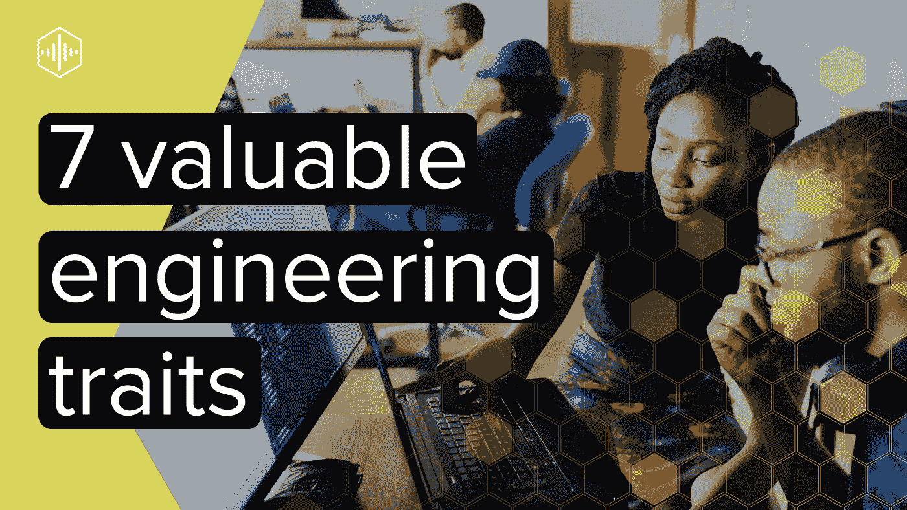

# 7 个比编码更有价值的软件工程特征

> 原文：<https://levelup.gitconnected.com/7-software-engineering-traits-more-valuable-than-coding-3ee8015f6f4>

## 全面发展的工程师的基本标志

在一个有能力的软件工程师越来越少的时代，这个行业正在通过任何必要的手段越来越努力地培养更多的软件工程师。学校正在扩充他们的计算机科学系，企业家们正在建立在线课程来培训新一代的工程师，编码训练营也在出售以满足需求。

虽然这些努力确实产生了可靠的软件工程师，但他们对工程编码方面的单一关注也带来了麻烦。在一个很容易躲在显示器后面，将人类互动限制到几乎没有的行业，100%专注于代码、代码和更多代码只会加强那块隐喻肌肉。

这个缺点类似于仅仅根据厨师会不会做饭来雇佣他。如果这个人不能及时烹饪，而这对于一个挤满饥饿的人的餐馆来说是可以接受的，那该怎么办呢？这个人有多干净？你能相信他们能防止交叉感染吗？他们会费心准时上班吗？正如你所看到的，在成为一名称职的厨师之前，有许多活动部分需要考虑。软件工程也是如此。

 [## 初级工程师:渴望退休

### 诚实而现实地看待你的角色

levelup.gitconnected.com](/juniors-engineers-aspire-to-retire-497e5f0e0fa) 

根据我的经验，对于有相关大学或行业经验的人来说，编码几乎是一门必修课。虽然这在招聘过程中值得考虑，但还有其他更重要的方面需要考虑。如果一个候选人想被录用并获得成功，这些方面是他或她必须具备的。

# 1.沟通

也许这第一点并不令人惊讶。大多数，如果不是全部的话，工作申请都会提到某种形式的交流。它的存在与否通常很容易被察觉。一个人不需要成为莎士比亚式的演说家来通过这个测试，而是分享他或她的想法，这样对方才能清楚地理解。

由于几乎每个团队都部分或完全处于偏远地区，因此工程师的口头和书面沟通至关重要。在某些时候，你需要通过麦克风解释一些事情，你可能会使用 Slack 来填补其他空白。你的团队必须能够通过这两种媒介理解你。

# 2.愿意学习

我更喜欢雇佣那些不太精通编程、不太好教的人，而不是一个无所不知的天才。你永远不会像你的团队知道的那么多，没有你，你的团队也永远不会像你一样博学。信息是双向的，拥有这种特质会让交流更加愉快。你永远不会走得太远以至于教不了，你的雇主也不会提拔你成为一个已经过了学习阶段的人。

 [## 无效技术领先的优点

### 当改变角色意味着改变心态时

better 编程. pub](https://betterprogramming.pub/the-virtues-of-an-unproductive-tech-lead-b17b31ee9065) 

# 3.非技术思维

每份工作都有不被提及的应用时刻。虽然你的雇主可能不会让你拖地，但你很可能会遇到其他类似的要求，这些要求需要非技术性技能。指导业务层面决策的会议，围绕应用程序设计的讨论，以及参与可用性研究只是我需要做的事情的几个例子。它们都不涉及像工程师一样思考，它们都要求我换一顶帽子来满足必要的需求。

# 4.无障碍设计

和上一点一样，为弱视或重听用户思考是所有软件工程师的另一项基本技能。随着世界人口不断老龄化，他们会带着自己熟悉的设备出行。这个事实意味着年长的眼睛和耳朵将会消费你的内容。

在这个例子中，不存在非我团队的问题。这种情况是每个人的问题。是的，设计师应该在他们的作品中意识到这一点。然而，正确地实现这些设计，测试它们，并在期望落空时返回设计，这是工程的责任。你的应用是全公司的财产，所以工程和设计都应该保持合理的标准。

# 5.挑战现状

软件工程正以光速前进。保持不动，继续做你一直在做的事情，类似于倒着跑一场比赛。你可能会到达终点线，但你做错了。

更具体地说，如果你在做一个月、六个月或一年前正确的事情，回去确保你的方法仍然是最新的。在许多情况下，尤其是在网络和移动行业，随着时间的推移，有一种更好的方式来做一些事情。作为一名工程师，发掘这些缺点，研究更好的方法，颠覆现状，让你的团队和产品达到更现代的标准，这是你的责任。

 [## 让自己在工作中变得无价的四步计划

### 多年的经验，浓缩成几个步骤

better 编程. pub](https://betterprogramming.pub/the-4-step-plan-to-make-yourself-invaluable-at-work-5f19a8b1f9b4) 

是的，这包括研究、阅读和紧跟行业趋势。不读书的工程师就像从来不磨砺技术的医生。我想要一个相关的医生，而不是一个从医学院毕业就没进过的医生。

# 6.灵活性

“全体船员上甲板”这个短语起源于 18 世纪我们航海的祖先。然而，它的含义已经扩展到更广泛的受众，不仅仅是我们热爱水的朋友。虽然你的工作申请假设你主要是写代码，但被要求帮助 QA、做演示或学习新东西都是非常合理的要求。

有时候，这些问题会打断你的日常工作，成为你新的首要任务，这是无可避免的。这个过程是你的公司和产品在曲折迂回的成功之路上航行的一部分。你的公司雇佣你通过任何可能的手段给他们带来成功，即使这意味着用工程师做代码以外的事情。

# 7.耐心

生活中很少有事情是又快又容易的，除非我们中的一个成为下一个霍尔马克频道浪漫电影的明星，那包括你和我。软件工程师创造了以前没有人创造过的东西。在应用程序开发的 R&D 阶段，没有所谓的大规模生产软件。这些事情需要时间，而学习做某事的最佳方法并不总是容易的。

 [## 技术主管可以提供的 3 个最有价值的属性

### 他们需要 0 知识和 0 工作

levelup.gitconnected.com](/3-most-valuable-attributes-tech-leads-can-provide-dd06ee1a8ba4) 

给自己一个许可，让自己放慢速度，专注于正确完成工作。如果平衡得当，最终会有丰厚的回报。你可能不觉得它迷人，但请记住，即使是 2013 年风靡一时的手机游戏《Flappy Bird》也有正常的开发周期，几乎花了整整一年才获得成功。有足够耐心支持的好主意一定会成功。

# 结论

作为一名工程师同事，让我感到沮丧的是，如此多的大型科技公司将近 100%的精力投入到招聘工程师上，仅仅基于他们是否是专业的程序员。正如你所看到的，制作一个工程师的完整图片需要更多的东西，你不能仅仅根据一次观察就假定上述的部分都存在。

每当我花时间雇用一名新的开发人员时，我不只是在寻找一名编码员。即使有软件的基本知识，这种特性也是可以训练的。这七个其他特征不是。

无论你是面试官还是被面试者，我都敦促你在把自己打造成为一名有市场的工程师或寻找一个有能力的人在你的公司与你并肩作战时，考虑这些品质。根据我的经验，这是一个健康的开发人员的七个基本标志，它们表明当一个人足够全面，能够为您的项目成功做出超过他们公平份额的贡献时。这表明这个人已经花时间对自己进行了正确的投资，并且值得你对他们进行投资。

# 喜欢你读的东西吗？

媒体上还有成千上万篇类似的文章。我是这个网站的付费会员，我完全认为这项投资是值得的。[点击这里加入](https://go.oliverspryn.com/medium-membership)，你将以你的一部分会员身份支持我的工作。

本文最初发表于[https://oliverspryn.com/](https://go.oliverspryn.com/7-software-engineering-traits-more-valuable-than-coding)。[加入我的邮件列表。](https://go.oliverspryn.com/medium-subscribe)