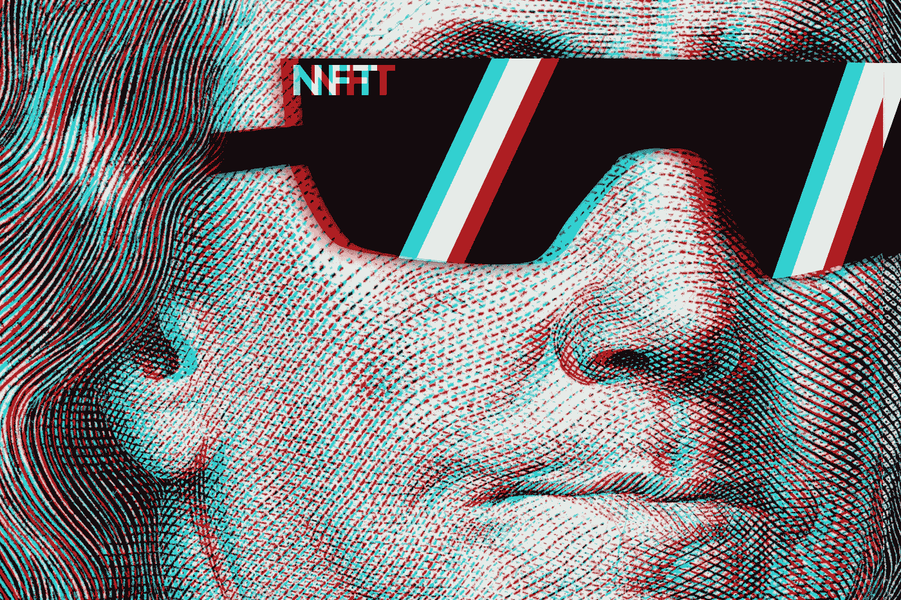

# 成功的 NFT 企业的 7 个步骤——NFT 销售框架

> 原文：<https://levelup.gitconnected.com/7-steps-for-a-successful-nft-business-the-nft-sell-out-framework-9434007cac62>

你想在 NFT 创业还是想把 NFTs 带到你现在的公司？

让我用我所谓的“成功的 NFT 企业框架”来帮助你

在这篇文章中，将维萨 NFT 的论文“NFTs 吸引当今的密码和商业爱好者”消化、浓缩并翻译成 7 个步骤，这样你就不必去读那无聊的 17 页了。他们写了一篇非常清晰(但冗长/乏味)的论文来描述什么是 NFT。如果你想回到什么是 NFT 的基础，查看[这篇文章](https://medium.com/geekculture/confused-about-nfts-you-are-not-alone-heres-all-you-need-to-know-170ece901fcc)。

与加密货币一样，NFT 是在区块链上发行的，用于指定某项资产的所有权。此外，它们与所有者密码关联。因此，NFT 的所有权可以用公钥和私钥来证明，就像任何其他加密货币一样。

与加密货币不同，NFT 是不可替代的，这意味着它们可以互换或分割。换句话说，一个比特币和另一个比特币是一样的。还有，一个比特币可以分成 2x 0.5 个比特币，不会贬值。NFT 有独特的属性，不能被分割。例如，你不能把蒙娜丽莎和我的画调换。此外，你不能把蒙娜丽莎剪成两半，还指望保持同样的价值。🤣

根据 Visa 的说法(我也同意)，NFT 可以吸引收藏家、粉丝和团队，是利用独特资产、吸引粉丝和创造额外收入的好方法。以下是这些要点的分类:

*   粉丝参与度:NFT 可以通过给予品牌和粉丝独家商品、独家优惠或投票权，更好地连接品牌和粉丝。
*   新的收入来源:嗯，看看 NBA 的最佳投篮！NFT 使数字稀缺成为可能，品牌可以销售独特或限量版的数字产品。此外，NFT 智能合约允许编程 NFT 支付未来的版税给 NFT 创作者每次 NFT 被出售。
*   客户关系:NFT 的特性之一是它们是可追踪的，并且可以看到它们属于哪个钱包地址。这可以为更好的客户细分和更有针对性的客户参与打开大门。现在可以使用钱包拥有的 NFT 类型、数量、持续时间和其他指标。

现在让我们来看看**的 7 个步骤**，根据 VISA 的说法，这些步骤将有助于**将 NFTs 整合到您的业务中**:

1.  确定 NFT 用例
2.  确定合适的区块链技术
3.  铸造 NFT
4.  决定如何/在哪里以可持续的方式存储数字资产
5.  安全轻松地存储和访问 NFTs
6.  在适用的市场上分销
7.  发现其他合作机会

## **确定 NFT 用例**

你打算如何使用 NFT？根据不同的用例，有不同的技术、平台和机制来设计 NFT。您的使用案例不需要完全遵循以下内容，但这些是目前最重要的 3 个:

**3 个最突出的使用案例是:**

*   收藏品——NFT 使数字稀缺成为可能，这极大地限制了数字物品的供应。一些最著名的例子是 Cryptokitties(一些价值接近 100 万美元)，Cryptopunks(一些价值几百万美元)。最近，NBA 顶级投篮篮球卡是最成功的 NFT 平台之一。我相信你可以想象为什么:你可以有一个 5 秒钟勒布朗詹姆斯视频的数字卡…不，等等，我更喜欢詹姆斯·哈登扣篮，你拥有这个东西多亏了 NFT 技术！
*   艺术——我一直在谈论数字艺术行业(有时也包括物理艺术)的 NFT 应用。NFT 允许数字艺术家出售独特的艺术品，他们可以从任何二次销售中获得分成，这真的很酷。音乐艺术家也正强势进入 NFT 市场。2021 年，一些 NFT 艺术市场的销售额已经超过 10 亿美元！
*   游戏——拥有游戏中物品的真正所有权怎么样？这就是 NFT 如何革新游戏产业的:允许一个独立的游戏内物品二级市场。有一些真正成功的案例，如 Axie Infinity、沙盒甚至分散土地，你可以在游戏世界中购买土地/财产。是的，人们为虚拟土地支付了很多钱(我也想知道为什么)。

你可以在这里查看更多 NFT 用例:[除了 Cryptokitties 之外的 NFT 用例有哪些，在哪里可以找到](https://medium.datadriveninvestor.com/what-are-the-nft-use-cases-other-than-cryptokitties-and-where-to-find-them-1fe7414ba922)。

**⚠️crypto Henri**[**YouTube**](https://www.youtube.com/channel/UCRXmxbm5pAGLPMdJXxzGKuQ)**⚠️**

## **确定合适的区块链技术**

在选择想要使用的区块链之前，您需要了解不同可用技术之间的权衡。此外，你还需要考虑可扩展性、交易成本、生态系统、互操作性和去中心化等变量。

以太坊是 NFT 活动最多的区块链，但其他区块链也在通过非功能性网络交易获得关注，比如心流。

以太坊、Rari、MATIC、WAX、Tezos、BSC(币安智能链)是支持 NFTs 的一些区块链。然而，我想说，可能 90%的 NFT 市场运行在以太坊区块链。 [ERC721](https://medium.datadriveninvestor.com/whats-the-nft-erc-721-token-standard-875160ca798a) 是 NFTs 最常见的智能合约标准。

为什么每个人都去以太坊区块链，尽管铸造或交易 NFT 可能需要 50 美元，而其他区块链的交易费用极低？

我认为这一切都归结于以太坊是一项非常成熟的技术。有超过 500 万活跃的 Metamask 用户(兼容以太坊和 NTF 的钱包之一)，这有助于带来大的网络效应。此外，许多第 2 层解决方案(如 MATIC/Polygon)有助于降低 Etehreum 交易费用。

当选择以太坊之外的技术时，考虑交易费用可能会更低，但生态系统、基础设施和社区也可能会小得多。此外，大约有 40 万名以太坊开发者，这使得使用以太坊构建应用程序和智能合约变得更加容易。

## 铸造 NFT

现在是时候挑选你的资产，铸造 NFT 了！你可以在这个视频中查看铸造 NFT 的所有步骤(这只是众多方法中的一种)。你也可以使用现有的市场，如 OpenSea 来铸造你的 NFT。

**NFT 一旦铸造，将在区块链永垂不朽。**

根据 Visa 的说法(我同意):在创建 NFT 时，公司被建议寻找将根据定制智能合同创建 NFT 的提供商，以便公司尽可能多地控制 NFT 的参数，包括出处、NFT 的属性和底层媒体资产的存储。

## 决定如何以长期可持续的方式存储数字资产

NFT 文件(例如，数字作品或篮球卡)存储在哪里？有不同的方法，但你应该选择一种更可持续和不变的方法来存储它。如果你把它存储在中央服务器上，它可能会丢失。如果存储在 Google Drive 上，文件 URL 可能会被更改。最好的方法可能是选择分散存储选项。

*   区块链存储:将你的 NFT 文件直接存储在区块上是理想的，但是区块链不是用来存储大文件的。在以太坊区块链上存储 1MB 的文件将花费大约 20 000 美元。所以还是算了这个选项吧。
*   集中存储:在这种情况下，NFT 将指向存储在服务器或云等集中位置的数字文件的 URL。问题是，如果 NFT 的创建者停止托管该文件(例如，因为他忘记支付存储费用)，NFT 将什么也不指向。所以这个选项并不理想。
*   分散存储:这就是 IPFS 的神奇世界发挥作用的地方。IPFS 代表行星间文件系统，存储文件分布在一个分布式网络上；不依赖于单个实体。这非常符合区块链永恒不变的精神。

我将在下面的两篇文章中讨论用于 NFTs 的 IPFS 分布式存储。有兴趣就看看吧。

*   创造一份 NFT 和 ERC-721 智能合同——一步一步轻松完成！
*   [步步为营 NFT 造币利用 IPFS](https://medium.datadriveninvestor.com/step-by-step-nft-minting-using-ipfs-26a1cb526326)

## 安全轻松地存储和访问 NFTs

像它们的加密货币表兄弟一样，NFT 也存储在加密钱包中，并且它们与公钥/私钥对相关联。有许多可用的钱包，它们提供不同的安全级别。例如，Metamask 是连接 NFT 市场的一种非常方便的方式。尽管如此，考虑到它可能暴露于攻击之下(仅仅通过你的计算机连接到互联网的简单事实)，它也可能被视为稍微不太安全。

其他平台，如 Nifty Gateway，提供保管钱包，钱包，这意味着客户不对钱包的安全性负责。对于更广泛的受众来说，这种选择可能更容易。

提示:如果你拥有任何有价值的 NFT 或加密资产，给自己买一个冷藏钱包来保护你的资产安全！

## 在适用的市场上分销

你还需要选择你的市场(假设你想卖掉你的毕加索 NFT！).

不同的市场接受不同的支付方式(有些只接受密码，有些接受信用卡)。他们可能使用不同的区块链，与交易所有不同的集成，有不同的社区，或者专注于不同种类的资产。确保您选择了正确的市场来分发您的 NFT。

## 发现其他合作机会

发挥你的创造力。NFTs 最大的优点之一是可组合性。您可以向 NFTs 添加任何额外的好处:

*   实物:作为 NFT 的一部分，买家可以收到实物(Beeple 就是这么做的)
*   票务:NFTs 可与活动或音乐会的门票结合使用
*   忠诚度和游戏化:NFT 可以作为忠诚度奖励来激励某种行为
*   粉丝治理和社区参与:NFT 可以给他们的所有者投票权
*   元宇宙中增强的效用:NFT 可以解锁功能，或者在虚拟世界或游戏中具有增强的效用

NFT 世界可以创造巨大的增长机会。但是，先发优势在 2021 年跳市的那一方！

通过 NFTs 为自己定位长期机会并最大化您的业务价值！🚀🤘🏻

## 其他注意事项

NFT 不是玫瑰的海洋。如果您没有意识到，或者没有正确考虑，一些额外的注意事项可能会成为绊脚石:

*   风险管理:波动风险、欺诈风险、安全风险(当安全实践不存在时)
*   许可和条款与条件:确保您在 NFT 的销售/购买符合法规和法律要求！你可能需要遵守你正在使用的市场条款和条件
*   法律和法规:不同的国家会有不同的版权法。确保你理解他们
*   NFTs 可以/应该被视为一种投资吗？

你铸造过 NFT 吗？如果有，就留下评论吧！我很想知道更多！🤩

**🚀跟随我的媒介，也请检查我的🧱区块链课程:**

**🐶** [**有史以来第一次 Dogecoin 课程**](https://www.udemy.com/course/-dogecoin-course-the-first-complete-dogecoin-course/?referralCode=9416B1408224CE309DD8)

**👨‍🎓** [**金融科技、云和网络安全课程**](https://www.udemy.com/course/fintech-technologies-cloud-and-cybersecurity/?referralCode=F1D4EA005A2881735A36)

**📖****[**完整 NFTs 教程**](https://www.udemy.com/course/the-complete-nft-course-learn-everything-about-nfts/?referralCode=AAEE908D13D0E2276B19)**

****👨‍🎓** [**Unblockchain 课程**](https://www.udemy.com/course/blockchain-deep-dive-from-bitcoin-to-ethereum-to-crypto/?referralCode=B8463EE382E6D313304B) **—脑洞大开的区块链课程****