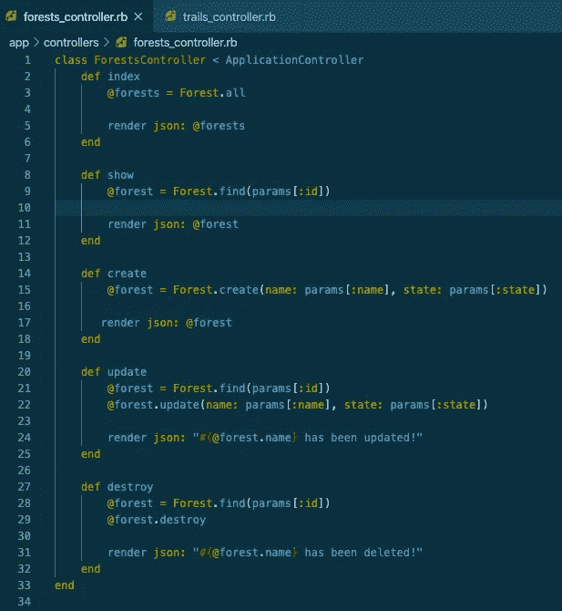

# 在 Rails 中创建 API 的 7 个步骤

> 原文：<https://levelup.gitconnected.com/7-steps-to-create-an-api-in-rails-2f984c7c4286>

## 比你想象的容易！

Lukasz Szmigiel 在 [Unsplash](https://unsplash.com?utm_source=medium&utm_medium=referral) 上拍摄的照片

用 Ruby on Rails 创建一个基本的 API 是一个快速而简单的过程。所以让我们开始吧！

确保您安装了导轨。为此，运行`gem install rails`。

## 步骤 1:创建您的目录

在您的终端中，运行`rails new [name] --api`。

[name]将是您的 Rails 目录名。在本文中，我们将一起创建一个示例案例。我们将构建一个基本的 API，其中包含关于森林及其踪迹的数据。

因此，我们将运行`rails new forest-trails --api`。

注意:这个例子说明了一个*一对多关系*。更多关于步骤 5 中的关系。

## 第二步:创建你的资源

运行`rails g resource [name] [attribute] [attribute]`。

在我们的示例中，我们将创建两个资源:“Forest”和“Trail”。[name]点应该用您想要的数据库表名填充。[attribute]点应该用资源需要的属性(比如数据库表列)填充。

在我们的例子中，我们将首先运行:`rails g resource Forest name state`。

接下来，我们将运行`rails g resource Trail name state`。

注意:属性的默认数据类型是字符串。如果需要不同的数据类型，您需要调整语法。如`rails g resource Trail name state *miles:integer*`。

一旦创建了资源，就会生成控制器文件(在“app”->“models”中)和迁移文件(在“db”->“migrate”中)。

## 第三步:填充你的种子

要填充种子，导航到“db”文件夹并打开“seeds.rb”。

首先，我们将`Forest.destroy_all` 和`Trail.destroy_all` 放在顶部。如果我们重启程序，这将重置我们的种子。

我们将每个种子设置为一个变量(例如`forest1`和`trail1`)，然后我们将使用。创建方法并传入我们的资源属性。比如`forest1 = Forest.create(name: "Black Forest", state: "Colorado")`。

请注意，在为 many 类创建种子时，您需要包含其相关的 *one* 类的 id。比如`trail1 = Trail.create(name: "Section 16", miles: 4, *forest: forest1*)`。

## 步骤 4:运行您的迁移

因为我们有一对多的关系，我们需要调整我们的*多*迁移文件。在我们的 trails 迁移文件中，我们将添加`t.references :forest, null: false, foreign_key:true`。

运行`rails db:migrate`。注意，如果你需要后退一步(例如，如果你需要添加一个属性)，你可以运行`rails db:rollback`。

## 第五步:建立你的联系

我们现在将在“app”->“models”中的 forest.rb 和 trail.rb 文件中设置我们的关联。

在我们的例子中，一个*森林有许多路径*，许多*路径属于一个森林。*这样，我们要进入森林内部的方法就是`has_many :trails`。在 Trail 方法中，我们将进入`belongs_to :forest`。

注意:当您有多个彼此相关的资源时，此步骤适用。在我们的例子中，我们有一个一对多的关系。在多对多的关系中，你可以有多个资源，甚至只有一个资源(因此不需要关系和关联)。

## 第六步:写下你的路线

写路线可能是最棘手的部分。我们将导航到“控制器”文件夹，并在 forests_controller.rb 和 trails_controller.rb 中写入路线。

在上图中，我们有**完整的 CRUD(创建、读取、更新、销毁)**方法。您是否需要所有这些方法取决于您打算如何使用您的 API。

## 第七步:经营你的种子

最后运行`rails db:seed`！

## **第八步:Cors***

*只有当您打算将 API 连接到前端时，才需要这一步。

首先，打开您的 gemfile 并取消注释`gem 'rack-cors'`(第 29 行)。

其次，导航到“config”->“initializer”-> CORS . Rb，在这里，取消第 8–26 行的注释。将 10 号线从`origins 'example.com'`改为`origins '*'`。

瞧啊。现在，您已经有了一个用 Ruby on Rails 创建的基本 API。就这么简单！

使用 Rails 还可以做很多事情，但这是一个很好的基础。

运行`rails s`启动您的本地服务器。考虑下载 [Postman](https://www.postman.com/) 来检查你的 CRUD 动作是否正常工作。

编码快乐！