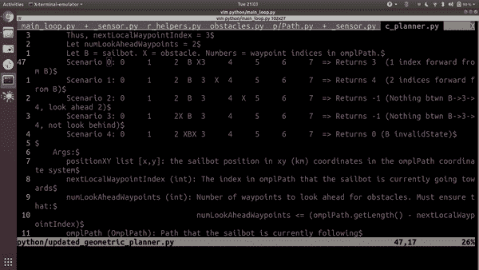

# 7 个惊人的 Vim 技巧，帮你节省时间

> 原文：<https://levelup.gitconnected.com/7-surprising-vim-tricks-that-will-save-you-hours-b158d23fe9b7>

你认为你了解维姆吗？再猜。


# 介绍

作为一个有经验的 vim 用户，我真的认为我知道所有关于 vim 的知识。当然，总是有改进和优化要做，但我认为我已经拥有了成为一个高效软件开发人员所需的所有工具。Vim 之前已经用新的技巧让我大吃一惊，所以我认为没有什么会以同样的方式让我惊讶。

我错了。

在本文中，您将了解 vim 可以为您做的 7 件令人兴奋的新事情。

# 先决条件

对于本文，我期望您对 vim 至少有初学者的流利程度，这意味着基本的移动、插入和搜索等简单命令已经理解。如果您还没有达到这个级别，您可以打开终端并运行:

```
sudo apt-get install vim
```

然后，您可以通过运行以下命令来浏览 vim 教程:

```
vimtutor
```

我还推荐阅读我以前的 vim 文章:[https://medium . com/swlh/8-vim-tricks-that-will-take you-from-beginner-to-expert-817 ff 4870245](https://medium.com/swlh/8-vim-tricks-that-will-take-you-from-beginner-to-expert-817ff4870245)

# 1.删除而不注册覆盖:复制、删除、粘贴工作流

默认情况下，删除文本的 vim 命令，如“d”、“c”和“x”，会覆盖寄存器。这允许您写“dd”来执行剪切，然后写“p”来执行粘贴。虽然这个功能很有用，但是 vim 中缺少的一个功能是删除文本而不覆盖寄存器的能力。

例如，假设您想要删除一些文本，并将其替换为当前注册中的文本。问题是，当您运行 delete 命令时，您会丢失注册表中的信息！这是一个非常常见的文本编辑场景，所以手动使用其他寄存器不是一个好的解决方案。

我发现解决这个问题的最好方法是在您的。vimrc:

```
" Shortcut to use blackhole register by default
nnoremap d "_d
vnoremap d "_d
nnoremap D "_D
vnoremap D "_D
nnoremap c "_c
vnoremap c "_c
nnoremap C "_C
vnoremap C "_C
nnoremap x "_x
vnoremap x "_x
nnoremap X "_X
vnoremap X "_X" Change <leader> to be comma
let mapleader = ","
let g:mapleader = ","" Shortcut to use clipboard with <leader>
nnoremap <leader>d d
vnoremap <leader>d d
nnoremap <leader>D D
vnoremap <leader>D D
nnoremap <leader>c c
vnoremap <leader>c c
nnoremap <leader>C C
vnoremap <leader>C C
nnoremap <leader>x x
vnoremap <leader>x x
nnoremap <leader>X X
vnoremap <leader>X X
```

这使得“d”、“c”和“x”命令在不覆盖寄存器的情况下删除，并且使得“、d”、“c”和“、x”命令在覆盖寄存器的情况下删除。

这可以从根本上改变你编辑代码的方式，因为它打开了一个“复制、删除、粘贴”的工作流程。


图 1:在这个例子中，我想创建一个新的变量 PUBLISH_RATE = 1.0/MAIN _ LOOP _ PERIOD _ SECONDS，复制文本 PUBLISH _ RATE，然后替换 rospy 中的参数。Rate()到 PUBLISH_RATE。

# 2.快速准确地导航

每个学习使用 vim 的人都知道如何使用“hjkl”进行小的导航步骤，使用“gg”和“G”跳转到文件的顶部和底部。虽然这些都非常有用，但我们需要在这些精细和粗糙的运动方法之间找到平衡的能力。要提高导航速度和准确性，请使用以下方法:

*   “SHIFT + L”(低)将光标跳到当前屏幕的底部，而不移动屏幕
*   “SHIFT + M”(中间)将光标跳转到当前屏幕的中央，而不移动屏幕
*   “SHIFT + H”(高)将光标跳转到当前屏幕的顶部，而不移动屏幕
*   “CTRL + U”(向上)将光标和屏幕向上移动半页
*   “CTRL + D”(向下)将光标和屏幕向下移动半页


图 2:高、中、低、上、下运动的演示。

# 3.打开多个文件

作为软件开发人员，很少会只处理一个文件。使用 vim 时，可以使用以下命令在新选项卡中打开另一个文件:

```
:tabe <filename>
```

这有制表符完成，以帮助您找到您想要的文件，以及通过单击向上箭头键的历史。

然后，您可以使用以下选项在选项卡之间切换:

*   “gt”向右移动
*   “gT”向左移动


图 3:使用:tabe 在新选项卡中打开文件，然后在选项卡间导航的演示。

# 4.在命令模式下使用 VIM

当我第一次发现这个技巧时，它让我大吃一惊。假设您正在编辑文本，然后使用提示 3 打开一个新文件“controller/left/left.py ”:

```
:tabe controller/left/left.py
```

然后，假设您还想打开另一个名为“controller/right/right.py”的文件。你可以写“:tabe”，然后按向上箭头键使用你的历史。这将帮助您显示“:tabe controller/left/left.py”。从这里开始，你可以慢慢地将光标移到左边，然后用右边替换两次。我以前就是这么做的。

这样做快一点不是很好吗？如果你可以使用一个很棒的文本编辑器…

解决方案:“CTRL + F”将允许您使用 vim 语法编辑命令。然后，您可以按“/左”，然后按“N”，然后按“cw”，然后按“右”，然后按“N，然后”。".查找单词，更改单词，查找上一个单词，运行上一个更改。


图 4:使用“CTRL+F”编辑 vim 命令模式文本的演示。在这种情况下，我将 global_planner 改为 wind_sensor。

# 5.在大写和小写之间转换

一个常见的令人沮丧且耗时的任务是修改单词的大小写。例如，如果您需要将 10 个大写单词全部改为小写，您通常需要手动重写这 10 个单词。幸运的是，vim 有工具允许我们捕获现有的文本信息，并轻松地进行更改。

*   “~”将大小写从小写改为大写或从大写改为小写
*   “gUw”将一个单词从小写改为大写(可以用你想要的动作替换“w”)
*   “guw”将一个单词从大写改为小写(可以用你想要的动作替换“w”)


图 5:改变字符大小写的演示。在注释中，我创建了一个宏，将单词的首字母改为大写，然后移动到下一个单词。我使用这个宏使接下来的 10 个单词的第一个字母大写。然后，我通过按住“~”键将变量名从 WIND_PUBLISH_PERIOD_SECONDS 改为 wind_publish_period_seconds。

# 6.递增和递减数字

另一个令人沮丧且耗时的任务是修改枚举。例如，如果您有一个注释，其中列出了函数中的 10 个步骤，但随后您需要删除步骤 2，您通常需要手动修改下面的 8 个数字。幸运的是，vim 有工具允许我们捕获现有的文本信息，并轻松地进行这种更改。

*   “CTRL + A”增加一个数字
*   “CTRL + X”减少一个数字



图 6:在这个例子中，我想把数字 0-4 改为 1-5。我没有手动更改每个数字，而是创建了一个宏来递增当前数字，然后向下移动。我用这个宏来改变接下来的 4 个数字。

# 7.使用剪贴板作为默认注册:Mac 与 Linux

在我之前的教程中，我展示了如何使用剪贴板作为默认注册表。这允许你在另一个程序中用“CTRL + C”复制，在 vim 中用“p”粘贴，或者在 vim 中用“yy”复制，在另一个程序中用“CTRL + V”粘贴。

然而，在那篇文章发表的时候，我只使用 Linux。当我试图在 Mac 上使用相同的 vim 配置时，我发现这一更改在 Mac 上不起作用。我能够通过更新。vimrc 包含以下内容:

```
" Use clipboard as default register
if system('uname -s') == "Darwin\n"
  set clipboard=unnamed "OSX
else
  set clipboard=unnamedplus "Linux
endif
```

# 结束语

vim 时常向我展示一种强大的技术，可以将常见的挫折转化为简单的命令。这些时刻总是让我微笑。学习这些 vim 技巧将帮助你节省时间，让你有更多的时间去做你真正喜欢的事情:学习更多的 vim 技巧。

在[https://github.com/tylerlum/vim_configuration](https://github.com/tylerlum/vim_configuration)查看我的 vim 配置文件。