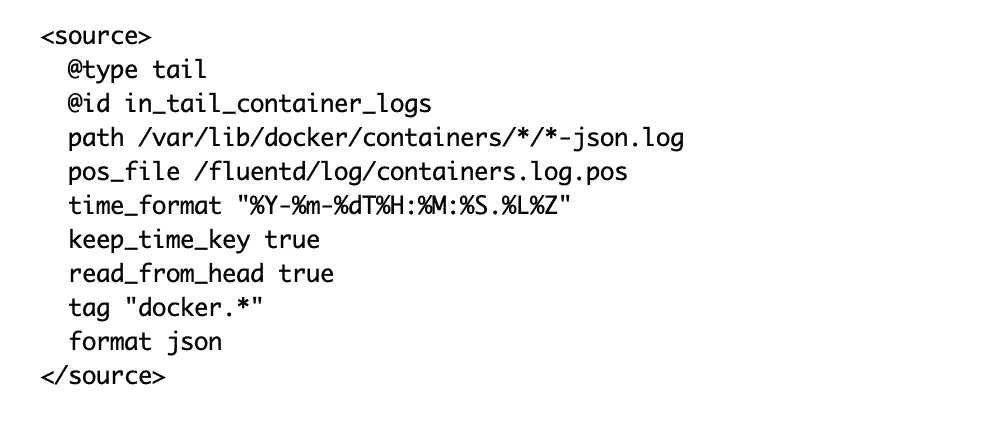
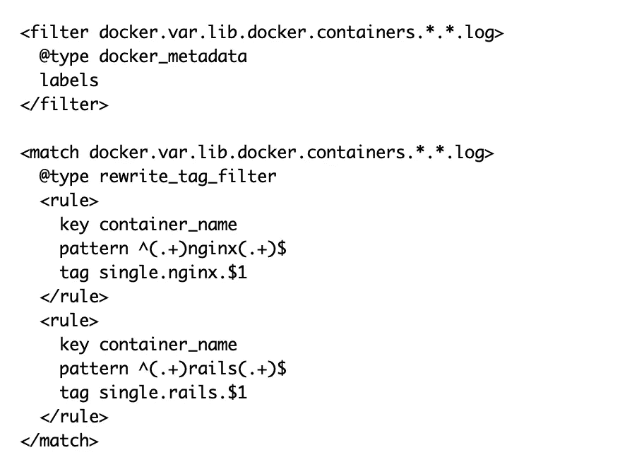
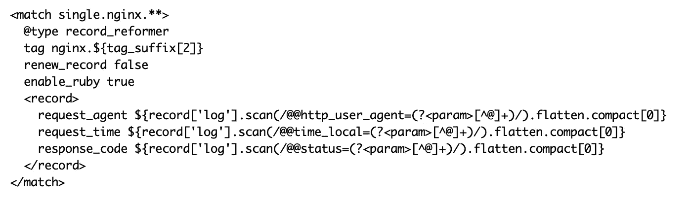
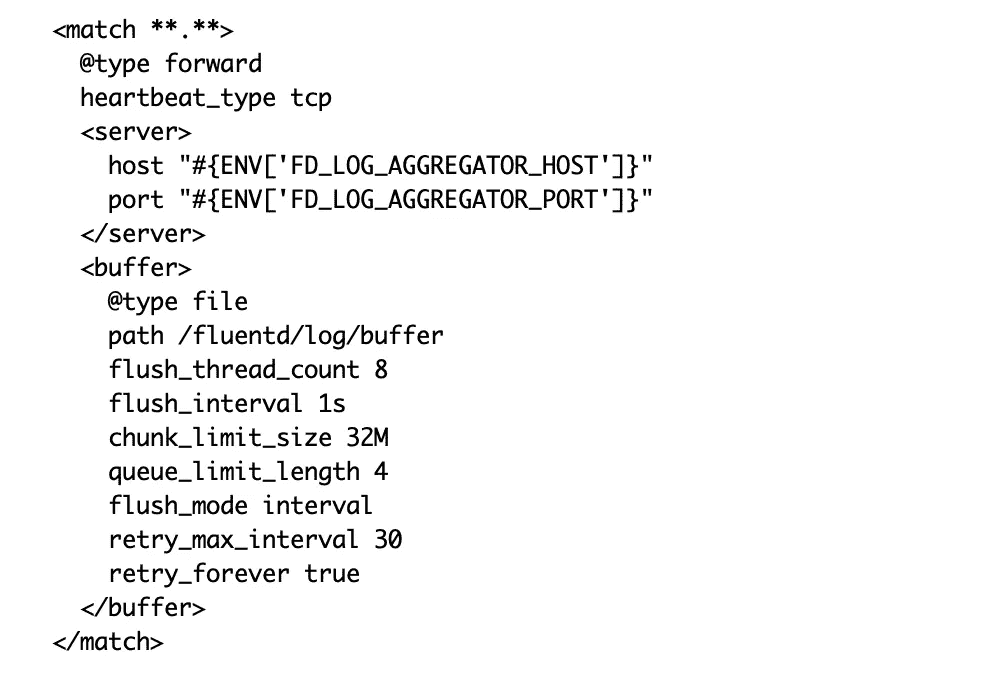
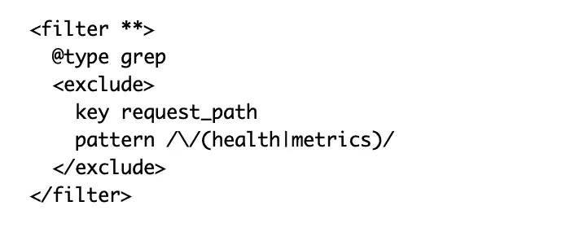
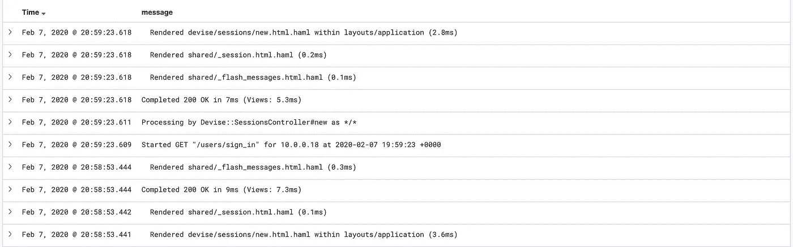
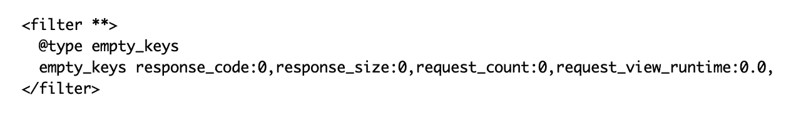

# 使用 Fluentd 收集日志的七个技巧

> 原文：<https://levelup.gitconnected.com/7-tips-for-using-fluentd-for-logs-collection-c9613f7a387c>

## 集中记录

## 通过应用一些最佳实践来改进您的 FluentD 配置和脚本

萨姆·丹·张在 [Unsplash](https://unsplash.com?utm_source=medium&utm_medium=referral) 上的照片

> Fluentd 是一个跨平台的开源数据收集软件项目，最初是在 Treasure Data 开发的。它主要是用 Ruby 编程语言编写的。[维基百科](https://en.wikipedia.org/wiki/Fluentd)

Fluentd 是一个工具，可用于从多个数据源收集日志，如应用程序日志、网络协议。和第三方服务。此外，Fluentd 允许您跨所有支持的服务和应用程序构建统一的日志记录层。例如，您可以从包括反向代理(Nginx 或 Apache)在内的所有应用程序中收集日志，并解析应用程序的日志以从日志消息中提取属性，以便能够在以后使用诸如 [Kibana](https://www.elastic.co/kibana) 之类的工具可视化日志，甚至将日志存储在 MongoDB 数据库中。

在 Fluentd 中收集和解析日志可以通过编写 FluentD 特定的[配置文件](https://docs.fluentd.org/configuration/config-file)来完成，这些文件定义了日志的数据源、集成插件和解析配置。

在这篇文章中，我将试图强调和描述一些编写 Fluentd 配置文件的最佳实践和建议。此外，我将描述一些可以与 Fluentd 集成的有用插件。

**组织配置文件**

虽然 FluentD 配置可以存储在一个包含所有 Fluentd 配置的巨大配置文件中，但我建议将 Fluentd 配置分成以下部分或文件:

*   源配置文件:这些文件将包括所有支持的数据源的配置。例如，下面的配置设置了一个 ***tail*** 源来从 Docker 容器收集日志。

*   分类配置文件:这些文件负责将日志源分类到不同的类别，并确保日志可以被解析。对于这些类别中的每一个，将对日志进行不同的解析。下面的代码片段显示了一个 Fluentd 配置的示例，它可以用来对 docker 容器日志进行分类。配置中的第一个过滤器将 docker 属性加载到日志事件中，例如 docker 容器名称。第二个过滤器将根据从第一个过滤器中提取的容器名称重新标记日志事件。

*   解析日志配置文件:这些文件负责解析日志消息，并从日志消息中提取属性和参数。在下面的例子中，我们从每个 Nginx 日志消息中提取请求代理、请求时间和响应代码。

*   输出配置文件:这些文件将包含将日志发送到最终目的地的配置，比如本地文件或远程日志服务器。Fluentd 支持几个[输出插件](https://docs.fluentd.org/output)比如 forward、copy 和 stdout。下图显示了我们如何将日志转发到外部日志服务器

**使用 tail over forward 等输入插件**

Fluentd 支持多个[输入插件](https://docs.fluentd.org/input)，并从不同的[数据源](https://www.fluentd.org/datasources)收集日志，如应用程序日志、网络协议日志和第三方服务日志。例如，要收集 docker 容器中运行的 rails 应用程序的日志，您有以下选择

*   将日志直接从应用程序转发到 Fluentd。
*   配置 docker 将容器日志转发到 Fluentd。
*   配置 Fluentd 从日志文件中收集应用程序日志。

虽然使用前两个选项收集日志似乎更容易，但我强烈建议使用第三个选项来收集应用程序日志，原因如下。

1.  对于前两个选项，需要修改应用程序的源代码并升级应用程序日志系统，或者更新 Docker 的配置。
2.  将 docker 配置为转发日志有一些缺点，比如无法从 Docker 命令行获得日志，因为我们需要更改日志记录驱动程序(如果应用程序停止将日志记录到 STDOUT，这也适用于直接发送日志)
3.  对于前两个选项，如果缓冲配置不正确(尤其是对于第一个选项)，如果远程服务器停机或出于某种原因不接受日志，就会出现松散日志的变化。
4.  通过跟踪日志文件来收集日志提供了更大的灵活性，并将易受影响的配置与应用程序本身隔离开来。举例来说，唯一的要求或依赖性是能够访问应用程序的日志文件。解析和发送日志的所有其他步骤都可以由 Fluentd 来处理。此外，使用第三种方法，应用程序根本不需要担心日志的流动或传送。

**使用标签**

微服务架构应用的 Fluentd 配置可能非常复杂，具体取决于服务数量和支持的日志格式。有助于降低配置复杂性的一种方法是使用 Fluentd "label ***"*** 指令来隔离和分组配置的不同部分。

**忽略不需要的日志**

在开始解析日志之前，最重要的步骤之一是处理“噪音”日志或日志消息，这些日志或日志消息可以被忽略，不需要发送。例如，通常，负载平衡器和监控系统会定期使用几个应用程序端点，如健康检查端点或指标端点。忽略与这些端点相关的所有日志消息以减少发送的日志量是很有意义的，尤其是在日志服务器对发送的日志大小有限制的情况下。下面的例子显示了如何忽略与 web 请求`health`和`metrics`相关的所有日志消息

**处理多行日志**

有许多应用程序会生成多行日志，其中一个请求的日志会被分成多行。默认情况下，Fluentd 会将每一行作为独立的日志消息来处理，并且不会将日志行关联起来。此外，Kibana 会将这些日志行视为单独的日志事件，很难在 Kibana 界面中圈出这些日志行，甚至很难读取它们。RubyonRails 是一个生成多行日志的 web 框架。下图显示了 Kibana 中 Rails 日志的样子。

因此，如果您的应用程序正在生成多行日志，您需要考虑将这些日志行关联在一起，并通过 Fluentd 处理多行日志。在这篇文章中，我详细讨论了如何处理 Rails 应用程序的多行日志。

 [## 用 FluentD 解析 Ruby on Rails 日志

### 让我们通过使用 FluentD 解析 rails 多行日志来减少日志量。

medium.com](https://medium.com/faun/parse-ruby-on-rails-logs-with-fluentd-9fca4df6ebfe) 

**弹性搜索的稳定接口**

将日志发送到 Elasticsearch 或任何其他数据库是一项简单的任务，但是，有几个制动问题可能会破坏日志记录系统并导致日志丢失。

*   索引太多:如果您的应用程序正在生成包含大量属性的 JSON 日志(因为您的应用程序正在记录对象的 JSON 表示),就会出现这个问题。这也会基于对象的 JSON 表示生成一些奇怪的索引名。
*   索引冲突:如果您有两个(甚至一个)应用程序记录具有相同索引但不同数据类型的消息，可能会发生此问题。例如，如果您的应用程序生成带有“字符串”数据类型的**错误索引**的日志消息，而您的另一个应用程序生成带有“对象”数据类型的**错误索引**的日志。
*   有效负载太大:当应用程序生成的日志消息超过 Elasticsearch 的限制时，就会出现这个问题。

为了克服这些问题，我建议使用 Fluentd 构建一个统一的日志记录接口，并且只使用该层定义的 ke 来发布日志消息。我们不应该允许应用程序直接更改或添加索引。使用 record_reformer 插件可以很容易地构建这一层。如下面的代码片段所示，Nginx 日志将由 Fluentd 解析，只有定义或提取的密钥将被发送到远程日志记录系统。

**清理有效载荷空键**

最后，作为一项清理措施，我建议过滤所有日志事件，删除所有值为空的键。此操作有助于保持 Kibana 上的日志消息干净，并且只包含具有有效值的键。可以使用 [empty_keys](https://github.com/wshihadeh/fluent-plugin-filter_empty_keys) 插件轻松完成这项任务。默认情况下，它将删除所有具有空字符串值的键。但是，它允许为自定义键定义空值。在下面的例子中，我们将 **0** 定义为列出的键的空值。

**推荐和有用的插件**

Fluentd 支持[多种插件和过滤器](https://www.fluentd.org/plugins)来处理和解析日志。下面是一些最常用的插件的简要描述。

*   [docker_metadata](https://github.com/wshihadeh/fluent-plugin-filter-docker_metadata) :这个插件帮助我们收集与日志消息相关的 docker 元数据，比如容器名。
*   [record-reformer](https://github.com/sonots/fluent-plugin-record-reformer) :这个插件对于重新创建日志消息事件非常有帮助。
*   [Rabbitmq](https://github.com/nttcom/fluent-plugin-rabbitmq) :这是一个生成 Rabbitmq 事件的输出插件。
*   [Elasticsearch](https://github.com/uken/fluent-plugin-elasticsearch) :这个插件帮助将日志发送到 Elasticsearch 实例。
*   [MongoDB](https://github.com/fluent/fluent-plugin-mongo) :这个插件可以用来在 MongoDB 实例中存储日志消息。

**结论**

从应用程序、网络协议和第三方服务收集日志相对容易完成。在这篇文章中，我强调了一些可以提高 Fluentd 配置可读性和质量的地方。