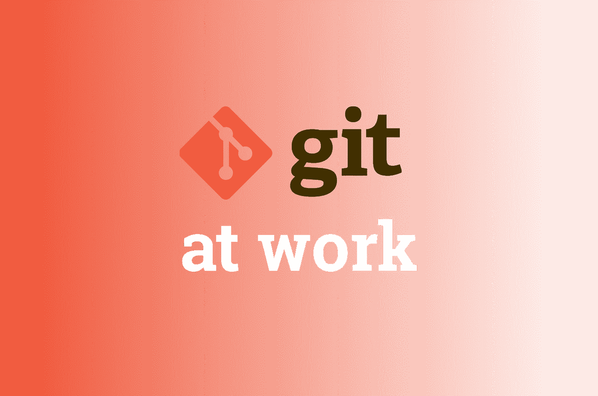

# 在工作中使用 Git 的 7 个技巧

> 原文：<https://levelup.gitconnected.com/7-tips-for-using-git-at-the-job-783ddd631e64>

## 在问你忙碌的高级同事之前，先看看这些



# 1.更新提交消息

运行这个命令，进入预定义的 git 编辑器，焦点是您之前的提交消息，您可以编辑它，然后再次保存它。

```
git commit --amend --no-verify
```

# 2.更新推送提交消息

要更新推式提交，您需要在想要更改的提交之前，从提交开始重新设置基础。这很棘手，尽管肯定是可能的。

```
git rebase -i [COMMIT_HASH]...pick my-commit-message > **reword my-new-commit-message**...git push --force
```

# 3.浏览整个提交历史记录

有时，您希望在代码编辑器或 IDE 中轻松浏览整个 git 历史。运行以下命令之一来轻松实现这一点。

## 使用 VSCode

```
git log | code -
```

## 使用 Vim

```
git log | vim
```

# 4.用您的更改创建新分支

您可能经常在主分支上开始构建，但是当需要创建 pr 时，您需要一个单独的分支。以下是如何快速创建一个。

```
git checkout -b my-new-branch
```

# 5.删除合并的分支

尽可能保持存储库的本地克隆是一个好主意。像这样删除你合并的分支，让它成为以后的习惯。

```
git branch -d my-merged-branch
```

# 6.两次提交之间的差异

有时你需要看到你所提交的改变的不同之处。你可以这样做，通过像这样相互区分两次散列提交。

```
git diff [FIRST_COMMIT_HASH] [SECOND_COMMIT_HASH]
```

# 7.将母版合并到您的分支

当长时间处理一个特性时，或者经常与 master 不同步时，与 master 保持同步以避免合并冲突是很重要的。

```
git merge master
```

# 了解更多信息

[](https://git-scm.com/doc) [## 证明文件

### 斯科特·沙孔和本·施特劳布写的整本 Pro Git 书可以免费在线阅读。死树版本…

git-scm.com](https://git-scm.com/doc)  [## Git 教程和培训|亚特兰大 Git 教程

### 通过这个全面的 Git 培训学习 Git 的基础知识。涵盖了分支、拉请求、合并等更多内容…

www.atlassian.com](https://www.atlassian.com/git/tutorials) [](https://dev.to/lydiahallie/cs-visualized-useful-git-commands-37p1) [## 🌳🚀CS 可视化:有用的 Git 命令

### 虽然 Git 是一个非常强大的工具，但是我想大多数人都会同意我说它也可以...完全是一场噩梦😐…

开发到](https://dev.to/lydiahallie/cs-visualized-useful-git-commands-37p1) [](https://www.datree.io/resources/git-commands) [## 常见 Git 任务的 10 个非常有用的 Git 命令

### Git 命令并不总是直观的。如果是的话，我们将拥有这 10 个命令。他们会是…

www.datree.io](https://www.datree.io/resources/git-commands)