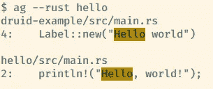
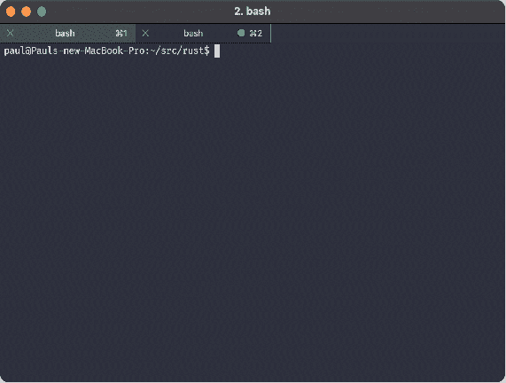
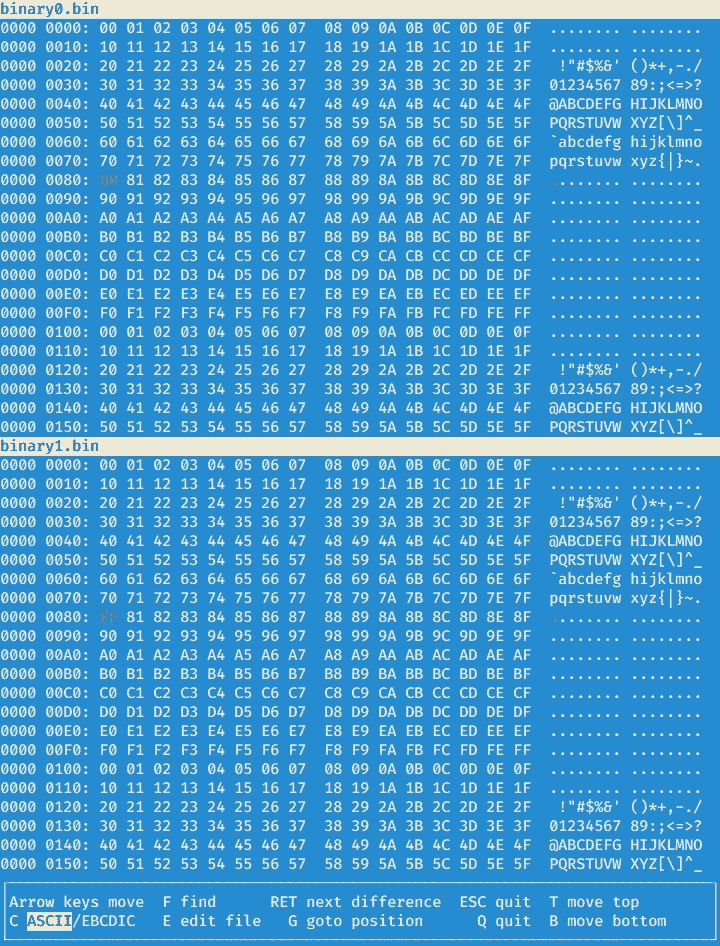
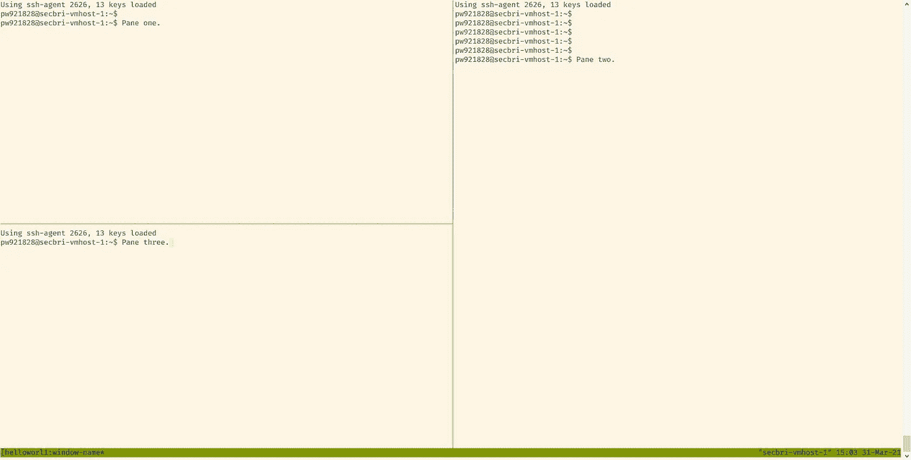

# 我每天在工作中使用的 7 种工具

> 原文：<https://levelup.gitconnected.com/7-tools-i-use-every-day-at-work-74abbdb65ea3>

## 让每一天都变得更好的东西

这些都是独立的工具——不是节点模块、浏览器扩展或 VS 代码扩展。

## [1。白银搜索者(ag)](https://github.com/ggreer/the_silver_searcher)

Silver Searcher(简称`ag`)是一个速度惊人的搜索器，比`grep`快得多。它带有默认设置，适用于大多数情况。它理解`.gitignore`文件，以及忽略其他工具的文件，所以它可以避免搜索“不感兴趣”的文件。

它很容易用来搜索特定的源格式，并且知道默认情况下忽略目标文件和其他生成的文件。

ag 的搜索输出示例，搜索 rust 文件

我被告知 [ripgrep](https://github.com/BurntSushi/ripgrep) 也是一个很好的 grep 替代品，但是我没有试过。

## [2。fd](https://github.com/sharkdp/fd)

`fd`就像`ag`——它是一个普通工具(`find`)的替代品，可以做得更快更好。同样，它本身理解`.gitignore`文件之类的东西。它还足够聪明，能够理解诸如`node_modules`或 Rust 目标目录之类的东西——例如:

不同之处在于不同的`target/debug/build/`目录中有许多文件——通常你不想在那里搜索。如果你这么做了，当然会有一个标志让你这么做。

您也可以轻松地将它用作其他工具的输入，比如`fzf`。

## [3。fzf](https://github.com/junegunn/fzf)

`fzf`是一个模糊查找器，它是那种一旦你找到它就无法想象不使用它的东西。我在`bash`中配合 Ctrl-R 使用，所以可以模糊搜索我的命令历史，这是*牛逼*。

它与 Vim(和其他编辑器)集成，以快速搜索文件列表，您也可以使用它与`ag`等工具的输出一起使用，以快速搜索搜索结果:

fd/fzf 动画

## [4。vbindiff](https://www.cjmweb.net/vbindiff/)

直观地看到二进制文件中的差异——也许不是每个人都需要的。但是如果你每天都在处理二进制文件，那么这是一个非常好的工具。

您可以将它用作 diff 工具，这是它擅长的地方，或者您可以将它用作普通的十六进制编辑器。

发现差异

## [tmux](https://github.com/tmux/tmux/wiki)

我承认，我花了一段时间来理解 tmux——我使用 GNU screen 很多年了。我最终决定我应该给 tmux 一个持续的尝试，现在我用它做任何事情。

我发现像拆分当前窗口(分成“窗格”)、在特定会话中创建新窗口之类的事情要容易得多。`[tmux-resurrect](https://github.com/tmux-plugins/tmux-resurrect)`和`[tmux-continuum](https://github.com/tmux-plugins/tmux-continuum)`插件很棒，即使在系统重启后也能回到原来的位置——它们甚至能恢复 Vim 会话。

## [齐姆](https://zim-wiki.org/)

你自己的个人桌面维基。看看插件列表，我想人们也用它来制作静态网站和其他更高级的东西。

我倾向于用它来做工作笔记，把我下次需要记住的东西藏起来(比如特定的命令行)，为每周团队会议做的总结，诸如此类的东西。

没什么特别令人兴奋的——但是它是跨平台的，而且它通常工作得很好，做了它应该做的事情。那里没什么可抱怨的。

## [翻拍](http://bashdb.sourceforge.net/remake/)

最后，我们有另一个工具，有点像 vbindiff，因为很多人可能不会使用 [make](http://make.mad-scientist.net/) 。如果你是，那么你几乎肯定有过这样的场景，一个工件的编译失败了，而且根本不清楚为什么，*或者甚至为什么要构建它*。

改造解决了这些问题，并为构建错误提供了一个很好的回溯。可以把它想象成有点像用于 Makefiles 的 gdb。最好的建议是去看看网页——我可以在这里添加的任何东西都是多余的，他们已经覆盖了。