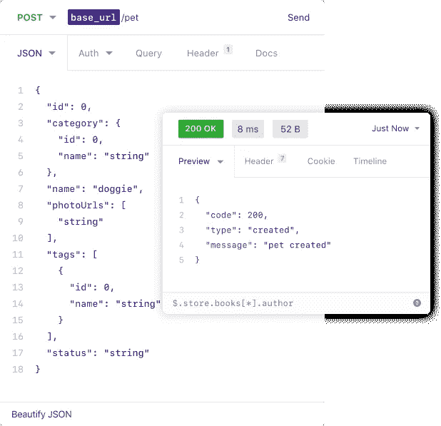
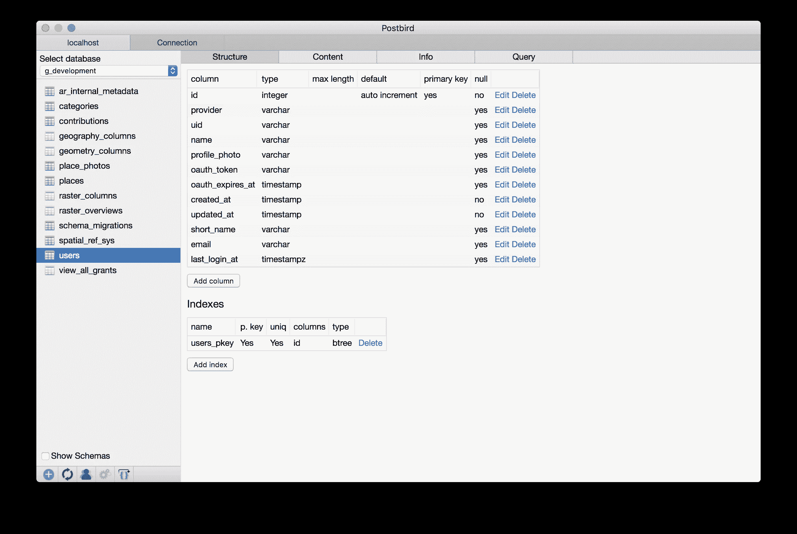
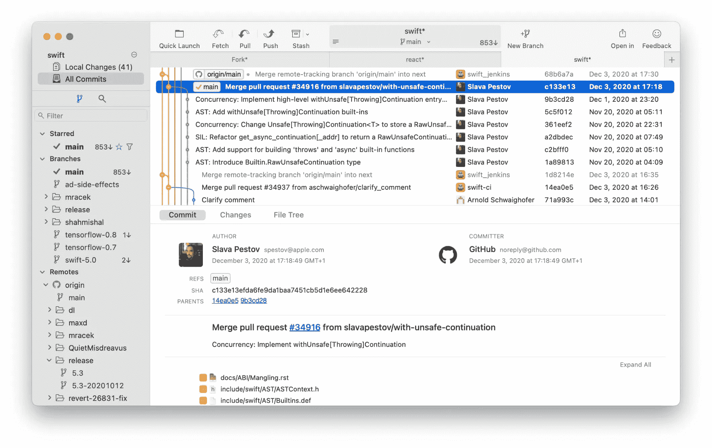
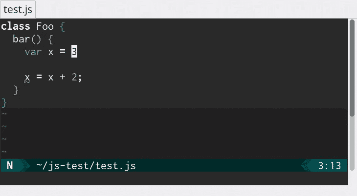

# 我每天使用的 7 个工具—家庭版

> 原文：<https://levelup.gitconnected.com/7-tools-i-use-every-day-home-edition-3d1c5d74effa>

最近，我很幸运地通过 Medium 和 [dev.to](https://dev.to/) 发现了一些不错的新桌面和编码工具。我想我会分享一些我不常用的。

## [失眠](https://insomnia.rest/)

失眠对于测试 web APIs 非常有用。app 是免费的；提供这种服务的公司还提供付费计划，分享你定义的请求，如果你在一个团队中，这很有用。

图片来自失眠网站

## [波斯特伯德](https://github.com/Paxa/postbird)

对于连接到 PostgreSQL 实例并检查它们，这是一个非常有用的应用程序。它能够查看模式和表的内容，并对它们进行编辑。您可以定义多个连接，并设置当您打开应用程序时应该自动连接的连接。

Postbird 截图(来自 Postbird 的 GitHub 页面)

## [叉子](https://git-fork.com/)

当我找到它时，这真是天赐之物。一个 GUI Git 客户端，它是最新的，友好的，运行良好，当你使用它的时候，它几乎就是我想要的。太牛逼了。我唯一的愿望是它可以在 Linux、macOS 和 Windows 上使用，但是我更希望作者能很好地支持两个平台，而不是三个平台。

Fork 图片(取自 Fork 网站)

## [CoC](https://github.com/neoclide/coc.nvim)

这是 Vim 的一个插件，而不是任何独立的东西，但它有自己的位置，因为我的上帝，它太棒了。结合下一个条目，它基本上给了 Vim 与代码一样好(有时甚至更好)的智能感知。

使用 CoC 的示例—摘自他们的网站

## [ALE](https://github.com/dense-analysis/ale)

又一个 Vim 插件！这是 coc 的对应部分—它与语言服务器集成在一起，以突出和识别错误。

ALE 网站 ALE 中突出错误和改进的示例

## 菲拉科德

从技术上来说，这是一种字体，而不是一个软件包，但它让一切看起来更容易，它有自己的入口。我用 FiraCode 培养基。

## [尤利西斯](https://ulysses.app/)

这篇博文写的是什么！这一个只有 macOS，所以如果你不是在 Mac 上就跳过这一个。或者看看你可以用什么。:-)

它具有强大的降价支持，但不仅仅如此:

*   它与 Ghost 和 Medium 等多个博客平台集成，支持每个平台上可用的额外元数据
*   导航面板可以让你轻松地浏览你所写的内容，并查看作品的大纲(使用标题)
*   工作表可以添加标签和注释，以帮助组织
*   有一个标记助手
*   图像支持
*   附件支架
*   一流的 iCloud 支持
*   可以在 iOS、iPadOS 和 macOS 上使用，所以它几乎可以在我想写的任何地方使用。把它和 iCloud sync 绑在一起，你就可以拿起它走了。
*   它可以导出为多种格式——Word 文档、PDF、HTML、Markdown，甚至直接导出为 ePub。

## 荣誉提名

两种配色，[德古拉](https://draculatheme.com/)和[日晒](https://ethanschoonover.com/solarized/)。我发现自己随着心情在它们之间切换，而不是一个主题统治所有主题。不过它们都很棒，可以在你的应用程序中协调颜色。

还有，[麦克维姆](https://macvim-dev.github.io/macvim/)本身。(我意识到 Emacs 用户在找石头砸我。)虽然我肯定会使用 VS 代码，但如果我有需要关注的事情，我会回到 Vim。

我还在某处读到了一些让我产生共鸣的东西。许多 ide 主要关注于输入文本——实际上，改变文本是事后的想法。Vim 的情况就不一样了，修改文本是一等公民。

# 分级编码

感谢您成为我们社区的一员！[订阅我们的 YouTube 频道](https://www.youtube.com/channel/UC3v9kBR_ab4UHXXdknz8Fbg?sub_confirmation=1)或者加入 [**Skilled.dev 编码面试课程**](https://skilled.dev/) 。

 [## 编写面试问题+获得开发工作

### 掌握编码面试的过程

技术开发](https://skilled.dev)