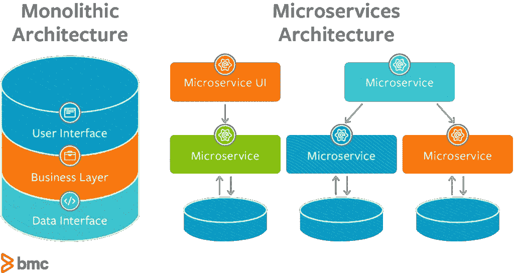
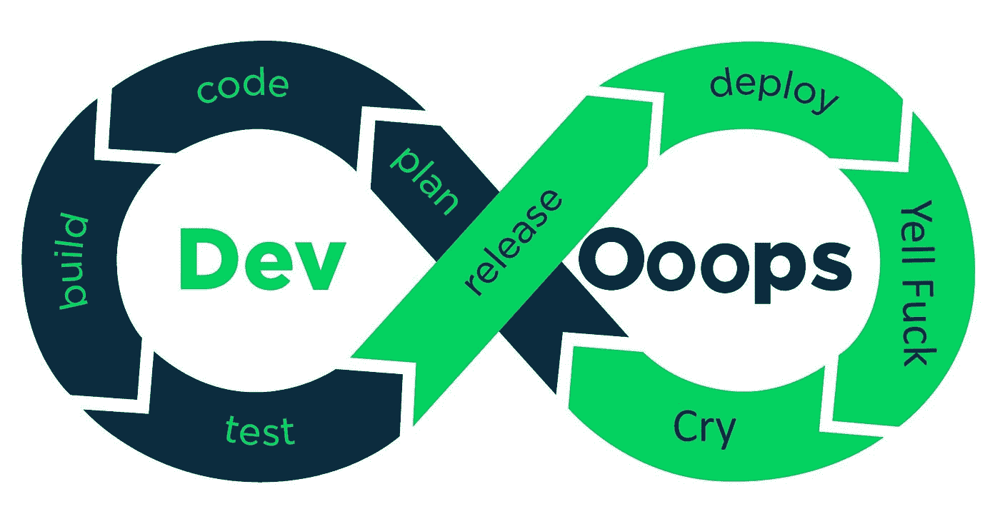
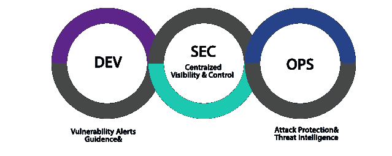
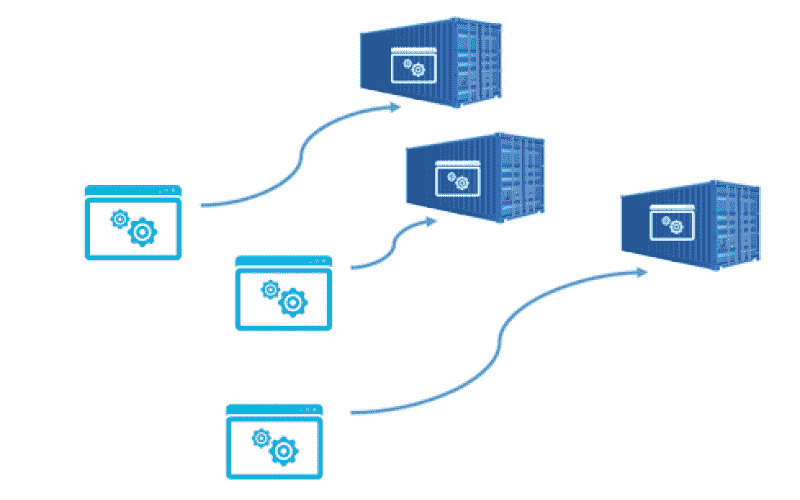

# 2020 年 7 大发展趋势

> 原文：<https://levelup.gitconnected.com/7-trending-devops-topics-in-2020-155078d6f550>

## 跟上 DevOps 的最新趋势，以强势结束这一年

来源:[https://enterprisesproject . com/sites/default/files/styles/620 x350/public/images/CIO _ devo PS _ trends . png？itok=2bfIRUhv](https://enterprisersproject.com/sites/default/files/styles/620x350/public/images/cio_devops_trends.png?itok=2bfIRUhv)

> *DevOps 是一种* ***文化*** *，鼓励包括开发和运营团队在内的所有利益相关者之间的协作，并通过自动化改进流程，以提高软件交付的质量和速度。*

记住 DevOps 的这个定义，并能够在被问到“什么是 DevOps？”目标是创建一个工作环境，在这个环境中，构建、测试和部署软件可以快速、可靠和频繁地进行。通过这样做，公司可以更快地实现其目标，并部署新功能、安全补丁和错误修复。

整个行业与开发运维相关的最新趋势如下:

1.  端到端生命周期管理可简化开发运维工作流
2.  更改“应用程序”的定义
3.  快速移动而不损坏东西
4.  优化 DevOps 工具链
5.  缩小开发人员技能差距
6.  DevSecOps 是现实
7.  全面采用集装箱优先战略

## 端到端简化的开发运维工作流

来源:[https://www . the truth about mortgage . com/WP-content/uploads/2008/06/bullet . jpg](https://www.thetruthaboutmortgage.com/wp-content/uploads/2008/06/bullet.jpg)

有如此多不同的 DevOps 工具，以及如此多的与其他工具的集成需要进行，以便整合一个完整的 CI/CD 管道。在整个管道的一小部分使用同类最佳产品的做法已经司空见惯。虽然组织已经获得了迎合定制工作流的好处，但这也导致了**难以置信的工具蔓延**在通常分散的团队中，这可能会阻碍生产力。

DevOps 供应商的任务通常是确保与其他供应商的工具兼容。工具的数量将会继续增加，但是将会朝着端到端的生命周期管理和单个应用程序的方向发展，这些应用程序将会简化工具和工作流，最终提高软件开发的速度和灵活性。

看看 [Gitlab 的价值主张](https://about.gitlab.com/stages-devops-lifecycle/)作为一个完整的 DevOps 解决方案，了解这是如何进行的。

## 到底什么是应用？

来源:[https://blogs . BMC . com/WP-content/uploads/2018/10/microservice-vs-monolithic-1024 x544 . png](https://blogs.bmc.com/wp-content/uploads/2018/10/microservices-vs-monolithic-1024x544.png)

许多组织正在努力采用云，因为他们当前的系统和流程根本无法适应如此动态的环境。当我可以每分钟多次配置和销毁服务器时，我如何使其与我的 CMDB 和变更控制系统保持同步？

想想现在有多少可用的 AWS 服务！您会考虑这些应用程序吗？

开发微服务时，每个功能都是应用吗？或者应用程序是在一个 UI 中工作的所有东西吗？

## 动作快点，别弄坏我的 app！

> “快速移动，打破东西。”

这种意识形态从未在金融服务领域发挥作用，我们正看到它对大型科技公司产生持续的负面影响。随着隐私和监管成为消费者最关心的问题，更多的公司将在启动新的商业计划之前踩刹车。随着行为、技术和产业的变化在我们周围不断发生，发布将需要更加稳定。

随着行业的成熟，我们在管理环境中的状态和内置应用程序的自我意识方面已经有了很大的进步，因此它们知道是否可以开始实时流量。

## 优化的工具链

来源:[https://www . six stories . com/WP-content/uploads/2017/10/step-up-your-conversion-game-header . png](https://www.sixstories.com/wp-content/uploads/2017/10/step-up-your-conversion-game-header.png)

市场上的 DevOps 工具正在走向成熟。他们将越来越多的功能集成到一个产品中，而过去需要将几个功能集成在一起才能达到相同的效果。为一个完整的 CI/CD 管道运行多个不同的 COTS 工具是非常昂贵的。如果资源只是为了基本功能而不断地集成几个工具，这也使得调整和优化每个工具变得更加困难。

看看即使没有 100%相同的功能集，您如何能够减少工具蔓延并保持相同的功能。它们很可能会出现在工具或产品的未来版本中。

## 技能差距缩小了

来源:[https://www . naceweb . org/uploaded images/images/2018/journal/02/Is-There-Really-a-Skills-Gap-1-961 x600 . jpg？n=963](https://www.naceweb.org/uploadedImages/images/2018/journal/02/Is-There-Really-a-Skills-Gap-1-961x600.jpg?n=963)

开发人员传统上非常反对学习“部署”或配置中间件。随着我们的自动化工具变得越来越像第三方库，开发人员越来越快地参与进来，并且在某些情况下引领部署自动化。

此外，随着操作人员越来越多地了解如何编写代码，他们很快就能够为核心应用程序开发做出贡献。

## DevSecOps——不仅仅是另一个流行词

来源:[https://anchore . com/WP-content/uploads/2019/02/devsecops . png](https://anchore.com/wp-content/uploads/2019/02/DevSecOps.png)

安全性变得越来越容易，组织希望在代码发布之前进行安全性验证。ISO 不再接受每 12 个月一次的人工审查，以检查是否遵循了安全策略。集成源代码秘密扫描、依赖性漏洞检查和开源许可证法律审查越来越常见。

## 集装箱优先

来源:[https://www . network computing . com/sites/default/files/styles/flex slider _ full/public/Docker-tear down-01-% 28 introduction % 29 _ 0 . png？itok=tQ6Djg92](https://www.networkcomputing.com/sites/default/files/styles/flexslider_full/public/Docker-Teardown-01-%28Introduction%29_0.png?itok=tQ6Djg92)

我们终于翻过了在“从属”节点上安装软件以进行 CI 构建的一页。我们在 CI 期间需要运行的工具和技术现在已经容器化了。这使我们能够根据我们需要做的工作使用更多不同类型的技术。

这也打开了另一个需要容器扫描的蠕虫罐。但集装箱安全问题将留待明年解决。