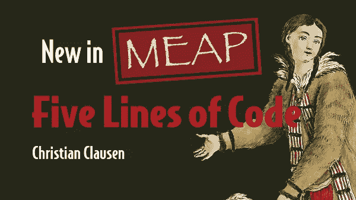

# 7 分钟内 7 次打字技巧

> 原文：<https://levelup.gitconnected.com/7-type-tricks-in-7-minutes-4ff7bf5198fc>


## 软件工艺

## Typescript 的类型系统和一个难题

Typescript 拥有任何主流编程语言中最令人兴奋的类型系统之一。学习起来可能很有挑战性，但是好的类型有如此多的优点，所以值得努力。这篇文章阐明了 Typescript 中类型的许多基本属性。我答应了七分钟，所以让我们直接进入它。

# 对象类型

我们从一个更简单的东西开始:对象。通过列出字段及其类型，我们可以像定义对象一样定义对象类型。

```
type A = { a: string; b: number };type B = { b: string; c: string[] };
```

注意，这两个对象都有一个名为`b`的字段，但是`b`的类型不同。

# 交集和并集类型

当我们引入并集和交集类型时，Typescript 的类型系统开始显示。联合意味着某样东西有这样或那样的类型，所以我们只能依靠它们的共同点。交集意味着它既有一种类型又有另一种类型，所以我们可以期望它拥有两者的一切。在 Typescript 中，它看起来像这样:

```
type AorB = A | B;
// { b: number | string }type AandB = A & B;
// { a: string; b: never; c: string[] }
```

注意，在`AorB`的情况下，只有字段`b`同时出现在两者中，但是由于它们的类型不同，Typescript 下推 union 操作符。另一个有趣的细节是在交集的情况下`b`有类型`never`。这意味着`number`和`string`之间没有交集，所以这种类型永远无法实现——这是真的。

# 常量类型

Typescript 还带来了一些常量类型。我们不仅可以告诉类型检查器表达式的类型，还可以告诉它的值。在本例中，我们有三个不同的变量，其中两个具有常量类型:

```
let a1: string = "a";let a2: "a" = "a";let a3: 5 = 5;
```

乍一看，常量类型似乎不是很有用，但是结合上面的联合类型，我们可以用它们来模拟具有基本模式匹配的 sum 类型:

```
type tree =
  | { type: "Leaf", value: number }
  | { type: "Node", left: tree, right: tree };
function sum_tree (t: tree): number {
  if (t.type === "Leaf") {
    return t.value;
  } else {
    return sum_tree(t.left) + sum_tree(t.right);
  }
}
```


# 环

组合常量和联合类型的另一个原因是通过它们进行循环，并使用它们来访问对象中的字段。类型循环关键字是`in`，在本例中，我们用它来创建一个类似于`A`的类型，但是我们用返回值的函数(称为 thunks)来替换字段:

```
type aorb = "a" | "b";type Athunks = {
  [key in aorb]: () => A[key];
};
// { a: () => string; b: () => number }
```

# 类型运算符

我们刚刚看到的 for 循环只明确地适用于`A`类型，所以一个程序员想到的自然问题是:我们能推广它吗？我们确实可以。Typescript 还附带了一个操作符来获取一个名为`keyof`的对象中的字段的并集。此外，允许类型通过使用角度来获取参数。将一种类型转换成另一种类型的类型称为类型运算符。在本例中，我们首先创建一个类型操作符，用于将类型转换为 thunk，然后我们创建一个类型操作符，用于 thunk 化任何对象类型:

```
type Akeys = keyof A;
// "a" | "b"type Thunkify<T> = () => T;type ThunkifyObject<T> = {
  [key in keyof T]: Thunkify<T[key]>;
};type Athunks2 = ThunkifyObject<A>
// { a: () => string; b: () => number }
```

# 模式匹配

我们已经看到了 Typescript 的类型系统的一些非常酷的特性，但是现在我们把它增加到 11。Typescript 不仅在类型中有 for-each 循环，甚至还有模式匹配。我们可以询问 Typescript 某样东西是否符合特定的模式，如果符合，则返回一个东西，如果不符合，则返回另一个东西。这个类型操作符检查它的参数类型是否是一个带有`a`字段的对象，并从中推断出类型。如果是，它返回推断的类型。否则，它返回 never。

```
type GetA<T> = T extends { a: infer R } ? R : never;type Aa = GetA<A>
// stringtype Ba = GetA<B>
// never
```

# 功能类型

我们还没有看到的一种类型是函数类型。函数类型起初看起来相对简单，因为它们有一些参数和一个返回值。但是，直到您了解到在 Typescript 中，我们可以利用可变参数来对函数进行模式匹配，即使我们不知道它们接受哪个参数，甚至不知道它们接受多少个参数。在本例中，我们发明了一个类型运算符来删除任何函数的第一个参数:

```
type foo = (name: string, age: number) => void;type RemoveFirstArg<T> = 
  T extends (head: any, ...rest: infer F) => infer R
  ? (..._: F) => R
  : never;type f = RemoveFirstArg<foo>;
// f = (age: number) => void
```

# 锻炼

让我们结合我们所学的一切以一个练习结束。

```
type puzzle = {
  foo: {
    bar: {
      desc: string;
      act: (name: string) => void;
    };
    baz: {
      desc: string;
      act: (name: string, props: { lock: boolean }) => string[];
    };
  };
};
```

我们希望类型操作符保留相同的结构，但是移除最内部对象中除了`act`函数之外的所有内容。它还应该删除第一个参数。所以对于上面的对象，我们应该得到:

```
type result = {
  foo: {
    bar: () => void;
    baz: (props: { lock: boolean }) => string[];
  };
};
```

请注意，类型系统中有一个错误导致了此错误:

```
Error: Type cannot be used to index type
```

但是，有一种方法可以绕过它。你能找到它吗？

如果你想要更多的打字稿或更多的软件工艺，你应该看看我的重构书:

[](https://www.manning.com/books/five-lines-of-code)